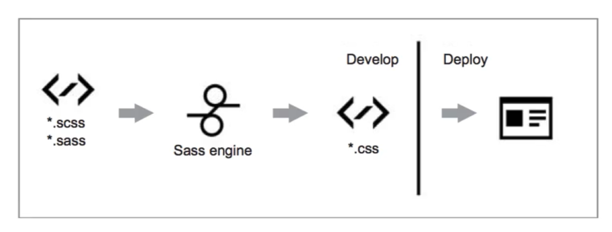

# CSS预处理器
定义：

CSS预处理器定义了一种新的语言，其基本思想是，用一种专门的编程语言，为CSS增加了一些编程的特性，将CSS作为目标生成文件，然后开发者就只要使用这种语言进行编码工作。

通俗的说，CSS预处理器用一种专门的编程语言，进行Web页面样式设计，然后再编译成正常的CSS文件，以供项目使用。CSS预处理器为CSS增加了一些编程的特性，无需考虑浏览器的兼容性问题。

例如你可以在CSS中使用**变量、简单的逻辑程序、函数**等等在编程语言中的一些基本特性，可以让你的CSS**更加简洁、适应性更强、可读性更佳，更易于代码的维护**等诸多好处。

 

其它的： 

- Sass（SCSS）✨

  - ```scss
    $color: red;
    
    .test {
      color: $color;
    }
    ```

- LESS✨

- Stylus✨

- Turbine

- Swithch CSS

- CSS Cacheer

- DT CSS

- ...


## Sass

> https://www.sass.hk

- 是一门高于CSS的元语言，它能用来清晰地、结构化地描述文件样式，有着比普通CSS更加强大的功能。
- 能够提供更简洁、更优雅的语法，同时提供多种功能来创建可维护的管理和样式表
- 基于Ruby



## Sass和SCSS有什么区别

两者其实是同一种东西，我们平时都称之为Sass，两者之间不同之处有以下两点：

- 文件扩展名不同。`.sass`和`.scss`
- 语法书写方式不同，sass是以严格的缩进式语法规则来书写，不带大括号｛｝和分号；，而SCSS的语法书写和我们的CSS语法书写类似

### Sass语法

```scss
$font-stack: Helvetica, sans-serif; // 定义变量
$primary-color: #333; // 定义变量
body
  font: 100% $font-stack;
  color: $primary-color;
```

### SCSS语法

```scss
$font-stack: Helvetica, sans-serif // 定义变量
$primary-color: #333 // 定义变量
body {
  font: 100% $font-stack
  color: $primary-color
}
```

编译

```css
body {
  font: 100% Helvetica, sans-serif;
  color: #333;
}
```


## Sass编译

编译方法：命令编译，GUI工具编译，自动化编译


### 命令编译

#### 单文件编译

```sh
cmd
sass <要编译的Sass文件路径>/style.scss:<要输出的CSS文件路径>/style.css
```

#### 多文件编译

```sh
sass sass/:css/
```

上面的命令标识将项目中的"sass"文件夹中素有的`.scss or .sass`编译成`.css`文件，并且将这些CSS文件都放在项目中`CSS`文件夹中


#### 缺点以及解决方法

在实际编译过程中，你会发现上面的命令，只能一次性编译。每次保存`.scss`文件之后，都得重新执行一次这一的命令。如此操作太麻烦，其实还有一种方法，就是在Sass编译时，**开启`watch`功能，这一只要你的代码进行任意修改，都能自动检测到代码的变化，并且给你直接编译出来：**

```sh
sass --watch <要编译的Sass文件路径>/style.scss:<要输出的CSS文件路径>/style.css
```


### GUI工具编译

主流的主要有:

- Koala(http://koala-app.com)✨
- Compass.app(http://compass.kkbox.com)
- Scout(http://mhs.github.io/scout-app)
- CodeKit(http://incident57.com/codekit/index.html)✨
- Prepros(http://prepros.id)


### 自动化编译

#### Grunt配置Sass编译的代码

```js
module.exports = function(grunt) {
  grunt.initConfig({
    pkg: grunt.file.readJSON('package.json'),
    sass: {
       dist: {
          files: {
              'style/style.css' : 'sass/style.scss'
          }
       }
    },
    watch: {
       css: {
         files: '**/*.scss',
         tasks: ['sass']
       }
    }
  });
  grunt.loadNpmTasks('grunt-contrib-sass');
  grunt.loadNpmTasks('grunt-contrib-watch');
  grunt.registerTask('default', ['watch']);
}
```


#### Gulp配置Sass编译的代码

```js
var gulp = require('gulp');
var sass = require('gulp-sass');
gulp.task('sass', function() {
  gulp.src('./scss/*.scss')
      .pipe(sass())
      .pipe(gulp.dest('./css'))
})
gulp.task('watch', function() {
  gulp.watch('scss/*.scss'. ['sass']);
})
gulp.task('defalut', ['sass', 'watch']);
```


### 常见的编译错误

- 字符编译错误，不支持`GBK`编码，只支持`UTF-8`
- 路径错误，中文字符


## 不同样式风格的输出方法

### 嵌套输出方式nested

> test.scss

```scss
nav {
  ul {
    margin: 0;
    padding: 0;
    list-style: none;
  }
  li { display: inline-block; }
  a {
    display: block;
    padding: 6px 12px;
    text-decoration: none;
  }
}
```

```sh
sass --watch test.scss:test.css --style nested
```

```css
nav ul {
  margin: 0;
  padding: 0;
  list-style: none; }
nav li { display: inline-block; }
nav a {
  display: block;
  padding: 6px 12px;
  text-decoration: none;  }
```


### 展开输出方式expanded✨

大括号另起一行

```sh
sass --watch test.scss:test.css --style expanded
```

```css
nav ul {
  margin: 0;
  padding: 0;
  list-style: none; 
}
nav li {
  display: inline-block; 
}
nav a {
  display: block;
  padding: 6px 12px;
  text-decoration: none;  
}
```


### 紧凑输出方式compact

单行CSS样式

```sh
sass --watch test.scss:test.css --style compact
```

```css
nav ul { margin: 0; padding: 0; list-style: none; }
nav li { display: inline-block; }
nav a { display: block; padding: 6px 12px; text-decoration: none;  }
```


### 压缩输出方式compressed

会去掉标准的Sass和CSS注释及空格

```sh
sass --watch test.scss:test.css --style compressed
```

```css
nav ul{ margin: 0; padding: 0; list-style: none; }nav li{ display: inline-block; }nav a{ display: block; padding: 6px 12px; text-decoration: none;  }
```


## Sass调试

需要浏览器支持`sourcemap`功能即可

```sh
sass --watch --scss --sourcemap style.scsc:style.css
sass --watch styles.scss:style.css
```

### 在线网站

> http://sassmeister.com/
