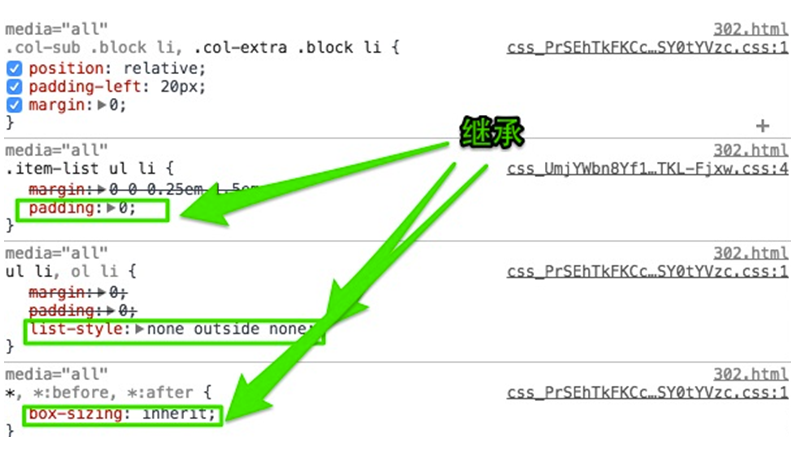

# Sass的基本特性✨

## 基础

### 变量声明

在JS中声明变量都是使用`var`关键词，而sass使用`$`开头
 
```scss
$good: 750px;
$brand-primary: darken(#42bca, 6.5%) !default; //337ab7
$btn-primary-color: #fff !default;
$btn-primary-bg: $brand-primary !default;
$btn-primary-border: darken($btn-primary-bg, 5%) !default;
```

如果值后面加上`!default`则表示默认值


#### 普通变量

定义之后可以在全局范围内使用

```scss
$fontSize: 12px;
body {
  font-size: $fontSize;
}
```


#### 默认变量

sass的默认变量需要在值后面加上`!default`即可

```scss
$baseLineHeight: 1.5 !deafult;
body {
  line-Height: $baseLineHeight;
}
```

默认变量一般是用来设置默认值，然后根据需求来覆盖的，覆盖的方式也很简单，只需要在默认变量**之前**重新声明下变量即可。

```scss
$baseLineHeight: 2;
$baseLineHeight: 1.5 !default;
body {
  line-height: $baseLineHeight;
}
```

编译

```css
body {
  line-height: 2;
}
```

编译后不是默认的1.5。默认的变量的价值在进行**组件化开发**的时候会非常有用


### 变量的调用

```scss
$brand-primary: darken(#42bca, 6.5%) !default; // #337ab7
$btn-primary-color: #fff !default;
$btn-primary-bg: $brand-primary !default;
$btn-primary-border: darken($btn-primary-bg, 5%) !default;
```

在按钮button中调用

```scss
.btn-primary {
  background-color: $btn-primary-bg;
  color: $btn-primary-color;
  border: 1px solid $btn-primary-border;
}
```

编译出来的CSS:

```CSS
.btn-primary {
  background-color: #337ab7;
  color: #fff;
  border: 1px solid #2e6da4;
}
```

 


#### 局部变量和全局变量

```scss
$color: orange !default; // 定义全局变量(在选择器、函数、混合宏...的外面定义的变量)
.block {
  color: $color; // 调用全局变量
}
em {
  $color: red: // 定义局部变量
  a {
    color: $color; // 调用局部变量
  }
}
span {
  color: $color; // 调用全局变量
}
```

编译结果

```css
.block {
  color: orange;
}
em a {
  color: red;
}
span {
  color: orange;
}
```

在元素内部定义的变量不会影响其他元素。**全局变量**就是定义在元素外面的变量，如下代码：

```scss
$color:orange !default;
```

`$color` 就是一个全局变量，而定义在元素内部的变量，比如 `$color:red; `是一个**局部变量**。


##### 全局变量的影子

当在局部范围（选择器内、函数内、混合宏内...）声明一个已经存在于全局范围内的变量时，局部变量就成为了**全局变量的影子**。基本上，**局部变量只会在局部范围内覆盖全局变量**。

```scss
$color: orange !default; // 定义全局变量
.block {
  color: $color; // 调用全局加变量
}
em {
  $color: red;// 定义局部变量（全局变量$color的影子）
  a {
    color: $color; // 调用局部变量
  }
}
```


##### 什么时候声明变量？

只有满足所有下述标准时方可创建新变量：

- 该值至少重复出现了两次
- 该值至少可能会被更新一次
- 该值所有的表现都与变量有关（非巧合）


### 嵌套

#### 选择器嵌套✨

假设有一段这样的结构：

```html
<header>
<nav>
    <a href=“##”>Home</a>
    <a href=“##”>About</a>
    <a href=“##”>Blog</a>
</nav>
<header>
```

想选中 header 中的 a 标签，在写 CSS 会这样写：

```css
nav a {
  color: red;
}

header nav a {
  color: green;
}
```

那么在 Sass 中，就可以使用选择器的嵌套来实现：

```scss
nav {
  a {
    color: red;
    header & {
      color: green;
    }
  }
}
```


#### 属性嵌套

CSS 有一些属性前缀相同，只是后缀不一样，比如：border-top/border-right，与这个类似的还有 margin、padding、font 等属性。

```css
.box {
  border-top: 1px solid red;
  border-bottom: 1px solid green;
}
```

在 Sass 中

```scss
.box {
  border: {
    top: 1px solid red;
    bottom: 1px solid green;
  }
}
```


#### 伪类嵌套

只不过他需要借助`&`符号一起配合使用。我们就拿经典的`clearfix`为例吧：

```scss
.clearfix {
  &:before,
  &:after {
    content: "";
    display: table;
  }
  &:after {
    clear: both;
    overflow: hidden;
  }
}
```

编译出来的 CSS：

```css
.clearfix:before, .clearfix:after {
  content: "";
  display: table;
}

.clearfix:after {
  clear: both;
  overflow: hidden;
}
```


**避免选择器嵌套**

- 选择器嵌套最大的问题是将使最终的代码难以阅读。开发着需要花费巨大精力计算不同缩进级别下的选择器具体的表现效果
- 选择器越具体则声明语句越冗长，而且对最近选择器的引用（&）也月频繁。在某些时候，出现混淆选择器路径和探索下一级选择器的错误率很高


### 混合宏

如果整个网站中有几处小样式类似，比如颜色，字体等，在 Sass 可以**使用变量**来统一处理，那么这种选择还是不错的。

但当你的样式变得越来越复杂，需要重复使用大段的样式时，使用变量就无法达到我们目了。这个时候**混合宏**就会变得非常有意义。


#### 声明混合宏

##### 不带参数混合宏

使用`@mixin`来声明一个混合宏。

```scss
@mixin border-radius {
  -webkit-border-radius: 5px;
  border-radius: 5px
}
```

其中 @mixin 是用来声明混合宏的关键词，有点类似 CSS 中的 @media、@font-face 一样。border-radius 是混合宏的名称。大括号里面是复用的样式代码。


##### 带参数混合宏

```scss
@mixin border-radius($radius: 5px){
    -webkit-border-radius: $radius;
    border-radius: $radius;
}
```


##### 复杂的混合宏

大括号里面写上带有**逻辑关系**

```scss
@mixin box-shadow($shadow...) {
  @if length($shadow) >= 1 {
    @include prefixer(box-shadow, $shadow);
  } @else{
    $shadow:0 0 4px rgba(0,0,0,.3);
    @include prefixer(box-shadow, $shadow);
  }
}
```

这个 box-shadow 的混合宏，带有多个参数，这个时候可以使用“ … ”来替代。简单的解释一下，当 $shadow 的参数数量值大于或等于 1 时，表示有多个阴影值，反之调用默认的参数值` 0 0 4px rgba(0,0,0,.3) `


#### 调用混合宏

匹配了一个关键词`@include`来调用声明好的混合宏

```scss
@mixin border-radius{
    -webkit-border-radius: 3px;
    border-radius: 3px;
}
```

在一个按钮中要调用定义好的混合宏“border-radius”，可以这样使用：

```scss
button {
    @include border-radius;
}
```

编译

```css
button {
  -webkit-border-radius: 3px;
  border-radius: 3px;
}
```


#### 混合宏的参数

##### 传一个不带值的参数

```scss
@mixin border-radius($radius) {
  -webkit-border-radius: $radius;
  border-radius: $radius;
}
```

在调用的时候可以给这个混合宏传一个参数值：

```scss
.box {
  @include border-radius(3px);
}
```

编译出来的 CSS:

```css
.box {
  -webkit-border-radius: 3px;
  border-radius: 3px;
}
```


##### 传一个带值的参数

给混合宏的参数传一个**默认值**，例如：

```scss
@mixin border-radius($radius: 3px){
  -webkit-border-radius: $radius;
  border-radius: $radius;
}
```

在调用类似这样的混合宏时，假设你的页面中的圆角很多地方都是`3px`的圆角，那么这个时候只需要调用默认的混合宏“border-radius”:

```scss
.btn {
  @include border-radius;
}
```

编译出来的 CSS:

```css
.btn {
  -webkit-border-radius: 3px;
  border-radius: 3px;
}
```

但有的时候，页面中有些元素的圆角值不一样，那么可以随机给混合宏传值，如：

```scss
.box {
  @include border-radius(50%);
}
```

编译出来的 CSS:

```css
.box {
  -webkit-border-radius: 50%;
  border-radius: 50%;
}
```


##### 传多个参数✨

```scss
@mixin center($width, $height){
  width: $width;
  height: $height;
  position: absolute;
  top: 50%;
  left: 50%;
  margin-top: -($height) / 2;
  margin-left: -($width) / 2;
}
```

在混合宏`center`就传了多个参数。在实际调用和其调用其他混合宏是一样的：

```scss
.box-center {
  @include center(500px, 300px);
}
```

编译出来CSS：

```css
.box-center {
  width: 500px;
  height: 300px;
  position: absolute;
  top: 50%;
  left: 50%;
  margin-top: -150px;
  margin-left: -250px;
}
```

有一个特别的参数 **`…`** 当混合宏传的参数过多之时，可以使用参数来替代，如：

```scss
@mixin box-shadow($shadows...) {
  @if length($shadows) >= 1 {
    -webkit-box-shadow: $shadows;
    box-shadow: $shadows;
  } @else {
    $shadows: 0 0 2px rgba(#000, .25);
    -webkit-box-shadow: $shadow;
    box-shadow: $shadow;
  }
}
```

在实际调用中：

```scss
.box {
  @include box-shadow(0 0 1px rgba(#000,.5),0 0 2px rgba(#000, .2));
}
```

编译出来的CSS:

```css
.box {
  -webkit-box-shadow: 0 0 1px rgba(0, 0, 0, 0.5), 0 0 2px rgba(0, 0, 0, 0.2);
  box-shadow: 0 0 1px rgba(0, 0, 0, 0.5), 0 0 2px rgba(0, 0, 0, 0.2);
}
```


#### 混合宏的不足

混合宏在实际编码中给我们带来很多方便之处，特别是对于**复用重复代码块**。但其最大的**不足之处**是会**生成冗余的代码块**。

比如在不同的地方调用一个相同的混合宏时。如：

```scss
@mixin border-radius { 
  -webkit-border-radius: 3px;
  border-radius: 3px;
}
.box {
   @include border-radius;
   margin-bottom: 5px;
}
.btn {
   @include border-radius;
}
```

在`.box`和`.btn`中都调用了定义好的“border-radius”混合宏。先来看编译出来的 CSS：

```css
.box {
  -webkit-border-radius: 3px;
  border-radius: 3px;
  margin-bottom: 5px;
}

.btn {
  -webkit-border-radius: 3px;
  border-radius: 3px;
}
```

Sass 在调用相同的混合宏时，并不能**智能的将相同的样式代码块合并在一起**。这也是 Sass 的混合宏最不足之处。


### 扩展/继承

继承可以理解为不带参数的混合宏，而且，继承是联合声明，相对于不带参数的混合宏来说，不会产生样式代码块的冗余




图中代码显示`.col-sub .block li,.col-extra .block li`继承了 `.item-list ul li”选择器的 “padding : 0;` 和 `ul li`选择器中的 `list-style : none outside none;`以及 * 选择器中的 `box-sizing: inherit;`。


在 Sass 中是通过关键词 “@extend”来继承已存在的类样式块，从而实现代码的继承。

```scss
.btn {
  border: 1px solid #ccc;
  padding: 6px 10px;
  font-size: 14px;
}

.btn-primary {
  backgroud-color: #f36;
  color: #fff;
  @extend .btn;
}
.btn-second {
  background-color: orange;
  color: #fff;
  @extend .btn;
}
```

编译出来之后：

```css
.btn, .btn-primary, .btn-second {
  border: 1px solid #ccc;
  padding: 6px 10px;
  font-size: 14px;
}
.btn-primary {
  backgroud-color: #f36;
  color: #fff;
}
.btn-second {
  background-color: orange;
  color: #fff;
}
```

在 Sass 中的继承，可以继承类样式块中所有样式代码，而且编译出来的 CSS 会将选择器合并在一起，形成组合选择器：

```css
.btn, .btn-primary, .btn-second {
  border: 1px solid #ccc;
  padding: 6px 10px;
  font-size: 14px;
}
```


### 占位符 %placeholder

取代以前 CSS 中的基类造成的代码冗余的情形。因为 `%placeholder` 声明的代码，如果不被 `@extend` 调用的话，不会产生任何代码。来看一个演示：

```scss
%mt5 {
  margin-top: 5px;
}
%pt5 {
  padding-top: 5px;
}
```

这段代码没有被 @extend 调用，所以并没有产生任何代码块：

```scss
.btn {
  @extend %mt5;
  @extend %pt5;
}
.block {
  @extend %mt5;
    span {
       @extend %pt5; 
    }
}
```

编译出来的CSS

```css
.btn, .block {
  margin-top: 5px;
}
.btn, .block span {
  padding-top: 5px;
}
```

从编译出来的 CSS 代码可以看出，通过 @extend 调用的占位符，编译出来的代码会将相同的代码合并在一起。这也是我们希望看到的效果，也让你的代码变得更为干净。


### 混合宏 VS 继承 VS 占位符✨

什么时候用混合宏，什么时候用继承，什么时候使用占位符？


#### Sass 中的混合宏使用

```scss
// SCSS中混合宏使用
@mixin mt($var){
  margin-top: $var;  
}

.block {
  @include mt(5px);

  span {
    display:block;
    @include mt(5px);
  }
}

.header {
  color: orange;
  @include mt(5px);

  span{
    display:block;
    @include mt(5px);
  }
}
```

编译结果：

```css
.block {
  margin-top: 5px;
}

.block span {
  display: block;
  margin-top: 5px;
}

.header {
  color: orange;
  margin-top: 5px;
}

.header span {
  display: block;
  margin-top: 5px;
}
```

**总结：**编译出来的 CSS 清晰告诉了大家，他**不会自动合并相同**的样式代码，如果在样式文件中调用同一个混合宏，会产生多个对应的样式代码，造成**代码的冗余**，这也是 CSSer 无法忍受的一件事情。不过他并不是一无事处，**它可以传参数**。

**个人建议**：如果你的代码块中**涉及到变量，**建议**使用混合宏**来创建相同的代码块。


#### Sass 中继承

```scss
// SCSS 继承的运用
// 无论.mt是否被调用过都会编译成CSS代码
.mt {
  margin-top: 5px; 
}

.block {
  @extend .mt;

  span {
    display:block;
    @extend .mt;
  }
}

.header {
  color: orange;
  @extend .mt;

  span{
    display:block;
    @extend .mt;
  }
}
```

编译结果：

```css
.mt, .block, .block span, .header, .header span {
  margin-top: 5px;
}

.block span {
  display: block;
}

.header {
  color: orange;
}

.header span {
  display: block;
}
```

**总结：**使用继承后，编译出来的 CSS 会将使用**继承的代码块合并到一起**，通过**组合选择器**的方式向大家展现，比如 .mt, .block, .block span, .header, .header span。这样编译出来的代码相对于混合宏来说要干净的多，也是 CSSer 期望看到。但是它**不能传变量参数**。

**个人建议**：如果你的代码块**不需要传任何变量参数**，而且**有一个基类已在文件**中存在，那么建议使用 Sass 的继承。


#### Sass中占位符

```scss
// SCSS中占位符的使用
// 只有%mt被调用过才会编译成CSS代码
%mt{
  margin-top: 5px;  
}

.block {
  @extend %mt;

  span {
    display:block;
    @extend %mt;
  }
}

.header {
  color: orange;
  @extend %mt;

  span{
    display:block;
    @extend %mt;
  }
}
```

编译结果：

```css
.block, .block span, .header, .header span {
  margin-top: 5px;
}

.block span {
  display: block;
}

.header {
  color: orange;
}

.header span {
  display: block;
}
```

**总结：**编译出来的 CSS 代码和使用继承基本上是相同，只是不会在代码中生成占位符 mt 的选择器。那么占位符和继承的主要区别的，“占位符是独立定义，不调用的时候是不会在 CSS 中产生任何代码；继承是首先有一个基类存在，不管调用与不调用，基类的样式都将会出现在编译出来的 CSS 代码中。”


#### 表格归纳

|          | 混合宏                                                       | 继承                                                         | 占位符                                                       |
| -------- | ------------------------------------------------------------ | ------------------------------------------------------------ | ------------------------------------------------------------ |
| 声明方式 | @mixin                                                       | .class                                                       | %placeholder                                                 |
| 调用方式 | @include                                                     | @extend                                                      | @extend                                                      |
| 使用环境 | 如果相同代码块需要在不同的环境传递不同的值时，可以通过混合宏来定义重复使用的代码块。<br />**不足**：就是编译出来的CSS代码多次出现调用的混合宏对应的代码块，使用文件变得臃肿，代码冗余。 | 如果相同代码块不需要传递不同的值，并且此代码块已经在Sass文件中定义，可以通过Sass的继承来调用已存在的基类。使用继承将会将调用相同基类的代码合并在一起。<br />**不足**：如果基类并不存在于HTML结构时，不管调用与不调用，在编译出来的CSS中都将产生基类对应的样式代码。 | 占位和继承基本类似，唯一不同的是，相同代码块并没有在基类中存在，而是额外声明。如果不调用已声明的占位符，将不会产生任何样式代码，如果在不同选择器调用占位符，那么编译出来的CSS代码将会把相同的代码合并在一起。 |


### 插值#{}

更干净的、高效的和面向对象的 CSS

```scss
#properties: (margin, padding);

@mixin set-value($side, $value) {
  @each #prop in $properties {
    #{$prop}-#{$side}: $value;
  }
}
.login-box {
  @include set-value(top, 14px)
}
/**
 * #propretimes: (margin, padding);理解为一个数组 propretimes = [ margin, padding ]
 * set-value是一个多参数混合宏
 * @each #prop in  $propretimes  ≈  for prop in propretimes
 * #{$prop}-#{$side}: $value;  ≈  return `${prop}-${side}: ${value}`  
/
```

@each...in...循环语句

它可以让变量和属性工作的很完美，上面的代码编译成 CSS：

```css
.login-box {
  margin-top: 14px;
  padding-top: 14px;
}
```

这是 Sass 插值中一个简单的实例。当你想设置属性值的时候你可以使用字符串插入进来。另一个有用的用法是构建一个选择器。可以这样使用：

```scss
@mixin generate-sizes($class, $small, $medium, $big) {
  .#{$class}-small { font-size: $samll; } // 12px
  .#{$class}-medium { font-size: $medium; } // 20px
  .#{$class}-big { font-size: $big; } // 40px
}
@include generate-sizes("header-text", 12px, 20px, 40px)
```

编译出来的 CSS:

```css
.header-text-small { font-size: 12px; }
.header-text-medium { font-size: 20px; }
.header-text-big { font-size: 40px; }
```

一旦你发现这一点，你就会想到超级酷的 mixins，用来生成代码或者生成另一个 mixins。

然而，这并不完全是可能的。第一个限制，这可能会很删除用于 Sass 变量的插值。

```scss
// 变量
$margin-big: 40px;
$margin-medium: 20px;
$margin-small: 12px;
// 混合宏
@mixin set-value($size) {
  margin-top: $margin-#{$size};
  // 想调用 margin-top: $margin-big
}
// 调用
.login-box {
  @include set-value(big);
}
```

编译结果：

```sh
Undefined variable: "$margin-".

error test.scss (Line 5: Undefined variable: “$margin-".)
```

所以，`#{}`语法并不是随处可用，你也不能在 mixin 中调用：

```scss
@mixin updated-status {
  margin-top: 20px;
  background: #F00;
}
$flag: "status";
.navigation {
  @include updated-#{$flag};
  // @include updated-status
}
```

编译结果：

```sh
Error: property "#{$flag}" must be followed by a ':'
error test.scss (Line 7: Invalid CSS after "...nclude updated-": expected "}", was "#{$flag};")
```

幸运的是，可以使用 @extend 中使用插值。例如：

```scss
%updated-status {
  margin-top: 20px;
  background: #F00;
}
.selected-status {
  font-weight: bold;
}
$flag: "status";
.navigation {
  @extend %updated-#{$flag};
  @extend .selected-#{$flag};
}
```

上面的 Sass 代码是可以运行的，可以动态的插入 .class 和 %placeholder。当然他们不能接受像 mixin 这样的参数，上面的代码编译出来的 CSS:

```css
.navigation {
  margin-top: 20px;
  background: #F00;
}
.selected-status, .navigation {
  font-weight: bold;
}
```


### 注释

1、类似CSS的注释方式，使用`/*...*/`

2、类似JS的注释方式，使用`//`

```scss
// 定义一个占位符
%mt5 {
  margin-top: 5px;
}
/* 调用一个占位符 */
.box {
  @extend %mt5;
}
```

编译：

```css
@charset "UTF-8";
.box {
  margin-top: 5px;
}

/* 调用一个占位符 */
```


### 数据类型

 Sass 和 JavaScript 语言类似，也具有自己的数据类型，在 Sass 中包含以下几种数据类型：

- 数字：如1，2，13，`10px`;
- 字符串：有引号字符串或无引号字符串，如`"foo"`、`'bar'`、`baz`;
- 颜色：blue、`#04a3f9`、`rgba(255, 0, 0, 0.5)`
- 布尔值：如 true、false
- 空值：如null
- 列表值：用空格或者逗号分开，如`1.5em 1em 0 2em`、`Helvetica, Arial, sans-serif`

`SassScript`也支持其他 CSS 属性值（property value），比如 **Unicode 范围**，或 **!important** 声明。

然而，Sass 不会特殊对待这些属性值，一律视为**无引号字符串** (unquoted strings)。


### 字符串

SassScript 支持 CSS 的两种字符串类型：

- **有引号字符串**(quoted strings)，如`"Lucida Grande"`、`'http://sass-lang.com'`
- **无引号字符串** (unquoted strings)，如`sans-serifbold`

**在编译 CSS 文件时不会改变其类型。**

只有一种情况例外，使用 **#{ }插值语句 (interpolation) 时**，**有引号字符串将被编译为无引号字符串**，这样方便了在混合指令 (mixin) 中引用选择器名。

```scss
@mixin firefox-message($selector) {
  body.firefox #{$selector}:before {
    content: "Hi Firefox users!";
  }
}
@include firefox-message(".header") // 变成无引号字符串了
```

编译为：

```css
body.firefox .header:before {
  content: "Hi Firefox users!";
}
```

需要注意的是：当 deprecated = property syntax 时 （暂时不理解是怎样的情况），所有的字符串都将被编译为无引号字符串，不论是否使用了引号。


### 值列表

所谓值列表(lists)是指Sass如何处理CSS中：

```css
margin: 10px 15px 0 0
```

或者

```css
font-face: Helvetica, Arial, sans-serif
```

像上面这样通过**空格或者逗号分隔**的一系列的值。

事实上，独立的值也被视为值列表——只包含一个值的值列表。

Sass列表函数（Sass list functions）赋予了值列表更多功能：

- nth函数可以直接访问值列表
- join函数可以将多个值列表连接在一起
- append函数可以在值列表中添加值
- @each规则能够给值列表中的每个项目添加样式

值列表中可以再包含值列表，比如 `1px 2px, 5px 6px `是包含`1px 2px `与 `5px 6px`两个值列表的值列表。

如果内外两层值列表使用相同的分隔方式，要用圆括号包裹内层，所以也可以写成`(1px 2px) (5px 6px)`。

当值列表被编译为CSS时，Sass不会添加任何圆括号，因为CSS不允许这样做。

包含两个值列表的值列表`(1px 2px) (5px 6px)`与四个值的值列表`1px 2px 5px 6px` 在编译后的CSS文件中是一样的


可以用()表示空的列表，这样不可以直接编译成CSS，比如编译font-family:()时，Sass将会报错。

如果值列表中包含空的值列表或空值，编译时将**清除空值**，比如`1px 2px () 3px` 或 `1px 2px null 3px`


### 运算

程序中的运算是常见的一件事情，但在 CSS 中能做运算的，到目前为止仅有 **calc() 函数**可行

#### 加法

加法运算是 Sass 中运算中的一种，在变量或属性中都可以做加法运算。如：

```scss
/*
in是英寸。
8in即8英寸。
1英寸约=2.54厘米,
1英寸大约是96像素
*/
.box {
  width: 20px + 8in; // in = 96
}
```

编译

```css
.box {
  width: 788px;
}
```

但对于携带不同类型的单位时，在 Sass 中计算会报错，如下例所示：

```scss
.box {
  width: 20px + 1em;
}
```

```sh
Error: Incompatible units: 'em' and 'px'.
```

#### 减法

```scss
$full-width: 960px;
$sidebar-width: 200px;
.content {
  width: $full-width - $sidebar-width;
}
```

编译出来的 CSS 如下：

```css
.content {
  width: 760px;
}
```

同样的，运算时碰到不同类型的单位时，编译也会报错，如：

```scss
$full-width: 960px;
.content {
  width: $full-width - 1em;
}
```

```sh
Error: Incompatible units: 'em' and 'px'.
```

#### 乘法

Sass 中的乘法运算和前面介绍的加法与减法运算还略有不同。

虽然他也能够支持多种单位（比如 em ,px , %），但当**一个单位同时声明两个值时会有问题。**

比如下面的示例：

```scss
.box {
  width: 10px * 2px;
}
```

```sh
Error: 20px*px isn't a valid CSS value.
```

如果进行乘法运算时，两个值单位相同时，只需要**为一个数值提供单位即可**。上面的示例可以修改成：

```
.box {
  width: 10px * 2;
}
```

编译

```css
.box {
  width: 20px;
}
```

Sass 的乘法运算和加法、减法运算一样，在运算中有不同类型的单位时，也将会报错。如下面的示例：

```scss
.box {
  width: 20px * 2em;
}
```

```sh
Error: 40em*px isn't a valid CSS value.
```


#### 除法

“**/**” 符号在 CSS 中已做为一种符号使用。因此在 Sass 中做除法运算时，直接使用“/”符号做为除号时，将不会生效，编译时既得不到我们需要的效果，也不会报错。

简单的示例：

```scss
.box {
  width: 100px / 2;
}
```

编译：

```css
.box {
  width: 100px / 2;
}
```

要修正这个问题，只需要给运算的外面添**加一个小括号( )**即可：

```scss
.box {
  width: (100px / 2);
}
```

编译

```css
.box {
  width: 50px;
}
```

除了上面情况带有小括号，“/”符号会当作除法运算符之外，如果“/”符号**在已有的数学表达式中时，也会被认作除法符号**。如下面示例：

```scss
.box {
  width: 100px / 2 + 2in;  
}
```

编译出来的CSS：

```css
.box {
  width: 242px;
}
```

另外，在 Sass 除法运算中，**当用变量进行除法运算时**，“/”符号也会自动被识别成除法，如下例所示：

```scss
$width: 1000px;
$nums: 10;
.item {
  width: $width / 10;
}
.list {
  width: $width / $nums;
}
```

编译出来的CSS:

```css
.item {
  width: 100px;
}
.list {
  width: 100px;
}
```


综合上述，”/ ”符号被当作除法运算符时有以下几种情况：

- 如果数值或它的任意部分是存储在一个变量中或是函数的返回值。
- 如果数值被圆括号包围。
- 如果数值是另一个数学表达式的一部分。

```scss
p {
  font: 10px / 8px; // 纯CSS，NO
  $width: 1000px;
  width: $width / 2; // 使用了变量，YES
  width: round(1.5) / 2; // 使用了函数，yes
  height: (500px / 2); // 使用了圆括号，yes
  margin-left: 5px + 8px / 2px; //使用了加(+),yes
}
```

编译：

```css
p {
  font: 10px / 8px;
  width: 500px;
  width: 1;
  height: 250px;
  margin-left: 9px;
}
```


**如果两个值带有相同的单位值时，除法运算之后会得到一个不带单位的数值。**✨

```scss
.box {
  width: (1000px / 100px); 
}
```

编译：

```css
.box {
  width: 10;
}
```


#### 变量计算

```scss
$content-width: 720px;
$sidebar-width: 220px;
$gutter: 20px;

.container {
  width: $content-width + $sidebar-width + $gutter;
  margin: 0 auto;
}
```

编译出来的CSS

```css
.container {
  width: 960px;
  margin: 0 auto;
}
```


##### 颜色运算

所有算数运算都支持颜色值，并且是分段运算的。也就是说，红、绿和蓝各颜色分段单独进行运算。如：

```scss
p {
  color: #010203 + #040506;
}
```

按位相加，计算公式为 01 + 04 = 05、02 + 05 = 07 和 03 + 06 = 09， 并且被合成为：

```css
p {
  color: #050709;
}
```


算数运算也能将数字和颜色值 一起运算，同样也是分段运算的。如：

```scss
p {
  color: #010203 * 2;
}
```

计算公式为：01 * 2 = 02、02 * 2 = 04 和 03 * 2 = 06， 并且被合成为：

```css
p {
  color: #020406;
}
```


#### 字符运算

在 Sass 中可以通过加法符号“+”来对字符串进行连接。例如：

```scss
$content: "Hello" + "" + "Sass!";
.box:before {
  content: " #{$content} ";
}
```

编译出来的CSS：

```css
.box:before {
  content: " HelloSass! ";
}
```

除了在变量中做字符连接运算之外，还可以直接通过 +，把字符连接在一起：✨

```scss
div {
  cursor: e + -resize;
}
```

编译出来的CSS:

```css
div {
  cursor: e-resize;
}
```

注意，如果**有引号**的字符串被添加了一个**没有引号**的字符串 （带引号的字符串在 + 符号左侧）， 结果会是一个**有引号**的字符串。 

同样的，如果一个**没有引号**的字符串被添加了一个**有引号**的字符串 （没有引号的字符串在 + 符号左侧）， 结果将是一个**没有引号**的字符串。  

```scss
p:before {
  content: "Foo " + Bar;
  font-family: sans- + "serif";
}
```

编译出来的 CSS：

```css
p:before {
  content: "Foo Bar";
  font-family: sans-serif;
}
```