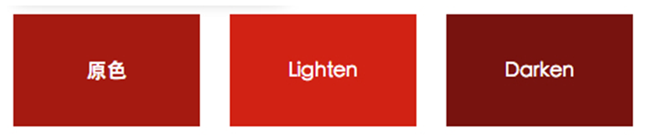

# 颜色函数

- RGB
- HSL
- Opacity
- adjust-color
- change-color


## RGB颜色函数

RGB 颜色只是颜色中的一种表达式，其中 R 是 red 表示红色，G 是 green 表示绿色而 B 是 blue 表示蓝色。在 Sass 中为 RGB 颜色提供六种函数：

- rgb($red, $green, $blue)：根据红、绿、蓝三个值创建一个颜色；
- rgba($red, $green, $blue, $alpha)：根据红、绿、蓝和透明度值创建一个颜色；
- red($color)：从一个颜色中获取其中红色值；
- green($color)：从一个颜色中获取其中绿色值；
- blue($color)：从一个颜色中获取其中蓝色值；
- mix($color-1,$color-2,[$weight])：把两种颜色混合在一起。

```bash
sass -i
```

在命令终端开启这个命令，相当于开启 Sass 的函数计算。

接下来，分别在终端使用 RGB 函数来进行计算，看其最终结果：

```bash
$ sass -i
>> rgb(200,40,88) // 根据r:200,g:40,b:88计算出一个十六进制颜色值
#c82858
>> rgba(#c82858, .65) //根据#c82858的65%透明度计算出一个rgba颜色值
rgba(200, 40, 88, 0.65)
>> red(#c82858) //从#c82858颜色值中得到红色值 200
200
>> green(#c82858) //从#c82858颜色值中得到绿色值 40
40
>> blue(#c82858) //从#c82858颜色值中得到蓝色值 88
88
//把#c82858和rgba(200,40,88, .65) 两颜色按比例混合得到一个新颜色
>> mix(#c82858, rgba(200, 40, 80, .65), .3) 
rgba(200, 40, 80, 0.65105)
```

在 RGB 颜色函数中，在实际中常用的主要是 rgba() 和 mix() 两个函数


## RGBA()函数

将一个颜色根据透明度转换成 rgba 颜色.

其语法有两种格式：

```scss
rgba($red, $green, $blue, $alpha)  // 将一个rgba颜色转译出来，和未转译的值一样
rgba($color, $alpha)  // 将一个Hex颜色转换成rgba颜色
```

原来的写法：

```scss
background: rgba(200, 40, 88, .5)
color: rgba(#c82858, .5) // （注意 css3 是可以的，但是存在浏览器兼容问题）：
```

假设在变量中定义了一个基本的变量：

```scss
$color: #f36;
$bgColor: orange;
$borderColor:green;
```

**语法**

在这个实例中，我们使用了 Sass 的 rgba 函数，在括号是函数的参数，第一个参数是需要转换的颜色，他可以是任何颜色的表达方式，也可以是一个颜色变量；第二个参数是颜色的透明度，其值是 0~1 之间。上面的代码转译出来：

```scss
// 转换的颜色
.rgba {
    color: rgba(#f36, .5);
    background: rgba(orange, .5);
    border-color: rgba(green, .5);
}
// 颜色变量
.rgba {
    color: rgba($color, .5);
    background: rgba($bgColor, .5);
    border-color: rgba($borderColor, .5);
}

```

编译后

```scss
.rgba {
  color: rgba(255, 51, 102, 0.5);
  background: rgba(255, 165, 0, 0.5);
  border-color: rgba(0, 128, 0, 0.5);
}
```


### Red()、Green()、Blue()函数

#### Red() 函数

获取一个颜色当中的红色值

```bash
>> red(#f36)
255
```

#### Green() 函数

获取某一个颜色值中 green 的值

```bash
>> green(#f36)
51
```

#### Blue() 函数

取某一个颜色值中 blue 的值

```bash
>> blue(#f36)
102
```


## Mix()函数

两种颜色根据一定的比例混合在一起，生成另一种颜色。其使用语法如下：

```scss
mix($color-1, $color-2, $weight);
```

**$color-1 和 $color-2** 指的是你需要合并的颜色，颜色可以是任何表达式，也可以是颜色变量。

**$weight** 为 合并的比例（选择权重），默认值为 50%，其取值范围是 0~1 之间。

它是每个 RGB 的百分比来衡量，当然透明度也会有一定的权重。

默认的比例是 50%，这意味着两个颜色各占一半，如果指定的比例是 25%，这意味着第一个颜色所占比例为 25%，第二个颜色所占比例为75%。


使用方法:

```scss
mix(#f00, #00f) => #7f007f
mix(#f00, #00f, 25%) => #3f00bf
mix(rgba(255, 0, 0, 0.5), #00f) => rgba(63, 0, 191, 0.75)
```

在前面的基础上，做一个修改：

```scss
$color1: #a63;
$color2: #fff;
$bgColor1: #f36;
$bgColor2: #e36;
$borderColor1: #c36;
$borderColor2: #b36;

.mix {
    background: mix($bgColor1, $bgColor2, .75);
    color: mix($color1, $color2, .25);
    border-color: mix($borderColor1, $bgColor2, .05);
}
```

编译的 css 代码：

```css
.mix {
    background: #ee3366;
    color: #fefefe;
    border-color: #ed33
}
```

这就是 Mix 函数的工作原理，在函数中指定三个函数，

前两个函数是你想混合的颜色（记住，你可以通过颜色变量、十六进制、RGBA、RGB、HSL 或者 HSLA 颜色值）。

第三个参数是第一种颜色的比例值。


## HSL函数

- **hsl(`$hue`, `$saturation`, `$lightness`)**：通过色相（hue）、饱和度(saturation)和亮度（lightness）的值创建一个颜色；

  - ```bash
    >> hsl(200,30%,60%) // 通过h200,s30%，l60%创建一个颜色
    #7aa3b8
    ```

- **hsla(`$hue`, `$saturation`, `$lightness`, `$alpha`)**：通过色相（hue）、饱和度(saturation)、亮度（lightness）和透明（alpha）的值创建一个颜色；

  - ```bash
    >> hsla(200,30%,60%,.8) // 通过h200,s30%，l60%,a80%创建一个颜色
    rgba(122, 163, 184, 0.8)
    ```

- **complement(`$color`)**：返回一个补充色，相当于adjust-hue($color, 180deg);

  - ```bash
    >> complement(#f36)
    #33ffcc
    ```

- **invert(`$color`)**：反回一个反相色，红、绿、蓝色值倒过来，而透明度不变。

  - ```bash
    >> invert(#f36)
    #00cc99
    ```


### lighten(`$color`, `$amount`)

通过改变颜色的亮度值，让颜色变亮，创建一个新的颜色；

### darken(`$color`, `$amount`)

通过改变颜色的亮度值，让颜色变暗，创建一个新的颜色；

这个亮度值可以是 0~1 之间，不过常用的一般都在 **3%~20%** 之间。

首先定义一个颜色变量：

```scss
$baseColor: #ad141e;
```

使用 lighten() 和 darken() 函数来修改 10% 的亮度值：

```scss
.lighten {
  background: lighten($baseColor, 10%);
}
.darken {
  background: darken($baseColor, 10%);
}
```

编译出来的 css 代码：

```css
.lighten {
  background: #db1926;
}

.darken {
  background: #7f0f16;
}
```



### lightness(`$color`)

从一个颜色中获取亮度（lightness）值

来验证一下三个颜色之间亮度值的变化：

```bash
>> lightness(#ad141e) // 原色的亮度值
37.84314%
>> lightness(#db1926) // 在原色的亮度值基础上增加10%
47.84314%
>> lightness(#7f0f16) // 在原色的亮度值基础上减少10%
27.84314%
```

lighten() 和 darken() 函数只是在原始颜色的基础上对亮度值进行运算操作，

但是生成出来的新颜色在色相和饱和度会有略微的变化，

比如上面的实例生成的新颜色与原始色在色相与饱和度值的对比：

```bash
>> hue(#ad141e)
356.07843deg
>> hue(#db1926)
355.97938deg
>> hue(#7f0f16)
356.25deg
>> saturation(#ad141e)
79.27461%
>> saturation(#db1926)
79.5082%
>> saturation(#7f0f16)
78.87324%
```

如果有点颜色概念基础的同学应该都清楚，不管什么颜色当其亮度值 趋近于0时，颜色会越来越暗，直到变成了黑色；反之，当其亮度值趋近于 100% 时，颜色会越来越亮，直到变成了白色。但当使用 lighten() 和 darken() 函数对一个颜色的亮度值计算时，会碰到两个极端，lighten() 函数会让新颜色的亮度值超过 100%，而 darken() 函数会让新颜色的亮度值低于 0 变成负数。可实际上任何颜色的亮度值都在 0~100% 之间，如此一来，Sass 的 lighten() 和 darken() 函数又将会如何处理呢？

带着上面的疑问，我们一起来做一个简单性的测试。从上面的示例中得知 #ad1414 的亮度值为 37.84314%，为了让新颜色的亮度值大于 100% 和小于 0，在对应的函数，做一些调整：

```scss
$baseColor:#ad141e;
.lighten {
    background: lighten($baseColor,70%);
}
.darken{
    background: darken($baseColor,40%);
}
```

编译出来的 css 代码：

```css
.lighten {
  background: white;
}

.darken {
  background: black;
}
```

**上面的例子说明了一切问题。当颜色的亮度值接近或大于 100%，颜色会变成白色；反之颜色的亮度值接近或小于 0 时，颜色会变成黑色。**


### saturate(`$color`, `$amount`)

通过改变颜色的饱和度值，让颜色更饱和，从而创建一个新的颜色

### desaturate(`$color`, `$amount`)

通过改变颜色的饱和度值，让颜色更少的饱和，从而创建出一个新的颜色；

```scss
$baseColor: #ad141e;
.saturate {
  background: saturate($baseColor, 30%); 
}
.desaturate {
  background: desaturate($baseColor, 30%);
}
```

编译出来的 css 代码：

```css
.saturate {
  background: #c1000d;
}

.desaturate {
  background: #903137;
}
```


### saturation(`$color`)

从一个颜色中获取饱和度（saturation）值

颜色变了。同样使用 saturation() 函数在终端中进行计算一下，看看他们有什么样的变化：

```bash
>> saturation(#ad141e) // 原色的饱和度
79.27461%
>> saturation(#c1000d)  // 在原色饱和度基础上增加30%,超过100%时按100%计算
100%
>> saturation(#903137) // 在原色饱和度基础上减少30%,小于0时按0计算
49.2228%
```


### adjust-hue(`$color`, `$degrees`)

通过改变一个颜色的色相值，创建一个新的颜色；

通常这个度数值是在 -360deg 至 360deg 之间，当然了可以是百分数：

```scss
$baseColor: #ad141e;
.adjust-hue-deg {
  background: adjust-hue($baseColor, 30deg);
}
.adjust-hue-per {
  background: adjust-hue($baseColor, 30%);
}
```

编译出的 css 代码：

```css
.adjust-hue-deg {
  background: #ad5614;
}

.adjust-hue-per {
  background: #ad5614;
}
```


从转译出来的代码，不难发现他们的颜色是一样的。尝试多次，如果两个值（抛弃 deg 和 100%）相同，计算出来的颜色也会一样。

### hue(`$color`)

从一个颜色中获取色相（hue）值；

同样的，可以通过 hue() 函数得到颜色转换前后的色相值：

```bash
>> hue(#ad141e) // 原颜色色相值
356.07843deg
>> hue(#ad5614) // 在原色色相基础上增加30deg
25.88235deg
```

在 HSL 颜色表达方式上，色相是从 -360 和 360 之间，负值逆时针转，正值顺时针转。

在这个实例中，原色的色相值约 356deg，加上 30deg 后，新颜色变成了 386deg，

但我们的色盘中并没有比 360deg 更大的值，当值大于 360deg时，表示色盘转完了一圈，继续顺时针转余下的值（这里是 26deg）

那么这个继续转的值就是新颜色的色相值。


### grayscale(`$color`)

一般这个函数能将彩色颜色转换成不同程度的灰色，相当于desaturate($color, 100%);

```scss
$baseColor: #ad141e;
.grayscale {
  background: grayscale($baseColor);
}
.desaturate {
  background: desaturate($baseColor,100%);
}
```

编译出来的 css 代码：

```css
.grayscale {
  background: #616161;
}

.desaturate {
  background: #616161;
}
```


看看计算出来的 HSL 各个值的变化：

```bash
>> hue(#ad141e)
356.07843deg
>> hue(#616161)
0deg
>> saturation(#ad141e)
79.27461%
>> saturation(#616161)
0%
>> lightness(#ad141e)
37.84314%
>> lightness(#616161)
38.03922%
```

grayscale() 函数处理过的颜色，其最大的特征就是颜色的饱和度为 0。


## Opacity函数

### alphpa() 和 opacity()

与 red()，green() 等函数很类似。这个函数的主要功能是用来**获取一个颜色的透明度值**。如果颜色没有特别指定透明度，那么这两个函数得到的值都会是 1：

```bash
>> alpha(red)
1
>> alpha(rgba(red, .8))
0.8

>> opacity(red)
1
>> opacity(rgba(red, .8))
0.8
```


### rgba()函数

有一个 rgba() 函数可以创建一个颜色，同时还可以**对颜色修改其透明度**。其可以接受两个参数，第一个参数为颜色，第二个参数是你需要设置的颜色透明值。

```bash
>> rgba(red, .5)
rgba(255, 0, 0, 0.5)

>> rgba(#dedede,.5)
rgba(222, 222, 222, 0.5)

>> rgba(rgb(34,45,44),.5)
rgba(34, 45, 44, 0.5)

>> rgba(rgba(33,45,123,.2),.5)
rgba(33, 45, 123, 0.5)

>> rgba(hsl(33,7%,21%),.5)
rgba(57, 54, 50, 0.5)

>> rgba(hsla(33,7%,21%,.9),.5)
rgba(57, 54, 50, 0.5)
```


### opacify()、fade-in()

对已有颜色的透明度做一个加法运算，会让颜色更加不透明。

其接受两个参数，第一个参数是原始颜色，第二个参数是你需要增加的透明度值，其取值范围主要是在 0~1 之间。

当透明度值增加到大于 1 时，会以 1 计算，表示颜色不具有任何透明度。

```bash
>> opacify(rgba(22,34,235,.6),.2)
rgba(22, 34, 235, 0.8)
>> opacify(rgba(22,34,235,.6),.5)
#1622eb
>> opacify(hsla(22,34%,23%,.6),.15)
rgba(79, 53, 39, 0.75)
>> opacify(hsla(22,34%,23%,.6),.415)
#4f3527
>> opacify(red,.15)
#ff0000
>> opacify(#89adde,.15)
#89adde

>> fade-in(rgba(23,34,34,.5),.15)
rgba(23, 34, 34, 0.65)
>> fade-in(rgba(23,34,34,.5),.615)
#172222
```

其中 fade-in( ) 函数又名 fade_in() 函数。其所起作用等效。


### transparentize()、 fade-out()

所起作用刚好与 opacify() 和 fade-in() 函数相反，让颜色更加的透明。

这两个函数会让透明值做减法运算，当计算出来的结果小于 0 时会以 0 计算，表示全透明。

```bash
>> transparentize(red,.5)
rgba(255, 0, 0, 0.5)
>> transparentize(#fde,.9)
rgba(255, 221, 238, 0.1)
>> transparentize(rgba(98,233,124,.3),.11)
rgba(98, 233, 124, 0.19)
>> transparentize(rgba(98,233,124,.3),.51)
rgba(98, 233, 124, 0)

>> fade-out(red,.9)
rgba(255, 0, 0, 0.1)
>> fade-out(hsla(98,6%,23%,.5),.1)
rgba(58, 62, 55, 0.4)
>> fade-out(hsla(98,6%,23%,.5),.6)
rgba(58, 62, 55, 0)
```


## 颜色函数实战——七色卡

常见的颜色就是七彩色，红、橙、黄、蓝、绿、紫、黑。

那么我们就使用 Sass 的颜色函数来制作一个这样的色卡。效果图如下：

