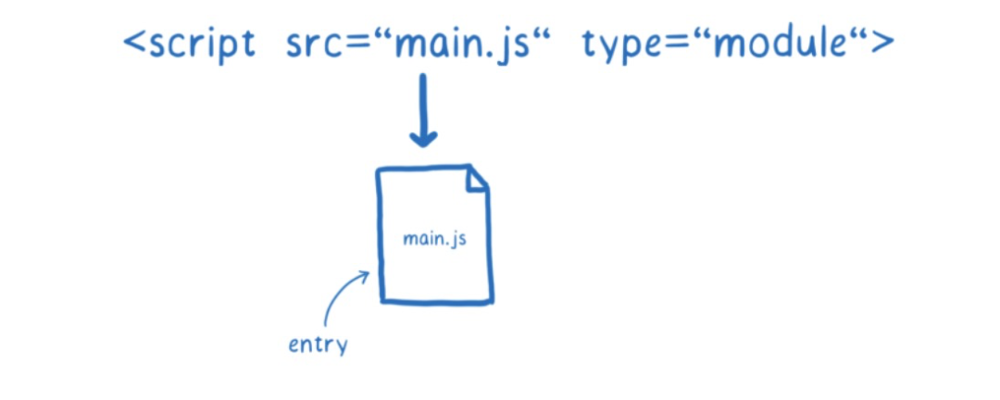
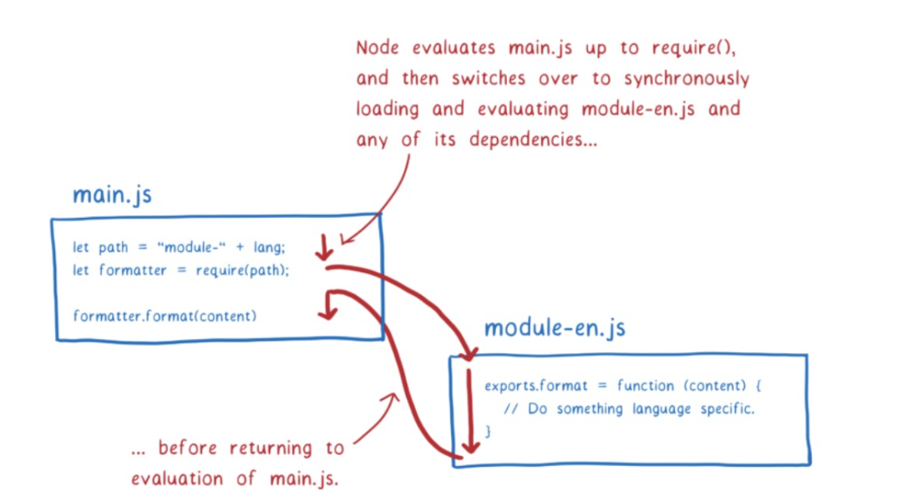

# es modules

## 模块是为了解决了什么问题？

现在开始思考一下， JS 的语法是不是都爱声明变量，管理变量。如下：


因为你的代码大部分都是在修改变量，如何写出优雅的代码，提高代码可维护性取决于你如何组织这些变量。

一次只考虑几个简单的变量会让代码编写更简单，你不需要担心你的代码对其他模块是否会造成影响。JS 提供了一个方式：Scopes 去帮助你处理这种问题。由于 Scopes 在 JS 的工作方式，函数不能访问定义在其他函数中的变量。如下图：


这是非常好的，因为这样当你处理一个函数时，你只用思考这个函数，不用考虑其他函数是否会影响你的变量。

不过，它也有缺点，比如它会让在2个函数之间共享变量变得困难。

如果你想要在 scopes 外共享变量，该怎么做？一个通用的方法是将这个变量提升到这个 scopes 外，比如，放在` global scope `。

在 jquery 时代，如果你想使用插件，必须确保 jquery 在 global scope 。如下图：


这样是可以解决问题的，但是他也导致了一些恼人的问题。

首先，所有的 script 必须按照正确的顺序加载。确保没人打乱顺序。如果顺序被打乱，在运行的时候，应用程序就会报错：在运行时需要获取 jquery 全局变量时，jquery 却没加载 ，如下图：


这样维护代码会变得非常困难。你在改变 script 加载顺序或者移除旧代码时，就变成一场“赌局”，代码之间的依赖关系是隐式的，所有函数可能都会去 global scopes 中获取变量或者修改变量，非常地不可控。


## modules 起到了什么作用？

modules 提供了一种更好的方式去组织你的变量和函数。

将这些函数和变量放入一个 modules 中。modules scopes 可用于在模块中的函数之间共享变量。

modules scopes 跟 function scopes 不同的地方在于，他可以清晰地定义在模块中哪些变量，类，或者函数可以被共享。


因为这具有显示的关系，你可以知道在哪些 modules 移除的时候，代码会报错。

一旦你有了在 modules 引入或导出变量的能力时，它会使得代码分解成可以独立工作的 chunks 会变得更容易。你可以组合或拆解这些 chunks ，像乐高组件一样，去组建不同的应用。

因为 modules 非常地有用，有很多方式去添加模块功能到 JS 中。现在有 2种 模块系统 在被使用着。`CommonJS (CJS)`是Node.js 历史上使用的。`ESM (EcmaScript模块)`是一个较新的系统，已经添加到JavaScript规范中。浏览器已经支持ES模块，Node正在添加支持。

接下来，让我们深入了解下新的 module 是怎么工作的。

## ES modules 原理

当使用模块进行开发时，将构建一个依赖关系图。这个依赖关系来源于你使用的 import 语法。这些 import 语法让 browser 或者 node 知道哪些代码需要被加载。你给他一个入口文件，接下来他会根据 import 语法去加载剩下的代码。如下图：


但是文件本身不是 browser 可以使用的。它需要解析他们，将他们转换成 module records 。这样子之后，它就知道文件发生了什么。如下图：


之后，模块数据结构需要转换成 模块实例。一个模块实例包含2个事情：code 和 state 。code 是一组指令，他定义了怎么去运行一段代码。他本身不能做任何事情。就像是制作东西的食谱。state 就是菜的原材料，且存在于内存中。

因此，模块实例将 code 和 state 组合在一起，如下图：


我们需要的是每个模块的一个模块实例。模块加载的过程是从这个入口点文件到拥有一个完整的模块实例图。

对于ES模块，这分为三个步骤。

- **构造**：找到、下载和解析所有的文件，并将其解析成 module records 。
- **实例化**：在内存中找到所有 export 值的位置。然后将 import 和 exports 指向内存中对应的位置。链接起来。
- **赋值**：运行代码将上述内存中的位置填充具体的值
看下图：


你可以认为 ES modules  是异步的，因为它被分为3个不同的阶段加载：实例化、构造、解析这些阶段是可以分开完成的。

这意味着该规范确实引入了一种CommonJS中没有的异步。我将在后面具体解释，但是在CJS中，一个模块和它下面的依赖是一次性加载、实例化和解析的，中间没有任何中断。

然而，对于 ES modules 来说，这些步骤不一定是异步的，他取决于如何去使用 ES modules, 而这并不是 ES modules 规范控制的。

ES modules 规范说明了应该如何将文件解析为模块记录，以及应该如何实例化和解析该模块。但是，它并没有说明如何获取文件。

loader 是在不同的规范中指定的。对于浏览器来说，这个规范就是HTML规范，你可以根据你使用的平台使用不同的 loader。


loader 可以精准地指定 modules 如何被加载。方法如下--ParseModule, Module.Instantiate, and Module.Evaluate.


接下来，我们更详细地讲解每一个阶段：

### 一、构造

在这个阶段，发生了三件事：

- 找出从哪里下载包含模块的文件
- 获取文件(从URL下载或从文件系统加载)
- 解析文件到一个 module record

**找出从哪里下载包含模块的文件**

首先，他要找到入口文件，在 hTML 中，你可以这样用 script 标签来声明



但是他如何找到接下来依赖的 modules ？这时就要使用到 import 语法了，它告诉了 loader 怎么去找到下一个模块。


关于模块需要注意的一点是:有时需要在 浏览器 和Node之间以不同的方式处理它们。每个主机都有自己解释 import 的方式。为了做到这一点，它使用了一种被称为模块分辨率算法的东西，这种算法在不同的平台之间是不同的。目前，在Node中工作的一些模块说明符在浏览器中无法工作，但目前正在进行修复工作。

我们需要一层一层地解析遍历树，解析一个文件，然后找出他的依赖项，然后加载这些依赖项，如下：


如果主线程要等待每个文件的下载，那么许多其他任务就会堆积在它的队列中。


像图片上这样阻塞主线程会使使用模块的应用程序运行太慢。这就是ES模块规范将算法分割成多个阶段的原因之一。将构造分解成它自己的阶段，允许浏览器在开始实例化的同步工作之前获取文件并建立对模块图的理解。

这种将算法分成阶段的方法是ES模块和CommonJS模块之间的关键区别之一。

CommonJS可以做不同的事情，因为从文件系统加载文件比通过Internet下载要少得多。这意味着Node在加载文件时可以阻塞主线程。因为文件已经加载，所以只实例化和运行是有意义的(在CommonJS中这不是单独的阶段)。这也意味着，在返回模块实例之前，您正在遍历整个树，加载、实例化和评估任何依赖项。



CommonJS方法有一些含义，我将在后面对此进行更多的解释。但这意味着在带有CommonJS模块的Node中，你可以在你的模块说明符中使用变量。在寻找下一个模块之前，您正在执行该模块中的所有代码(直到require语句)。这意味着当你去做模块解析时变量会有一个值。

但是使用ES模块，你需要在做任何运行之前先建立整个模块图。这意味着你不能在你的模块说明符中有变量，因为那些变量还没有值。看下图理解：


也就是说，对于 ES modules 来说，是先解析依赖关系，这个阶段并不会执行代码，所以在这个阶段如果使用变量，是会报错的。但是 commonJS 是边解析变运行，所以可以拿到变量。

如果希望 ES modules 也可以实现 commonjs 这个特性，可以使用 `dynamic import` ，比如：
```JS
import(`${path}/foo.js`).
```
这个的原理是，使用 import() 加载的任何文件，都会作为一个单独图的入口，会启动一个新的图，单独处理。


不过，这两个图中的任何模块都将共享一个模块实例。这是因为加载器缓存模块实例。对于特定全局作用域中的每个模块，将只有一个模块实例。

这意味着对engine的工作更少。例如，它意味着即使多个模块依赖于它，才会获取一次模块文件。（这是缓存模块的一个原因。我们将在评估部分看到另一个。）

loader 使用 module map 来管理这个缓存。每个全局变量在一个单独的 module map 中跟踪其模块。

当 loader 去获取一个URL时，它将该URL放在 module map 中，并注意到它正在获取文件。然后它将发送请求并继续获取下一个文件。


如果另一个模块依赖于相同的文件会发生什么? loader 将在module map中查找每个URL。如果它看到取回，它会转到下一个URL。

>所以提前解析出 modules map 作用很大，它可以更好的做优化：缓存或防止重复加载。
 
### 二、解析

现在我们已经获取了这个文件，我们需要将它解析为一个module record。这有助于浏览器理解模块的不同部分。


一旦创建了module record，它就被放置在 module map 中。这意味着无论何时从这里请求它，loader 都可以从该地图中提取它。


在浏览器中，这很简单。你只需把type="module"放在script标签上。这告诉浏览器这个文件应该被解析为一个模块。因为只有模块可以被导入，所以浏览器知道任何导入也是模块。


但在 Node 中，不使用HTML标记，因此您无需使用类型属性。社区尝试解决这一点的一种方式是使用.mjs扩展。使用该扩展告诉节点，“此文件是module”。你会看到人们谈论这一点作为解析目标的信号。讨论目前正在进行中，因此尚不清楚节点社区将决定最终使用的信号。

无论哪种方式，loader 都将决定是否将文件解析为模块。如果它是一个模块，并且存在导入，那么它将再次启动该过程，直到获取和解析所有文件。


### 三、实例化

实例化步骤就是把所有东西连接到内存中。首先，JS引擎创建一个模块环境记录。这将管理模块记录的变量。接下来，找到对应的变量地址，运行后，修改实际变量值。


**「导出和导入都指向内存中的相同位置」**。连接出口首先可以确保所有进口都可以连接到匹配的出口。


**「这与CommonJS模块不同。在CommonJS中，整个导出对象在导出时被复制。这意味着导出的任何值(比如数字)都是副本。」**

这意味着在 commonjs 中，如果导出模块稍后更改了这个值，导入模块不会看到该改变。


相比之下，ES模块使用的是一种称为活动绑定的东西。两个模块都指向内存中的相同位置。这意味着当导出模块更改一个值时，该更改将显示在导入模块中。导出值的模块可以在任何时候更改这些值，但导入模块不能更改其导入的值。也就是说，如果一个模块导入了一个对象，它可以改变该对象上的属性值。


像这样使用动态绑定的原因是，您可以在不运行任何代码的情况下连接所有模块。当您有循环依赖项时，这有助于求值，我将在下面解释。

### 四、运行

最后一步是运行并在内存中给这些变量赋值。JS engine 通过执行top-level code(函数之外的代码)来实现这一点。

除了在内存中对这些变量赋值时，执行代码还可能触发副作用。例如，模块可能会调用服务器。


因为这个副作用，你只需要对 module 执行一次，当执行多次的时候，求值的结构可能会不同。

这也是为什么要使用 modules map 来保证每个模块只加载一次的原因。

在 **「循环依赖」** 中，你会得到一个循环图。通常，这是一个很长的循环，但为了方便理解，用一个简单的循环来讲解：


让我们看看这在 CommonJS模块如何工作。首先，main.js 将执行到require语句为止。然后它会去加载 counter.js 模块。因为这时候 main.js 还没赋值，所以此时 message 是 undefined


求值继续向下到counter.js 模块的末尾。我们想看看最终是否会为message获得正确的值(在main.js求值之后)，所以我们设置了一个超时。然后在main.js上继续运行代码。

代码执行如下：


message 变量将被初始化并添加到内存中。但是因为两者之间没有联系，所以在 counter.js 的模块中它将保持undefined。

而如果使用 live bindings， 这个值将是正确的，只因为他们指向了同一个内存地址。支持这样的循环是设计 ES modules 的重要理由。

>原文地址： https://hacks.mozilla.org/2018/03/es-modules-a-cartoon-deep-dive/