# 数据结构与算法

## 《时间复杂度是什么》

- 一个函数，用大O表示，比如O(1)、O(n)、O(logN)......

- 定性描述该算法的运行时间

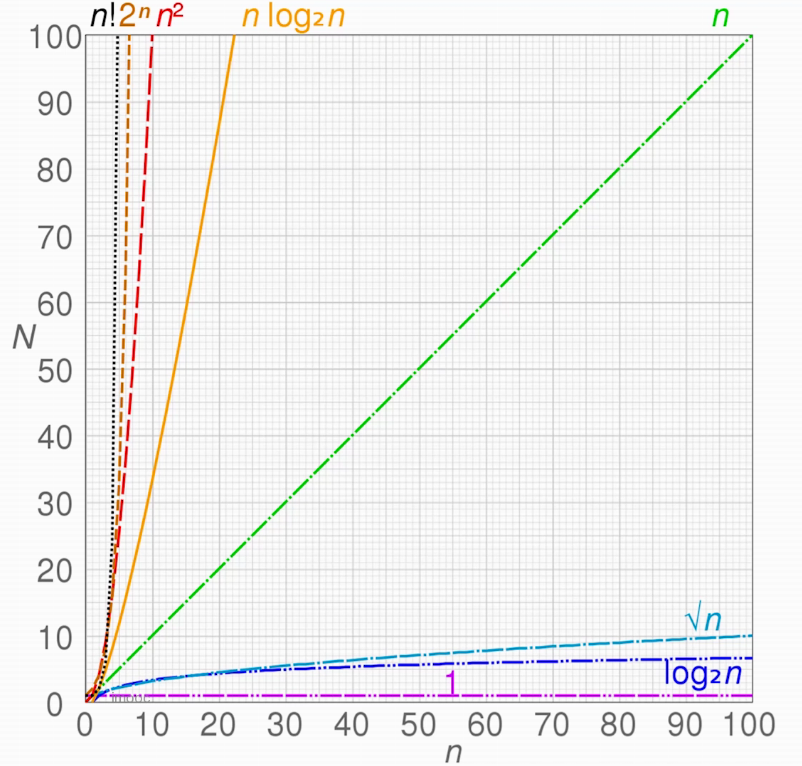

#### O(1) : 永远只会执行一次

```js
let i = 0
i += 1
```


#### O(n): n次的代码

```js
for(let i = 0; i < n; i++){
  console.log(i)
}
```

##### O(1)  + O(n) = O(n)


##### O(n)  * O(n) = O(n^2)

```js
for(let i = 0; i < n; i++){
  for(let j =0; j < n; j++){
  	console.log(i)
  }
}
```


#### O(logN)

```js
let i = 1;
while(i < n){
  console.log(i)
  i *= 2;
}
```


### 《空间复杂度是什么》

- 一个函数，用大O表示，比如O(1)、O(n)、O(n^2)......

- 算法在运行过程中临时占用存储空间大小的量度


#### O(1) : 只声明了单个变量

```js
let i = 0
i += 1
```


#### O(n): n个值，n个内存单元

```js
const list = []
for(let i = 0; i < n; i++){
  list.push(i)
}
```


#### O(n^2): 矩阵（二维数组）

```js
const martix = []
for(let i = 0; i < n; i++){
  martix.push([])
  for(let j =0; j < n; j++){
  	martix[i].push(j)
  }
}
```


## 《栈》

#### 后进先出

- JS中没有栈，但可以用Array实现栈的所有功能

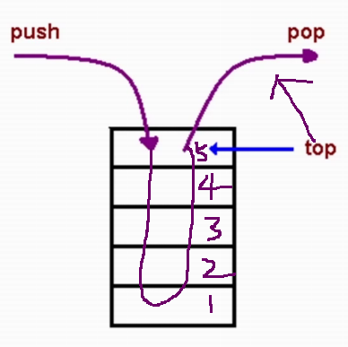

代码演示：

```js
(function(){
  const stack = []
  stack.push(1)
  stack.push(2)
  const item1 = stack.pop()
  const item2 = stack.pop()
})()
```


#### 应用场景

- 需要后进先出的场景
- 十进制转二进制、判断字符串的括号是否有效、函数调用堆栈...


##### 十进制转二进制

- 后出来的余数反而要排到前面
- 把余数依次入栈，然后再出栈，就可以实现余数倒叙输出

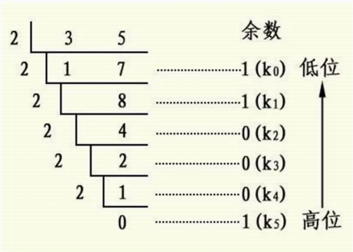

##### 有效的括号

- 越靠后的左括号，对应的右括号越靠前

- 左括号入栈，右括号出栈，**最后栈空了**就是合法的

  ```
  (((((()))))) --VALID
  ()()()() --VALID
  (((((() --INVALID
  ((()(()))) --VALID
  ```

###### leetCode:20

- 新建一个栈
- 扫描字符串，遇左括号入栈，遇到和栈顶括号类型匹配的右括号就出栈，类型不匹配直接判定为不合法。

- 最后栈空了就合法，否则不合法

```js
var isValid = function(s) {
    if(s.length % 2 === 1) { return false }
    const stack = []
    const map = new Map()
    map.set('{', '}')
    map.set('[', ']')
    map.set('(', ')')
    for(let i = 0; i < s.length; i++){
        const c = s[i]
        if(map.has(c)){
            stack.push(c)
        } else {
            const t = stack[stack.length - 1]
            if(map.get(t) === c){
                stack.pop()
            } else {
                return false
            }
        }
    }
    return stack.length === 0;
};
```

时间和空间复杂度都是O(n)


##### 函数调用堆栈

- 最后调用的函数，最先执行完
- JS解释器使用栈来控制函数的调用顺序

```js
function greeting(){
  // 最后调用，但是最早执行完
  sayHi()
}
function sayHi(){
  retrun "Hi!"
}
// 最先调用，最后执行完
greeting()
```


## 《队列》

#### 先进先出

- JS中没有队列，但可以用Array实现队列的所有功能

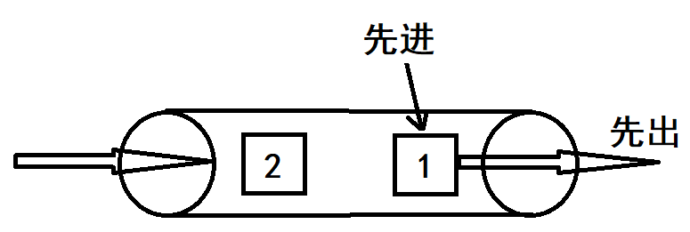


代码示例

```js
const queue = []
queue.push(1)
queue.push(2)
const item1 = queue.shift()
const item2 = queue.shift()
```


#### 应用场景

- 比如：食堂排队打饭、JS异步中的任务队列、计算最近请求次数


#####  JS异步中的任务队列

- JS是单线程的，无法同时处理异步中的并发任务
- 使用任务队列先后处理异步任务

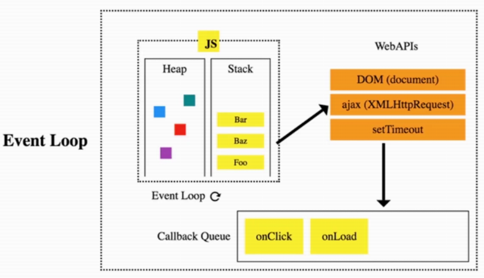

##### 计算最近请求次数

- 有新请求就入队，3000ms前发出的请求出队
- 队列的长度就是最近请求次数

###### leetCode: 933

- 越早发出的请求越早不再最近3000ms内的请求里

```js
const RecentCounter = function(){
  this.q = []
}
RecentCounter.prototype.ping = function(t){
  this.q.push(t)
  while(this.q[0] < t - 3000){
     this.q.shift()
  }
  return this.q.length
}
```

时间与空间复杂度：O(n)


## 《链表》

- 多个元素组成的列表
- 元素存储不连续，用next指针连在一起
- 数组：增删非首位元素时往往需要移动元素
- 链接：增删非首位元素，不需要移动元素，只需要更改 next的指向即可

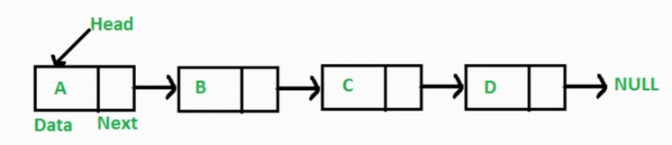

#### JS中没有链表

- 可以用Object模拟链表


代码示例

```js
const a = { val: 'a'}
const b = { val: 'b'}
const c = { val: 'c'}
const d = { val: 'd'}

a.next = b
b.next = c
c.next = d

// 遍历链表
let p = a
while(p){
  console.log(p.val)
  p = p.next
}

// 插入
const e = { val: 'e'}
c.next = e
e.next = d

// 删除
c.next = d
```


##### leetCode: 237

- 无法直接获取被删除节点的上个节点
- 将被删除节点转移到下个节点
- 将被删节点的值改为下个节点的值
- 删除下个节点

```js
const deleteNode = function(node){
  // 当前节点设置为下个节点的值
  node.val = node.next.val
  // 删除下个节点
  node.next = node.next.next
}
/* 1 2 3 4
   1 2 4 4*
   1 2 4*
*/
```

时间复杂和空间复杂度O(1)


##### leetCode: 206

- 反转两个节点：将n + 1的next指向 n
- 反转多个节点：双指针遍历链表，重复上述操作
- 双指针一前一后遍历链表
- 反转双指针

```js
const reverseList = function(head){
  let curr = head
  let prev = null
  while(curr){
    console.log(curr.val, prev && prev.val)
    // 不能让链条断掉
    const tmp = curr.next
    // 向前移动一个
    curr.next = prev
    // 交换位置
    prev = curr
    curr = tmp
  }
  console.log(curr && curr.val, prev && prev.val)
  return prev
}
```

时间复杂度O(n)和空间复杂度O(1)


##### leetCode: 2

- 新建一个空链表
- 需要遍历被相加的两个链表，模拟相加操作，将个位数追加到新链表上，将十位数留到下一位去相加

```js
const addTwoNumbers = function(l1, l2) {
    const l3 = new ListNode(0)
    let p1 = l1
    let p2 = l2
    let p3 = l3
    let carry = 0
    while(p1 || p2){
        let v1 = p1 ? p1.val : 0
        let v2 = p2 ? p2.val : 0
        const val = v1 + v2 + carry
        carry = Math.floor(val / 10)
        p3.next = new ListNode(val % 10)
        if(p1) p1 = p1.next
        if(p2) p2 = p2.next
        p3 = p3.next
    }
    if(carry){
        p3.next = new ListNode(carry)
    }
    return l3.next
};
```

时间复杂度O(n) 空间复杂度O(n)


##### leetCode: 83

- 因为链表是有序的，所以重复元素一定相邻
- 遍历链表，如果发现当前元素和下个元素值相同，就删除下个元素值
- 遍历结束后，返回原链表的头部

```js
var deleteDuplicates = function(head) {
    let p = head
    while (p && p.next) {
        if (p.val === p.next.val) {
            p.next = p.next.next
        } else {
            p = p.next
        }
    }
    return head
};
```

时间复杂度O(n) 空间复杂度O(1)


##### leetCode: 141

- 两个人在圆形操场上的起点同时起跑，速度快的让一定会超过速度慢的人一圈
- 用一快一慢两个指针遍历链表，如果指针能够相逢，那么链表就有圈

```js
var hasCycle = function(head) {
    let slow = head
    let fast = head
    while(slow && fast && fast.next){
        slow = slow.next
        fast = fast.next.next
        if(slow === fast){
            return true
        }
    }
    return false
};
```

时间复杂度O(n) 空间复杂度O(1)


#### 原型链

- 原型链的本质是链表

- 原型链上的节点是各种原型的对象，比如

  ```js
  Function.prototype
  Object.prototype
  ```

  

- 原型链通过 **__ proto__** 属性连接各种原型对象


##### 一些例子

- obj => `Object.prototype`  => null

- fun =>`Function.prototype` => `Object.prototype` => null

- `arr` => `Array.prototype`=> `Object.prototype` => null


##### 知识点

如果A沿着原型链能找到`B.prototype`，那么`A instanceof B` 为 true

```js
const obj = {}
const fun = () => {}
const arr = []
obj instanceof Object
fun instanceof Function
fun instanceof Object
arr instanceof Function // fasle
arr instanceof Array 
arr instanceof Object
```

如果在A对象上没有找到x属性，那么会沿着原型链找x属性

```js
Object.prototype.x = 'x'
const fun = () => {}
Function.prototype.y = 'y'
fun.x // 'x'
```


##### instanceof原理

遍历A的原型链，如果找到`B.prototype`，返回true，否则返回false

```js
const instanceof  = (a, b) => {
	let p = a;
	while(p){		
		if(p === b.prototype){
			return true
		}
        p = p.__proto__;
	
	return false
}
```

笔试题

```js
var foo = {}
F = function(){}
Object.prototype.a = 'value a'
Function.prototype.b = 'value b'

console.log(foo.a) // 'value a'
console.log(foo.b) // undefined

console.log(F.a) // 'value a'
console.log(F.b) // 'value b'
```


##### 使用链表指针获取JSON的节点值

```js
const json = {
  a: { b: { c:1 }},
  d: { e: 2 }
}
const path = ['a', 'b', 'c']

let p = json
path.forEach(key => {
    p = p[key]
})
```


#### 小结

- 链表的元素存储不是连续的，之间通过next连接
- JS中没有链表，但可以用Object模拟链表
- 链表常用操作：修改next、遍历链表
- JS中的原型链也是一个链表
- 使用链表指针获取JSON的节点值


## 《集合》

#### 无序且唯一

- ES6中有集合，名为Set

- 集合的常用操作：去重、判断某元素是否在集合中、求交集...

```js
// 去重
const arr = [1,2,2,1]
const arr2 = [...new Set(arr)]
// 判断元素是否在集合中
const set = new Set(arr)
const has = set.has(3)
// 求交集
const set2 = new Set([2,3])
const set3 = new Set([...set].filter(item => set2.has(item)))
```


#### leetcode: 349

- 用集合对num1去重
- 遍历nums1，筛选出nums2也包含的值

```js
var intersection = function(nums1, nums2) {
  return [...new Set(nums1)].filter(item => nums2.includes(item))
};
```

时间复杂度O(n^2) 空间复杂度O(n)


#### Set操作

- 使用Set对象：new、add、delete、has、size

```js
let mySet = new Set()
mySet.add(1)
mySet.add(5)
mySet.add(5)
mySet.add('some text')
let obj = { a:1, b: 2}
mySet.add(obj)
mySet.add({ a:1, b: 2})

mySet.has(1)
mySet.has(obj)

mySet.delete(5)

mySet.size
```


- 迭代Set：多种迭代方法、set与Array互转、求交集/差集

```js
// 多种迭代方法
for(let item of mySet) console.log(item)
for(let item of mySet.keys()) console.log(item)
for(let item of mySet.values()) console.log(item)
for(let [key, value] of mySet.keys()) console.log(key, value)
```

```js
// set与Array互转
const myArr = [...mySet]
const myArr = Array.from(mySet)
const mySet2 = new Set([1,2,3,4])
```

```js
// 求交集/差集
const intersection new Set([...mySet].filter(item => mySet2.has(item)))
const difference new Set([...mySet].filter(item => !mySet2.has(item)))
```


## 《字典》

#### 键值对存储且唯一

- ES6中有字典，名为Map
- 字典的常用操作：键值对的增删改查

```js
const m = new Map()
// add
m.set('a', 'aa')
m.set('b', 'bb')
// get
m.get('a')
// delete
m.delete('b')
m.clear()
// update
m.set('a', 'aaa')
```


#### leetcode: 349

- 用字典建立一个映射关系，记录nums1里有的值

- 遍历nums2，找出nums1里也有的值

- 新建一个字典，遍历nums1，填充字典
- 遍历nums2，遇到字典里的大值就选出，并从字典中删除

```js
var intersection = function(nums1, nums2) {
  const map = new Map()
  nums1.forEach(item => {
      map.set(item, true)
  })
  const res = [];
  nums2.forEach(item => {
      if(map.get(item)){
          res.push(item)
          map.delete(item)
      }
  })
  return res;
};
```

时间复杂度O(2n) 空间复杂度O(n)


#### leetcode: 1

- 新建一个字典作为婚姻介绍所
- nums里的值，逐个来介绍所找对象，没有合适的就先登记着，有适合的就牵手成功

```js
var twoSum = function(nums, target) {
    const map = new Map()
    for(let i = 0; i < nums.length; i++){
        const n = nums[i]
        const n2 = target - n 
        if(map.has(n2)){
            return [map.get(n2), i]
        } else {
            map.set(n, i)
        }
    }
};
```

时间与空间复杂度O(n)


#### leetcode: 3

- 用双指针维护一个滑动窗口，用来剪切子串
- 不断移动右指针，遇到重复字符，就把左指针移动到重复字符的下一位
- 过程中，记录所有窗口的长度，并返回最大值

```js
var lengthOfLongestSubstring = function(s) {
    let l = 0
    let res = 0
    const map = new Map()
    for(let r = 0; r < s.length; r++){
        if(map.has(s[r]) && map.get(s[r]) >= l){
            l = map.get(s[r]) + 1 
        }
        res = Math.max(res, r - l + 1)
        map.set(s[r], r)
    }
    return res
};
```

时间与空间复杂度O(n)


#### leetcode: 76

- 用双指针维护一个滑动窗口
- 移动右指针，找到包含T的子串，移动左指针，尽量减少包含T的子串的长度

```js
var minWindow = function(s, t) {
    let l = 0
    let r = 0
    const need = new Map()
    for(let c of t){
        need.set(c, need.has(c) ? need.get(c) + 1 : 1)
    }
    let needType = need.size;
    let res = ''
    while(r < s.length){
        const c = s[r]
        if(need.has(c)){
            need.set(c, need.get(c) - 1)
            if(need.get(c) === 0) needType--;
        }
        while(needType === 0){
            const newRes = s.substring(l, r + 1)
            if(!res || newRes.length < res.length) res = newRes
            const c2 = s[l]
            if(need.has(c2)){
                need.set(c2, need.get(c2) + 1)
                if(need.get(c2) === 1) needType++;
            }
            l++;
        }
        r++;
    }
    return res
};
```

m是t的长度，n是s的长度

时间复杂度O(m+n) 空间复杂度O(m)


## 《树》★★★

- 一种**分层**数据的抽象模型
- 前端工作中常见的树包括：DOM树、级联选择组件、树形控件

- js中没有树，但是可以用Object和Array构建树

- 树的常用操作：深度/广度优先遍历、先中后序遍历


#### 深度/广度优先遍历

- 深度优先遍历：尽可能深的搜索树的分支
  - 访问根节点
  - 对根节点的children挨个进行深度优先遍历

- 广度优先遍历：先访问离根节点最近的节点
  - 新建一个队列，把根节点入队
  - 把队头出队并访问
  - 把队头的children挨个入队
  - 重复第二、三步，直到队列为空

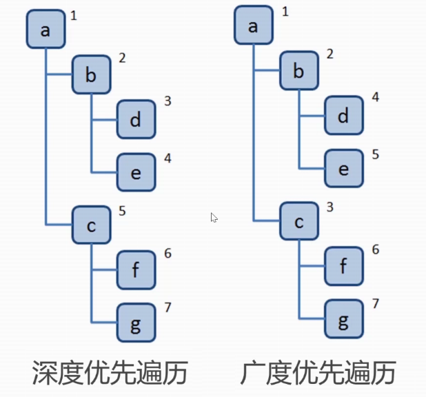


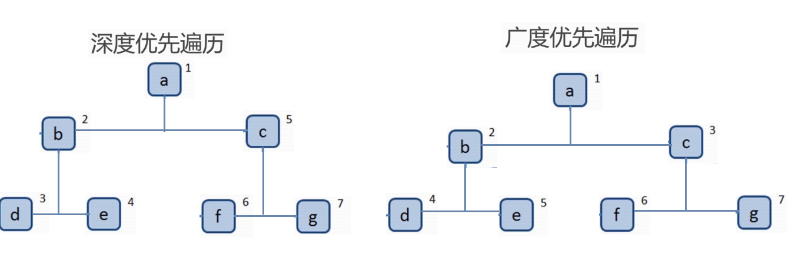

##### 代码示例

```js
const tree = {
  val: 'a',
  children: [
    {
      val: 'b',
      children: [
        {
          val: 'd',
          children: [],
        },
        {
          val: 'e',
          children: [],
        }
      ]
    },
    {
      val: 'c',
      children: [
        {
          val: 'f',
          children: [],
        },
        {
          val: 'g',
          children: [],
        }
      ]
    }
  ]
}
```

###### 深度优先

```js
const dfs = root => {
  console.log(root.val)
  root.children.forEach(child => dfs(child))
  // 简写
  root.children.forEach(dfs)
}
```

###### 广度优先

```js
const dfs = root => {
  const q = [root]
  while(q.length > 0){
      const n = q.shift()
      console.log(n.val)
      n.children.forEach(child => q.push(child))
  }
}
```


#### 二叉树

- 树中每个节点最多只能有两个子节点

- 在JS中通常用Object来模拟二叉树


##### 先序遍历

- 访问**根**节点
- 对根节点的**左**子树进行先序遍历
- 对根节点的**右**子树进行先序遍历
- 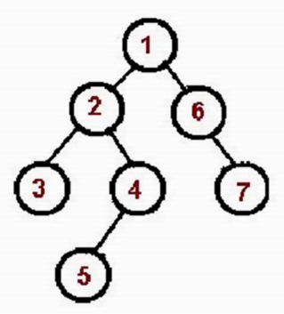

```js
const bt = {
  val: 1,
  left:
      {
        val: 2,
        left:
            {
              val: 4,
              left: null,
              right: null
            },
        right:
            {
              val: 5,
              left: null,
              right: null
            }
      },
      right: {
        val: 3,
        left:
            {
              val: 6,
              left: null,
              right: null
            },
        right:
            {
              val: 7,
              left: null,
              right: null
            }
      }
}
module.export = bt
```

```js
const bt = require('./bt')
// 递归
const perorder = root => {
  if(!root) return
  console.log(root.val)
  perorder(root.left)
  perorder(root.right)
}
// 非递归
const perorder = root => {
  if(!root) return
  const stack = [root]
  while(stack.length){
    const n = stack.pop()
    console.log(n.val)
    if(n.right) stack.push(n.right)
    if(n.left) stack.push(n.left) 
  }
}
```


##### 中序遍历

- 对根节点的**左**子树进行中序遍历
- 访问**根**节点
- 对根节点的**右**子树进行中序遍历

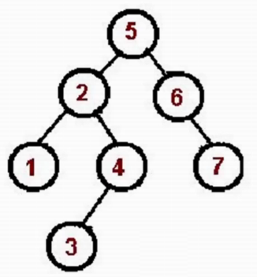

```js
const bt = require('./bt')
// 递归
const inorder = root => {
   if(!root) return
   inorder(root.left)
   console.log(root.val)
   inorder(root.right)
}
// 非递归
const perorder = root => {
  if(!root) return
  const stack = []
  let p = root
  while(stack.length || p){
    while(p){
      stack.push(p)
      p = p.left
    }
    const n = stack.pop()
    console.log(n.val)
    p = p.right
  }
}
```


##### 后序遍历

- 对根节点的**左**子树进行中序遍历
- 对根节点的**右**子树进行中序遍历
- 访问**根**节点

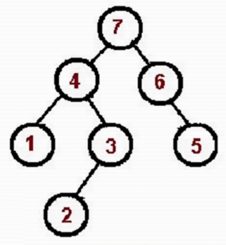

```js
const bt = require('./bt')
// 递归
const inorder = root => {
   if(!root) return
   inorder(root.left)
   inorder(root.right)
   console.log(root.val)
}
// 非递归
const perorder = root => {
  if(!root) return
  const outputStack = []
  const stack = [root]
  while(stack.length){
    const n = stack.pop()
    outputStack.push(n)
    if(n.left) stack.push(n.left)
    if(n.right) stack.push(n.right)
    while(outputStack.length){
      const n = outputStack.pop()
      console.log(n.val)
    }
  }
}
```


#### leetCode: 104

- 求最大深度，🤔使用深度优先遍历
- 在深度优先遍历过程中，记录每个节点所在的层级，找出最大的层级即可
- 新建一个变量，记录最大深度
- 深度优先遍历整棵树，并记录每个节点的层级，同时不断刷新最大深度这个变量
- 遍历结束返回最大深度这个变量

```js
var maxDepth = function(root) {
    let res = 0;
    const dfs = (n, l) => {
        if(!n) {return}
        if(!n.left && !n.right){
            res = Math.max(res, l)
        }
        dfs(n.left, l + 1)
        dfs(n.right, l + 1)
    }
    dfs(root, 1)
    return res
};
```

时间复杂度O(n) 空间复杂度O(logN)?O(n)


#### leetCode: 111

- 求最小深度，🤔使用广度优先遍历
- 在广度优先遍历中，遇到叶子节点，停止遍历，返回节点层级
- 广度优先遍历整棵树，并记录每个节点的层级
- 遇到叶子节点，返回节点层级，停止遍历

```js
var minDepth = function(root) {
    if(!root) return 0
    const q = [[root, 1]]
    while(q.length){
        const [n, l] = q.shift()
        if(!n.left && !n.right){
            return l
        }  
        // console.log(n.val, 1)
        if(n.left) q.push([n.left, l + 1])
        if(n.right) q.push([n.right, l +1])
    }
};
```

时间复杂度O(n) 空间复杂度O(n)


#### leetCode: 102

- 层序遍历顺序就是广度优先比那里
- 不过在遍历时候需要记录当前节点所处的层级，方便将其添加到不同的数组中
- 广度优先遍历二叉树
- 遍历过程中，记录每个节点的层级，并将其添加到不同的数组中

```js
var levelOrder = function(root) {
    if(!root) return []
    const q = [root]
    const res = []
    while(q.length){
        let len = q.length
        res.push([])
        while(len--){
            const n = q.shift()
            res[res.length - 1].push(n.val)
            if(n.left) q.push(n.left)
            if(n.right) q.push(n.right)
        }
    }
    return res
};
```

时间复杂度O(n) 空间复杂度O(n)


#### leetCode: 94

- 中序遍历

```js
// 递归
var inorderTraversal = function(root) {
    const res = []
    const rec = (n) => {
        if(!n) return
        rec(n.left)
        res.push(n.val)
        rec(n.right)
    }
    rec(root)
    return res
};
// 迭代
var inorderTraversal = function(root) {
    const res = []
    const stack = []
    let p = root
    while(stack.length || p){
        while(p){
            stack.push(p)
            p = p.left
        }
        const n = stack.pop()
        res.push(n.val)
        p = n.right
    }
    return res
};
```

时间复杂度O(n) 空间复杂度O(n)


#### leetCode: 112

- 在深度优先遍历的过程中，记录当前路径的节点值的和
- 在叶子节点处，判断当前路径的节点值的和是否等于目标值
- 深度优先遍历二叉树，在叶子节点处，判断当前路径的节点的和是否等于目标值，是就返回true，遍历结束否则返回fasle

```js
var hasPathSum = function(root, targetSum) {
    if(!root) return false
    let res = false
    const dfs = (n, s) => {
        if(!n.left && !n.right && s === targetSum){
            res = true
        }
        if(n.left) dfs(n.left, s + n.left.val)
        if(n.right) dfs(n.right, s + n.right.val)
    }
    dfs(root, root.val)
    return res
};
```

时间复杂度O(n) 空间复杂度O(logN)O(n)


#### 前端-遍历JSON的所有节点值


```js
const json = {
  a: { b: { c:1 }},
  d: [1, 2],
}
const dfs = (n, path) => {
  console.log(n, path)
  Object.keys(n).forEach(key => {
    dfs(n(key), path.concat(key))
  })
}
dfs(json, [])
```


#### 前端-渲染Antd的树组件

```jsx
const { Tree } = antd
const { TreeNode } = Tree
const json = [
    {
      title: '一',
      key: '1',
      children: [{
          titile: '三', 
          key: '3', 
          children: [{ titile: '四', key: '4', children: []}]
      }]
    },
    {
      title: '二',
      key: '2',
      children: [{ titile: '四', key: '4', children: []}]
    },
]
calss Demo extends React.Component {
    dfs = (n) => {
        return (
           <TreeNode title = (n.title) key={n.key}>
              {n.children.map(this.rfs)}
           </TreeNode>
        )
    }
    render(){
        return (
         <Tree>
            {json.map(this.dfs)}
         </Tree>
        )
    }
}
ReactDOM.render(<Dmo />, mountNode)
```


## 《图》

- 图示**网络结构**的抽象模型，是一组由**边**连接的**节点**
- 图可以表示任何二元关系，比如道路、航班...
- js中没有图，可以用Object和Array构建图
- 图的表示法：邻接矩阵★、邻接表★、关联矩阵...


#### 邻接矩阵


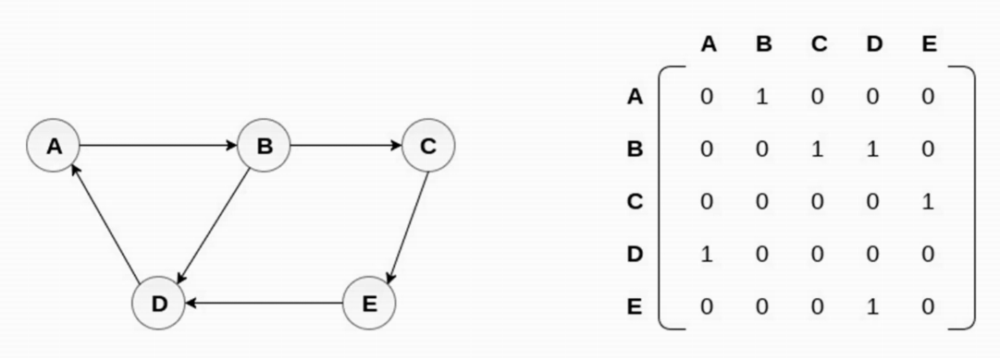

#### 邻接表

```JS
{
 A: ['B'],
 B: ['C', 'D'],
 C: ['E'],
 D: ['A'],
 E: ['D']
}
```


#### 图的常用操作

##### 深度优先遍历

- 访问根节点
- 对根节点的**没访问的相邻节点**挨个进行深度优先遍历

```js
const graph = {
  0: [1, 2],
  1: [2],
  2: [0 ,3],
  3: [3]
}
module.export = graph
```

```js
const graph = reequire('./graph')
const visited = new Set()
const dfs = (n) => {
  console.log(n)
  visited.add(n)
  graph[n].forEach(c => {
      if(!visited.has(c)){
          dfs(c)
      }
  })
}
dfs(2)
```


##### 广度优先遍历

- 新建一个队列，把根节点入队
- 把队头出队并访问
- 把队头的**没访问的相邻节点**入队

- 重复第二、三步，直到队列为空

```js
const graph = reequire('./graph')
const visited = new Set()
visited.add(2)
const q = [2]
while(q.length){
  const n = q.shift()
  console.log(n)
  graph(n).forEach(c => {
     if(!visited.has(c)){
        q.push(c)
        visited.add(c)
     }
  })
}
dfs(2) 
```


#### leetCode：65

- 构建一个表示状态的图
- 遍历字符串，并沿着图走，如果到了某个节点无路可走就返回fasle
- 遍历结束，如走到3/5/6，就返回true，否则返回fasle

```js
var isNumber = function(s) {
    const graph = {
        0: { 'blank': 0, 'sign': 1, '.': 2, 'digit': 6 },
        1: { 'digit': 6, '.': 2},
        2: { 'digit': 3 },
        3: { 'digit': 3, 'e': 4 },
        4: { 'digit': 5, 'sign': 7},
        5: { 'digit': 5 },
        6: { 'digit': 6, '.': 3, 'e': 4 },
        7: { 'digit': 5 }
    }
    let state = 0;
    for(c of s.trim()){
        if(c >= '0' && c <= '9'){
            c= 'digit'
        } else if ( c === ' '){
            c= 'blank'
        } else if ( c === '+' || c === '-'){
            c = 'sign'
        }
        state = graph[state][c]
        if(state === undefined){
            return false
        }
    }
    if(state === 3 || state === 5 || state === 6){
        return true
    }
    return false
};
```

时间复杂度O(n) 空间复杂度O(1)


#### leetCode：417

- 把矩阵想象成图
- 从海岸线逆流而上遍历图，所到之处就是可以流到某个大洋的坐标

- 新建两个矩阵，分别记录能流到两个大洋的坐标
- 从海岸线，多管齐下，同时深度优先遍历图，过程中填充上述矩阵
- 遍历两个矩阵，找出能流到两个大洋的坐标

```js
var pacificAtlantic = function(heights) {
    if(!heights || !heights[0]) return []
    const m = heights.length
    const n = heights[0].length
    const flow1 = Array.from({ length: m }, () => new Array(n).fill(false))
    const flow2 = Array.from({ length: m }, () => new Array(n).fill(false))

    const dfs = (r, c, flow) => {
        flow[r][c] = true;
        [[r - 1, c], [r + 1, c], [r, c - 1], [r, c + 1]].forEach(([nr, nc]) => {
            if(
                // 保证在矩阵中
                nr >= 0 && nr < m &&
                nc >= 0 && nc < n &&
                // 防止死循环
                !flow[nr][nc] &&
                // 保证逆流而上
                heights[nr][nc] >= heights[r][c]
            ){
                dfs(nr, nc, flow)
            }
        })
    }

    // 沿着海岸线逆流而上
    for(let r = 0; r < m; r++){
        dfs(r, 0, flow1)
        dfs(r, n - 1, flow2)
    }
    for(let c = 0; c < n; c++){
        dfs(0, c, flow1)
        dfs(m - 1, c, flow2)
    }
    // 收集能流到两个大洋里的坐标
    const res = []
    for(let r = 0; r < m; r++){
        for(let c = 0 ; c < n; c++){
            if(flow1[r][c] && flow2[r][c]){
                res.push([r, c])
            }
        }
    }
    return res
};
```

时间复杂度O(m * n) 空间复杂度O(m * n)


#### leetCode：133

- 拷贝所有的节点
- 拷贝所有的边
- 深度或广度优先遍历所有节点
- 拷贝所有节点，存储起来
- 将拷贝的节点，按照原图的连接方法进行连接

```js
var cloneGraph = function(node) {
   if(!node) return
   const visited = new Map()
   visited.set(node, new Node(node.val))
   const q = [node]
   while(q.length){
       const n = q.shift();
       (n.neighbors || []).forEach(ne => {
           if(!visited.has(ne)){
               q.push(ne)
               visited.set(ne, new Node(ne.val))
           }
           visited.get(n).neighbors.push(visited.get(ne))
       })
   } 
   return visited.get(node)
};
```

时间复杂度O( n) 空间复杂度O(n)


## 《堆》

- 堆是一种特殊得到**完全的二叉树**
- 所有节点都**大于**等于（最大堆）或**小于**等于（最小堆）它的子节点

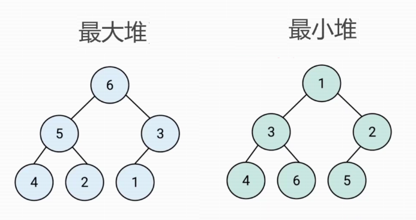

- js中通常用数组表示堆

- 左侧子节点的位置是2 * index + 1

- 右侧子节点的位置是2 * index + 2

- 父节点位置是(index - 1) / 2

  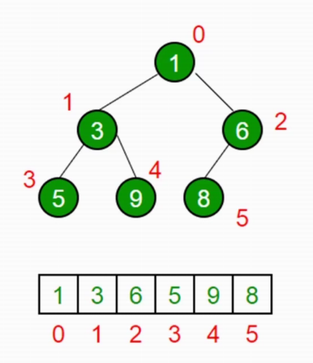

#### 堆的应用

- 能高效、快速地找出最大值和最小值，时间复杂度：O(1)

- 找出第K个最大（小）元素
  - 构建一个最小堆，并将元素依次插入堆中
  - 当堆的容量超过K，就删除堆顶
  - 插入结束后，堆顶就是第K个最大元素


#### 代码演示

##### 插入

- 将值插入堆的底部，即数组的尾部
- 然后上移：将这个值和它的父节点进行交还，直到父节点小于等于这个插入的值
- 大小为K的堆中插入元素的时间复杂度为O(logK)

```js
class MinHeap {
  constructor(){
    this.heap = []
  }
  getParentIndex(i) {
    retrun (i - 1) >> 1
  }
  swap (i1, i2){
     let temp = this.heap[i1]
     this.heap[i1] = this.heap[i2]
     this.heap[i2] = temp
  }
  shiftUp(index) {
    if(index === 0) return
    const parentIndex = this.getParentIndex(index)
    if(this.heap[parentIndex] && this.heap[parentIndex] > this.heap[index]) {
        this.swap(parentIndex, index);
        this.shiftUp(parentIndex)
    }
  }
  insert(value) {
    this.heap.push(value)
    this.shiftUp(this.heap.length -1)
  } 
    
  // delete删除堆顶
  shiftDown(index){
      const leftIndex = this.getLeftIndex(index)
      const rightIndex = this.getRightIndex(index)
      if(this.heap[leftIndex] && this.heap[leftIndex] < this.heap[index]){
          this.swap(leftIndex, index)
          this.shiftDown(leftIndex)
      }
      if(this.heap[rightIndex] && this.heap[rightIndex] < this.heap[index]){
          this.swap(rightIndex, index)
          this.shiftDown(rightIndex)
      }
  }
  getParentIndex(i) {
    retrun (i - 1) >> 1
  }
  getLeftIndex(i) {
    retrun i * 2 + 1
  }
  getRightIndex(i) {
    retrun i * 2 + 2
  }
  pop(){
      this.heap[0] = this.heap.pop()
      this.shiftDown(0)
  }
  // 获取堆顶和堆的大小
  peek(){
      return this.heap[0]
  }
  size(){
      return this.heap.length
  }
}
const h  = new MinHeap()
h.insert(3)
h.insert(2)
h.insert(1)
// delete删除堆顶
h.pop()
```


##### 删除堆顶

- 用数组尾部元素替换堆顶（直接删除堆顶会破坏堆结构）
- 然后下移：将新堆顶和它的子节点进行交换，直到子节点大于等于这个新堆顶
- 大小为K 的堆中删除堆顶的时间复杂度为O(logK)


##### 获取堆顶和堆的大小


#### leetCode: 215

- 看到第K个最大元素，考虑使用最小堆
- 构建一个最小堆，并依次把数组的值插入堆中
- 当堆的容量超过K，就删除堆顶
- 插入结束后，堆顶就是第K个最大元素

```js
var findKthLargest = function(nums, k) {
   const h = new MinHeap()
   nums.forEach(n => {
       h.insert(n)
       if(h.size() > k){
           h.pop()
       }
   }) 
   return h.peek()
};
```

时间复杂度O(n * logK) 空间复杂度O(k)


#### leetCode: 347


```js
var topKFrequent = function(nums, k) {
  const map = new Map()
  nums.forEach(n => {
  	map.set(n, map.has(n) ? map.get(n) + 1, 1)
  })
  const list = Array.from(map).sort((a, b) => b[1] - a[1])
  return list.slice(0, k).map(n => n[0])
}
```


```js
var topKFrequent = function(nums, k) {
    const map = new Map()
    nums.forEach(n => {
        map.set(n, map.has(n) ? map.get(n) + 1 : 1)
    })
    const h = new MinHeap()
    nums.forEach((value, key) => {
        h.insert({ value, key})
        if(h.size() > k){
            h.pop()
        }
    })   
    return h.heap.map(a => a.key)
};
```

时间复杂度O(n * logK) 空间复杂度O(n)


#### leetCode: 23

- 新链表的下一个节点一定是K个链表头中的最小节点
- 考虑使用最小堆
- 构建一个最小堆，并以此把链表头插入堆中
- 弹出堆顶接到输出链表，并将堆顶所在链表的新链表头插入堆中
- 等堆元素全部弹出，合并工作就完成了

```js
var mergeKLists = function(lists) {
    const res = new ListNode(0)
    let p = res
    const h = new MinHeap()
    lists.forEach(l => {
        if(l) h.insert(l)
    })
    while(h.size()){
        const n = h.pop()
        p.next = n
        if(n.next) h.insert(n.next)
    }
    return res.next
};
```

时间复杂度O(n * logK) 空间复杂度O(K)


## 《排序和搜索》★★★

- 模拟网站：https://visualgo.net/en/sorting

- 排序：把某个乱序的数组变成升序或者降序的数组
- 搜索：找出数组中某个元素的下标

#### JS中的方法

JS中的排序：数组的sort方法

JS中的搜索：数组的indexOf方法


#### 排序算法

##### 冒泡排序

- 思路：比较所有相邻元素，如果第一个比第二个，则交还它们
- 一轮下来，可以保证最后一个数是最大的
- 执行n-1轮，就可以完成排序

```js
Array.prototype.bubbleSort = function () {
  for (let i = 0; i < this.length - 1; i++) {
    for (let j = 0; j < this.length - 1 - i; j++) {
      if(this[j] > this[j + 1]){
        const temp = this[j]
        this[j] = this[j +1]
        this[j + 1] = temp
      }
    }
  }
}
const arr = [3, 32, 3, 0, 23, 12]
arr.bubbleSort()
```

时间复杂度O(n^2) 空间复杂度O(1)


##### 选择排序

- 找到数组中的最小值，选中它并将其放置在第一位
- 找到数组中第二小的值，选中它并将其放置在第二位
- 执行n-1轮，就可以完成排序

```js
Array.prototype.selectionSort = function () {
  for (let i = 0; i < this.length - 1; i++) {
    let indexMin = i
    for (let j = i; j < this.length; j++) {
      if(this[j] < this[indexMin]){
        indexMin = j
      }
    }
    if(indexMin !== i){
       const temp = this[i]
       this[i] = this[indexMin]
       this[indexMin] = temp
    }  
  }
}
const arr = [3, 32, 3, 0, 23, 12]
arr.selectionSort()
console.log(arr);
```

时间复杂度O(n^2) 


##### 插入排序

- 从第二个数开始往前比
- 比它大就往后排
- 以此类推进行到最后一个数

```js
Array.prototype.insertionSort = function () {
  for (let i = 0; i < this.length; i++) {
    const temp = this[i]
    let j = i
    while(j > 0){
      if(this[j - 1] > temp){
        this[j] = this[j - 1]
      } else {
        break
      }
      j--
    }
    this[j] = temp
  }
}

const arr = [3, 32, 3, 0, 23, 12]
arr.insertionSort()
console.log(arr);
```

时间复杂度O(n^2) 空间复杂度O(1)


##### 归并排序

- 分：把数组劈成两半，再递归地对子数组进行“分”操作，直到分成一个个单独的树
- 和：把两个数合并为有序数组，再对有序数组进行合并，知道全部子数组合并为一个完整数组
  - 新建一个空数组res，用于存放最终排序后的数组
  - 比较两个有序数组的头部，较小者出队并推入res中
  - 如果两个数组还有值，就重复第二步

```js
Array.prototype.mergeSort = function () {
  const rec = arr => {
    if(arr.length === 1) return arr
    const mid = Math.floor(arr.length / 2)
    const left = arr.slice(0, mid)
    const right = arr.slice(mid, arr.length)
    const orderLeft = rec(left)
    const orderRight = rec(right)
    const res = []
    while(orderLeft.length || orderRight.length){
      if(orderLeft.length && orderRight.length){
        res.push(orderLeft[0] < orderRight[0] ? orderLeft.shift() : orderRight.shift())
      } else if (orderLeft.length){
        res.push(orderLeft.shift())
      } else if (orderRight.length){
        res.push(orderRight.shift())
      }
    }
    return res
  }
  const res = rec(this)
  res.forEach((n, i) => { this[i] = n })
}

const arr = [3, 32, 3, 0, 23, 12]
arr.mergeSort()
console.log(arr);
```

分的时间复杂度是O(logN)

和的时间复杂度是O(n)

所以时间复杂度为：O(n * logN)


##### 快速排序

- 分区：从数组中任意选择一个“基准”，所以比基准小的元素放在基准前面，比基准大的元素放在基准的后面
- 递归：递归地对基准前后的子数组进行分区

```js
Array.prototype.quickSort = function () {
  const rec = arr => {
    if(arr.length === 1 || arr.length === 0){
      return arr
    }
    const left = []
    const right = []
    const mid = arr[0]
    for (let i = 1; i < arr.length; i++) {
      if(arr[i] < mid) {
        left.push(arr[i])
      } else {
        right.push(arr[i])
      }
    }
    return [...rec(left), mid, ...rec(right)]
  }
  const res = rec(this)
  res.forEach((n, i) => { this[i] = n })
}

const arr = [3, 32, 3, 0, 23, 12]
arr.quickSort()
console.log(arr);
```

递归的时间复杂度O(logN)

分区操作的时间复杂度是O(n)

所以时间复杂度为：O(n * logN)


#### 搜索算法

##### 顺序搜索

- 遍历数组
- 找到目标值相等的元素，就返回它的下标
- 遍历结束后，如果没有所搜到目标值，就返回-1

```js
Array.prototype.sequentialSearch = function (item) {
  for(let i = 0 ; i < arr.length; i++){
    if(this[i] === item){
      return i
    }
  }
  return -1
} 
const arr = [3, 32, 3, 0, 23, 12]
console.log(arr.sequentialSearch(23));
```

时间复杂度为：O(n)


##### 二分搜索

- 从数组的中间元素开始，如果中间元素正好是目标值，则搜索结束
- 如果目标值大于或者小于中间元素，则在大于或小于中间元素的那一半数组中搜索

- 如果没有所搜到目标值，就返回-1

```js
Array.prototype.binarySearch = function (item) {
  let low = 0
  let high = this.length - 1
  while(low <= high){
    const mid = Math.floor((low + high) / 2)
    const element = this[mid]
    if(element < item){
      low = mid + 1
    } else if (element > item) {
      high = mid - 1
    } else {
      return mid
    }
  }
  return -1
}

const arr = [3, 32, 3, 0, 23, 12]
console.log(arr.binarySearch(23));
```

每一次比较都使搜索范围缩小一半

时间复杂度：O(logN)


#### leetCode: 21

- 新建一个新链表，作为返回结果
- 用指针遍历两个有序链表，并比较两个链表的当前节点，较小者先接入新链表，并将指针后移一步
- 链表遍历结束，返回新链

```js
var mergeTwoLists = function(l1, l2) {
    const res = new ListNode(0)
    let p = res
    let p1 = l1
    let p2 = l2
    while(p1 && p2){
        if(p1.val < p2.val){
            p.next = p1
            p1 = p1.next
        } else {
            p.next = p2
            p2 = p2.next
        }
        p = p.next
    }
    if(p1){
        p.next = p1
    }
    if(p2){
        p.next = p2
    }
    return res.next
};
```

时间复杂度O(m+n) 空间复杂度O(1)


#### leetCode: 374

- 从数组中间元素开始，如果中间元素正好是目标值，则搜索过程结束
- 如果目标值大于或者小于中间元素，则在数组大于或小于中间元素的那一半中查找

```js
var guessNumber = function(n) {
    let low = 1
    let high = n
    while(low <= high){
        const mid = Math.floor((low + high) / 2)
        const res = guess(mid)
        if(res === 0){
            return mid
        } else if (res === 1){
            low = mid + 1
        } else {
            high = mid - 1
        }
    }
};
```

时间复杂度O(logN) 空间复杂度O(1)


#### 一些问题

- Chrom浏览器最新的Arrayprototype.sort用的是什么排序算法
- 用二分法搜索法求x的平方根 leetCode:69


## 《分而治之》

它将一个问题分成多个和原问题相似的独立的小问题，递归解决小问题，再将结果合并以解决原来的问题


#### 归并排序

- 分：把数组从中间一分为二
- 解：递归地对里两个子数组进行归并排序
- 合：合并有序子数组


#### 快速排序

- 分：选基准，按基准把数组分成两个子数组
- 解：递归地对两个子数组进行快速排序
- 合：对两个子数组进行合并


#### leetCode: 374

- 二分搜索，同样具备“分、解、合”的特性
- 考虑选择分而治之
  - 分：计算中间元素，分割数组
  - 解：递归地在较大或者较小子数组进行二分搜索
  - 合：不需要此步，因为在子数组中搜到就返回了

```js
var guessNumber = function(n) {
  const rec = (low, high) => {
    if (low > high)  return
    const mid = Math.floor((low + high) / 2)
    const res = guess(mid)
    if(res === 0){
       return mid    
    } else if (res === 1){
        return rec(mid + 1, high)
    } else {
        return rec(1, mid - 1)
    }
  } 
  return rec(1, n)
};
```

时间复杂度O(logN) 空间复杂度O(logN)


#### leetCode: 226

- 先翻转左右子树，再将子树换个位置
- 符合“分、解、合”的特性
  - 分：获取左右子树
  - 解：递归地翻转左右子树
  - 合：将翻转后的左右子树换个位置放到根节点上

```js
var invertTree = function(root) {
    if(!root) return null
    return{
        val: root.val,
        left: invertTree(root.right),
        right: invertTree(root.left)
    }
};
```

时间复杂度O(n) 空间复杂度O(n)


#### leetCode: 100

- 两个树：根节点的值相同，左子树相同，右子树相同
- 符合“分、解、合”的特性
  - 分：获取两个树的左子树和右子树
  - 解：递归地判断两个树的左子树是否相同，右子树是否相同
  - 合：将上述结果合并，如果根节点的值也相同，树就相同

```js
var isSameTree = function(p, q) {
    if(!p && !q) return true
    if(p && q && p.val === q.val && 
    isSameTree(p.left, q.left) &&
    isSameTree(p.right, q.right) 
    ){
        return true
    }
    return false
};
```

时间复杂度O(n) 空间复杂度O(n)


#### leetCode: 101

- 转化为：左右子树是否镜像
- 分解为：树1的左子树和树2的右子树是否镜像，树1的右子树和树2的左子树是否镜像 
  - 分：获取两个树的左子树合右子树
  - 解：递归地判断树1的左子树和树2的右子树是否镜像，树1的右子树和树2的左子树是否镜像

```js
var isSymmetric = function(root) {
    if(!root) return true
    const isMirror = (l, r) => {
        if(!l && !r) return true
        if(l && r && l.val === r.val &&
            isMirror(l.left, r.right) &&
            isMirror(l.right, r.left)
        ){
            return true
        }
        return false
    }
    return isMirror(root.left, root.right)
};
```

时间复杂度O(n) 空间复杂度O(n)


#### 一些问题

- 说出分而治之的套路步骤
- 用分而治之的套路步骤，描述切西瓜的过程


## 《动态规划》

它将一个问题分解为**相互重叠**的子问题，通过反复求解子问题，来解决原来的问题

案例：斐波那契数列 0、1、1、2、3、5、8、13、21、34

- 定义子问题：F（n）= F( n - 1 ) +  F( n - 2 ) 
- 反复执行：从2循环到n，执行上述公式


#### leetCode: 70

- 爬到第n阶可以在第n-1阶爬1个台阶，或者在第n-2阶爬2个台阶
- F（n）= F( n - 1 ) +  F( n - 2 ) 
- 反复执行：从2循环到n，执行上述公式

```js
var climbStairs = function(n) {
    if(n < 2) return 1
    let dp0 = 1
    let dp1 = 1
    for(let i = 2; i <= n; i++){
        const temp = dp0
        dp0 = dp1
        dp1 = dp1 + temp
    }
    return dp1
};
```

时间复杂度O(n) 空间复杂度O(1)


#### leetCode: 198

- f(k) = 从前k个房屋中能偷窃到的最大数额
- Ak = 第k个房屋的钱数
- f(k)  = max（f (k - 2 ) + Ak,  f( k - 1))

- 反复执行：从2循环到n，执行上述公式

```js
var rob = function(nums) {
    if(nums.length === 0) return 0
    let dp0 = 0
    let dp1 = nums[0]
    for(let i = 2; i <= nums.length; i++){
        const dp2 = Math.max(dp0 + nums[i - 1], dp1)
        dp0 = dp1
        dp1 = dp2
    }
    return dp1
};
```

时间复杂度O(n) 空间复杂度O(1)


#### 一些问题

- 说出动态规划的套路步骤
- 完成打家劫舍2=> leetCode：123


## 《贪心算法》

期盼通过每个阶段的**局部最优**选择，从而达到全局的最优，结果不一定是最优的

案例：零钱兑换（最少数量）

- 输入：coins = [1, 2, 5], amount = 11
- 输出：3
- 11 = 5 + 5 + 1


#### leetCode: 455

- 局部最优：既能满足孩子，还消耗最少
- 先将“较小的饼干”分给“胃口最小”的孩子
- 对饼干数组和胃口数组升序排序
- 遍历饼干数组，找到能满足第一个孩子的饼干
- 然后继续遍历饼干数组，找到满足第二、三、...、n个孩子得到饼干

```js
var findContentChildren = function(g, s) {
    const sortFunc = function (a, b){
        return a - b
    }
    g.sort(sortFunc)
    s.sort(sortFunc)
    let i = 0
    s.forEach(n => {
        if(n >= g[i]){
            i++
        }
    })
    return i
};
```

时间复杂度O(n * logN) 空间复杂度O(1)


#### leetCode: 122

- 前提：上帝视角，知道未来的价格
- 局部最优：见好就收，见差就不动，不做任何长远打算
- 新建一个变量，用来统计总利润
- 遍历价格数组，如果当前价格比昨天高，就在昨天买，今天卖，否则就不交易
- 遍历结束后，返回所有利润之和

```js
var maxProfit = function(prices) {
    let profit = 0
    for(let i = 1; i< prices.length; i++){
        if(prices[i] > prices[i - 1]){
            profit += prices[i] - prices[i - 1]
        }
    }
    return profit
};
```

时间复杂度O(n) 空间复杂度O(1)


#### 一些问题

- 说出贪心算法的套路步骤
- 贪心算法总能求的最优解吗？为什么？


## 《回溯算法》

一种**渐进式**寻找并构建问题解决方式的策略，会先从一个可能的动作开始解决问题，如果不行，就回溯并选择另一个动作，直到将问题解决


#### 应用

- 有很多组合，路

- 这些路里，有死路，也有出路
- 通常需要递归模拟所有的路

##### 全排列

1、2、3有多少中排列组合？

- 用递归模拟出所有情况
- 遇到包含重复元素的情况，就回溯
- 收集所有达到递归终点的情况，并返回


#### leetCode: 46

```js
var permute = function(nums) {
    const res = []
    const backtrack = path =>{
        if(path.length === nums.length){
            res.push(path)
            return
        }
        nums.forEach(n => {
            if(path.includes(n)) return
            backtrack(path.concat(n))
        })
    }
    backtrack([])
    return res
};
```

时间复杂度O(n) 空间复杂度O(n)


leetCode: 78

- 要求：1、所有子集; 2、没有重复元素
- 有出路、有死路
- 考虑使用回溯算法
- 用递归模拟出所有情况
- 保证接的数字都是后面的数字
- 收集所有达到递归终点的情况，并返回

```js
var subsets = function(nums) {
    const res = []
    const backtrack = (path, l, start) => {
        if(path.length === l){
            res.push(path)
            return
        }
        for(let i = start; i < nums.length; i++){
            backtrack(path.concat(nums[i]), l, i + 1)
        }
    }
    for(let i = 0; i <= nums.length; i++){
        backtrack([], i, 0)
    }
    return res
};
```

时间复杂度O(n ^ 2) 空间复杂度O(n)


#### 一些问题

- 说出回溯算法的套路步骤
- 用回溯算法的套路步骤描述走迷宫的过程

