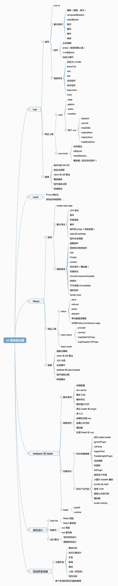

# React、Vue、Webpack、Babel面试



## 面试题

### Vue

- v-show和v-if的区别
  - v-show通过CSS display控制显示和隐藏
  - v-if真正的渲染和销毁，而不是隐藏 
  - 频繁切换显示状态用v-show，否则用v-if
  
- 为何v-for中要用key
  - diff算法通过tag和key来判断，是否是sameNode
  - 减少渲染次数，提升渲染性能
  
- 描述Vue组件生命周期（有父子组件的情况）
  - 
  
- Vue组件如何通讯
  - 父子组件`props`和`this.$emit`
  - 自定义事件`event.$on` `event.$off` `event.$emit`
  - vuex
  
- 描述组件渲染和更新的过程
  - 画图
  - 紫色蓝色 => 响应式
  - 黄色 => 模板渲染
  - 绿色 => Vdom
  
- 双向数据绑定v-model的实现原理

  - input 元素的 :value = this.name

  - 绑定input 事件 this.name = $event.target.value

  - data 更新触发re-render

  - ```vue
    <input :value="value" @input="value = $event.target.value" />
    ```


### React

- React组件如何通讯

- JSX的本质是什么

- context是什么，有何用途

- shouldComponentUpadate的用途

- 描述redux单向数据流

- setState是同步还是异步？★★★

  ```jsx
  class Root extends React.Component{
  	constructor(props){
  	  super(props)
  	  this.state = { count 0 }
  	}
  	componentDidMount(){
  	  this.setState({ count: this.state.count + 1 })
  	  console.log(this.state.count)
  	  this.setState({ count: this.state.count + 1 })
  	  console.log(this.state.count)
  	  setTimeout(function(){
  	  	this.setState({ count: this.state.count + 1 })
  	    console.log(this.state.count)
  	  }, 0)
  	  setTimeout(function(){
  	  	this.setState({ count: this.state.count + 1 })
  	    console.log(this.state.count)
  	  }, 0)
  	}
  	render(){
  	  return <h1>{this.state.count}</h1>
  	}
  }
  ```


### 框架综合应用

- 基于React设计一个todolist（组件结构，redux state数据结构）

- 基于Vue设计一个购物车（组件结构，vuex state数据结构）


### Webpack

- 前端代码为何要进行构建和打包？
- module chunk bundle 分别什么意思，有何区别？
- loader和plugin的区别？
- webpack如何实现懒加载？
- webpack常见性能优化？
- babel-runtime和babel-polyfill的区别


### 怎么办？

- 框架的使用（基本使用，高级特性，周边插件）
- 框架的原理（基本原理的了解，热门技术的深度，全面性）
- 框架的实际应用，即设计能力（组件结构，数据结构）


### Why？

- 保证候选人能正常工作 ——考察使用

- 多个候选人竞争时，选择有技术追求的——考察原理
- 看候选人是否能独立承担项目——考察设计能力


## Vuejs基础

### 指令和插值

- 插值、表达式
- 指令、动态属性
- `v-html`: 会有XSS风险，会覆盖子组件

```vue
<template>
    <div>
        <p>文本插值 {{message}}</p>
        <p>JS 表达式 {{ flag ? 'yes' : 'no' }} （只能是表达式，不能是 js 语句）</p>

        <p :id="dynamicId">动态属性 id</p>

        <hr/>
        <p v-html="rawHtml">
            <span>有 xss 风险</span>  
            <span>【注意】使用 v-html 之后，将会覆盖子元素</span>
        </p>
        <!-- 其他常用指令后面讲 -->
    </div>
</template>

<script>
export default {
    data() {
        return {
            message: 'hello vue',
            flag: true,
            rawHtml: '指令 - 原始 html <b>加粗</b> <i>斜体</i>',
            dynamicId: `id-${Date.now()}`
        }
    }
}
</script>
```


### computed和watch

- computed有缓存★★★(提高性能)，data不变则不会重新计算

  ```vue
  <template>
      <div>
          <p>num {{num}}</p>
          <p>double1 {{double1}}</p>
          <input v-model="double2"/>
      </div>
  </template>
  
  <script>
  export default {
      data() {
          return {
              num: 20
          }
      },
      computed: {
          double1() {
              return this.num * 2
          },
          double2: {
              get() {
                  return this.num * 2
              },
              set(val) {
                  // input输入的时候会将值改变为输入的一半
                  this.num = val / 2
              }
          }
      }
  }
  </script>
  ```


原理

```js
const age = computed(() => {
    retrun age.value + 1
})
// 错误
function computed(getter) {
  let value 
  watchEffect(() => {
    // 此处代码相当于异步，但是函数执行完会执行返回return的内容，异步的内容会加载，但是因为是值类型，此时无法改变，引用类型可以
    value = getter()
  })
  // 类似于 let a = 100 b = a  a = 200 
  setTimeout(() => {
    value = getter()
  }, 1500)
  return value
}
// 响应式
function computed(getter) {
  const ref = {
    value: null
  }  
  watchEffect(() => {
    ref.value = getter()
  })
  return ref
}
```


- watch如何深度监听？

- watch监听引用类型，拿不到oldVal

  ```vue
  <template>
      <div>
          <input v-model="name"/>
          <input v-model="info.city"/>
      </div>
  </template>
  
  <script>
  export default {
      data() {
          return {
              name: 'heisming',
              info: {
                  city: '北京'
              }
          }
      },
      watch: {
          name(oldVal, val) {
              // eslint-disable-next-line
              console.log('watch name', oldVal, val) // 值类型，可正常拿到 oldVal 和 val
          },
          info: {
              handler(oldVal, val) {
                  // eslint-disable-next-line
                  console.log('watch info', oldVal, val) // 引用类型，拿不到 oldVal 。因为指针相同，此时已经指向了新的 val
              },
              deep: true // 深度监听
          }
      }
  }
  </script>
  ```
  


### class和style

- 使用动态属性 :class,
- 使用驼峰式写法  :style  fontSize="123px"

```vue
<template>
    <div>
        <p :class="{ black: isBlack, yellow: isYellow }">使用 class</p>
        <p :class="[black, yellow]">使用 class （数组）</p>
        <p :style="styleData">使用 style</p>
    </div>
</template>

<script>
export default {
    data() {
        return {
            isBlack: true,
            isYellow: true,

            black: 'black',
            yellow: 'yellow',

            styleData: {
                fontSize: '40px', // 转换为驼峰式
                color: 'red',
                backgroundColor: '#ccc' // 转换为驼峰式
            }
        }
    }
}
</script>

<style scoped>
    .black {
        background-color: #999;
    }
    .yellow {
        color: yellow;
    }
</style>
```


### 条件渲染

- v-if  v-else的用法，可使用变量，也可以使用===表达式
- v-if和v-show的区别？
- v-if和v-show得到使用场景？

```vue
<template>
    <div>
        <p v-if="type === 'a'">A</p>
        <p v-else-if="type === 'b'">B</p>
        <p v-else>other</p>

        <p v-show="type === 'a'">A by v-show</p>
        <p v-show="type === 'b'">B by v-show</p>
    </div>
</template>

<script>
export default {
    data() {
        return {
            type: 'a'
        }
    }
}
</script>
```


### 循环（列表）渲染

- 如何遍历对象？——也可以用v-for
- key的重要性。key不能乱写（如random和或者index）

- v-for和v-if不能一起用！

```vue
<template>
    <div>
        <p>遍历数组</p>
        <ul>
            <li v-for="(item, index) in listArr" :key="item.id">
                {{index}} - {{item.id}} - {{item.title}}
            </li>
        </ul>

        <p>遍历对象</p>
        <ul >
            <li v-for="(val, key, index) in listObj" :key="key">
                {{index}} - {{key}} -  {{val.title}}
            </li>
        </ul>
    </div>
</template>

<script>
export default {
    data() {
        return {
            flag: false,
            listArr: [
                { id: 'a', title: '标题1' }, // 数据结构中，最好有 id ，方便使用 key
                { id: 'b', title: '标题2' },
                { id: 'c', title: '标题3' }
            ],
            listObj: {
                a: { title: '标题1' },
                b: { title: '标题2' },
                c: { title: '标题3' },
            }
        }
    }
}
</script>
```


### 事件绑定

- event参数，自定义参数

```vue
<template>
    <div>
        <p>{{num}}</p>
        <button @click="increment1">+1</button>
        <button @click="increment2(2, $event)">+2</button>
    </div>
</template>

<script>
export default {
    data() {
        return {
            num: 0
        }
    },
    methods: {
        increment1(event) {
            // eslint-disable-next-line
            console.log('event', event, event.__proto__.constructor) // 是原生的 event 对象
            // eslint-disable-next-line
            console.log(event.target)
            // eslint-disable-next-line
            console.log(event.currentTarget) // 注意，事件是被注册到当前元素的，和 React 不一样
            this.num++

            // 1. event 是原生的
            // 2. 事件被挂载到当前元素
            // 和 DOM 事件一样
        },
        increment2(val, event) {
            // eslint-disable-next-line
            console.log(event.target)
            this.num = this.num + val
        },
        loadHandler() {
            // do some thing
        }
    },
    mounted() {
        window.addEventListener('load', this.loadHandler)
    },
    beforeDestroy() {
        //【注意】用 vue 绑定的事件，组建销毁时会自动被解绑
        // 自己绑定的自定义事件，需要自己销毁！！！
        window.removeEventListener('load', this.loadHandler)
    }
}
</script>
```

- 事件修饰符，按键修饰符

  ```vue
  <!-- 阻止单机事件继续传播 -->
  <a v-on:click.stop="doThis"></a>
  <!-- 提交事件不再重载页面 -->
  <form v-on:submit.prevent="onSubmit"></form>
  <!-- 修饰符可以串联 -->
  <a v-on:click.stop.prevent="doThis"></a>
  <!-- 只有修饰符 -->
  <form v-on:submit.prevent></form>
  <!-- 添加事件监听时使用插件捕获模式 -->
  <!-- 即内部元素触发的事件先在此处理，然后才交由内部元素进行处理 -->
  <div v-on:click.capture="doThis"></div>
  <!-- 只当在event.target是当前元素自身时出触发处理函数 -->
  <!-- 即事件不是从内部元素触发的 -->
  <div v-on:click.self="doThis"></div>
  ```

  ```vue
  <!-- 即时Alt或Shift被一同按下时也会触发 -->
  <button v-on:click.ctrl="onClick">A</button>
  <!-- 有且只有Ctrl被按下的时候才触发 -->
  <button v-on:click.exact="onCtrlClick">B</button>
  <!-- 没有任何系统修饰符被按下的时候才触发 -->
  <button v-on:click.exact="onClick">C</button>
  ```

- 【观察】事件被绑定到哪里？

  


### 表单

- v-model
- 常见表单项textarea checkbox radio select
- 修饰符 lazy(bounce) number(默认数字) trim(清除空格)

```vue
<template>
    <div>
        <p>输入框: {{name}}</p>
        <input type="text" v-model.trim="name"/>
        <input type="text" v-model.lazy="name"/>
        <input type="text" v-model.number="age"/>

        <p>多行文本: {{desc}}</p>
        <textarea v-model="desc"></textarea>
        <!-- 注意，<textarea>{{desc}}</textarea> 是不允许的！！！ -->

        <p>复选框 {{checked}}</p>
        <input type="checkbox" v-model="checked"/>

        <p>多个复选框 {{checkedNames}}</p>
        <input type="checkbox" id="jack" value="Jack" v-model="checkedNames">
        <label for="jack">Jack</label>
        <input type="checkbox" id="john" value="John" v-model="checkedNames">
        <label for="john">John</label>
        <input type="checkbox" id="mike" value="Mike" v-model="checkedNames">
        <label for="mike">Mike</label>

        <p>单选 {{gender}}</p>
        <input type="radio" id="male" value="male" v-model="gender"/>
        <label for="male">男</label>
        <input type="radio" id="female" value="female" v-model="gender"/>
        <label for="female">女</label>

        <p>下拉列表选择 {{selected}}</p>
        <select v-model="selected">
            <option disabled value="">请选择</option>
            <option>A</option>
            <option>B</option>
            <option>C</option>
        </select>

        <p>下拉列表选择（多选） {{selectedList}}</p>
        <select v-model="selectedList" multiple>
            <option disabled value="">请选择</option>
            <option>A</option>
            <option>B</option>
            <option>C</option>
        </select>
    </div>
</template>

<script>
export default {
    data() {
        return {
            name: 'hesiming',
            age: 18,
            desc: '自我介绍',

            checked: true,
            checkedNames: [],

            gender: 'male',

            selected: '',
            selectedList: []
        }
    }
}
</script>
```


### TodoList

```vue
<template>
  <div id="app">
    <p @click="changeName">{{name}}</p>
    <ul>
        <li v-for="(item, index) in list" :key="index">
            {{item}}
        </li>
    </ul>
    <button @click="addItem">添加一项</button>
  </div>
</template>

<script>
export default {
  name: 'app',
  data() {
      return {
        name: 'vue',
        list: ['a', 'b', 'c']
      }
  },
  methods: {
    changeName() {
        this.name = 'heisming'
    },
    addItem() {
        this.list.push(`${Date.now()}`)
    }
  }
}
</script>
```


## Vue组件的使用

### props和$emit

#### 组件间通讯——自定义事件

```js
import Vue from 'vue'

export default new Vue()
```

List.vue

```vue
<template>
    <div>
        <ul>
            <li v-for="item in list" :key="item.id">
                {{item.title}}
                <button @click="deleteItem(item.id)">删除</button>
            </li>
        </ul>
    </div>
</template>

<script>
import event from './event'

export default {
    // props: ['list']
    props: {
        // prop 类型和默认值
        list: {
            type: Array,
            default() {
                return []
            }
        }
    },
    data() {
        return {

        }
    },
    methods: {
        deleteItem(id) {
            this.$emit('delete', id)
        },
        addTitleHandler(title) {
            // eslint-disable-next-line
            console.log('on add title', title)
        }
    },
    created() {
        // eslint-disable-next-line
        console.log('list created')
    },
    mounted() {
        // eslint-disable-next-line
        console.log('list mounted')

        // 绑定自定义事件
        event.$on('onAddTitle', this.addTitleHandler)
    },
    beforeUpdate() {
        // eslint-disable-next-line
        console.log('list before update')
    },
    updated() {
        // eslint-disable-next-line
        console.log('list updated')
    },
    beforeDestroy() {
        // 及时销毁，否则可能造成内存泄露，及时解绑自定义事件
        event.$off('onAddTitle', this.addTitleHandler)
    }
}
</script>
```

Input.vue

```vue
<template>
    <div>
        <input type="text" v-model="title"/>
        <button @click="addTitle">add</button>
    </div>
</template>

<script>
import event from './event'

export default {
    data() {
        return {
            title: ''
        }
    },
    methods: {
        addTitle() {
            // 调用父组件的事件
            this.$emit('add', this.title)

            // 调用自定义事件
            event.$emit('onAddTitle', this.title)

            this.title = ''
        }
    }
}
</script>
```

index.vue

```vue
<template>
    <div>
        <Input @add="addHandler"/>
        <List :list="list" @delete="deleteHandler"/>
    </div>
</template>

<script>
import Input from './Input'
import List from './List'

export default {
    components: {
        Input,
        List
    },
    data() {
        return {
            list: [
                {
                    id: 'id-1',
                    title: '标题1'
                },
                {
                    id: 'id-2',
                    title: '标题2'
                }
            ]
        }
    },
    methods: {
        addHandler(title) {
            this.list.push({
                id: `id-${Date.now()}`,
                title
            })
        },
        deleteHandler(id) {
            this.list = this.list.filter(item => item.id !== id)
        }
    },
    created() {
        // eslint-disable-next-line
        console.log('index created')
    },
    mounted() {
        // eslint-disable-next-line
        console.log('index mounted')
    },
    beforeUpdate() {
        // eslint-disable-next-line
        console.log('index before update')
    },
    updated() {
        // eslint-disable-next-line
        console.log('index updated')
    },
}
</script>
```


### 单组件生命周期

- 挂载阶段
- 更新阶段
- 销毁阶段


### 父子组件生命周期

- setup

- created 

  - | 过程                          | 解释                                                         |
    | ----------------------------- | ------------------------------------------------------------ |
    | **初始化**                    |                                                              |
    | setup                         | 第一位                                                       |
    | `parent`=>beforeCreate        |                                                              |
    | `parent`=>Created             |                                                              |
    | `parent`=>onBeforeMounted     | 父组件创建完毕后才准备挂载子组件                             |
    | `parent`=>**renderTracked**   | ★★★每次渲染后重新收集响应式依赖                              |
    | **child**=>beforeCreate       |                                                              |
    | **child**=>Created            |                                                              |
    | **child**=>onBeforeMounted    |                                                              |
    | **child**=>onMounted          |                                                              |
    | `parent`=>onMounted           |                                                              |
    | **点击更新**                  |                                                              |
    | `parent`=>**renderTriggered** | ★★★每次触发页面重新渲染时自动执行                            |
    | `parent`=>onBeforeUpdate      | [与页面视图绑定的data数据发生变化是才会触发](https://blog.csdn.net/wq_ocean_/article/details/108918689) |
    | **child**=>onBeforeUpdate     |                                                              |
    | **child**=>onUpdated          |                                                              |
    | `parent`=>onUpdated           |                                                              |
    | **销毁时**                    |                                                              |
    | `parent`=>onBeforeUnmount     |                                                              |
    | **child**=>onBeforeUnmount    |                                                              |
    | **child**=>onUnmounted        |                                                              |
    | `parent`=>onUnmounted         |                                                              |

- beforeMounted 父 > 子

- mounted 子 > 父

- beforeUpdate 父 > 子

- updated 子 > 父

- beforeDestroy 父 > 子 推导待验证 ✔

- destroyed 子 > 父 推导待验证 ✔


## Vue高级特性

### 自定义组件的v-model

```vue
<template>
  <p>{{name}}</p>
  <CustomVModel v-model="name" />
</template>
<script>
export default {
  components: {
    CustomVModle
  },
  data() {
    return {
      name: 'heisming'
    }
  }
}
</script>
```

#### CustomVModel.vue

```vue
<template>
  <!-- 例如:vue颜色选择器 -->
  <input
  type="text"
  :value="v_text"
  @input="$emit('change',$event.target.value)"
  />
  <!-- 
    1、上面的input使用了 :value 而不是 v-model
    2、上面的change 和model.event1要对应起来
    3、v_text属性对应起来
   -->
</template>

<script>
export default {
  model: {
    prop: 'v_text', // 对应 props text1
    event: 'change'
  },
  props: {
    v_text: String,
    default() {
      return ''
    }
  }
}
</script>
```


### $nextTick

- Vue是异步渲染
- data改变之后，DOM不会立刻渲染
- $nextTick会在DOM渲染之后被触发，以获取最新的DOM节点
- 在下次 DOM 更新循环结束之后执行延迟回调。在修改数据之后立即使用这个方法，获取更新后的 DOM。

```vue
<template>
  <div id="app">
    <ul ref="ulDOM">
        <li v-for="(item, index) in list" :key="index">
            {{item}}
        </li>
    </ul>
    <button @click="addItem">添加一项</button>
  </div>
</template>

<script>
export default {
  name: 'app',
  data() {
      return {
        list: ['a', 'b', 'c']
      }
  },
  methods: {
    addItem() {
        this.list.push(`${Date.now()}`)
        this.list.push(`${Date.now()}`)
        this.list.push(`${Date.now()}`)
        
        const ulElement = this.$refs.ulDOM;
        console.log(ulElement)
        console.log(ulElement.children.length)

        // 1. 异步渲染，$nextTick 待 DOM 渲染完再回调
        // 2. 页面渲染时会将 data 的修改做整合，多次的 data 修改只会渲染一次
        // 无此方法时只能获取新增之前得到元素个数
        this.$nextTick(() => {
          // 获取 DOM 元素
          const ulElem = this.$refs.ul1
          console.log(ulElement)
          // eslint-disable-next-line
          console.log( ulElem.children.length )
        })
    }
  }
}
</script>
```


### slot

- v-slot can only be used on components or <template>

#### 基本使用

```vue
<template>
   <SlotDemo :url="website.url">
       {{website.title}}
   </SlotDemo>
   <!-- 作用域插槽 -->
   <ScopedSlotDemo :url="website.url">
     <!-- 传递子组件的数据 slotData来自于子组件的动态属性 :slotData-->
     <template v-slot="slotProps">
        {{slotProps.slotData.title}}
     </template>
   </ScopedSlotDemo>
</template>

<script>
import SlotDemo from './SlotDemo'
import ScopedSlotDemo from './ScopedSlotDemo'
export default {
    components: {
      SlotDemo,
      ScopedSlotDemo
    },
    data() {
        return {
          title: 'heisming',
          website: {
             url: 'http://www.heisming.com',
             title: 'heisming',          
          }
        }
    }
}
</script>
```

##### SlotDemo.vue

```vue
<template>
    <a :href="url">
        <slot>
            <!-- {{website.title}} -->
            <!-- 默认内容，即父组件没设置内容时，这里显示 -->
        </slot>
    </a>
</template>

<script>
export default {
    props: ['url'],
    data() {
        return {
          title: 'jd',
          website: {
             url: 'http://www.jd.com',
             title: 'jd',          
          }           
        }
    }
}
</script>
```

​	

#### 作用域插槽

##### ScopedSlotDemo.vue

```vue
<template>
    <a :href="url">
        <!-- 传递 -->
        <slot :slotData="website">
            {{website.subTitle}} <!-- 默认值显示 subTitle ，即父组件不传内容时 -->
        </slot>
    </a>
</template>
<script>
export default {0
    props: ['url'],
    data() {
        return {
            website: {
                url: 'http://www.jd.com/',
                title: 'jd',
                subTitle: 'shopping'
            }
        }
    }
}
</script>
```


#### 具名插槽

```vue
<NamedSlot>
  <!-- 缩写 <template #header> -->
  <template v-slot:header>
    <h1>将插入 header slot 中</h1>  
  </template>
    <p>将插入到 main slot 中，即未命令的slot </p>
  <template v-slot:footer>
    <h1>将插入 footer slot 中</h1>  
  </template>   
</NamedSlot>
```

##### NamedSlot.vue

```VUE
<!-- NamedSlot 组件-->
<div class="container">
  <header>
    <slot name="header"></slot>  
  </header>
  <main>
    <slot></slot>  
  </main>
  <footer>
    <slot name="footer"></slot>  
  </footer>
</div>
```


### 动态组件

- :is= "component-name"用法
- 需要根据数据，动态渲染的场景。即组件类型不确定
- 即某些新闻类页面的数据是不同的

```vue
new Vue({
      el: '#root',
      data () {
        return {
          currentTab: 'Home',
          tabs: ['Home', 'Posts', 'Archive']
        }
      },
      computed: {
        currentTabComponent() {
          return 'tab_' + this.currentTab.toLowerCase()
        }
      },
      components: {
        tab_home: {
          template:`
          <div>Home component</div>
          `
        },
        tab_archive: {
          template:`
          <div>Archive component</div>
          `
        },
        tab_posts: {
          template:`
          <div>Posts component</div>
          `
        }
      },
      template:`
        <div>
          <button
          v-for="tab in tabs"
          v-bind:key="tab"
          v-on:click="currentTab = tab"
          >{{tab}}</button>
          <component :is="currentTabComponent"></component>
        </div>
      `
    })
```


### 异步组件

- import()函数
- 按需加载，异步加载大组件

```vue
<template>
    <div>
      <!-- 异步组件<component> -->
      <FormDemo v-if="showFormDemo"/>
      <button @click="showFormDemo = true">show form demo</button>
    </div>
</template>

<script>
import NextTick from './NextTick'
export default {
    components: {
         FormDemo: () => import('../BaseUse/FormDemo'),
    },
    data() {
        return {
            name: 'heisming',
            website: {
                url: 'http://jd.com/',
                title: 'jd',
                subTitle: '京东'
            },
            showFormDemo: false
        }
    }
}
</script>
```


### keep-alive

- 缓存组件
- 频繁切换，不需要重复渲染

- Vue常见性能优化

```vue
<template>
    <div>
      <!-- keep-alive -->
      <KeepAlive/>
    </div>
</template>

<script>
import KeepAlive from './KeepAlive'
export default {
    components: {
        KeepAlive
    }
}
</script>
```

#### KeepAlive.vue

```vue
<template>
    <div>
        <button @click="changeState('A')">A</button>
        <button @click="changeState('B')">B</button>
        <button @click="changeState('C')">C</button>

        <keep-alive> <!-- tab 切换 -->
            <KeepAliveStageA v-if="state === 'A'"/> <!-- v-show -->
            <KeepAliveStageB v-if="state === 'B'"/>
            <KeepAliveStageC v-if="state === 'C'"/>
        </keep-alive>
    </div>
</template>

<script>
import KeepAliveStageA from './KeepAliveStateA'
import KeepAliveStageB from './KeepAliveStateB'
import KeepAliveStageC from './KeepAliveStateC'
export default {
    components: {
        KeepAliveStageA,
        KeepAliveStageB,
        KeepAliveStageC
    },
    data() {
        return {
            state: 'A'
        }
    },
    methods: {
        changeState(state) {
            this.state = state
        }
    }
}
</script>
```

#### KeepAliveStateA.vue

```vue
<template>
    <p>state A</p>
</template>

<script>
export default {
    mounted() {
        // eslint-disable-next-line
        console.log('A mounted')
    },
    destroyed() {
        // eslint-disable-next-line
        console.log('A destroyed')
    }
}
</script>
```

#### KeepAliveStateB.vue

```vue
<template>
    <p>state B</p>
</template>

<script>
export default {
    mounted() {
        // eslint-disable-next-line
        console.log('B mounted')
    },
    destroyed() {
        // eslint-disable-next-line
        console.log('B destroyed')
    }
}
</script>
```

#### KeepAliveStateC.vue

```vue
<template>
    <p>state C</p>
</template>

<script>
export default {
    mounted() {
        // eslint-disable-next-line
        console.log('C mounted')
    },
    destroyed() {
        // eslint-disable-next-line
        console.log('C destroyed')
    }
}
</script>
```

结果：ABC顺序切换逻辑：A mounted => A destroyed  B mounted =>  B destroyed C mounted => C destroyed A mounted => ...

<keep-alive>后：A mounted =>   B mounted =>  C mounted  ，再次切换就没有了，因为vue对它们做了缓存

在 2.2.0 及其更高版本中，`activated` 和 `deactivated` 将会在 `<keep-alive>` 树内的所有嵌套组件中触发。


### mixin

- 多个组件有相同的逻辑，抽离出来

- mixin并不是完美的解决方案，会有一些问题

  - 当组件和混入对象含有**同名选项**时，这些选项将以恰当的方式进行“合并”。比如，**数据(data)对象**在内部会进行递归合并，并在发生冲突时**以组件数据优先**。
    - 组件 data, methods 优先级高于 mixin data, methods 优先级
    
  - 同名**钩子函数**将合并为一个数组，因此**都将被调用**。另外，**混入对象**的钩子将在**组件**自身钩子**之前**调用。
    - 生命周期函数，先执行 mixin 里面的，再执行组件里面的
    
  - 值为对象的选项，例如 `methods`、`components` 和 `directives`，将被合并为同一个对象。两个对象键名冲突时，**取组件对象的键值对**。
    - 组件 data, methods 优先级高于 mixin data, methods 优先级
    
  - 自定义的属性，组件中的属性优先级高于 mixin 属性的优先级

    - ```js
       const myMixin = {
          number: 11111
       }
      ```

- **自定义选项合并策略**  https://cn.vuejs.org/v2/guide/mixins.html#

  - ```js
    Vue.config.optionMergeStrategies.myOption = function (toVal, fromVal) {
      // 返回合并后的值
    }
    ```

- Vue3提出的Composition API 旨在解决这些问题

```vue
<template>
    <div>
      <!-- mixin -->
      <MixinDemo/>
    </div>
</template>

<script>
import MixinDemo from './MixinDemo'

export default {
    components: {
        MixinDemo
    }
}
</script>
```

#### MixinDemo.vue

```vue
<template>
    <div>
        <p>{{name}} {{major}} {{city}}</p>
        <button @click="showName">显示姓名</button>
    </div>
</template>

<script>
import myMixin from './mixin'

export default {
    mixins: [myMixin], // 可以添加多个，会自动合并起来
    data() {
        return {
            name: 'heisming',
            major: 'web 前端'
        }
    },
    methods: {
    },
    mounted() {
        // eslint-disable-next-line
        console.log('component mounted', this.name)
    }
}
</script>
```

#### mixin.js

```js
export default {
    data() {
        return {
            city: '北京'
        }
    },
    methods: {
        showName() {
            // eslint-disable-next-line
            console.log(this.name)
        }
    },
    mounted() {
        // eslint-disable-next-line
        console.log('mixin mounted', this.name)
    }
}
```


#### 存在的问题

- 变量来源不明确，不利于阅读
- 多mixin可能会造成命令冲突
- mixin和组件可能出现多对多的关系，复杂度较高


### 自定义指令directive

> 官方文档：https://cn.vuejs.org/v2/api/#Vue-directive

```html
<html>
  <head>
    <title>directive 用法</title>
    <script src="https://cdn.jsdelivr.net/npm/vue/dist/vue.js"></script>
  </head>
  <body>
    <div id="root">
      <div v-loading="isLoading">{{data}}</div>
      <button @click="update">更新</button>
    </div>
    <script>
      Vue.directive('loading', {
        update(el, binding, vnode) {
          if (binding.value) {
            const div = document.createElement('div')
            div.innerText = '加载中...'
            div.setAttribute('id', 'loading')
            div.style.position = 'absolute'
            div.style.left = 0
            div.style.top = 0
            div.style.width = '100%'
            div.style.height = '100%'
            div.style.display = 'flex'
            div.style.justifyContent = 'center'
            div.style.alignItems = 'center'
            div.style.color = 'white'
            div.style.background = 'rgba(0, 0, 0, .7)'
            document.body.append(div)
          } else {
            document.body.removeChild(document.getElementById('loading'))
          }
        }
      })
      new Vue({
        el: '#root',
        data() {
          return {
            isLoading: false,
            data: ''
          }
        },
        methods: {
          update() {
            this.isLoading = true
            setTimeout(() => {
              this.data = '用户数据'
              this.isLoading = false
            }, 3000)
          }
        }
      })
    </script>
  </body>
</html>
```


### Vue.extend

```html
<html>
  <head>
    <title>Vue.extend 用法2</title>
    <script src="https://cdn.jsdelivr.net/npm/vue/dist/vue.js"></script>
    <style>
      #loading-wrapper {
        position: fixed;
        top: 0;
        left: 0;
        display: flex;
        justify-content: center;
        align-items: center;
        width: 100%;
        height: 100%;
        background: rgba(0,0,0,.7);
        color: #fff;
      }
    </style>
  </head>
  <body>
    <div id="root">
      <button @click="showLoading">显示Loading</button>
    </div>
    <script>
      function Loading(msg) {
        const LoadingComponent = Vue.extend({
          template: '<div id="loading-wrapper">{{msg}}</div>',
          props: {
            msg: {
              type: String,
              default: msg
            }
          },
          name: 'LoadingComponent'
        })
        const div = document.createElement('div')
        div.setAttribute('id', 'loading-wrapper')
        document.body.append(div)
        new LoadingComponent().$mount('#loading-wrapper')
        return () => {
          document.body.removeChild(document.getElementById('loading-wrapper'))
        }
      }
      Vue.prototype.$loading = Loading
      new Vue({
        el: '#root',
        methods: {
          showLoading() {
            const hide = this.$loading('正在加载，请稍等...')
            setTimeout(() => {
              hide()
            }, 2000)
          }
        }
      })
    </script>
  </body>
</html>
```


### Vue.use

https://cn.vuejs.org/v2/api/#Vue-use

```js
<html>
  <head>
    <title>Vue.use 用法</title>
    <script src="https://cdn.jsdelivr.net/npm/vue/dist/vue.js"></script>
    <style>
      #loading-wrapper {
        position: fixed;
        top: 0;
        left: 0;
        display: flex;
        justify-content: center;
        align-items: center;
        width: 100%;
        height: 100%;
        background: rgba(0,0,0,.7);
        color: #fff;
      }
    </style>
  </head>
  <body>
    <div id="root">
      <button @click="showLoading">显示Loading</button>
    </div>
    <script>
      const loadingPlugin = {
        install: function(vm) {
          const LoadingComponent = vm.extend({
            template: '<div id="loading-wrapper">{{msg}}</div>',
            props: {
              msg: {
                type: String,
                default: 'loading...'
              }
            }
          }, 'LoadingComponent')
          function Loading(msg) {
            const div = document.createElement('div')
            div.setAttribute('id', 'loading-wrapper')
            document.body.append(div)
            new LoadingComponent({
              props: {
                msg: {
                  type: String,
                  default: msg
                }
              } 
            }).$mount('#loading-wrapper')
            return () => {
              document.body.removeChild(document.getElementById('loading-wrapper'))
            }
          }
          vm.prototype.$loading = Loading
        }
      }
      // 解耦
      Vue.use(loadingPlugin)
      new Vue({
        el: '#root',
        methods: {
          showLoading() {
            const hide = this.$loading('正在加载，请稍等...')
            setTimeout(() => {
              hide()
            }, 2000)
          }
        }
      })
    </script>
  </body>
</html>
```


### 组件通信 provide 和 inject

```html
<html>
  <head>
    <title>组件通信 provide 和 inject</title>
    <script src="https://cdn.jsdelivr.net/npm/vue/dist/vue.js"></script>
  </head>
  <body>
    <div id="root">
      <Test></Test>
    </div>
    <script>
      function registerPlugin() {
        Vue.component('Test', {
          template: '<div>{{message}}<Test2 /></div>',
          provide() {
            return {
              elTest: this
            }
          }, // function 的用途是为了获取运行时环境，否则 this 将指向 window
          data() {
            return {
              message: 'message from Test'
            }
          },
          methods: {
            change(component) {
              this.message = 'message from ' + component
            }
          }
        })
        Vue.component('Test2', {
          template: '<Test3 />'
        })
        Vue.component('Test3', {
          template: '<button @click="changeMessage">change</button>',
          inject: ['elTest'],
          methods: {
            changeMessage() {
              this.elTest.change(this.$options._componentTag)
            }
          }
        })
      }
      Vue.use(registerPlugin)
      new Vue({
        el: '#root'
      })
    </script>
  </body>
</html>
```


### 过滤器 filter

```html
<html>
  <head>
    <title>过滤器 filter</title>
    <script src="https://cdn.jsdelivr.net/npm/vue/dist/vue.js"></script>
  </head>
  <body>
    <div id="root">
      {{message | lower}}
    </div>
    <script>
      new Vue({
        el: '#root',
        filters: {
          lower(value) {
            return value.toLowerCase()
          }
        },
        data() {
          return {
            message: 'Hello Vue'
          }
        }
      })
    </script>
  </body>
</html>
```


### 监听器 watch

```html
<html>
  <head>
    <title>监听器 watch</title>
    <script src="https://cdn.jsdelivr.net/npm/vue/dist/vue.js"></script>
  </head>
  <body>
    <div id="root">
      <h3>Watch 用法1：常见用法</h3>
      <input v-model="message">
      <span>{{copyMessage}}</span>
    </div>
    <div id="root2">
      <h3>Watch 用法2：绑定方法</h3>
      <input v-model="message">
      <span>{{copyMessage}}</span>
    </div>
    <div id="root3">
      <h3>Watch 用法3：deep + handler</h3>
      <input v-model="deepMessage.a.b">
      <span>{{copyMessage}}</span>
    </div>
    <div id="root4">
      <h3>Watch 用法4：immediate</h3>
      <input v-model="message">
      <span>{{copyMessage}}</span>
    </div>
    <div id="root5">
      <h3>Watch 用法5：绑定多个 handler</h3>
      <input v-model="message">
      <span>{{copyMessage}}</span>
    </div>
    <div id="root6">
      <h3>Watch 用法6：监听对象属性,性能好于deep</h3>
      <input v-model="deepMessage.a.b">
      <span>{{copyMessage}}</span>
    </div>
      
    <script>
      new Vue({
        el: '#root',
        watch: {
          message(value) {
            this.copyMessage = value
          }
        },
        data() {
          return {
            message: 'Hello Vue',
            copyMessage: ''
          }
        }
      })
      new Vue({
        el: '#root2',
        watch: {
          message: 'handleMessage'
        },
        data() {
          return {
            message: 'Hello Vue',
            copyMessage: ''
          }
        },
        methods: {
          handleMessage(value) {
            this.copyMessage = value
          }
        }
      })
      new Vue({
        el: '#root3',
        watch: {
          deepMessage: {
            handler: 'handleDeepMessage',
            deep: true
          }
        },
        data() {
          return {
            deepMessage: {
              a: {
                b: 'Deep Message'
              }
            },
            copyMessage: ''
          }
        },
        methods: {
          handleDeepMessage(value) {
            this.copyMessage = value.a.b
          }
        }
      })
      new Vue({
        el: '#root4',
        watch: {
          message: {
            handler: 'handleMessage',
            immediate: true,
          }
        },
        data() {
          return {
            message: 'Hello Vue',
            copyMessage: ''
          }
        },
        methods: {
          handleMessage(value) {
            this.copyMessage = value
          }
        }
      }),
      new Vue({
        el: '#root5',
        watch: {
          message: [{
            handler: 'handleMessage',
          },
          'handleMessage2',
          function(value) {
            this.copyMessage = this.copyMessage + '...'
          }]
        },
        data() {
          return {
            message: 'Hello Vue',
            copyMessage: ''
          }
        },
        methods: {
          handleMessage(value) {
            this.copyMessage = value
          },
          handleMessage2(value) {
            this.copyMessage = this.copyMessage + '*'
          }
        }
      })
      new Vue({
        el: '#root6',
        watch: {
          'deepMessage.a.b': 'handleMessage'
        },
        data() {
          return {
            deepMessage: { a: { b: 'Hello Vue' } },
            copyMessage: ''
          }
        },
        methods: {
          handleMessage(value) {
            this.copyMessage = value
          }
        }
      })
    </script>
  </body>
</html>
```


### class 和 style 绑定的高级用法

```html
<html>
  <head>
    <title>class 和 style 绑定的高级用法</title>
    <script src="https://cdn.jsdelivr.net/npm/vue/dist/vue.js"></script>
  </head>
  <body>
    <div id="root">
      <div :class="['active', 'normal']">数组绑定多个class</div>
      <div :class="[{active: isActive}, 'normal']">数组包含对象绑定class</div>
      <div :class="[showWarning(), 'normal']">数组包含方法绑定class</div>
      <div :style="[warning, bold]">数组绑定多个style</div>
      <div :style="[warning, mix()]">数组包含方法绑定style</div>
      <div :style="{ display: ['-webkit-box', '-ms-flexbox', 'flex'] }">style多重值</div>
    </div>
    <script>
      new Vue({
        el: '#root',
        data() {
          return {
            isActive: true,
            warning: {
              color: 'orange'
            },
            bold: {
              fontWeight: 'bold'
            }
          }
        },
        methods: {
          showWarning() {
            return 'warning'
          },
          mix() {
            return {
              ...this.bold,
              fontSize: 20
            }
          }
        }
      })
    </script>
  </body>
</html>
```


### Vue2.6新特性

#### Vue.observable

https://cn.vuejs.org/v2/api/#Vue-observable

```html
<html>
  <head>
    <title>Vue.use 用法</title>
    <script src="https://cdn.jsdelivr.net/npm/vue/dist/vue.js"></script>
    <style>
      #loading-wrapper {
        position: fixed;
        top: 0;
        left: 0;
        display: flex;
        justify-content: center;
        align-items: center;
        width: 100%;
        height: 100%;
        background: rgba(0,0,0,.7);
        color: #fff;
      }
    </style>
  </head>
  <body>
    <div id="root">
        {{message}}
      <button @click="change">change</button>
    </div>
    <script>
      const state = Vue.observable({ message: 'Vue 2.6'})
      const mutation = {
        setMessage(value) {
           state.message = value
        }
      }
      new Vue({
        el: '#root',
        computed: {
          message() {
            return state.message
          }
        },
        methods: {
          change() {
            mutation.setMessage('Vue 3.0')
          }
        }
      })
    </script>
  </body>
</html>
```


#### 插槽 slot

```html
<html>
  <head>
    <title>插槽 slot</title>
    <script src="https://cdn.jsdelivr.net/npm/vue/dist/vue.js"></script>
  </head>
  <body>
    <div id="root">
      <div>案例1：slot的基本用法</div>
      <Test>
        <template #header="{user}">
          <div>自定义header({{user.a}})</div>
        </template>
        <template v-slot="{user}">
          <div>自定义body({{user.b}})</div>
        </template>
      </Test>
    </div>
    <div id="root2">
      <div>案例2：Vue2.6新特性 - 动态slot</div>
      <Test>
        <template v-slot:[section]="{section}">
          <div>this is {{section}}</div>
        </template>
      </Test>
      <button @click="change">switch header and body</button>
    </div>
    <script>
      Vue.component('Test', {
        template: 
          '<div>' +
            '<slot name="header" :user="obj" :section="\'header\'">' +
              '<div>默认header</div>' +
            '</slot>' +
            '<slot :user="obj" :section="\'body\'">默认body</slot>' +
          '</div>',
        data() {
          return {
            obj: { a: 1, b: 2 }
          }
        }
      })
      new Vue({ el: '#root' })
      new Vue({ 
        el: '#root2',
        data() {
          return {
            section: 'header'
          }
        },
        methods: {
          change() {
            this.section === 'header' ? this.section = 'default' : this.section = 'header'
          }
        }
      })
    </script>
  </body>
</html>
```


### 相关的面试技巧

- 可以不太深入，但必须知道
- 熟悉基本用法，了解使用场景
- 最好能和自己的项目经验结合起来


## Vuex的使用

- 考察state的数据结构设计

- Vuex 的原理关键：使用 Vue 实例管理状态

- https://github.com/vuejs/vuex

  - ```html
    <html>
      <head>
        <title>vuex 原理解析</title>
        <script src="https://cdn.jsdelivr.net/npm/vue/dist/vue.js"></script>
      </head>
      <body>
        <div id="root">{{data}}</div>
        <div id="root2">{{data2}}</div>
        <div id="root3">
          <button @click="change">change</button>
        </div>
        <script>
          function registerPlugin(Vue) {
            const vuex = {}
            vuex._vm = new Vue({
              data: {
                message: 'hello vue.js'
              }
            })
            vuex.state = vuex._vm
            vuex.mutations = {
              setMessage(value) {
                vuex.state.message = value
              }
            }
            function init() {
              this.$store = vuex
            }
            Vue.mixin({
              beforeCreate: init
            })
          }
          Vue.use(registerPlugin)
          new Vue({
            el: '#root',
            computed: {
              data() {
                return this.$store.state.message
              }
            }
          })
          new Vue({
            el: '#root2',
            computed: {
              data2() {
                return this.$store.state.message
              }
            }
          })
          new Vue({
            el: '#root3',
            methods: {
              change() {
                const newValue = this.$store.state.message + '.'
                this.$store.mutations.setMessage(newValue)
              }
            }
          })
        </script>
      </body>
    </html>
    ```

    

### 基本概念

- state
- getters
- action
- mutation

用于vue组件

- dispatch
- commit

- mapState
- mapGetters
- mapActions
- mapMutations


#### Actions里面才可以做异步操作

1. dispatch 方法，派发一个 action，名字叫做change

2. 感知到 change 这个action，执行store 中 actions 下面的 change 方法

3. commit 提交一个叫做 change 的数据改变

4. mutation 感知到提交的change改变，执行 change 方法改变数据

《异步操作走1~4》

《同步操作走3~4》


## Vue-router使用

### vue-router 实现原理

https://github.com/vuejs/vue-router

### 路由模式

#### hash

- hash模式（默认），如：http://abc.com/#user/10

#### H5  history

- H5 history模式， 如http://abc.com/user/20（后者需要服务端支持）

```js
const router = new VueRouter({
  mode: 'history',
  routes: [...]
})
```


### 路由配置

#### 动态路由

```js
const User = {
  // 获取参数如 10 20
  template: '<div>User{{ $route.params.id }}</div>'
}

const router = new VueRouter({
  routes: [
    // 动态路径参数 以冒号开头，能命中`/user/10  /user/20`等格式的路由
    { 
       path: '/user/:id',
       name: 'User',
       component: User 
    }
  ]
})
```

#### 懒加载

```js
const router = new VueRouter({
  routes: [
    { 
        path: '/',
        component: () => import(
          './../components/AAA'
        ) 
    },
    { 
        path: '/feedback',
        component: () => import(
          './../components/feedback'
        ) 
    },
  ]
})
```


### 路由守卫

https://router.vuejs.org/zh/guide/advanced/navigation-guards.html#%E5%85%A8%E5%B1%80%E5%89%8D%E7%BD%AE%E5%AE%88%E5%8D%AB

**我的项目中**

```js
import { createRouter, createWebHashHistory } from 'vue-router'

const routes = [
{
    path: '/login',
    name: 'Login',
    // 动态路由
    component: () => import(/* webpackChunkName: "login" */ '../views/login/Login.vue'),
    // 访问login之前会执行的函数
    beforeEnter (to, from, next) {
      const { isLogin } = localStorage
      if (isLogin) {
        next({ name: 'Home' })
      } else {
        // 展示当前页面，不做跳转
        next()
      }
    }
  },
  {
    path: '/register',
    name: 'Register',
    component: () => import(/* webpackChunkName: "register" */ '../views/register/Register.vue'),
    // 访问register之前会执行的函数
    beforeEnter (to, from, next) {
      const { isLogin } = localStorage
      if (isLogin) {
        next({ name: 'Home' })
      } else {
        // 展示当前页面，不做跳转
        next()
      }
    }
  }
]

const router = createRouter({
  history: createWebHashHistory(),
  routes
})

// 路由跳转会执行的函数
router.beforeEach((to, from, next) => {
  const isLogin = localStorage.isLogin
  if (!isLogin && (to.name !== 'Login' && to.name !== 'Register')) {
    next({ name: 'Login' })
  } else {
    next()
  }
})
export default router
```

#### 全局前置守卫

```js
router.beforeEach((to, from, next) => {
  const isLogin = localStorage.isLogin
  if (!isLogin && (to.name !== 'Login' && to.name !== 'Register')) {
    next({ name: 'Login' })
  } else {
    next()
  }
})
```

#### 路由独享的守卫

```js
{
    path: '/register',
    name: 'Register',
    component: () => import(/* webpackChunkName: "register" */ '../views/register/Register.vue'),
    // 访问register之前会执行的函数
    beforeEnter (to, from, next) {
      const { isLogin } = localStorage
      if (isLogin) {
        next({ name: 'Home' })
      } else {
        // 展示当前页面，不做跳转
        next()
      }
    }
 }
```

#### 组件内的守卫

```js
const Foo = {
  template: `...`,
  beforeRouteEnter(to, from, next) {
    // 在渲染该组件的对应路由被 confirm 前调用
    // 不！能！获取组件实例 `this`
    // 因为当守卫执行前，组件实例还没被创建
  },
  beforeRouteUpdate(to, from, next) {
    // 在当前路由改变，但是该组件被复用时调用
    // 举例来说，对于一个带有动态参数的路径 /foo/:id，在 /foo/1 和 /foo/2 之间跳转的时候，
    // 由于会渲染同样的 Foo 组件，因此组件实例会被复用。而这个钩子就会在这个情况下被调用。
    // 可以访问组件实例 `this`
  },
  beforeRouteLeave(to, from, next) {
    // 导航离开该组件的对应路由时调用
    // 可以访问组件实例 `this`
  }
}
```

#### 完整的导航解析流程

1. 导航被触发。
2. 在失活的组件里调用 `beforeRouteLeave` 守卫。
3. 调用全局的 `beforeEach` 守卫。
4. 在重用的组件里调用 `beforeRouteUpdate` 守卫 (2.2+)。
5. 在路由配置里调用 `beforeEnter`。
6. 解析异步路由组件。
7. 在被激活的组件里调用 `beforeRouteEnter`。
8. 调用全局的 `beforeResolve` 守卫 (2.5+)。
9. 导航被确认。
10. 调用全局的 `afterEach` 钩子。
11. 触发 DOM 更新。
12. 调用 `beforeRouteEnter` 守卫中传给 `next` 的回调函数，创建好的组件实例会作为回调函数的参数传入。


## 《Vue原理》★★★

- 考察重点，而不是考察细节。掌握好2/8原则

- 和使用相关联的原理，例如vdom、模板渲染

- 整体流程是否全面？热门技术是否有深度？


### 组件化

#### 数据驱动视图

- vue => MVVM模型 

- react => setState

- 传统组件，只是静态渲染，更新还要依赖于操作DOM


修改数据 => model => 驱动修改view

Model：data


### 响应式★★★★★

- 组件data的数据一旦变化，立刻触发视图的更新
- 实现数据驱动视图的第一步

- 核心API - Object.defineProperty（ie8）

  ```js
  const data = {}
  const name = 'zhangsan'
  Object.defineProperty(data, "name", {
      get: function(){
          console.log('get')
          retrun name
      },
      set: function(newVal) {
          console.log('set')
          new = newVal
      }
  })
  // 测试
  console.log(data.name) // get zhangsan
  data.name = 'lisi' // set
  ```

  - 监听对象，监听数组

  - 复杂对象，深度监听
    - 深度监听，需要递归到底，一次性计算量大
    - 如果递归很深，如何按需监听？
    - 无法监听新增属性/删除属性（Vue.set Vue.delete）

  ```js
  // 触发更新视图
  function updateView() {
      console.log('视图更新')
  }
  
  // 重新定义数组原型
  const oldArrayProperty = Array.prototype
  // 创建新对象，原型指向 oldArrayProperty ，再扩展新的方法不会影响原型
  const arrProto = Object.create(oldArrayProperty);
  ['push', 'pop', 'shift', 'unshift', 'splice'].forEach(methodName => {
      arrProto[methodName] = function () {
          updateView() // 触发视图更新
          // 执行原生数组的方法
          oldArrayProperty[methodName].call(this, ...arguments)
          // Array.prototype.push.call(this, ...arguments)
      }
  })
  
  // 重新定义属性，监听起来
  function defineReactive(target, key, value) {
      // 深度监听
      observer(value)
  
      // 核心 API
      Object.defineProperty(target, key, {
          get() {
              return value
          },
          set(newValue) {
              if (newValue !== value) {
                  // 深度监听
                  observer(newValue)
  
                  // 设置新值
                  // 注意，value 一直在闭包中，此处设置完之后，再 get 时也是会获取最新的值
                  value = newValue
  
                  // 触发更新视图
                  updateView()
              }
          }
      })
  }
  
  // 监听对象属性
  function observer(target) {
      if (typeof target !== 'object' || target === null) {
          // 不是对象或数组
          return target
      }
  
      // 污染全局的 Array 原型
      // Array.prototype.push = function () {
      //     updateView()
      //     ...
      // }
  
      if (Array.isArray(target)) {
          target.__proto__ = arrProto
      }
  
      // 重新定义各个属性（for in 也可以遍历数组）
      for (let key in target) {
          defineReactive(target, key, target[key])
      }
  }
  
  // 准备数据
  const data = {
      name: 'zhangsan',
      age: 20,
      info: {
          address: '北京' // 需要深度监听
      },
      nums: [10, 20, 30]
  }
  
  // 监听数据
  observer(data)
  
  // 测试
  // data.name = 'lisi'
  // data.age = 21
  // // console.log('age', data.age)
  // data.x = '100' // 新增属性，监听不到 —— 所以有 Vue.set
  // delete data.name // 删除属性，监听不到 —— 所有已 Vue.delete
  // data.info.address = '上海' // 深度监听
  data.nums.push(4) // 监听数组
  ```

- 由于Object.defineProperty的一些缺点，Vue3启用了Proxy(有兼容性问题, 无法polyfill)


### vdom和diff★★★★★

- 基石
- diff算法是vdom核心

- DOM操作非常耗费性能

- vdom用JS（类似数据结构中的树）模拟DOM结构，计算出最小的变更，操作DOM

  ```html
  <div id="div1" class="container">
    <p>vdom</p>
    <ul style="font-size: 20px">
      <li>a</li>
    </ul>
  </div>
  ```

  ```js
  {
  	tag: 'div',
  	props: {
  		className: 'container',
  		id: 'div1'
  	},
  	children: [
  		{
  			tag: 'p',
  			children: 'vdom'
  		},
  		{
  			tag: 'ul',
  			props: { style: 'font-size: 20px'},
  			children: [
  				{
  					tag: 'li',
  					children: 'a'
  				}
  				// ...
  			]
  		}
  	]
  }
  ```

  

#### diff

- 即对比，是一个广泛的概念，如linux diff命令，git diff等
- 两个js对象也可以做diff，如https://github.com/cujojs/jiff
- 两棵树做diff，如这里的vdom diff
- 树diff的时间复杂度O(n^3)优化到O(n)
  - 只比较同一层级，不跨级比较
  - tag不相同，则直接删掉重建，不再深度比较
  - tag和key两者都相同，则认为是相同节点，不再深度比较
  - 通过snabbdom学习vdom
    - patchVnode
    - addVnodes removeVnodes
    - updateChildren(key的重要性)

#### 总结

- vdom核心概念很重要：h、vnode、patch、diff、key等 4-9~12集视频
- vdom存在的价值更加重要：数据驱动视图，控制DOM操作
- vdom：patch(elem, vnode) 和 patch(vnode, newVnode) 


### 模板编译★★★★★

- 它不是html，v-for、v-if...有指令、插值、JS表达式。 4-15

- JS的 with语法

  ```js
  const obj = { a: 100, b: 200 }
  
  console.log(obj.a)
  console.log(obj.b)
  console.log(obj.c) // undefined
  
  // 使用with语法，能改变{}内自由变量的查找方式
  // 将{}内自由变量，当做obj的属性来查找
  // 打破了作用域规则，易读性变差
  with(obj) {
  	console.log(a)
  	console.log(b)
  	console.log(c) // mistake
  }
  ```

  

- vue template complier将模板编译为render函数

  ```js
  Vue.component('heading', {
    // template: 'xxx'
    render: function(createElement) {
      return createElement(
        // h1~6
        'h' + this.level,
        [
          // <a href="#headerId" name="headerId">this is a tag</a>
          createElement('a', {
            attrs: {
              name: 'headerId',
              href: '#' + 'headerId'
            }
           }, 'this is a tag')   
        ]
      )
    }
  })
  ```

  

- 最后执行render函数生成vnode，做渲染和更新

```js
const compiler = require('vue-template-compiler')

// 插值
// const template = `<p>{{message}}</p>`
// with(this){return createElement('p',[createTextVNode(toString(message))])}
// h -> vnode
// createElement -> vnode

// // 表达式
// const template = `<p>{{flag ? message : 'no message found'}}</p>`
// // with(this){return _c('p',[_v(_s(flag ? message : 'no message found'))])}

// // 属性和动态属性
// const template = `
//     <div id="div1" class="container">
//         
//     </div>
// `
// with(this){return _c('div',
//      {staticClass:"container",attrs:{"id":"div1"}},
//      [
//          _c('img',{attrs:{"src":imgUrl}})])}

// // 条件
// const template = `
//     <div>
//         <p v-if="flag === 'a'">A</p>
//         <p v-else>B</p>
//     </div>
// `
// with(this){return _c('div',[(flag === 'a')?_c('p',[_v("A")]):_c('p',[_v("B")])])}

// 循环
// const template = `
//     <ul>
//         <li v-for="item in list" :key="item.id">{{item.title}}</li>
//     </ul>
// `
// with(this){return _c('ul',_l((list),function(item){return _c('li',{key:item.id},[_v(_s(item.title))])}),0)}

// 事件
// const template = `
//     <button @click="clickHandler">submit</button>
// `
// with(this){return _c('button',{on:{"click":clickHandler}},[_v("submit")])}

// v-model
const template = `<input type="text" v-model="name">`
// 主要看 input 事件
// with(this){return _c('input',{directives:[{name:"model",rawName:"v-model",value:(name),expression:"name"}],attrs:{"type":"text"},domProps:{"value":(name)},on:{"input":function($event){if($event.target.composing)return;name=$event.target.value}}})}

// render 函数
// 返回 vnode
// patch

// 编译
const res = compiler.compile(template)
console.log(res.render)

// ---------------分割线--------------

// // 从 vue 源码中找到缩写函数的含义
// function installRenderHelpers (target) {
//     target._o = markOnce;
//     target._n = toNumber;
//     target._s = toString;
//     target._l = renderList;
//     target._t = renderSlot;
//     target._q = looseEqual;
//     target._i = looseIndexOf;
//     target._m = renderStatic;
//     target._f = resolveFilter;
//     target._k = checkKeyCodes;
//     target._b = bindObjectProps;
//     target._v = createTextVNode;
//     target._e = createEmptyVNode;
//     target._u = resolveScopedSlots;
//     target._g = bindObjectListeners;
//     target._d = bindDynamicKeys;
//     target._p = prependModifier;
// }
```


### 渲染过程

#### 初次渲染过程

- 解析模板为render函数(或在开发环境已完成，vue-loader)

- 触发响应式，监听data属性getter setter

- 执行render函数(可能会触发getter)，生成vnode，patch(elem, vnode)

  ```vue
  <p>{{message}}</p>
  
  <script>
    export default {
      data() {
         return {
            message: 'hello', // 会触发get
            city: '北京' // 不会触发get，因为模板没用到，即和视图没关系
         }
      }
    }
  </script>
  ```

  

#### 更新过程

- 修改data，触发setter（此前在getter中已被监听）
- 重新执行render函数，生成newVnode
- patch(vnode，newVnode)
- https://cn.vuejs.org/v2/guide/reactivity.html


#### 异步渲染

- 回顾$nextTick
- 汇总data的修改，一次性更新视图
- 减少DOM操作次数，提高性能

- https://cn.vuejs.org/v2/guide/reactivity.html#%E5%BC%82%E6%AD%A5%E6%9B%B4%E6%96%B0%E9%98%9F%E5%88%97


### 前端-路由原理

#### hash

- 网页url的组成部分

  ```js
  // http://127.0.0.1:8881/01-hash.html?a=100&b=20#/aaa/bbb
  location.protocol // 'http:'
  location.hostname // '127.0.0.1'
  location.host // '127.0.0.1:8881'
  location.port // '8881'
  location.pathname // '/01-hash.html'
  location.search // '?a=100&b=20'
  location.hash // '#/aaa/bbb'
  ```

- hash变化会触发网页跳转，即浏览器的前进、后退

- hash变化不会刷新页面，SPA必须的特点

- hash永远不会提交到server端


##### 示例代码

```html
<!DOCTYPE html>
<html lang="en">
<head>
    <meta charset="UTF-8">
    <meta name="viewport" content="width=device-width, initial-scale=1.0">
    <meta http-equiv="X-UA-Compatible" content="ie=edge">
    <title>hash test</title>
</head>
<body>
    <p>hash test</p>
    <button id="btn1">修改 hash</button>

    <script>
        // hash 变化，包括：
        // a. JS 修改 url
        // b. 手动修改 url 的 hash
        // c. 浏览器前进、后退
        window.onhashchange = (event) => {
            console.log('old url', event.oldURL)
            console.log('new url', event.newURL)

            console.log('hash:', location.hash)
        }
        
        // 页面初次加载，获取 hash
        document.addEventListener('DOMContentLoaded', () => {
            console.log('hash:', location.hash)
        })
        
        // JS 修改 url
        document.getElementById('btn1').addEventListener('click', () => {
            location.href = '#/user'
        })
    </script>
</body>
</html>
```


#### H5 history

- 用url规范的路由，但跳转时不刷新页面
- history.pushState
- window.onpopstate


##### 示例代码

```html
<!DOCTYPE html>
<html lang="en">
<head>
    <meta charset="UTF-8">
    <meta name="viewport" content="width=device-width, initial-scale=1.0">
    <meta http-equiv="X-UA-Compatible" content="ie=edge">
    <title>history API test</title>
</head>
<body>
    <p>history API test</p>
    <button id="btn1">修改 url</button>

    <script>
        // 页面初次加载，获取 path
        document.addEventListener('DOMContentLoaded', () => {
            console.log('load', location.pathname)
        })

        // 打开一个新的路由
        // 【注意】用 pushState 方式，浏览器不会刷新页面
        document.getElementById('btn1').addEventListener('click', () => {
            const state = { name: 'page1' }
            console.log('切换路由到', 'page1')
            history.pushState(state, '', 'page1') // 重要！！★★★★★
        })

        // 监听浏览器前进、后退
        window.onpopstate = (event) => { // 重要！！★★★★★
            console.log('onpopstate', event.state, location.pathname)
        }

        // 需要 server 端配合，无论直接访问什么都返回index.html页面，可参考
        // https://router.vuejs.org/zh/guide/essentials/history-mode.html#%E5%90%8E%E7%AB%AF%E9%85%8D%E7%BD%AE%E4%BE%8B%E5%AD%90
    </script>
</body>
</html>
```


#### 两者选择

- toB的系统推荐用hash，简单易用，对url规范不敏感
- toC的系统，可以考虑选择H5 history，但需要服务端支持
- 考虑成本和收益


## Vue面试真题演练

- 对MVVM理解
  - 画图

- computed有何特点
  - 缓存，data不变不会重新计算
  - 提高性能

- 为何组件data必须是一个函数？
  - .vue文件是个class类，使用的时候相当于对其实例化，如果不是函数的话，每一个组件的data数据共享了

- ajax请求应该放在哪个生命周期
  - mounted
  - JS是单线程的，ajax异步获取数据
  - 放在mounted之前没有用，只会让逻辑更加混乱
- 如何将组件所有props传递给子组件？
  - $props
  - <User v-bind= "$props"/>
  - 细节知识点，优先级不高

- 如何自己实现v-model

- 多个组件有相同的逻辑，如何抽离？
  - mixin
- 何时要使用异步组件？
  - 加载大组件
  - 路由异步加载
  - 优化性能
- 何时要使用keep-alive?
  - 缓存组件，不需要重复渲染
  - 如多个静态tab页的切换
  - 优化性能

- 何时要使用beforeDestory
  - 解绑自定义事件event.$off防止内存泄漏
  - 清除定时器
  - 解绑自定义DOM事件，如window，scroll等

- 什么是作用域插槽

- Vuex中action和mutation有何区别
  - action中处理异步，mutation不可以
  - nutation做原子操作
  - action可以整合多个mutation

- Vue-router常用的路由模式
  - hash默认
  - H5 history
  - 两者比较

- 如何配置Vue-router异步加载

- 请用vnode描述一个DOM结构

- 监听data变化的核心API是什么
  - Object.defineProperty
  - 以及深度监听、监听数组
  - 有何缺点

- Vue如何监听数组变化
  - Object.defineProperty不能监听数组变化
  - 重新定义原型，重写push pop 等方法，实现监听
  - Proxy可以原生支持监听数组变化

- 请描述响应式原理
  - 监听data变化过程
  - 组件渲染和更新的流程
- diff算法的时间复杂度
  - O(n)
  - 在O(n^3)基础上做了一些调整

- 简述diff算法过程
  - patch(elem, vnode)和patch(vnode, newVnode)
  - patchVnode和addVnodes 和removeVnodes
  - updataChildren(key的重要性)

- Vue为何是异步渲染，$nextTick有什么作用？
  - 异步渲染(以及合并data修改)，以提高渲染性能
  - $nextTick在DOM更新完成之后，触发回调

- Vue常见性能优化方式
  - 合理使用v-show和v-fi
  - 合理使用computed
  - v-for是加key，以及避免和v-if同时使用
  - 自定义事件、DOM事件及时销毁
  - 合理使用异步组件
  - 合理使用keep-alive
  - data层级不要太深(递归参考响应式)
  - 使用vue-loader在开发环境做模板编译（预编译）
  - webpack层面的优化
  - 前端通用的性能优化，如图片懒加载
  - 使用SSR


## 《Vue3》

### 面试题

#### Vue3和Vue2有什么优势？

- 体积更小
- 性能更好

- 更好的TS的支持

- 更好的代码组织
- 更好的逻辑抽离

#### 描述Vue3生命周期

- Options API (Vue2)生命周期

  - beforeDestroy改为beforeUnmount
  - destroyed改为unmouted
  - 其他沿用Vue2的生命周期

- Composition API (Vue3) 生命周期

  - setup函数替代了beforeCreate和created

  - 新的生命周期函数要**写在setup函数之中**

    | Vue2（或vue3中使用）         | Vue3(在setup中绑定) |
    | ---------------------------- | ------------------- |
    | beforeCreat                  | use setup()         |
    | created                      | use setup()         |
    | beforeMount                  | onBeforeMount       |
    | mounted                      | onMounted           |
    | beforeUpdate                 | onBeforeUpdate      |
    | updated                      | onUpdated           |
    | beforeUnmount(beforeDestroy) | onBeforeUnmount     |
    | unmouted(destroyed)          | onUnmounted         |
    | activated                    | onActivated         |
    | deactivated                  | onDeactiavted       |
    | errorCaptured                | onErrorCaptured     |

  - 新增onRenderTracked, onRenderTriggered
    此函数的执行时间点在beforeCreate,created函数之间，直接写在这里面就OK了

#### 如何看待composition API和Options API？

- composition API带来了什么
  - 更好的代码组织
    - https://v3.cn.vuejs.org/guide/composition-api-introduction.html#%E7%BB%84%E5%90%88%E5%BC%8F-api-%E5%9F%BA%E7%A1%80
  - 更好的逻辑复用
    - Vue2的业务逻辑代码被data、methods、computed、watch...分割在不同的地方，面向框架语法
    - Vue3的setup函数变为一个中转站，将业务逻辑独立成一个函数，里面可以单独处理data、methods、computed等等，面向代码逻辑
  - 更好的类型推导
- 如何选择？
  - 不建议公用，会引起混乱
  - 小型项目、业务逻辑简单，可以用OAPI
  - 中大型项目、逻辑复杂，用CAPI
- 别误解Composition API
  - 属于**高阶技巧**，不是基础必会
  - 为了解决复杂业务逻辑而设计
  - 像Hooks在React中的地位

#### 如何理解ref toRef和toRefs？

- ref

  - 生成值类型的响应式数据

  - 可用于模板和reactive

    ```js
    const nameRef = ref('heisming')
    const state = reactive({ name: nameRef })
    ```

  - 通过.value修改值

  - 建议所有值类型的命名规则都使用XXXRef

  - 获取DOM元素（onMounted）

    ```vue
    <template>
      <p ref="elemRef">我是一行文字</p>
    </template>
    
    <script>
     import { ref, onMounted } from 'vue'
     export defalut {
       name: 'xx',
       setup () {
         const elemRef = ref(null)
         // 必须在onMounted之后
         onMounted(() => {
           console.log('ref template', elemRef.value)
         })
         return { elemRef }
       }
     }
    </script>
    ```

- toRef

  - 针对一个响应式对象（reactive封装）的prop
  - 用来创建一个ref，具有响应式
  - **两者保持引用关系**

  ```vue
  <template>
    <p>{{ageRef}}{{state.name}}{{state.age}}</p>
  </template>
  
  <script>
   import { ref, toRef, reactive, onMounted } from 'vue'
   export defalut {
     name: 'ToRef',
     setup ()  
       // toRef如果用于普通对象（非响应式对象），产出的结果不具备响应式
       const state = reactive({
         age: 20,
         name: 'heisming'
       })
       // 第二个参数是key
       const ageRef = toRef(state, 'age')
       
       setTimeout(() => {
          state.age = 25
       }, 1500)
         
       setTimeout(() => {
          ageRef.value = 30
       }, 2000)
       return { state, ageRef }
     }
   }
  </script>
  ```

- toRefs

  - 将响应式对象（reactive封装）转换为普通对象
  - 对象的每个prop都是对应的ref
  - **两者保持引用关系**

  ```vue
  <template>
    <p>{{name}}{{age}}</p>
  </template>
  <script>
   import { ref, toRef, reactive, onMounted } from 'vue'
   export defalut {
     name: 'ToRef',
     setup ()  
       const state = reactive({
         age: 20,
         name: 'heisming'
       })
       // 将响应式对象，变成普通对象
   	 // 普通对象里每个对象属性，都是ref对象    
       // 合成返回响应式对象
       const { age: ageRef, name: nameRef } = toRefs(state)
       // 组合1
       // const stateAsRefs = toRefs(state)
       // return stateAsRefs
       
       // 组合2
       // <p>{{name}}{{age}}</p>
       // return state
       
       // 如果直接retrun { ...state }, 将会失去响应式
       // 那么修改就不会有效果
       setTimeout(() => {
          state.age = 25
       }, 1500)
         
       return { age, name }
     }
   }
  </script>
  ```

- 最佳使用方式

  - 用reactive做对象的响应式，用ref做值类型响应式
  - setup中返回toRefs(state)（整体引用），或者toRef(state，‘xxx’) （单个引用）
  - ref的变量命名都用xxxRef
  - 合成函数返回响应式对象时，使用toRefs

- 进阶，深入理解

  - 为何需要ref？

    - 为何需要响应式？（因为需要值类型修改的时候，render也要跟着修改啊）

    - 返回值类型，会丢失响应式
    - 如在setup、computed、合成函数，都有可能返回值类型
    - Vue如不定义ref，用户将自造ref，反而混乱

  - 为何需要.value？

    - ref是一个对象（不丢失响应式），value存储值
    - 通过.value属性的get和set实现响应式
    - **用于模板、reactive时**，不需要.value，其他情况都需要

    ```js
    const age = computed(() => {
        retrun age.value + 1
    })
    // 错误
    function computed(getter) {
      let value 
      watchEffect(() => {
        // 此处代码相当于异步，但是函数执行完会执行返回return的内容，异步的内容会加载，但是因为是值类型，此时无法改变，引用类型可以
        value = getter()
      })
      // 类似于 let a = 100 b = a  a = 200 
      setTimeout(() => {
        value = getter()
      }, 1500)
      return value
    }
    // 响应式
    function computed(getter) {
      const ref = {
        value: null
      }  
      watchEffect(() => {
        ref.value = getter()
      })
      return ref
    }
    ```
  
  - 为何需要toRef、toRefs?
  
    - 初衷：不丢失响应式的情况下，把对象数据**`分解/扩撒`**
    - 前提：正对的是响应式对象（reactive封装的）非普通对象
    - 注意：不创造响应式，而是**`延续`**响应式

#### Vue3升级了哪些重要的功能?

- https://v3.cn.vuejs.org/guide/migration/introduction.html

##### createApp

  ```js
  // vue2.x
  const app = new Vue({})
  Vue.use()
  Vue.mixin()
  Vue.component()
  Vue.directive()
  
  // vue3.x
  const app = Vue.createApp({})
  app.use()
  app.mixin()
  app.component()
  app.directive()
  ```

##### emit属性

```vue
vue3
// 父组件
<template>
  <HelloWorld :msg="msg" @onSayHello="sayHello"></HelloWorld>
</template>
// 子组件
<script>
export default {
  name: 'HelloWorld',
  props: {
     msg: String
  },
  emits: ['onSayHello'],
  setup(props, { emit } ){
     emit('onSayHello', 'vue3')
  }
}
</script>

vue2
<script>
export default {
  name: 'HelloWorld',
  props: {
     msg: String
  },
  methods: {
    handle () {
      this.$emit('onSayHello', 'vue2')
    }
  }
}
</script>
```

##### 生命周期

##### 多事件

```vue
// 在methods里定义one two两个函数
<button @click="one($event), two($event)">go</button>
```

##### Fragment（无需单一父节点包裹）

```vue
Vue2.x组件模板
<template>
  <div class="blog-post">
    <h3>{{title}}</h3>
    <div v-html="content"></div>
  </div>
</template>

Vue3.x组件模板
<template>
  <h3>{{title}}</h3>
  <div v-html="content"></div>
</template>
```


##### 移除.sync

```vue
Vue2.x
<MyComponent v-bind:title="title" v-on:update:title="title"/>
<MyComponent v-bind:title.sync="title"/>

Vue3.x
<MyComponent v-bind:title="title"/>
```

##### 异步组件的写法

```js
vue2.x
new Vue({
  components: {
    'my-component': () => import('./may-async-component.vue')
  }
})

vue3.x
import { createApp, defineAsyncComponent } from 'vue'
createApp({
  components: {
    AsyncComponent: defineAsyncComponent(() => import('./may-async-component.vue'))
  }
})
```


##### 移除filter

```vue
以下filter在Vue3中不可用了
{{ message | capitalize }}

<div v-bind:id="rawId | formatId"></div>
```


##### Teleport

```html
<body>
  <div id="root"></div>
  <div id="hello"></div>
</body>
<script>
  // teleport 传送门
  const app = Vue.createApp({
    data() {
      return {
        show: false,
        message: 'hello'
      }
    },
    methods: {
      handleBtnClick() {
        this.show = !this.show;
      }
    },
    // 将teleport改为div就知道结果了
    // 将元素和组件挂载其他元素和组件上面
    // <teleport to="#hello">将属性挂载到id为hello的元素上，若为div就会挂载到div上
    template: `
      <div class="area">
        <button @click="handleBtnClick">按钮</button>
        <teleport to="#hello">
          <div class="mask" v-show="show">{{message}}</div>
        </teleport>
      </div>
    `
  });
  const vm = app.mount('#root');
</script>

<button @click="modalOpen = true">
    Open full screen modal! (With teleport!)
</button>
<teleport to="body">
  <div v-if="modalOpen" class="modal">
    <div>
        telePort 弹窗（父元素是body）
        <button @click="modalOpen = false">
            Close
        </button>
    </div>
  </div>
</teleport>
```


##### Suspense

```vue
<Suspense>
 <template>
   // 异步组件
   <Test1 /> 
 </template>
 <!-- 
  #fallback就是一个具名插槽，
  即 Suspense 组件内部，有两个 slot
  其中一个具名位 fallback
 -->   
 <template #fallback>
   Loading...
 </template>
</Suspense>
```


##### Composition API

- reactive
- ref toRef toRefs
- watch和watchEffect
- setup
- 生命周期钩子函数


#### Composition API如何实现代码逻辑复用？

- 抽离逻辑代码到一个函数
- 函数命名约定为useXxxx格式（React Hooks也是）
- 在setup中引用userXxxx函数

useMousePosition.js

```js
import { reactive, ref, onMounted, onUnmounted } from 'vue'
function useMousePosition() {
   const x = ref(0)
   const y = ref(0)
   function update(e) {
     x.value = e.pageX
     y.value = e.pageY
   }
   
   onMounted() {
     console.log('onMounted')
     window.addEventListener('mousemove', update)
   } 
 
   onUnmounted() {
     console.log('onUnmounted')
     window.removeEventListener('mousemove', update)   
   }
   
   retrun { x, y }
}
export default useMousePosition

function useMousePosition2() {
  const state = reactive({
    x: 0,
    y: 0
  }) 
  retrun state
}
export default useMousePosition2
```

MousePosition.vue

```vue
<template>
  <p>mouse positioin:{{x}}{{y}}</p>
</template>

<script>
import { reactive } from 'vue'
import useMousePosition from './useMousePosition'
export default {
  name: 'MousePosition',
  setup(){
    const { x, y } = useMousePosition()
    
    // 如果直接解构，就直接失去响应式
    const { x, y } = useMousePosition2()
    // 正确做法  <p>mouse positioin:{{state.x}}{{state.y}}</p>
    const state = useMousePosition2()
    return { state }
    // state如果想解构需要使用toRefs
    return { x, y }
  }
}
</script>
```


#### Vue3如何实现响应式？

#### watch和watchEffect的区别是什么？

- 两者都可以监听data的变化
- watch需要明确监听哪个属性
- watchEffect会根据其中的属性，自动监听变化

```vue
<script>
  // watch 侦听器
  // watchEffect 侦听器，偏向于 effect
  const app = Vue.createApp({
    setup() {
      const { reactive, watch, watchEffect, toRefs, ref } = Vue;
      const numberRef = ref(100)
      const nameObj = reactive({
        name: 'heisming',
        englishName: 'lee'
      })
      // 被动触发具备一定的惰性 lazy
      // 参数可以拿到原始和当前值
      // reactive使用() => {}去监听
      // 可以侦听多个数据的变化，用一个侦听器承载
      // 也可以写停止异步调用
      
      // 单个
      // 如果是reactive的属性就使用函数作为参数() => nameObj.name
      watch(numberRef, (newNumber, oldNumber) => {
        console.log('ref watch', newNumber, oldNumber)  
      },
      // 非惰性可开启(页面记载完毕后立即执行监听)
      { immediate: true ，
       // 深度监听 name: { smallname: 'ming' }
      	deep: true
      }
      )
      
      // 多个
      watch([() => nameObj.name, () => nameObj.englishName], ([curName, curEng], [prevName, preEng]) => {
        console.log('reactive watch', curName, prevName, '---', curEng, preEng);
      },
      // 非惰性可开启(页面记载完毕后立即执行监听)
      { immediate: true }
      )
      
        
      
      // WatchEffect
      // 页面加载完毕后立即执行，*没有惰性 immediate*，因为要收集监听的数据
      // 不需要传递你要侦听的内容，不需要传递很多参数，*只要传递一个回调函数*，自动会感知其中的代码依赖
      // 不同点：不能获取之前数据的值
      const stop = watchEffect(() => {
        console.log('watchEffect =>',nameObj.name);
        console.log('watchEffect =>',nameObj.englishName);
        setTimeout(() => {
          stop();
        }, 5000)
      })

      const { name, englishName } = toRefs(nameObj);

      return { name, englishName }
    },
    template: `
      <div>
        <div>
          Name: <input v-model="name"> 
        </div>
        <div>
          Name is {{name}}
        </div>
        <div>
          EnglishName: <input v-model="englishName"> 
        </div>
        <div>
          EnglishName is {{englishName}}
        </div>
      </div>
    `,
  });

  const vm = app.mount('#root');
</script>
```


#### setup中如何获取组件实例？

- 在setup和其他Composition API中没有this，打印undefined
- 可通过**`getCurrentInstance`**获取当前实例
- 若使用Options API可照常使用this

```js
const app = Vue.createApp({
    setup() {
      const { onMounted, getCurrentInstance } = Vue;
      console.log('setup this=', this) // undefined
	  onMounted() {
        console.log('onMounted this=', this) // undefined
      }
      const instance = getCurrentInstance()
      console.log('instance=', instance)
      // 因为setup函数在created和beforeCreate之间，所以可以放到onMounted中取值
      console.log('x=', instance.data.x)
    },
    // Vue2.x Options API
    mounted () {
      console.log('mounted this=', this) // √
    }
  });
const vm = app.mount('#root');
```


#### Vue3为何比Vue2快？

- Proxy响应式

- PatchFlag

  - 编译模板时，动态节点做标记
  - 标记，分为不同的类型，如TEXT PROPS
  - diff算法时，可以区分静态节点，以及不同类型的动态节点，优化比较算法
  - https://vue-template-explorer.netlify.app
  - https://vue-next-template-explorer.netlify.app

  ```vue
  <div>
    <span>hello Vue3</span>
    <span>{{ msg }}</span>
    <span :class="name" >heisming</span>
    <span :id="name" >heisming</span>
    <span :id="name" >{{ msg }}</span>
    <span :id="name" :msg="msg">heisming</span>
  </div>
  ```

  ```js
  import { createElementVNode as _createElementVNode, toDisplayString as _toDisplayString, normalizeClass as _normalizeClass, openBlock as _openBlock, createElementBlock as _createElementBlock } from "vue"
  
  export function render(_ctx, _cache, $props, $setup, $data, $options) {
    return (_openBlock(), _createElementBlock("div", null, [
      _createElementVNode("span", null, "hello Vue3"),
      _createElementVNode("span", null, _toDisplayString(_ctx.msg), 1 /* TEXT */),
      _createElementVNode("span", {
        class: _normalizeClass(_ctx.name)
      }, "heisming", 2 /* CLASS */),
      _createElementVNode("span", { id: _ctx.name }, "heisming", 8 /* PROPS */, ["id"]),
      _createElementVNode("span", { id: _ctx.name }, _toDisplayString(_ctx.msg), 9 /* TEXT, PROPS */, ["id"]),
      _createElementVNode("span", {
        id: _ctx.name,
        msg: _ctx.msg
      }, "heisming", 8 /* PROPS */, ["id", "msg"])
    ]))
  }
  ```

  

- hoistStatic

  - 将静态节点的定义，提升到父作用于，缓存起来
  - 多个相邻的静态节点，会被合并起来
  - 典型的拿空间换时间的优化策略

  ```vue
  <div>
    <span>hello Vue3</span>
    <span>hello Vue3</span>
    <span>hello Vue3</span>
    <span>{{ msg }}</span>
  </div>
  ```

  ```js
  import { createElementVNode as _createElementVNode, toDisplayString as _toDisplayString, openBlock as _openBlock, createElementBlock as _createElementBlock } from "vue"
  // 这三个静态节点、变量不会改变，会被缓存起来
  const _hoisted_1 = /*#__PURE__*/_createElementVNode("span", null, "hello Vue3", -1 /* HOISTED */)
  const _hoisted_2 = /*#__PURE__*/_createElementVNode("span", null, "hello Vue3", -1 /* HOISTED */)
  const _hoisted_3 = /*#__PURE__*/_createElementVNode("span", null, "hello Vue3", -1 /* HOISTED */)
  
  export function render(_ctx, _cache, $props, $setup, $data, $options) {
    return (_openBlock(), _createElementBlock("div", null, [
      _hoisted_1,
      _hoisted_2,
      _hoisted_3,
      _createElementVNode("span", null, _toDisplayString(_ctx.msg), 1 /* TEXT */)
    ]))
  }
  ```

- cacheHandler

  - 缓存事件

  ```vue
  <div>
    <span @click="clickHandle">hello Vue3</span>
  </div>
  ```

  ```js
  import { createElementVNode as _createElementVNode, openBlock as _openBlock, createElementBlock as _createElementBlock } from "vue"
  
  export function render(_ctx, _cache, $props, $setup, $data, $options) {
    return (_openBlock(), _createElementBlock("div", null, [
      _createElementVNode("span", { onClick: _ctx.clickHandle }, "hello Vue3", 8 /* PROPS */, ["onClick"])
    ]))
  }
  ```

  Options打开cacheHandler

  ```js
  import { createElementVNode as _createElementVNode, openBlock as _openBlock, createElementBlock as _createElementBlock } from "vue"
  
  export function render(_ctx, _cache, $props, $setup, $data, $options) {
    return (_openBlock(), _createElementBlock("div", null, [
      _createElementVNode("span", {
        // _cache[0]缓存
        onClick: _cache[0] || (_cache[0] = (...args) => (_ctx.clickHandle && _ctx.clickHandle(...args)))
      }, "hello Vue3")
    ]))
  }
  ```

- SSR优化(服务器端渲染server side render)

  - 静态节点直接输出，绕过了vdom
  - 动态节点，还是需要动态渲染

  ```vue
  <div>
    <span>hello Vue3</span>
    <span>hello Vue3</span>
    <span>hello Vue3</span>
    <span>{{ msg }}</span>
  </div>
  ```

  ```js
  import { mergeProps as _mergeProps } from "vue"
  import { ssrRenderAttrs as _ssrRenderAttrs, ssrInterpolate as _ssrInterpolate } from "vue/server-renderer"
  
  export function ssrRender(_ctx, _push, _parent, _attrs, $props, $setup, $data, $options) {
    const _cssVars = { style: { color: _ctx.color }}
    _push(`<div${
      _ssrRenderAttrs(_mergeProps(_attrs, _cssVars))
    }><span>hello Vue3</span><span>hello Vue3</span><span>hello Vue3</span><span>${
      _ssrInterpolate(_ctx.msg)
    }</span></div>`)
  }
  ```

  

- tree-shaking

  - 编译时，根据不同的情况，引入不同的API

  ```
  <div>
    <span>hello Vue3</span>
    <span v-if="msg">hello Vue3</span>
    <input v-model="msg" />
    <span>{{ msg }}</span>
  </div>
  ```

  ```js
  // {{}}
  import { createElementVNode as _createElementVNode, toDisplayString as _toDisplayString, openBlock as _openBlock, createElementBlock as _createElementBlock } from "vue"
  // v-model、{{}}
  import { createElementVNode as _createElementVNode, vModelText as _vModelText, withDirectives as _withDirectives, toDisplayString as _toDisplayString, openBlock as _openBlock, createElementBlock as _createElementBlock } from "vue"
  // v-if、v-model、{{}}
  import { createElementVNode as _createElementVNode, openBlock as _openBlock, createElementBlock as _createElementBlock, createCommentVNode as _createCommentVNode, vModelText as _vModelText, withDirectives as _withDirectives, toDisplayString as _toDisplayString } from "vue"
  ```

  

#### Vite是什么？

- https://v3.cn.vuejs.org/guide/installation.html#vite

- 一个前端打包工具

- 优势：开发环境下无需打包，启动快

  - 开发环境使用ES6 Module，无需打包
  - 生产环境使用rollup，不会快很多

  ```js
  export default function add(x, y){
    retrun x + y
  }
  ```

  ```html
  <script type="module">
    // 看ES6笔记 Module模块 即可
    // webpack会打包成ES5，而Vite直接使用ES6 Module不打包    
      import age from './js/module.js';
      console.log(age);
  </script>
  ```

  ```html
  <script type="module">
    // 远程引入    
      import { createStore } from 'https://unpkg.com/redux@latest/rs/redux.mjs';
      console.log(age);
  </script>
  ```

  ```html
  <script type="module">
    // 动态引入    
    document.getElementById('btn').addEventListener('click', async () => {
      const add = await import('./src/add.js')
      cosnt res = add.default(1, 2) 
      console.log(res);
    })
    document.getElementById('btn').addEventListener('click', async () => {
      const { createStore } = await import('https://unpkg.com/redux@latest/rs/redux.mjs')
      cosnt res = createStore()
      console.log(res);
    })
  </script>
  ```

  

#### Composition API和React Hooks的对比

- 


## 《React》

- 基本使用——常用，必会
- 高级特性——“不常用”，但体现深度
- Redux和React-router


### 面试题

- React组件如何通讯

  - 父子组件props
  - Redux和context
  - 自定义事件
- JSX本质是什么

  - React.createElement
  - 执行返回vnode
  - patch(elem, vnode)
- context是什么，有何用途

  - 父组件向其下所有子孙组件传递信息（主题色，语言）
- SCU的用途

  - 性能优化
  - 配合不可变值一起使用
- 手画redux单项数据流图


- setState场景题

  - ```react
    componentDidMount() {
      // count = 0
      this.setState({ count: this.state.count + 1})
      console.log('1', this.state.count)
      this.setState({ count: this.state.count + 1})
      console.log('2', this.state.count)
      setTimeout(() => {
        this.setState({ count: this.state.count + 1})
        console.log('3', this.state.count)
      })
        setTimeout(() => {
        this.setState({ count: this.state.count + 1})
        console.log('4', this.state.count)
      })
    }
    ```

- 什么是纯函数？
  - 返回一个新值，没有副作用

- React组件生命周期
  - 单个组件生命周期
  - 父子组件生命周期
  - 注意SCU

- React发起ajax应该在哪个生命周期？
  - componentDidMount
    - 为什么呢？要在DOM渲染完之后，为了流程

- 渲染列表，为何用key
  - diff算法中通过tag和key来判断，是否是sameNode
  - 减少渲染次数，提升渲染性能

- 函数组件和class组件的区别
  - 纯函数，输入props，输出JSX
  - 没有实例，没有生命周期，没有state
  - 不能扩展其它方法

- 什么是受控组件？
  - 表单的值，受state控制
  - 需要自行监听onChange，更新state
  - 对比非受控组件

- 如何使用异步组件？

  - 路由懒加载

  - 加载大组件

- 多个组件有公共逻辑，如何抽离？

  - 高阶组件
  - Render Props

- redux如何进行异步请求？
  - 使用异步action
  - 如redux-action

- react-router如何配置懒加载？

- PureComponent有何区别？
  - 实现了浅比较的SCU
  - 性能优化
  - 结合不可变值使用

- React事件和DOM事件的区别？
  - 所有事件挂载到document上（React17之前）
  - event不是原生的，是SyntheticEvent合成事件对象

- React的性能优化？
  - 渲染列表时加key
  -  自定义事件、DOM事件及时销毁
  - 合理使用异步组件
  - 减少函数bind、this的次数
  - 合理使用SCU PureComponent和memo
  - 合理使用Immutable.js
  - webpack层面的优化 => DLLPlugin 动态链接库插件
  - 前端通用的性能优化，如图片懒加载
  - 使用SSR

- React和Vue的比较

  - 共同点

    - 都支持组件化
    - 都是MVVM
    - 都使用vdom操作DOM

  - 不同的

    - React使用JSX拥抱JS，Vue使用模板拥抱html

    - React函数式编程setState，Vue声明式编程data
    - React更多需要自力更生，Vue把想要的都给你


### 基本使用

#### JSX基本使用

- 变量、表达式
- class style
- 子元素和组件

```js
import React from 'react'
import './style.css'
import List from '../List'

class JSXBaseDemo extends React.Component {
    constructor(props) {
        super(props)
        this.state = {
            name: 'heisming',
            imgUrl: 'https://img1.mukewang.com/5a9fc8070001a82402060220-140-140.jpg',
            flag: true
        }
    }
    render() {
        // // 获取变量 插值
        // const pElem = <p>{this.state.name}</p>
        // return pElem

        // // 表达式
        // const exprElem = <p>{this.state.flag ? 'yes' : 'no'}</p>
        // return exprElem

        // // 子元素
        // const imgElem = <div>
        //     <p>我的头像</p>
        //     
        //     
        // </div>
        // return imgElem

        // // class
        // const classElem = <p className="title">设置 css class</p>
        // return classElem

        // // style
        // const styleData = { fontSize: '30px',  color: 'blue' }
        // const styleElem = <p style={styleData}>设置 style</p>
        // // 内联写法，注意 {{ 和 }}
        // // const styleElem = <p style={{ fontSize: '30px',  color: 'blue' }}>设置 style</p>
        // return styleElem

        // 原生 html
        const rawHtml = '<span>富文本内容<i>斜体</i><b>加粗</b></span>'
        const rawHtmlData = {
            __html: rawHtml // 注意，必须是这种格式
        }
        const rawHtmlElem = <div>
            <p dangerouslySetInnerHTML={rawHtmlData}></p>
            <p>{rawHtml}</p>
        </div>
        return rawHtmlElem
        // // 加载组件
        // const componentElem = <div>
        //     <p>JSX 中加载一个组件</p>
        //     <hr/>
        //     <List/>
        // </div>
        // return componentElem
    }
}
export default JSXBaseDemo
```


#### 条件判断

- if else
- 三元表达式
- 逻辑运算符&&||

```js
import React from 'react'
import './style.css'

class ConditionDemo extends React.Component {
    constructor(props) {
        super(props)
        this.state = {
            theme: 'black'
        }
    }
    render() {
        const blackBtn = <button className="btn-black">black btn</button>
        const whiteBtn = <button className="btn-white">white btn</button>

        // // if else
        // if (this.state.theme === 'black') {
        //     return blackBtn
        // } else {
        //     return whiteBtn
        // }

        // // 三元运算符
        // return <div>
        //     { this.state.theme === 'black' ? blackBtn : whiteBtn }
        // </div>

        // &&
        return <div>
            { this.state.theme === 'black' && blackBtn }
        </div>
    }
}

export default ConditionDemo
```


#### 渲染列表

- map(return newArray)
- key

```js
import React from 'react'

class ListDemo extends React.Component {
    constructor(props) {
        super(props)
        this.state = {
            list: [
                {
                    id: 'id-1',
                    title: '标题1'
                },
                {
                    id: 'id-2',
                    title: '标题2'
                },
                {
                    id: 'id-3',
                    title: '标题3'
                }
            ]
        }
    }
    render() {
        return <ul>
            { /* vue v-for */
                this.state.list.map(
                    (item, index) => {
                        // 这里的 key 和 Vue 的 key 类似，必填，不能是 index 或 random
                        return <li key={item.id}>
                            index {index}; id {item.id}; title {item.title}
                        </li>
                    }
                )
            }
        </ul>
    }
}

export default ListDemo
```


#### 事件✨✨✨

- bind this
- 关于evnet参数
- 传递自定义参数

```js
import React from 'react'

class EventDemo extends React.Component {
    constructor(props) {
        super(props)
        this.state = {
            name: 'zhangsan',
            list: [
                {
                    id: 'id-1',
                    title: '标题1'
                },
                {
                    id: 'id-2',
                    title: '标题2'
                },
                {
                    id: 'id-3',
                    title: '标题3'
                }
            ]
        }
        // 修改方法的 this 指向
        // 只执行一次 this 的绑定
        this.clickHandler1 = this.clickHandler1.bind(this)
    }
    render() {
        // // this - 使用 bind
        // return <p onClick={this.clickHandler1}>
        //     {this.state.name}
        // </p>

        // // this - 使用静态方法
        // return <p onClick={this.clickHandler2}>
        //     clickHandler2 {this.state.name}
        // </p>

        // // event
        // return <a href="https://heisming.com/" onClick={this.clickHandler3}>
        //     click me
        // </a>

        // 传递自定义参数 - 用 bind(this, a, b)
        return (
          <ul>
            {
              this.state.list.map((item, index) => {
           	     return 
            		( 
                       <li key={item.id} onClick={this.clickHandler4.bind(this, item.id, item.title)}>
                         index {index}; title {item.title}
           			   </li> 
					)
        	   )}
            }
         </ul> ) 
    }
    clickHandler1() {
        // console.log('this....', this) // this 默认是 undefined
        this.setState({
            name: 'lisi'
        })
    }
    // 静态方法，this 指向当前实例
    clickHandler2 = () => {
        this.setState({
            name: 'lisi'
        })
    }
    // 获取 event
    clickHandler3 = (event) => {
        event.preventDefault() // 阻止默认行为
        event.stopPropagation() // 阻止冒泡
        console.log('target', event.target) // 指向当前元素，即当前元素触发
        console.log('current target', event.currentTarget) // 指向当前元素，假象！！！

        // 注意，event 其实是 React 封装的。可以看 __proto__.constructor 是 SyntheticEvent 组合事件
        console.log('event', event) // 不是原生的 Event ，原生的是 MouseEvent
        console.log('event.__proto__.constructor', event.__proto__.constructor)

        // 原生 event 如下。其 __proto__.constructor 是 MouseEvent
        console.log('nativeEvent', event.nativeEvent)
        console.log('nativeEvent target', event.nativeEvent.target)  // 指向当前元素，即当前元素触发
        console.log('nativeEvent current target', event.nativeEvent.currentTarget) // 指向绑定事件的元素 document ！！！

        // 1. event 是 SyntheticEvent ，模拟出来 DOM 事件所有能力
        // 2. event.nativeEvent 是原生事件对象
        // 3. 所有的事件，都被挂载到 document 上
        // 4. 和 DOM 事件不一样，和 Vue 事件也不一样
    }
    // 传递自定义参数
    clickHandler4(id, title, event) {
        console.log(id, title)
        console.log('event', event) // 最后追加一个参数，即可接收 event
    }
}
export default EventDemo
```


#### 表单

- 受控组件与非受控组件

- input textarea select 用 value
- checkbox radio 用checked

```js
import React from 'react'

class FormDemo extends React.Component {
    constructor(props) {
        super(props)
        this.state = {
            name: 'heisming',
            info: '个人信息',
            city: 'beijing',
            flag: true,
            gender: 'male'
        }
    }
    render() {

        // // 受控组件（input表单的值受state控制了，非受控组件，后面再讲）
        // return 
        // <div>
        //     <p>{this.state.name}</p>
        //     <label htmlFor="inputName">姓名：</label> {/* 用 htmlFor 代替 for关键字 */}
        //     <input id="inputName" value={this.state.name} onChange={this.onInputChange}/>
        // </div>

        // textarea - 使用 value
        return 
            <div>
                <textarea value={this.state.info} onChange={this.onTextareaChange}/>
                <p>{this.state.info}</p>
            </div>

        // // select - 使用 value
        // return <div>
        //     <select value={this.state.city} onChange={this.onSelectChange}>
        //         <option value="beijing">北京</option>
        //         <option value="shanghai">上海</option>
        //         <option value="shenzhen">深圳</option>
        //     </select>
        //     <p>{this.state.city}</p>
        // </div>

        // // checkbox
        // return <div>
        //     <input type="checkbox" checked={this.state.flag} onChange={this.onCheckboxChange}/>
        //     <p>{this.state.flag.toString()}</p>
        // </div>

        // // radio
        // return <div>
        //     male <input type="radio" name="gender" value="male" checked={this.state.gender === 'male'} onChange={this.onRadioChange}/>
        //     female <input type="radio" name="gender" value="female" checked={this.state.gender === 'female'} onChange={this.onRadioChange}/>
        //     <p>{this.state.gender}</p>
        // </div>

        // 非受控组件 - 后面再讲
    }
    onInputChange = (e) => {
        this.setState({
            name: e.target.value
        })
    }
    onTextareaChange = (e) => {
        this.setState({
            info: e.target.value
        })
    }
    onSelectChange = (e) => {
        this.setState({
            city: e.target.value
        })
    }
    onCheckboxChange = () => {
        this.setState({
            flag: !this.state.flag
        })
    }
    onRadioChange = (e) => {
        this.setState({
            gender: e.target.value
        })
    }
}
export default FormDemo
```


#### todoList


### 组件使用

#### Props

- props传递数据

- props传递函数
- props类型检查

```js
import React from 'react'
import PropTypes from 'prop-types'

class Input extends React.Component {
    constructor(props) {
        super(props)
        this.state = {
            title: ''
        }
    }
    render() {
        return (<div>
            <input value={this.state.title} onChange={this.onTitleChange}/>
            <button onClick={this.onSubmit}>提交</button>
        </div>)
    }
    onTitleChange = (e) => {
        this.setState({
            title: e.target.value
        })
    }
    onSubmit = () => {
        const { submitTitle } = this.props
        submitTitle(this.state.title) // 'abc'

        this.setState({
            title: ''
        })
    }
}
// props 类型检查
Input.propTypes = {
    submitTitle: PropTypes.func.isRequired
}
// // https://react.docschina.org/docs/typechecking-with-proptypes.html
// // 限制父组件传值类型
// ListItem.propTypes = {
//   // 你可以在任何 PropTypes 属性后面加上 `isRequired` ，确保
//   // 这个 prop 没有被提供时，会打印警告信息。
//   // 任意类型的必需数据
//   requiredAny: PropTypes.any.isRequired,
//   content: PropTypes.oneOfType([PropTypes.string, PropTypes.number]),
//   onChildrenClick: PropTypes.func,
//   index: PropTypes.number
// }
// // 指定 props 的默认值：
// ListItem.defaultProps = {
//   requiredAny: 'Stranger'
// };  


class List extends React.Component {
    constructor(props) {
        super(props)
    }
    render() {
        const { list } = this.props

        return <ul>{list.map((item, index) => {
            return <li key={item.id}>
                <span>{item.title}</span>
            </li>
        })}</ul>
    }
}
// props 类型检查
List.propTypes = {
    list: PropTypes.arrayOf(PropTypes.object).isRequired
}

class Footer extends React.Component {
    constructor(props) {
        super(props)
    }
    render() {
        return <p>
            {this.props.text}
            {this.props.length}
        </p>
    }
    componentDidUpdate() {
        console.log('footer did update')
    }
    shouldComponentUpdate(nextProps, nextState) {
        if (nextProps.text !== this.props.text
            || nextProps.length !== this.props.length) {
            return true // 可以渲染
        }
        return false // 不重复渲染
    }

    // React 默认：父组件有更新，子组件则无条件也更新！！！
    // 性能优化对于 React 更加重要！
    // SCU 一定要每次都用吗？—— 需要的时候才优化
}

class TodoListDemo extends React.Component {
    constructor(props) {
        super(props)
        // 状态（数据）提升
        this.state = {
            list: [
                {
                    id: 'id-1',
                    title: '标题1'
                },
                {
                    id: 'id-2',
                    title: '标题2'
                },
                {
                    id: 'id-3',
                    title: '标题3'
                }
            ],
            footerInfo: '底部文字'
        }
    }
    render() {
        return <div>
            <Input submitTitle={this.onSubmitTitle}/>
            <List list={this.state.list}/>
            <Footer text={this.state.footerInfo} length={this.state.list.length}/>
        </div>
    }
    onSubmitTitle = (title) => {
        this.setState({
            list: this.state.list.concat({
                id: `id-${Date.now()}`,
                title
            })
        })
    }
}

export default TodoListDemo
```


#### setState✨✨✨

- 不可变值★★★★★
  - 不能直接对 this.state.list 进行 push pop splice 等，这样违反不可变值
  - 不能直接对 this.state.obj 进行属性设置，这样违反不可变值

- 可能是异步更新
  - 在方法中是异步合并执行的
    - setState第二个参数使用回调函数就是同步的
    - 使用setTimeoutJ就是同步的

  - 在自定义DOM事件中是同步的

- 可能会被合并

```js
import React from 'react'

// 函数组件（后面会讲），默认没有 state
class StateDemo extends React.Component {
    constructor(props) {
        super(props)
        // 第一，state 要在构造函数中定义
        this.state = {
            count: 0
        }
    }
    render() {
        return <div>
            <p>{this.state.count}</p>
            <button onClick={this.increase}>累加</button>
        </div>
    }
    increase = () => {
        // // 第二，不要直接修改 state ，使用不可变值 ----------------------------
        // // this.state.count++ // 错误
        // this.setState({
        //     count: this.state.count + 1 // SCU
        // })
        // 操作数组、对象的的常用形式

        // 第三，setState 可能是异步更新（有可能是同步更新） ----------------------------
        
        // this.setState({
        //     count: this.state.count + 1
        // }, () => {
        //     // 联想 Vue $nextTick - DOM
        //     console.log('count by callback', this.state.count) // 回调函数中可以拿到最新的 state
        // })
        // console.log('count', this.state.count) // 异步的，拿不到最新值

        // // setTimeout 中 setState 是同步的
        // setTimeout(() => {
        //     this.setState({
        //         count: this.state.count + 1
        //     })
        //     console.log('count in setTimeout', this.state.count)
        // }, 0)

        // 自己定义的 DOM 事件，setState 是同步的。再 componentDidMount 中

        // 第四，state 异步更新的话，更新前会被合并 ----------------------------
        
        // // 传入对象，会被合并（类似 Object.assign ）。执行结果只一次 +1
        // this.setState({
        //     count: this.state.count + 1
        // })
        // this.setState({
        //     count: this.state.count + 1
        // })
        // this.setState({
        //     count: this.state.count + 1
        // })
        
        // 传入函数，不会被合并。执行结果是 +3
        this.setState((prevState, props) => {
            return {
                count: prevState.count + 1
            }
        })
        this.setState((prevState, props) => {
            return {
                count: prevState.count + 1
            }
        })
        this.setState((prevState, props) => {
            return {
                count: prevState.count + 1
            }
        })
    }
    // bodyClickHandler = () => {
    //     this.setState({
    //         count: this.state.count + 1
    //     })
    //     console.log('count in body event', this.state.count)
    // }
    // componentDidMount() {
    //     // 自己定义的 DOM 事件，setState 是同步的
    //     document.body.addEventListener('click', this.bodyClickHandler)
    // }
    // componentWillUnmount() {
    //     // 及时销毁自定义 DOM 事件
    //     document.body.removeEventListener('click', this.bodyClickHandler)
    //     // clearTimeout
    // }
}

export default StateDemo

// -------------------------- 我是分割线 -----------------------------

// // 不可变值（函数式编程，纯函数） - 数组
// const list5Copy = this.state.list5.slice()
// list5Copy.splice(2, 0, 'a') // 中间插入/删除
// this.setState({
//     list1: this.state.list1.concat(100), // 追加
//     list2: [...this.state.list2, 100], // 追加
//     list3: this.state.list3.slice(0, 3), // 截取
//     list4: this.state.list4.filter(item => item > 100), // 筛选
//     list5: list5Copy // 其他操作
// })
// // 注意，不能直接对 this.state.list 进行 push pop splice 等，这样违反不可变值*****************************

// // 不可变值 - 对象
// this.setState({
//     obj1: Object.assign({}, this.state.obj1, {a: 100}),
//     obj2: {...this.state.obj2, a: 100}
// })
// // 注意，不能直接对 this.state.obj 进行属性设置，这样违反不可变值
```


### 组件生命周期

> https://projects.wojtekmaj.pl/react-lifecycle-methods-diagram/


#### 单组件的生命周期


#### 父子组件的生命周期

回来验证


### 高级特性

#### 函数组件

- 纯函数，接受`props`，输出JSX
- **没有实例，没有生命周期，没有state**
- 不能扩展其他方法

```react
// 函数组件
function List(props){
  const { list } = props
  return (<div>
    {
       list.map((item, index) => {
         return (<div key={item.id}>{item.title}</div>)  
       })           
    }        
  </div>)
}
```


#### 非受控组件

- ref

- defaultValue defaultChecked

##### 使用场景

- 必须手动操作DOM元素获取值，setState实现不了
- 文件上传<input tpye="file"/>
- 某些富文本编辑器，需要传入DOM元素
- 优先使用受控组件，符合React设计原则
- 操作DOM使用非受控组件

```react
import React from 'react'

class App extends React.Component {
    constructor(props) {
        super(props)
        this.state = {
            name: 'heisming',
            flag: true,
        }
        this.nameInputRef = React.createRef() // 创建 ref
        this.fileInputRef = React.createRef()
    }
    render() {
        // // input defaultValue
        // return <div>
        //     {/* 使用 defaultValue 而不是 value ，使用 ref */}
        //     <input defaultValue={this.state.name} ref={this.nameInputRef}/>
        //     {/* state 并不会随着改变 */}
        //     <span>state.name: {this.state.name}</span>
        //     <br/>
        //     <button onClick={this.alertName}>alert name</button>
        // </div>

        // // checkbox checked替换为defaultChecked
        // return <div>
        //     <input
        //         type="checkbox"
        //         defaultChecked={this.state.flag}
        //     />
        // </div>

        // file上传文件
        return <div>
            <input type="file" ref={this.fileInputRef}/>
            <button onClick={this.alertFile}>alert file</button>
        </div>

    }
    alertName = () => {
        const elem = this.nameInputRef.current // 通过 ref 获取 DOM 节点
        alert(elem.value) // 不是 this.state.name
    }
    alertFile = () => {
        const elem = this.fileInputRef.current // 通过 ref 获取 DOM 节点
        alert(elem.files[0].name)
    }
}
export default App
```


#### Portals

- 组件默认会按照既定层次嵌套渲染
- 如何让组件`渲染到父组件`以外？

```react
import React from 'react'
import ReactDOM from 'react-dom'
import './style.css'

class App extends React.Component {
    constructor(props) {
        super(props)
        this.state = {
        }
    }
    render() {
        // // 正常渲染
        // return <div className="modal">
        //     {this.props.children} {/* 类似vue slot */}
        // </div>

        // 使用 Portals 渲染到 body 上。
        // fixed 元素要放在 body 上，有更好的浏览器兼容性。
        return ReactDOM.createPortal(
            <div className="modal">{this.props.children}</div>,
            document.body // DOM 节点
        )
    }
}
export default App
```

`style.css`

```css
.modal {
    /* fixed在第一层渲染 */
    position: fixed;
    width: 300px;
    height: 100px;
    top: 100px;
    left: 50%;
    margin-left: -150px;
    background-color: #000;
    /* opacity: .2; */
    color: #fff;
    text-align: center;
}
```

##### 使用场景

- overflow: hidden(BFC逃离父组件)
- 父组件z-index值太小
- fixed需要放在body第一层级


#### context

- 公共信息（语言、主题）如何传递给每个组件？
- 用redux小题大做，用props太复杂

##### `ContextDemo.js`

```react
import React from 'react'

// 1、创建 Context 填入默认值（任何一个 js 变量）
const ThemeContext = React.createContext('light')


// 底层组件 - 函数是组件
function ThemeLink (props) {
    // const theme = this.context // 会报错。函数式组件没有实例，即没有 this

    // 函数式组件可以使用 Consumer
    return <ThemeContext.Consumer>
        { value => <p>link's theme is {value}</p> }
    </ThemeContext.Consumer>
}
// 底层组件 - class 组件
class ThemedButton extends React.Component {
    // 指定 contextType 读取当前的 theme context。
    // static contextType = ThemeContext // ES6, 也可以用 ThemedButton.contextType = ThemeContext
    render() {
        const theme = this.context // React 会往上找到最近的 theme Provider，然后使用它的值。
        return <div>
            <p>button's theme is {theme}</p>
        </div>
    }
}
// class.type = context
ThemedButton.contextType = ThemeContext // 指定 contextType 读取当前的 theme context。


// 中间的组件再也不必指明往下传递 theme 了。
function Toolbar(props) {
    return (
      <div>
        <ThemedButton />
        <ThemeLink />
      </div>
    )
}


class App extends React.Component {
    constructor(props) {
        super(props)
        this.state = {
            theme: 'light'
        }
    }
    render() {
        return <ThemeContext.Provider value={this.state.theme}>
            <Toolbar />
            <hr/>
            <button onClick={this.changeTheme}>change theme</button>
        </ThemeContext.Provider>
    }
    changeTheme = () => {
        this.setState({
            theme: this.state.theme === 'light' ? 'dark' : 'light'
        })
    }
}
export default App
```


#### 异步组件

- import()异步加载语法
- React.lazy
- react.Suspense

```react
import React from 'react'

// 异步组件
const ContextDemo = React.lazy(() => import('./ContextDemo'))

class App extends React.Component {
    constructor(props) {
        super(props)
    }
    render() {
        return <div>
            <p>引入一个动态组件</p>
            <hr />
            <React.Suspense fallback={<div>Loading...</div>}>
                <ContextDemo/>
            </React.Suspense>
        </div>
        // 1. 强制刷新，可看到 loading （看不到就限制一下 chrome 网速）
        // 2. 看 network 的 js 加载
    }
}
export default App
```


#### 性能优化✨✨✨

React默认：父组件更新，子组件一定更新，不管子组件数据是否有变化。

`todolist.js`

```react
import React from 'react'
class Todo extends React.Component {
  constructor(props){
    super(props)
  }
  retun (
    <div>
      <Input type="text"/>
      <Button></Button>
      <C>{'我即使数据不变我也会更新'}</C>
    </div>
  )
}
```

##### SCU:shouldComponentUpdate() { return true}

- 必须配合“不可变值”一起使用
- 可先不用SCU,有性能问题时再考虑使用

```react
import React from 'react'

class App extends React.Component {
    constructor(props) {
        super(props)
        this.state = {
            count: 0
        }
    }
    render() {
        return <div>
            <span>{this.state.count}</span>
            <button onClick={this.onIncrease}>increase</button>
        </div>
    }
    onIncrease = () => {
        this.setState({
            count: this.state.count + 1
        })
    }
    // 演示 shouldComponentUpdate 的基本使用
    shouldComponentUpdate(nextProps, nextState) {
        if (nextState.count !== this.state.count) {
            return true // 可以渲染
        }
        return false // 不重复渲染
    }
}

export default App
```

SCU需要的时候才优化，只要网页不卡顿，就不需要优化

```react
import React from 'react'
import PropTypes from 'prop-types'
import _ from 'lodash'

// 输入框子组件
class Input extends React.Component {
    constructor(props) {
        super(props)
        this.state = {
            title: ''
        }
    }
    render() {
        return <div>
            <input value={this.state.title} onChange={this.onTitleChange}/>
            <button onClick={this.onSubmit}>提交</button>
        </div>
    }
    onTitleChange = (e) => {
        this.setState({
            title: e.target.value
        })
    }
    onSubmit = () => {
        const { submitTitle } = this.props
        submitTitle(this.state.title)

        this.setState({
            title: ''
        })
    }
}
// props 类型检查
Input.propTypes = {
    submitTitle: PropTypes.func.isRequired
}

// 列表子组件
class List extends React.Component {
    constructor(props) {
        super(props)
    }
    render() {
        const { list } = this.props

        return <ul>{list.map((item, index) => {
            return <li key={item.id}>
                <span>{item.title}</span>
            </li>
        })}</ul>
    }

    // 增加 shouldComponentUpdate
    shouldComponentUpdate(nextProps, nextState) {
        // _.isEqual 方法做对象或者数组的深度比较（一次性递归到底）
        if (_.isEqual(nextProps.list, this.props.list)) {
            // 相等，则不重复渲染
            return false
        }
        return true // 不相等，则渲染
    }
}

// props 类型检查
List.propTypes = {
    list: PropTypes.arrayOf(PropTypes.object).isRequired
}

// 父组件
class TodoListDemo extends React.Component {
    constructor(props) {
        super(props)
        this.state = {
            list: [
                {
                    id: 'id-1',
                    title: '标题1'
                },
                {
                    id: 'id-2',
                    title: '标题2'
                },
                {
                    id: 'id-3',
                    title: '标题3'
                }
            ]
        }
    }
    render() {
        return <div>
            <Input submitTitle={this.onSubmitTitle}/>
            <List list={this.state.list}/>
        </div>
    }
    onSubmitTitle = (title) => {
        // 正确的用法*************************
        this.setState({
            list: this.state.list.concat({
                id: `id-${Date.now()}`,
                title
            })
        })

        // // 为了演示 SCU ，故意写的错误用法********************************
        // this.state.list.push({
        //     id: `id-${Date.now()}`,
        //     title
        // })
        // this.setState({
        //     list: this.state.list
        // })
    }
}

export default TodoListDemo
```


##### 纯组件PureComponent和memo

- SCU中实现了**浅比较**

- memo，函数组件中的PureComponent

- 浅比较已适用于大部分情况（尽量不要做深度比较，比较耗费性能）

```react
import React from 'react'
import PropTypes from 'prop-types'

class Input extends React.Component {
    constructor(props) {
        super(props)
        this.state = {
            title: ''
        }
    }
    render() {
        return <div>
            <input value={this.state.title} onChange={this.onTitleChange}/>
            <button onClick={this.onSubmit}>提交</button>
        </div>
    }
    onTitleChange = (e) => {
        this.setState({
            title: e.target.value
        })
    }
    onSubmit = () => {
        const { submitTitle } = this.props
        submitTitle(this.state.title)

        this.setState({
            title: ''
        })
    }
}
// props 类型检查
Input.propTypes = {
    submitTitle: PropTypes.func.isRequired
}

class List extends React.PureComponent {
    constructor(props) {
        super(props)
    }
    render() {
        const { list } = this.props

        return <ul>{list.map((item, index) => {
            return <li key={item.id}>
                <span>{item.title}</span>
            </li>
        })}</ul>
    }
    shouldComponentUpdate() {/*浅比较*/}
}
// props 类型检查
List.propTypes = {
    list: PropTypes.arrayOf(PropTypes.object).isRequired
}

class TodoListDemo extends React.Component {
    constructor(props) {
        super(props)
        this.state = {
            list: [
                {
                    id: 'id-1',
                    title: '标题1'
                },
                {
                    id: 'id-2',
                    title: '标题2'
                },
                {
                    id: 'id-3',
                    title: '标题3'
                }
            ]
        }
    }
    render() {
        return <div>
            <Input submitTitle={this.onSubmitTitle}/>
            <List list={this.state.list}/>
        </div>
    }
    onSubmitTitle = (title) => {
        // 正确的用法
        this.setState({
            list: this.state.list.concat({
                id: `id-${Date.now()}`,
                title
            })
        })

        // // 为了演示 SCU ，故意写的错误用法
        // this.state.list.push({
        //     id: `id-${Date.now()}`,
        //     title
        // })
        // this.setState({
        //     list: this.state.list
        // })
    }
}

export default TodoListDemo
```

```react
function MyComponent(props) {
  /* 使用props渲染 */
}
function areEqual(prevProps, nextProps) {
  /*
  如果把nextProps 传入 render方法的返回结果与将prevProps传入render方法的返回结果一致，则返回true，否则返回false
  */
}
export default React.memo(MyComponent, areEqual)
```


##### `了解immutable.js`

- 彻底使用“不可变值”
  - 以前使用深拷贝，影响性能
  - 基于共享数据（不是深拷贝），速度好

```js
const map1 = Immutable.Map({ a: 1, b: 2})
cosnt map2 = map1.set('b', 50)
map1.get('b')// 2
map2.get('b')// 50
```


##### 自定义的方法的手动注销


#### 关于组件公共逻辑的抽离

mixin已经被React弃用

##### 高阶组件HOC

是一种模式（工厂），不是功能

```react
import React from 'react'

// 高阶组件 工厂流水线
const withMouse = (Component) => {
    // 工厂流水线的操作内容
    class withMouseComponent extends React.Component {
        constructor(props) {
            super(props)
            this.state = { x: 0, y: 0 }
        }
        handleMouseMove = (event) => {
            this.setState({
                x: event.clientX,
                y: event.clientY
            })
        }
        // 定义多个组件的公共逻辑
        render() {
            // 返回拼装的结果
            return (
              <div style={{ height: '500px' }} onMouseMove={this.handleMouseMove}>
                 {/* 1. 透传所有 props 2. 增加 mouse 属性 */}
                 <Component {...this.props} mouse={this.state}/>
              </div>
            )
        }
    }
    // 返回拼装完成的组件成品
    return withMouseComponent
}

// 原始材料
const App = (props) => {
    // 父组件传值<withMouse a="99"/> 透传所有 props
    const a = props.a
    const { x, y } = props.mouse // 接收 mouse 属性
    return (
        <div style={{ height: '500px' }}>
            <h1>The mouse position is ({x}, {y})</h1>
            <p>{a}</p>
        </div>
    )
}

export default withMouse(App) // 返回高阶函数
```


###### redux connect是高阶组件

```REACT
import { connect } from 'react-redux'
const VisibleTodo = connect(
  mapStateToProps,
  mapDispatchToProps
  // TodoList是子组件
)(TodoList)
export default VisibleTodo

class Home extends PureComponent{
  const mapStateToProps = (state) => {
    return {}
  }
  const mapDispatchToProps = (dispatch) => {
    return {}
  }
}
export default connect(mapStateToProps, mapDispatchToProps)(Home)
```

源码

```react
export const connect = (mapStateToProps, mapDispatchToProps) => (WrappedComponent) => {
  class Connect extends Component {
    constructor() {
      super()
      this.state = {
        allProps: {}
      }
    }
    // 中间省略N行代码
    render() {
      return <WrappedComponent {...this.state.allProps}/>
    }
  }
  return Connect
}
```


###### 存在的问题

- 组件层级嵌套过多，不易渲染，不易调试
- HOC会劫持props，必须严格规范，容易出现疏漏


###### Vue如何实现高阶组件？


##### Render Props

- 通过一个函数将class组件的state作为props传递给纯函数组件
- HOC: `public(App)`    Render Props：`const App  =  ()  => {<Public xxx={...}>}`

```react
import React from 'react'
import PropTypes from 'prop-types'

class Mouse extends React.Component {
    constructor(props) {
        super(props)
        this.state = { x: 0, y: 0 }
    }
    handleMouseMove = (event) => {
      this.setState({
        x: event.clientX,
        y: event.clientY
      })
    }
    render() {
      return (
        <div style={{ height: '500px' }} onMouseMove={this.handleMouseMove}>
            {/* 将当前 state 作为 props ，传递给 render （render 是一个函数组件） */}
            {this.props.render(this.state)}
        </div>
      )
    }
}
// 类型校验
Mouse.propTypes = {
    render: PropTypes.func.isRequired // 必须接收一个 render 属性，而且是函数
}

const App = (props) => (
    <div style={{ height: '500px' }}>
        {*父组件 <App a="99"/>*}
        <p>{props.a}</p>
        <Mouse render={
            /* render 是一个函数组件 */
            ({ x, y }) => <h1>The mouse position is ({x}, {y})</h1>
        }/>
    </div>
)

/**
 * 即，定义了 Mouse 组件，只有获取 x y 的能力。
 * 至于 Mouse 组件如何渲染，App 说了算，通过 render prop 的方式告诉 Mouse 。
 */

export default App
```

`HOC`与`Render Props`两者传递a的区别？


###### 存在的问题

- 只能传递纯函数，而默认情况下纯函数功能有限


HOC：模式简单，但会增加组件层级

Render Props：代码简洁


### 《Redux》

- 核心：不可变值，纯函数
- 面试常考


##### 基本概念

- store state
- action
- reducer

> https://www.redux.org.cn/


##### 单项数据流

> https://www.redux.org.cn/docs/basics/DataFlow.html

- dispatch(action)
- reducer => newState
- subscribe触发通知


##### react-redux✨

https://www.jianshu.com/p/6c4510e1344b

https://zhuanlan.zhihu.com/p/85403048

- <Provider>
- connect
- mapStateToProps与mapDispatchToProps

`index.js`

```react
import React from 'react'
import { Provider } from 'react-redux'
import { createStore } from 'redux'
import todoApp from './reducers'
import App from './components/App'

let store = createStore(todoApp)

export default function () {
    return <Provider store={store}>
        <App />
    </Provider>
}
```


`AddTodo.js`

```react
import React from 'react'
import { connect } from 'react-redux'
import { addTodo } from '../actions'

// 函数组件，接收 props 参数
let AddTodo = ({ dispatch }) => {
  // dispatch 即 props.dispatch

  let input

  return (
    <div>
      <form
        onSubmit={e => {
          e.preventDefault()
          if (!input.value.trim()) {
            return
          }
          // 创建一个 todo
          dispatch(addTodo(input.value))
          input.value = ''
        }}
      >
        <input
          ref={node => {
            input = node
          }}
        />
        <button type="submit">
          Add Todo
        </button>
      </form>
    </div>
  )
}

// connect 高阶组件 ，将 dispatch 作为 props 注入到 AddTodo 组件中
AddTodo = connect()(AddTodo)

export default AddTodo
```


`VisibleTodoList.js`

```js
import { connect } from 'react-redux'
import { toggleTodo } from '../actions'
import TodoList from '../components/TodoList'

// 不同类型的 todo 列表
const getVisibleTodos = (todos, filter) => {
  switch (filter) {
    case 'SHOW_ALL':
      return todos
    case 'SHOW_COMPLETED':
      return todos.filter(t => t.completed)
    case 'SHOW_ACTIVE':
      return todos.filter(t => !t.completed)
  }
}

const mapStateToProps = state => {
  // state 即 vuex 的总状态，在 reducer/index.js 中定义
  return {
    // 根据完成状态，筛选数据
    todos: getVisibleTodos(state.todos, state.visibilityFilter)
  }
}

const mapDispatchToProps = dispatch => {
  return {
    // 切换完成状态
    onTodoClick: id => {
      dispatch(toggleTodo(id))
    }
  }
}

// connect 高阶组件，将 state 和 dispatch 注入到组件 props 中
const VisibleTodoList = connect(
  mapStateToProps,
  mapDispatchToProps
)(TodoList)

export default VisibleTodoList
```


`FilterLink.js`

```js
import { connect } from 'react-redux'
import { setVisibilityFilter } from '../actions'
import Link from '../components/Link'

const mapStateToProps = (state, ownProps) => {
  // ownProps 即父组件传来的 `filter="SHOW_ALL"`
  return {
    active: ownProps.filter === state.visibilityFilter
  }
}

const mapDispatchToProps = (dispatch, ownProps) => {
  // ownProps 即父组件传来的 `filter="SHOW_ALL"`
  return {
    onClick: () => {
      // 设置过滤状态
      dispatch(setVisibilityFilter(ownProps.filter))
    }
  }
}

const FilterLink = connect(
  mapStateToProps,
  mapDispatchToProps
)(Link)

export default FilterLink
```


##### 异步action

- 需要使用中间件才可以异步
- redux-thunk
- redux-promise
- redux-saga

```js
// 同步action
export const addTodo = text => {
  // 返回 action 对象
  return {
    // ....
  }
}
```

```js
// 异步action
export const addTodoAsync = text => {
  // 返回函数，其中有 dispatch 参数
  return dispatch => {
    // ajax 异步获取数据
    fetch(url).then(res => {
      // 执行异步action
      dispatch(addTodo(res.text))
    })
  }
}
```


##### 中间件

`button` = =callback==> `dispatch` ==action==> `reducer` ==state==> `view`


`button` ==callback==>| `mid1` => `mid2` ==action==> `...` => `dispatch`} | ==action==> `reducer`

```js
import { applyMiddleware, createStore } from 'redux'
import createLogger from 'redux-logger'
import thunk from 'redux-thunk'
const logger = createLogger()

const store = createStore(
  reducer,
  applyMiddleware(thunk, logger) // 会按顺序执行
)
```

```js
// logger实现，自己修改dispatch
let next = store.dispatch
store.dispatch = function dispatchAndLog(action) {
  console.log('dispatching', action)
  next(action)
  console.log('next state', store.getState())
}
```


##### 数据流图

### 


### 《react-router》

#### 路由模式

- 默认hash => http://abc.com/#/user/10
- H5 history => http://abc.com/user/20
  - 需要server端支持，因此无特殊需求可选择前者

```react
import React from 'react'
// hash
import { HashRouter as Router, Switch, Route } from 'react-router-dom'
// H5 history
import { BrowserRouter as Router} from 'react-router-dom'

export default function RouterComponent() {
  return (
    <Router>
      <Switch>
        <Route exact path="/"><Home /></Route>
        <Route exact path="/project/:id"><Project /></Route>
        <Route exact path="*"><Home /><NotFound /></Route>
      </Switch>
    </Router>
  )
}
```

#### 路由配置（动态路由:id、懒加载）

```react
import React from 'react'
import { Link, useParams, useHistory } from 'react-router-dom'

export default function Project() {
    // 获取url参数，如 '/project/100'
    const { id } = useParams()
    console.log('url param id', id)
    
    // 跳转路由
    const history = useHistory()
    function handleClick() {
      history.push('/')
    }
    retrun (
      <div>
        <Link to="/">首页</Link>
        <Button onClick={handleClick}>首页</Button>
      </div>
    )
}
```

```react
import React, { Suspense, lazy } from 'react'
// H5 history
import { BrowserRouter as Router, Switch, Route } from 'react-router-dom'

const Home = lazy(() => import('./routes/Home'))
const About = lazy(() => import('./routes/About'))

export default function LazyApp() {
  return (
    <Router>
      {*页面组件没加载之前显示的样式*}
      <Suspense fallback={<div>Loading...</div>}>
          <Switch>
            <Route exact path="/" componen={Home} />
            <Route exact path="/about" componen={About} />
          </Switch>
      </Suspense>
    </Router>
  )
}
```


### 《React原理》

#### 函数式编程

- 一种编程范式，概念比较多
- 纯函数
- 不可变值


#### vdom和diff算法

- h函数

- vnode数据结构

  ```js
  {
    tag: 'div',
    props: {
      className: 'contianer',
      id: 'div1'
    },
    children: [
      {
        tag: 'p',
        children: 'vdom'
      },
      {
        tag: 'ul',
        props: { style: 'font-size: 20px' },
        children : [
          {
            tag: 'li',
            children: 'a'
          }
        ]
      }
    ]
  }
  ```

- patch函数

diff算法

- 只比较同一层级，不跨级比较
- tag不相同，直接删掉重建，不再深度比较
- tag和key，两者都相同，则认为是相同节点，不再深度比较

Vue2.x Vue3.x React三者实现vdom细节都不同

- 核心概念和实现思路，都一样
- 面试主要考察后者，不用全部掌握细节


#### JSX本质

- JSX等同于Vue模板
- Vue模板不是html
- JSX也不是JS
- React.createElement即h函数，返回vnode
- 第一个参数，可能是组件，也可能是html tag
- 组件名，首字母一定要大写

https://babel.docschina.org/repl/#?browsers=defaults%2C%20not%20ie%2011%2C%20not%20ie_mob%2011&build=&builtIns=false&spec=false&loose=false&code_lz=PTAECkGUA1QIwIYGcCmAoAxgewHZIC6gCWAtgOYCiANiiaALygA8AJkQG6gZXJIByCEinoAiAIwjiLUQhEA-NKGYAHOUixDQ-FAA98TYKsXNSZUEgBOGegG9TAVQtUAvqGAKDbdgpAQY5_ABPGkxcAgDglAARBHwEBlAbUAAzXHxIIgAvFAAuUAByAGYABmUdfIAaLiwqLAs8_LgqAFcUfOdQvEICSOpaBKZlCJpbHpoYuOc5QD7owDt_MZQDIzRfKFhAAqVAX3jAEb9AN7lO8IRlIcZWDgUlS8umAEkcZWbu5rgSInwAFTeRm1xIZ9ePl8UK4gsphCJtHoRO5jFclEwADJEcJUZH4WyogiuGGec6wy4rMBrUCAaLl9tguqAUOwUDh8JjCKchrgAMKojAAa1s-AAFsiAHTcIicgASCBwLBoFim6k0kP0hgucMJflggCr9QD1zgdCAy-nRTs0qEqrjZeQKCLEUPyGfySEcABT2t60KpECW6ACU9DkiXxVwsKHwzQsOGYqNAHJQgVszpI_KILCmbpYujs7p0zgA3Pg3kQaHZtHGc_TgQZUT7QH7QM4PR14cBDQogA&debug=false&forceAllTransforms=false&shippedProposals=false&circleciRepo=&evaluate=false&fileSize=false&timeTravel=false&sourceType=module&lineWrap=true&presets=env%2Ces2015%2Creact%2Cstage-2%2Cenv&prettier=false&targets=&version=7.16.4&externalPlugins=

```jsx
// JSX base
const imgElem = <div className="1" id="a">
  <p>some text</p>
  
</div>
// JSX style
const styleData = { fontSize: '30px', color: 'blue'}
const styleElem = <p style={styleData}>设置style</p>

// JSX 加载组件
const app = <div>
        <Input submitTitle={onSubmitTitle} type="text"/>
        <List list={list} />
</div>
      
// JSX 事件
const eventlist = <p onClick={this.clickHandler}>some text</p>
      
// JSX 循环
const listElem = <ul>
      {this.state.list.map((item, index)=> {
        return <li key={item.id}>index{index};titile{item.title}</li>  
      })}
  </ul>

```

```js
"use strict";

// JSX base
var imgElem = /*#__PURE__*/React.createElement("div", {
  className: "1",
  id: "a"
}, /*#__PURE__*/React.createElement("p", null, "some text"), /*#__PURE__*/React.createElement("img", {
  src: imgUrl
})); 
// JSX style
var styleData = {
  fontSize: '30px',
  color: 'blue'
};
var styleElem = /*#__PURE__*/React.createElement("p", {
  style: styleData
}, "\u8BBE\u7F6Estyle"); 
// JSX 加载组件,组件会继续向下拆分，
// React.createElement(List, { list: list })
/* React.createElement("ul", null, list.map(function (item, index) {
     return React.createElement("li", {key: item.id}, "title", item.title)
   }))
*/
var app = /*#__PURE__*/React.createElement("div", null, /*#__PURE__*/React.createElement(Input, {
  submitTitle: onSubmitTitle,
  type: "text"
}), /*#__PURE__*/React.createElement(List, {
  list: list
})); 
// JSX 事件
var eventlist = /*#__PURE__*/React.createElement("p", {
  onClick: (void 0).clickHandler
}, "some text"); 
// JSX 循环
var listElem = /*#__PURE__*/React.createElement("ul", null, (void 0).state.list.map(function (item, index) {
  return /*#__PURE__*/React.createElement("li", {
    key: item.id
  }, "index", index, ";titile", item.title);
}));
```

```
// // 总结
// React.createElement('div', null, [child1, child2, child3])
// React.createElement('div', {...}, child1, child2, child3)
// React.createElement(List, null, child1, child2, '文本节点')
// // h 函数
// // 返回 vnode
// // patch
```


#### 合成事件SyntheticEvent✨

- 所有事件挂载到document上（react17之后绑定到root【有利于多个React版本并存，例如微前端】）
- event不是原生的，是`SyntheticEvent`合成事件对象
- 和Vue事件不同，和DOM事件也不同

- 为什么？
  - 更好的兼容性和跨平台
  - 挂载到document，减少内存消耗，避免频繁解绑
  - 方便事件的统一管理（如事务机制）


#### setState batchUpdate✨

- 有时异步（普通使用），有时同步（setTimeout、DOM事件）
- 有时合并（对象形式），有时不合并（函数形式）
- 看是否能命中batchUpdate机制，判断isBatchingUpdates

##### setState主流程

`this.setState(newState`) ==> `newState存储pending队列 ` ==>`?是否处于batch update`

==Yes==>`保存组件于dirtyComponents中`

==No==>`遍历所有的dirtyComponents` `调用updateComponent` `更新pending state or props`


##### batchUpate机制

- 可以命中
  - 生命周期（和它调用的函数）
  - React中注册的事件（和它调用的函数）
  - React可以“管理”得到入口
- 不能命中
  - setTimeout setInterval等（和它调用的函数）
  - 自定义的DOM事件（和它调用的函数）
  - React可以“管理不”到入口

```react
class ListDemo extends React.Component {
  constructor(props) {}
  render() {}
  increase = () => {
    // 开始：处于 batchUpdate
    // isBatchingUpdates = true 实际位置在入口
    this.setState({
      count: this.state.count + 1
    })
    // 结束
    // isBatchingUpdates = false
  }
}
```

```react
class ListDemo extends React.Component {
  constructor(props) {}
  render() {}
  increase = () => {
    // 开始：处于 batchUpdate
    // isBatchingUpdates = true 实际位置在入口
    setTimeout(() => {
      // 此时的 isBatchingUpdates = false
      this.setState({
        count: this.state.count + 1
      })
    })
    // 结束
    // isBatchingUpdates = false
  }
  // 自定义DOM事件
  componentDidMount() {
    // 开始：处于 batchUpdate
    // isBatchingUpdates = true 实际位置在入口判断
    document.body.addEventListener('click', () => {
      // 此时的 isBatchingUpdates = false
      this.setState({
        count: this.state.count + 1
      })
      console.log('count in body event', this.state.count)    
    })
    // 结束
    // isBatchingUpdates = false
  }
}
```


##### transaction（事务）机制

```js
// 模拟代码
transaction.initialize = function () {
  console.log('initialize')
}
transaction.close = function () {
  console.log('close')
}
function method() { console.log('abc') }
transaction.perform(method)
// 'initialize' => 'abc' => 'close'
```


#### 组件渲染和更新过程

- JSX如何渲染为页面
  - JSX即createElement函数
  - 执行生成vnode
  - patch(elem, vnode) 和 patch(vnode, newVnode)
- setState之后如何更新页面
- 面试考察全流程


##### 组件渲染过程

- props state
- render()生成vnode
- patch(elem, vnode)


##### 更新过程

- `setState(newState)` ==> `保存组件于dirtyComponents中`(可能有子组件)
- render()生成newVnode
- patch(vnode, newVnode)


###### patch的两个阶段

- reconciliation阶段 ——执行diff算法，纯JS计算
- commit阶段——将diff结果渲染DOM

- 不分可能会有性能问题
  - JS是单线程，且和DOM渲染公用一个线程
  - 当组件足够复杂，组件更新时计算和渲染压力大
  - 同时再有DOM操作需求（动画，鼠标拖拽等），将卡顿
  - 解决方案fiber
    - 将reconciliation阶段进行任务拆分（commit无法拆分）
    - DOM需要渲染时暂停，空闲时恢复
    - window.requestIdleCallback


#### [前端路由](#前端-路由原理)


## 《React Hooks》

- 可选功能（class组件 vs Hooks）
- 100%向后兼容
- 不会取代class组件，尚无计划要移除class组件
- 以class组件为主，Hooks为辅


### 面试题

- class组件的问题
  - 相同业务逻辑，分散到各个方法中，逻辑混乱
  - CDM和CDU中获取数据
  - CDM中绑定时间，WUM中解绑事件
  - 使用Hooks，相同逻辑可以分割到一个一个的useEffect中

- 为什么会有Hooks，它解决了哪些问题？
  - 解决class组件拆分和重构问题
  - 完善函数组件的能力，函数更适合React组件
  - 组件逻辑复用，Hooks表现更好
- React Hooks如何模拟组件生命周期？
  - useEffect依赖[] => CDM
  - useEffect依赖[stateA, stateB] => CDU
  - useEffect返回一个函数fn => WUM
    - useEffect依赖[] =>  WUM时执行fn
    - useEffect无依赖或依赖[stateA, stateB] => CDU时执行fn
- [如何自定义Hook？](# 自定义Hook✨✨✨)
- React Hooks性能优化
  - useMemo缓存数据
  - useCallback缓存函数
  - 相当于SCU PureComponent
- [React Hooks你遇到过的问题？](#注意事项)
- Hooks相比HOC和Render Prop有哪些优点？
  - 完全符合Hooks原有规则，没有其他要求，易理解记忆
  - 变量作用域明确
  - 不会产生组件嵌套


### useState✨

让函数组件实现state和setState

- 默认函数组件没有state
- 函数组件是一个纯函数，执行完后销毁，无法存储state

- 需要State Hook，即把state功能 “钩“ 到纯函数中

```react
import React, { useState } from 'react'
function App() {
    const [count, setCount] = useState(0)
    // 拆解
    // const arr = useState(0)
    // const count = arr[0]
    // const setCount = arr[1]
    return (<div>
       <p>你点击了{count}次</p>
       {/* setCount() 表示立即执行函数，程序会陷入死循环 */}
       <button onClick={() => setCount(count + 1)}>点击</button>
    </div>
  )
}
```

```react
import React from 'react'
class ClickCouter extends React.Component {
  constructor() {
    super()
    this.state = { count: 0 }
    this.setCount = this.setCount.bind(this)
  }
  setCount() {
    this.setState({
        count: this.state.count + 1
    })
  }
  render() {
    return (<div>
       <p>你点击了{this.state.count}次</p>
       <button onClick={this.setCount}>点击</button>        
     </div>)
  }
}
```


### useEffect✨

让函数组件**只是模拟**生命周期

- 默认函数组件没有生命周期
- 函数组件是一个纯函数，执行完即销毁，自己无法实现生命周期

```react
import React, { useState, useEffect } from 'react'

function App() {
    
    const [count, setCount] = useState(0)
    
    // 模拟class 组件的 DidMount 和 DidUpdate
  	useEffect(() => {
   	  console.log('0和1')
  	})
    
    // 模拟class 组件的 DidMount 
    useEffect(() => {
   	  console.log('0和1')
  	}, [])
    
    // 模拟 class 组件的 DidUpdate
    useEffect(() => {
   	  console.log('0和1')
  	}, [count]) // 第二个参数就是依赖的 state
    
    // 模拟class 组件的 DidMount
    useEffect(() => {
   	  let timerId = window.setInterval(() => {
        console.log(Date.now())
      }, 1000)
      // 如果不返回一个函数，会导致这个组件销毁的时候，定时器还会继续执行
      // 模拟 willUnMount
      return () => {
        window.clearInterval(timerId)
      }
  	}, [])
    
    return (<div>
       <p>你点击了{count}次</p>
       {* setCount() 表示立即执行函数，程序会陷入死循环 *}
       <button onClick={() => setCount(count + 1)}>点击</button>
    </div>
  )
}
```


#### 让纯函数有了副作用

- 默认情况下，执行纯函数，输入参数，返回结果，无副作用
- 所谓副作用，就是对函数之外造成影响，如设置全局定时任务
- 而组件需要副作用，所以需要useEffect“钩”
- 有矛盾，技术向业务妥协。


#### 模拟WillUnMount，但不完全相等

```react
import React, { useState, useEffect } from 'react'
import FriendStatus from './FriendStatus'

export default function App() {
   const [id, setId] = useState(1)
   const [flag, setFlag] = useState(true)
   return (
     <div>
       <Button onClick={() => setFleg(false)}>flag=false</Button>
       <Button onClick={() => setId(id + 1)}>id++</Button>
       {flag && <FriendStatus friendId={id} /> }
     </div>
   )
}
```

```react
import React from 'react'

class FriendStatusClass extends React.Component {
    constructor(props) {
        super(props)
        this.state = {
            status: false // 默认当前不在线
        }
    }
    render() {
        return <div>
            好友 {this.props.friendId} 在线状态：{this.state.status}
        </div>
    }
    componentDidMount() {
        console.log(`开始监听 ${this.props.friendId} 的在线状态`)
    }
    componentWillUnMount() {
        console.log(`结束监听 ${this.props.friendId} 的在线状态`)
    }
    // friendId 更新
    componentDidUpdate(prevProps) {
        console.log(`结束监听 ${prevProps.friendId} 在线状态`)
        console.log(`开始监听 ${this.props.friendId} 在线状态`)
    }
}
export default FriendStatusClass
```

```react
import React, { useState, useEffect } from 'react'

function FriendStatus({ friendId }) {
    const [status, setStatus] = useState(false)

    // DidMount 和 DidUpdate
    useEffect(() => {
        console.log(`开始监听 ${friendId} 在线状态`)

        // 【特别注意】
        // 此处并不完全等同于 WillUnMount
        // props 发生变化，即更新，也会执行结束监听 => console.log(`结束监听 ${prevProps.friendId} 在线状态`)
        // 准确的说：返回的函数，会在下一次 effect 执行之前，被执行
        return () => {
            console.log(`结束监听 ${friendId} 在线状态`)
        }
    })

    return <div>
        好友 {friendId} 在线状态：{status.toString()}
    </div>
}
export default FriendStatus
```


#### 返回函数的fn

- `useEffect`依赖[]，组件销毁是执行fn，等于willUnMount
- `useEffect`无依赖或依赖[a, b]，组件更新时执行fn
- 即下一次执行`useEffect`之前，就会执行fn，无论更新或卸载


### useRef

```react
import React, { useRef, useEffect } from 'react'

function UseRef() {
    const btnRef = useRef(null) // 初始值

    // const numRef = useRef(0)
    // numRef.current

    useEffect(() => {
        console.log(btnRef.current) // DOM 节点
    }, [])

    return <div>
        {*DOM 节点*}
        <button ref={btnRef}>click</button>
    </div>
}

export default UseRef
```


### useContext

```react
import React, { useContext } from 'react'

// 主题颜色
const themes = {
    light: {
        foreground: '#000',
        background: '#eee'
    },
    dark: {
        foreground: '#fff',
        background: '#222'
    }
}

// 创建 Context
const ThemeContext = React.createContext(themes.light) // 初始值

function ThemeButton() {
    const theme = useContext(ThemeContext) // <ThemeContext.Consumer>{ value => <p>{value}</p> }</ThemeContext.Consumer>

    return <button style={{ background: theme.background, color: theme.foreground }}>
        hello world
    </button>
}

function Toolbar() {
    return <div>
        <ThemeButton></ThemeButton>
    </div>
}

function App() {
    return <ThemeContext.Provider value={themes.dark}>
        <Toolbar></Toolbar>
    </ThemeContext.Provider>
}

export default App
```


### useReducer

```react
import React, { useReducer } from 'react'

const initialState = { count: 0 }

const reducer = (state, action) => {
    switch (action.type) {
        case 'increment':
            return { count: state.count + 1 }
        case 'decrement':
            return { count: state.count - 1 }
        default:
            return state
    }
}

function App() {
    // 很像 const [count, setCount] = useState(0)
    const [state, dispatch] = useReducer(reducer, initialState)

    return <div>
        count: {state.count}
        <button onClick={() => dispatch({ type: 'increment' })}>increment</button>
        <button onClick={() => dispatch({ type: 'decrement' })}>decrement</button>
    </div>
}

export default App
```


#### 与reudx的区别

- `useReducer`是`useState`的代替方案，用于`state`复杂变化

- `useReducer`是**单个组件状态管理**，组件通讯还需要`props`
- `redux`是全局的状态管理，多组件共享数据


### useMemo

> https://react.docschina.org/docs/strict-mode.html

```react
import React, { useState, memo, useMemo } from 'react'

// 子组件
// function Child({ userInfo }) {
//     console.log('Child render...', userInfo)

//     return <div>
//         <p>This is Child {userInfo.name} {userInfo.age}</p>
//     </div>
// }
// 类似 class PureComponent ，对 props 进行浅层比较
const Child = memo(({ userInfo }) => {
    console.log('Child render...', userInfo)

    return <div>
        <p>This is Child {userInfo.name} {userInfo.age}</p>
    </div>
})

// 父组件
function App() {
    console.log('Parent render...')

    const [count, setCount] = useState(0)
    const [name, setName] = useState('双越老师')

    // const userInfo = { name, age: 20 }
    // 用 useMemo 缓存数据，有依赖
    const userInfo = useMemo(() => {
        return { name, age: 21 }
    }, [name])

    return <div>
        <p>
            count is {count}
            <button onClick={() => setCount(count + 1)}>click</button>
        </p>
        <Child userInfo={userInfo}></Child>
    </div>
}

export default App
```


- React默认会更新所有子组件
- class组件使用SCU和PureComponent做优化
- Hooks使用useMemo，但优化的原理是相同的


### useCallback

```react
import React, { useState, memo, useMemo, useCallback } from 'react'

// 子组件，memo 相当于 PureComponent
const Child = memo(({ userInfo, onChange }) => {
    console.log('Child render...', userInfo)

    return <div>
        <p>This is Child {userInfo.name} {userInfo.age}</p>
        <input onChange={onChange}></input>
    </div>
})

// 父组件
function App() {
    console.log('Parent render...')

    const [count, setCount] = useState(0)
    const [name, setName] = useState('双越老师')

    // 用 useMemo 缓存数据
    const userInfo = useMemo(() => {
        return { name, age: 21 }
    }, [name])

    // function onChange(e) {
    //     console.log(e.target.value)
    // }
    // 用 useCallback 缓存函数
    const onChange = useCallback(e => {
        console.log(e.target.value)
    }, [])

    return <div>
        <p>
            count is {count}
            <button onClick={() => setCount(count + 1)}>click</button>
        </p>
        {/* 加上自定义函数就会导致memo失效，需要使用useCallback */}
        <Child userInfo={userInfo} onChange={onChange}></Child>
    </div>
}

export default App
```


- useMemo 缓存数据
- useCallback 缓存函数
- 两者都是React Hooks的常见优化策略


### 自定义Hook✨✨✨

- 本质是一个函数，以`use`开头，自定义返回结果
- 封装通用的功能

- 开发和使用第三方Hooks
- 自定义Hook带来了无限的扩展性，解耦代码

```
├── src
│ ├── components
│ │ ├── CustomHookUsage.js
│ ├── customHooks
│ │ ├── useAxios.js
│ │ ├── useMousePosition.js
```

`useAxios.js`

```react
import { useState, useEffect } from 'react'
import axios from 'axios'

// 封装 axios 发送网络请求的自定义 Hook
function useAxios(url) {
    const [loading, setLoading] = useState(false)
    const [data, setData] = useState()
    const [error, setError] = useState()

    useEffect(() => {
        // 利用 axios 发送网络请求
        setLoading(true)
        axios.get(url) // 发送一个 get 请求
            .then(res => setData(res))
            .catch(err => setError(err))
            .finally(() => setLoading(false))
    }, [url])

    return [loading, data, error]
}

export default useAxios

// 第三方 Hook
// https://nikgraf.github.io/react-hooks/
// https://github.com/umijs/hooks
```

`CustomHookUsage.js`

```react
import React from 'react'
import useAxios from '../customHooks/useAxios'
// import useMousePosition from '../customHooks/useMousePosition'

function App() {
    const url = 'http://localhost:3000/'
    // 数组解构
    const [loading, data, error] = useAxios(url)

    if (loading) return <div>loading...</div>

    return <div>{error ? JSON.stringify(error) : JSON.stringify(data)}</div>

    // const [x, y] = useMousePosition()
    // return <div style={{ height: '500px', backgroundColor: '#ccc' }}>
    //     <p>鼠标位置 {x} {y}</p>
    // </div>
}

export default App
```


### 使用规范

- 命名规范useXxxx

- 只能用于React函数组件和自定义Hook中，其他地方不可以

- 只能用于顶层代码，不能在循环、判断中使用Hooks

  ```react
  function Teach({ courseName }) {
    const [studentName, setStudentName] = useState('zhansan')
    // 错误
    if(courseName == '') {
      useEffect(() => {
        localStorage.setItem('name', studentName)
      })
    }
    // 错误  
    for(let i = 0; i < 100 ; i++) {
      const [teacherName, setTeacherName] = useState('heisming')
    }
    // 错误
    if(!courseName) {
      return
    }
    useEffect(() => {
      console.log(`${teacherName} 开始讲课，学生是${studentName}`)
    })
    return <div></div>
  }
  ```

- eslint插件eslint-plugin-react-hooks可以帮到你

  ```json
  {
    "plugins": ["react-hooks"],
    "rules": {
      "react-hooks/rules-of-hooks": "error",
      "react-hooks/exhaustive-deps": "warn"
    }
  }
  ```


#### 调用顺序

- 无论是render还是re-render，Hooks调用顺序必须一致
- 如果Hooks出现在循环，判断，则失效
- Hooks严重依赖于调用顺序

```react
import React, { useState, useEffect } from 'react'

function Teach({ couseName }) {
    // 函数组件，纯函数，执行完即销毁
    // 所以，无论组件初始化（render）还是组件更新（re-render）
    // 都会重新执行一次这个函数，获取最新的组件
    // 这一点和 class 组件不一样

    // render: 初始化 state 的值 '张三'
    // re-render: 读取初始化时 state 的值 '张三'
    const [studentName, setStudentName] = useState('张三')
	
    // 错误，因为state是按顺序读取值的，如果加上判断循环等条件就会导致顺序读值失败
    // if (couseName) {
    //     const [studentName, setStudentName] = useState('张三')
    // }

    // render: 初始化 state 的值 'heisming'
    // re-render: 读取初始化时 state 的值 'heisming'
    const [teacherName, setTeacherName] = useState('heisming')
    
	// 错误
    // if (couseName) {
    //     useEffect(() => {
    //         // 模拟学生签到
    //         localStorage.setItem('name', studentName)
    //     })
    // }

    // render: 添加 effect 函数
    // re-render: 替换 effect 函数（匿名函数执行完毕会被销毁，内部的函数也会重新定义）
    useEffect(() => {
        // 模拟学生签到
        localStorage.setItem('name', studentName)
    })

    // render: 添加 effect 函数
    // re-render: 替换 effect 函数（匿名函数执行完毕会被销毁，内部的函数也会重新定义）
    useEffect(() => {
        // 模拟开始上课
        console.log(`${teacherName} 开始上课，学生 ${studentName}`)
    })

    return <div>
        课程：{couseName}，
        讲师：{teacherName}，
        学生：{studentName}
    </div>
}

export default Teach
```


### Hooks组件逻辑复用

- 完全符合Hooks原有原则，
- 变量作用域明确
- 不会产生组件嵌套

```react
import { useState, useEffect } from 'react'

function useMousePosition() {
    const [x, setX] = useState(0)
    const [y, setY] = useState(0)

    useEffect(() => {
        function mouseMoveHandler(event) {
            setX(event.clientX)
            setY(event.clientY)
        }

        // 绑定事件
        document.body.addEventListener('mousemove', mouseMoveHandler)

        // 解绑事件
        return () => document.body.removeEventListener('mousemove', mouseMoveHandler)
    }, [])

    return [x, y]
}

export default useMousePosition
```


### 注意事项

#### useState初始化值，只有第一次有效

  ```react
  import React, { useState } from 'react'
  
  // 子组件
  function Child({ userInfo }) {
      // render: 初始化 state
      // re-render: 只恢复初始化的 state 值，不会再重新设置新的值
      //            只能用 setName 修改
      const [ name, setName ] = useState(userInfo.name)
  
      return <div>
          <p>Child, props name: {userInfo.name}</p>
          <p>Child, state name: {name}</p>
      </div>
  }
  
  
  function App() {
      const [name, setName] = useState('heisming')
      const userInfo = { name }
  
      return <div>
          <div>
              Parent &nbsp;
              <button onClick={() => setName('lmsnoa')}>setName</button>
          </div>
          <Child userInfo={userInfo}/>
      </div>
  }
  
  export default App
  ```

  

#### useEffect内部不能获取其值再修改state

  ```react
  import React, { useState, useRef, useEffect } from 'react'
  
  function UseEffectChangeState() {
      const [count, setCount] = useState(0)
      // 解决问题代码
  	const countRef = useRef(0)
      
      // 模拟 DidMount
      useEffect(() => {
          // count 在useEffect里永远是0
          console.log('useEffect...', count)
  
          // 定时任务
          const timer = setInterval(() => {
              // 问题代码
              setCount(count + 1)
              
              // 解决问题代码
              console.log('setInterval...', countRef.current)
              setCount(++countRef.current)
          }, 1000)
  
          // 清除定时任务
          return () => clearTimeout(timer)
      }, []) // 依赖为 []
  
      // 依赖为 [] 时： re-render 不会重新执行 effect 函数
      // 没有依赖：re-render 会重新执行 effect 函数
      // 依赖为 [count] 时，会重新执行 effect 函数
  
      return <div>count: {count}</div>
  }
  
  export default UseEffectChangeState
  ```

  

#### useEffect可能出现死循环

  ```react
  import { useState, useEffect } from 'react'
  import axios from 'axios'
  
  // 封装 axios 发送网络请求的自定义 Hook
  function useAxios(url, config = {}) {
      const [loading, setLoading] = useState(false)
      const [data, setData] = useState()
      const [error, setError] = useState()
  
      useEffect(() => {
          // 利用 axios 发送网络请求
          setLoading(true)
          axios.get(url) // 发送一个 get 请求
              .then(res => setData(res))
              .catch(err => setError(err))
              .finally(() => setLoading(false))
      }, [url, config]) // 依赖里有 {} [] 引用类型 
      // 第一次和第二次传入的引用类型使用Object.is来比较是否改变，Object.is({}, {}) false
  
      return [loading, data, error]
  }
  
  export default useAxios
  ```

  


## 《webpack4》

成熟的工具，重点在于配置和使用，原理并不高优

webpack 是<静态模块打包器>，当 webpack 处理应用程序时，会将所有这些模块打包成一个或多个文件

webpack官网地址：https://www.webpackjs.com

### 面试题

前端代码为何要进行构建和打包？

module chunk bundle 分别什么意思，有何区别？

- module => 各个源码文件，webpack中一切皆模块，图片、js等等（import...）

- chunk => 多模块合并成的，如 entry import()  splitChunk

- bundle => 最终的输出文件

- Module => Chunk => Bundle

  - 像官网那张图一样

  - https://www.webpackjs.com/

loader和plugin的区别？

- loader模块转换器，如less => css
  - loader的执行顺序是：从后往前
- plugin扩展插件，如HtmlWebpackPlugin
- https://www.webpackjs.com/loaders/
- https://www.webpackjs.com/plugins/

babel和webpack的区别

- babel => JS新语法编译工具，不关心模块化
- webpack => 处理模块，打包构建工具，是多个loader plugin的集合

如何产出一个lib

- [参考webpack.dll.js](#DLLPlugin 动态链接库插件（不可用于生产环境）)

webpack如何实现懒加载？

- [import()](#webpack懒加载)
- 结合 Vue React异步组件
- 结合Vue-router React-router异步加载路由

webpack常见性能优化？

- 优化构建速度（生产环境）
  - 优化babel-loader
  - IgnorePlugin
  - noParse
  - happyPack
  - ParalleIUglifyPlugin
- 优化构建速度（不用于生产环境）
  - 自动刷新
  - 热更新
  - DLLPlugin（使用场景）
- 优化产出代码（原理，效果是什么）
  - 小图片base64编码
  - bundle加hash
  - 懒加载
  - 提取公共代码
  - IngorePlugin
  - 使用CDN加速
  - 使用mode: 'production '
  - Scope Hoisting

babel-runtime和babel-polyfill的区别？

- `babel-polyfill`会污染全局
- `babel-runtime`不会污染全局
- 产出第三方lib要用`babel-runtime`

关于webpack5

- webpack5主要是内部效率的优化
- 对比webpack4，没有太多使用上的改动

为何Proxy不能Polyfill？

-  如class可以用function模拟
- 如Promise可以用callback来模拟
- 但Proxy的功能用Object.defineProperty无法模拟

### webpack基本配置

- vue-cli create-react-app
  - https://cli.vuejs.org/zh/guide/webpack.html#%E7%AE%80%E5%8D%95%E7%9A%84%E9%85%8D%E7%BD%AE%E6%96%B9%E5%BC%8F
- 常用上述脚手架，而不会自己配置webpack？脚手架工程师？

#### 初始化`package.json`文件

```shell
npm init -y
```

```json
{
  "name": "webpackdemo", // 项目名称
  "version": "1.0.0", // 版本号
  "description": "", // 描述
  "main": "index.js", // 主文件
  "scripts": { // 运行命令配置
    "test": "echo \"Error: no test specified\" && exit 1",
    "webapck": "webpack --config webpack."
  },
  "keywords": [],
  "author": "", // 作者
  "license": "ISC" // 协议
}
```

#### 常用的输入输出文件夹路径

##### `paths.js`

  ```js
  const path = require('path')
  // 如果paths.js放在文件夹中使用这个
  const srcPath = path.join(__dirname, '..', 'src')
  const distPath = path.join(__dirname, '..', 'dist')
  // 如果paths.js放在*根*文件夹中使用这个
  const srcPath = path.join(__dirname, 'src')
  const distPath = path.join(__dirname, 'dist')
  
  module.exports = {
    srcPath,
    distPath
  }
  ```

##### path.join和path.resolve的区别

> 可以看这篇知乎：https://zhuanlan.zhihu.com/p/27798478

- ```js
  // __dirname是当前的根目录前缀：D:\大前端学习\webpack
  // '..'表示省略上一级目录，类似 cd ..
  // 第三个参数就是目录名
  // srcPath就是 D:\大前端学习\webpack\src
  // join需要手动添加根目录
  const path = require('path')
  /**
   * 两者区别：
   *   1、join是把各个path片段连接在一起， resolve把‘／’当成根目录
   *   2、join直接拼接字段，resolve解析路径并返回 
   */
  const a =  path.join('a', 'b') // Outputs '/a/b'
  const a1 = path.resolve('a', 'b') // Outputs '/b'
  
  const b =  path.join('/a', '/b') // Outputs '/a/b'
  const b1 = path.resolve('/a', '/b') // Outputs '/b'
  
  console.log(a) // a\b
  console.log(a1) // D:\大前端学习\study\z\a\b
  console.log(b) // \a\b
  console.log(b1) // D:\b
  ```


#### 安装基本包

#####  `webpack`核心包

- ```shell
  npm install --save-dev webpack@4.41.2 webpack-cli@3.3.10
  ```


#### 创建配置文件

将开发环境配置和生产环境配置区分开来

如果配置文件被分成了许多不同的部分，那么必须以某种方式来组合他们，通常就是合并数组和对象，webpack-merge很好的做到了这一点。

##### 拆分配置和merge

```shell
npm install --save-dev webpack-merge@4.2.2
```


##### `webpack.common.js`配置

###### 处理ES6

babel 是编译 (js)es6 的核心工具（只解析语法，不处理模块化）

- babel/core和babel/preset-env是核心包

```shell
npm install --save-dev @babel/core@7.7.4 @babel/preset-env@7.7.4 
```

- 创建`.babelrc`文件

```json
{
    "presets": ["@babel/preset-env"],
    "plugins": []
}
```

loader 被用于帮助 webpack 处理各种模块

- https://www.webpackjs.com/loaders/

- babel-loader是处理js的模块转换器

```shell
npm install --save-dev babel-loader@8.0.6
```

###### 处理样式文件CSS

```shell
npm install --save-dev style-loader@1.0.1 css-loader@3.2.1 less-loader@5.0.0 postcss-loader@3.0.0 autoprefixer@9.7.3
```

- style-loader插件将css文件使用<style></style>标签插入

- css-loader帮助识别css文件（只识别只读无法使用）

- less-loader是解析less工具，解析为css交给css-loader

  - https://webpack.docschina.org/loaders/less-loader/

  - 安装less
    
    ```shell
    npm install --save-dev less@3.10.3
    ```

- post-loader用来处理postcss文件

  - https://webpack.docschina.org/loaders/postcss-loader/

  - ```shell
    npm install --save-dev postcss@8.3.11
    ```

  - 创建`postcss.conifg.js`文件，并配置autoprefixer

    ```js
    module.exports = {
      plugins: [require('autoprefixer')]
    }
    ```

- autoprefixer

  - Autoprefixer是一个后处理程序，你可以同Sass，Stylus或LESS等预处理器共通使用。它适用于普通的CSS，而你无需关心要为哪些浏览器加前缀，只需全新关注于实现，并使用W3C最新的规范。

  - 有的CSS属性需要对不同的浏览器加上前缀，然而有时添加一条属性，需要添加3~4条类似的属性只是为了满足浏览器的兼容

    - ```css
      -moz-     /* 火狐等使用Mozilla浏览器引擎的浏览器 */
      -webkit-  /* Safari, 谷歌浏览器等使用Webkit引擎的浏览器 */
      -o-       /* Opera浏览器(早期) */
      -ms-      /* Internet Explorer (不一定) */ 
      ```

- sass-loader(未安装)

  - sass-loader是解析sass工具，解析为css交给css-loader

  - ```shell
    npm install --save-dev sass-loader
    ```

  - 因为sass-loader依赖于node-sass，所以需要先安装node-sass

    - ```shell
      npm n install --save-dev node-sass
      ```


###### 处理html

plugins插件则可以用于执行范围更广的任务

- html-webpack-plugin会自动将index.js文件嵌入html文件中

```shell
npm install --save-dev html-webpack-plugin@3.2.0
```


> 创建`webpack.common.js`文件

```js
const path = require('path')
// 引入paths.js
const { srcPath, distPath } = require('./paths')
const HtmlWebpackPlugin = require('html-webpack-plugin')

module.exports = {
   // entry指定了入口文件
   entry: path.join(srcPath, 'index.js'),
   // 模块
   module: {
    rules: [
      { 
        // 匹配.js后缀文件
        test: /\.js$/,
        // 使用什么loader来处理
        loader: ['babel-loader'],
        // 包含需要处理的文件(夹)
        include: srcPath,
        // 包含不需要处理的文件(夹)
        exclude: /node_modules/
      },
      {
        test: /\.css$/,
        // loader 的执行顺序是：从后往前（知识点）
        loader: ['style-loader', 'css-loader', 'postcss-loader'] // 加了 postcss
      },
      {
        test: /\.less$/,
        // 增加 'less-loader' ，注意顺序
        // less-loader是解析工具，解析为css交给css-loader
		    // css-loader处理完毕css后交给style-loader处理到页面中来
        loader: ['style-loader', 'css-loader', 'less-loader']
      }
    ]
  },
  plugins: [
    // 处理html文件
    new HtmlWebpackPlugin({
       // 文件位置
       template: path.join(srcPath, 'index.html'),
       // 输出的文件名
       filename: 'index.html',
       // 可选
       minify: {
         // 删除 index.html 中的注释
         removeComments: true,
         // 删除 index.html 中的空格
         collapseWhitespace: true,
         // 删除各种 html 标签属性值的双引号
         removeAttributeQuotes: true
      }
    })
  ]
}
```


##### `webpack.dev.js`配置

###### 启动本地服务

- 搭建开发环境（实时修改实时改变） 

- https://www.webpackjs.com/configuration/dev-server/

```shell
npm install --save-dev webpack-dev-server@3.9.0
```

- `package.json`文件添加

```json
"scripts": {
    "test": "echo \"Error: no test specified\" && exit 1",
    // add
    // 开发环境打包一次
    "devBuild": "webpack --config webpack.dev.js",
    // 开发环境实时改变，在内存中
    "dev": "webpack-dev-server --config webpack.dev.js",
    // 生产环境打包
    "build": "webpack --config webpack.prod.js"
 }
```

###### 简单处理JS中的图片

```shell
npm install --save-dev file-loader@5.0.2
```


> 创建`webpack.dev.js`文件

```js
const path = require('path')
// 如果配置文件被分成了许多不同的部分，那么必须以某种方式来组合他们，通常就是合并数组和对象，webpack-merge很好的做到了这一点。
const { smart } = require('webpack-merge')
// 引入`webpack.common.js`文件
const webpackCommonConf = require('./webpack.common')
const webpack = require('webpack')
const { srcPath, distPath } = require('./paths')

module.exports = smart(webpackCommonConf, {
  mode: 'development',
  module: {
    rules: [
      // 直接引入图片url,不做额外处理
      {
        test: /\.(png|jpg|jpeg|gif)$/,
        use: 'file-loader'
      }
    ]
  },
  plugins: [
    new webpack.DefinePlugin({
    // window.ENV = 'development'
    // https://www.webpackjs.com/plugins/define-plugin/
    // 允许创建一个在编译时可以配置的全局常量。这可能会对开发模式和发布模式的构建允许不同的行为非常有用。
    ENV: JSON.stringify('development')
    })
  ],
  devServer: {
    port: 8080,
    progress: true, // 显示打包的进度条
    contentBase: distPath, // 根目录
    open: true, // 自动打开浏览器
    compress: true, // 启动gzip压缩
    // 设置代理
    proxy:{
      // 将本地 /api/xxx 代理到localhost:3000/api/xxx
      '/api': 'http://localhost:3000',
      // 将本地 /api2/xxx 代理到localhost:3000/xxx
      '/api2': {
        target: 'http://localhost:3000',
        // 省略url中的api2
        pathRewrite: {
          'api2': ''
        }
      }
    }
  }
})
```


##### `webpack.prod.js`配置

###### 处理js中的图片

url-loader基于file-lodaer实现，依赖file-lodaer包

```shell
npm install --save-dev url-loader@3.0.0
```

###### 清空上次prod构建产物

```shell
npm install --save-dev clean-webpack-plugin@3.0.0
```

###### (模块化)

- webpack默认功能可以处理模块化

- ```js
  import './style/base.css'
  import './style/index.less'
  
  import { sum } from './math'
  ```

###### output+hash+cdn

> 创建`webpack.prod.js`文件

```js
const path = require('path')
const webpack = require('webpack')
const { CleanWebpackPlugin } = require('clean-webpack-plugin')
const webpackCommonConf = require('./webpack.common.js')
const { smart } = require('webpack-merge')
const { srcPath, distPath } = require('./paths')

module.exports = smart(webpackCommonConf, {
    mode: 'production',
    // 出口文件
    output: {
        // 打包代码时，加上hash戳，为了304
        filename: 'bundle.[contentHash:8].js',  // 单文件出口配置
        path: distPath,
        // publicPath: 'http://cdn.abc.com'  // 修改所有静态文件 url 的前缀（如 cdn 域名），这里暂时用不到
    },
    module: {
        rules: [
            // 图片 - 考虑 base64 编码的情况
            {
                test: /\.(png|jpg|jpeg|gif)$/,
                use: {
                    loader: 'url-loader',
                    // 配置选项
                    options: {
                        // 保留原样
                        name: '[name].[ext]',
                        // 小于 5kb 的图片用 base64 格式产出
                        // 否则，依然延用 file-loader 的形式，产出 url 格式,即copy原图
                        limit: 5 * 1024,
						esModule: false, // 关闭了es模块语法,不按照ES6的模块来导出
                        // 打包到 img 目录下
                        outputPath: 'img1/',
                        // 设置图片的 cdn 地址（也可以统一在外面的 output 中设置，那将作用于所有静态资源）
                        // publicPath: 'http://cdn.abc.com'
                    }
                }
            },
        ]
    },
    plugins: [
        // 会默认清空上次构建的产物，output.path文件夹
        new CleanWebpackPlugin(),
        new webpack.DefinePlugin({
            // 允许创建一个在编译时可以配置的全局常量。这可能会对开发模式和发布模式的构建允许不同的行为非常有用。
            // window.ENV = 'production'
            ENV: JSON.stringify('production')
        })
    ]
})
```


##### 创建需要打包的文件

- 根目录建立`src`文件夹

  - 编写`index.html`文件

    - ```HTML
      <html lang="en">
      <head>
          <meta charset="UTF-8">
          <meta http-equiv="X-UA-Compatible" content="IE=edge">
          <meta name="viewport" content="width=device-width, initial-scale=1.0">
          <title>index</title>
      </head>
      <body>
          <p>webpack demo</p>
          <input type="text">
          <!-- 看看我还存在不？ -->
      </body>
      </html>
      ```

  - 编写`index.js`文件

    - ```js
      import './style/base.css'
      import './style/index.less'
      import { sum } from './math'
      
      const sums = sum(1, 22)
      
      console.log(sums)
      
      // ES6语法
      const print = (info) => {
        console.log(info)
      }
      print('webpack 4')
      
      console.log('window.ENV', ENV)
      
      function insertImgElement(imgFile){
        const img = new Image()
        img.src = imgFile
        document.body.appendChild(img)
      }
      
      import img1 from './img/1.png'
      import img2 from './img/2.jpeg'
      insertImgElement(img1)
      insertImgElement(img2)
       
      console.log('indexindex')
      ```
    
  - 创建`math.js`
  
    ```js
    export const sum = (a, b) => {
      return a + b
    }
    ```

  - 创建`style`文件夹
  
    - 编写`index.less`和`base.css`文件
  
    - ```css
      body{
          margin: 0;
          padding: 0;
          /* background-color: red; */
          background-image: url(../img/1.png);
      }
      p{
          transform: rotate(-45deg);
      }
      ```
  
    - ```less
      p{
         color: red;
         /* background-color: blue; */
      }
      ```
  
  - 创建`img`文件夹
  
    - 导入两张图片名为`1.png`和`2.jpeg`


### webpack高级配置

- 基本配置只能做demo，不能做线上项目

#### 多入口multi-entry

在`src`文件夹下增加`other.html`和`other.js`文件

- ```html
  <!DOCTYPE html>
  <html lang="en">
  <head>
      <meta charset="UTF-8">
      <meta name="viewport" content="width=device-width, initial-scale=1.0">
      <meta http-equiv="X-UA-Compatible" content="ie=edge">
      <title>other page</title>
  </head>
  <body>
      <p>other page</p>
      <!-- 看看我还存在不？ -->  
  </body>
  </html>
  ```
  
- ```js
  import { sum } from './math'
  const sumRes = sum(10, 20)
  console.log('sumRes', sumRes)
  console.log('other page')
  ```

  

- 修改`webpack.common.js`配置

  - ```js
    const path = require('path')
    // 引入paths.js
    const { srcPath, distPath } = require('./paths')
    const HtmlWebpackPlugin = require('html-webpack-plugin')
    
    module.exports = {
       // entry指定了多入口文件**********************************************
       entry: {
         index: path.join(srcPath, 'index.js'),
         other: path.join(srcPath, 'other.js'),
       },
       // 模块
       module: {
        rules: [
          { 
            // 匹配.js后缀文件
            test: /\.js$/,
            // 使用什么loader来处理
            loader: ['babel-loader'],
            // 包含需要处理的文件(夹)
            include: srcPath,
            // 包含不需要处理的文件(夹)
            exclude: /node_modules/
          },
          {
            test: /\.css$/,
            // loader 的执行顺序是：从后往前（知识点）
            loader: ['style-loader', 'css-loader', 'postcss-loader'] // 加了 postcss
          },
          {
            test: /\.less$/,
            // 增加 'less-loader' ，注意顺序
            // less-loader是解析工具，解析为css交给css-loader
    		    // css-loader处理完毕css后交给style-loader处理到页面中来
            loader: ['style-loader', 'css-loader', 'less-loader']
          }
        ]
      },
      plugins: [
        // 处理html文件
        // 多入口 - 生成 index.html**********************************************
        new HtmlWebpackPlugin({
           // 文件位置
           template: path.join(srcPath, 'index.html'),
           // 输出的文件名
           filename: 'index.html',
           // 可选
           minify: {
             // 删除 index.html 中的注释
             removeComments: true,
             // 删除 index.html 中的空格
             collapseWhitespace: true,
             // 删除各种 html 标签属性值的双引号
             removeAttributeQuotes: true
          },
          // chunks 表示该页面要引用哪些 chunk （即上面的 index.js 和 other.js），默认全部引用
          chunks:['index']
        }),
        // 多入口 - 生成 other.html
        new HtmlWebpackPlugin({
          template: path.join(srcPath, 'other.html'),
          filename: 'other.html',
          chunks: ['other'] // 只引用 other.js
        })
      ]
    }
    ```
    

- 修改`webpack.prod.js`配置

  ```js
  const path = require('path')
  const webpack = require('webpack')
  const { CleanWebpackPlugin } = require('clean-webpack-plugin')
  const webpackCommonConf = require('./webpack.common.js')
  const { smart } = require('webpack-merge')
  const { srcPath, distPath } = require('./paths')
  
  module.exports = smart(webpackCommonConf, {
      mode: 'production',
      // 出口文件
      output: {
          // 打包代码时，加上hash戳，为了304
          // filename: 'bundle.[contentHash:8].js',  // 单文件出口配置
          filename: '[name].[contentHash:8].js',// name 即多入口时 entry 的 key**************************
          path: distPath,
          // publicPath: 'http://cdn.abc.com'  // 修改所有静态文件 url 的前缀（如 cdn 域名），这里暂时用不到
      },
      module: {
          rules: [
              // 图片 - 考虑 base64 编码的情况
              {
                  test: /\.(png|jpg|jpeg|gif)$/,
                  use: {
                      loader: 'url-loader',
                      // 配置选项
                      options: {
                          // 保留原样
                          name: '[name].[ext]',
                          // 小于 5kb 的图片用 base64 格式产出
                          // 否则，依然延用 file-loader 的形式，产出 url 格式,即copy原图
                          limit: 5 * 1024,
  						esModule: false, // 关闭了es模块语法,不按照ES6的模块来导出
                          // 打包到 img 目录下
                          outputPath: 'img1/',
                          // 设置图片的 cdn 地址（也可以统一在外面的 output 中设置，那将作用于所有静态资源）
                          // publicPath: 'http://cdn.abc.com'
                      }
                  }
              },
          ]
      },
      plugins: [
          // 会默认清空上次构建的产物，output.path文件夹
          new CleanWebpackPlugin(),
          new webpack.DefinePlugin({
              // 允许创建一个在编译时可以配置的全局常量。这可能会对开发模式和发布模式的构建允许不同的行为非常有用。
              // window.ENV = 'production'
              ENV: JSON.stringify('production')
          })
      ]
  })
  ```

  


#### 抽离CSS文件 (prod)

```shell
npm install --save-dev mini-css-extract-plugin@0.8.0
```

- mini-css-extract-plugin插件将css文件使用link：css文件方式插入

- css变成<link href="css/main.css" rel="stylesheet">

```shell
npm install --save-dev optimize-css-assets-webpack-plugin@5.0.3
```

- optimize-css-assets-webpack-plugin压缩css:去除空格、换行、注释等等

```shell
npm install --save-dev terser-webpack-plugin@2.2.2
```

- terser-webpack-plugin可以用来去除console.log debugger等等调试代码


修改`webpack.common.js`配置

```js
const path = require('path')
// 引入paths.js
const { srcPath, distPath } = require('./paths')
const HtmlWebpackPlugin = require('html-webpack-plugin')

module.exports = {
   // entry指定了入口文件
   entry: {
     index: path.join(srcPath, 'index.js'),
     other: path.join(srcPath, 'other.js'),
   },
   // 模块
   module: {
    rules: [
      { 
        // 匹配.js后缀文件
        test: /\.js$/,
        // 使用什么loader来处理
        loader: ['babel-loader'],
        // 包含需要处理的文件(夹)
        include: srcPath,
        // 包含不需要处理的文件(夹)
        exclude: /node_modules/
      },
        
        
      // 删除css代码 **********************************
      // {
      //   test: /\.css$/,
      //   // loader 的执行顺序是：从后往前（知识点）
      //   loader: ['style-loader', 'css-loader', 'postcss-loader'] // 加了 postcss
      // },
      // {
      //   test: /\.less$/,
      //   // 增加 'less-loader' ，注意顺序
      //   // less-loader是解析工具，解析为css交给css-loader
		  //   // css-loader处理完毕css后交给style-loader处理到页面中来
      //   loader: ['style-loader', 'css-loader', 'less-loader']
      // }
        
        
    ]
  },
  plugins: [
    // 处理html文件
    // 多入口 - 生成 index.html
    new HtmlWebpackPlugin({
       // 文件位置
       template: path.join(srcPath, 'index.html'),
       // 输出的文件名
       filename: 'index.html',
       // 可选
       minify: {
         // 删除 index.html 中的注释
         removeComments: true,
         // 删除 index.html 中的空格
         collapseWhitespace: true,
         // 删除各种 html 标签属性值的双引号
         removeAttributeQuotes: true
      },
      // chunks 表示该页面要引用哪些 chunk （即上面的 index.js 和 other.js），默认全部引用
      chunks:['index']
    }),
    // 多入口 - 生成 other.html
    new HtmlWebpackPlugin({
      template: path.join(srcPath, 'other.html'),
      filename: 'other.html',
      chunks: ['other'] // 只引用 other.js
    })
  ]
}
```

修改`webpack.dev.js`配置

```js
const path = require('path')
// 如果配置文件被分成了许多不同的部分，那么必须以某种方式来组合他们，通常就是合并数组和对象，webpack-merge很好的做到了这一点。
const { smart } = require('webpack-merge')
// 引入`webpack.common.js`文件
const webpackCommonConf = require('./webpack.common')
const webpack = require('webpack')
const { srcPath, distPath } = require('./paths')

module.exports = smart(webpackCommonConf, {
  mode: 'development',
  module: {
    rules: [
      // 直接引入图片url,不做额外处理
      {
        test: /\.(png|jpg|jpeg|gif)$/,
        use: 'file-loader'
      },
        
        
      // 之前是开发和生产公用loader去处理，现在dev使用loader，prod使用mini-css-extract-plugin **********************************
      {
        test: /\.css$/,
        // loader 的执行顺序是：从后往前（知识点）
        loader: ['style-loader', 'css-loader', 'postcss-loader'] // 加了 postcss
      },
      {
        test: /\.less$/,
        // 增加 'less-loader' ，注意顺序
        // less-loader是解析工具，解析为css交给css-loader
        // css-loader处理完毕css后交给style-loader处理到页面中来
        loader: ['style-loader', 'css-loader', 'less-loader']
      }
        
        
    ]
  },
  plugins: [
    new webpack.DefinePlugin({
    // window.ENV = 'development'
    // https://www.webpackjs.com/plugins/define-plugin/
    // 允许创建一个在编译时可以配置的全局常量。这可能会对开发模式和发布模式的构建允许不同的行为非常有用。
    ENV: JSON.stringify('development')
    })
  ],
  devServer: {
    port: 8080,
    progress: true, // 显示打包的进度条
    contentBase: distPath, // 根目录
    open: true, // 自动打开浏览器
    compress: true, // 启动gzip压缩
    // 设置代理
    proxy:{
      // 将本地 /api/xxx 代理到localhost:3000/api/xxx
      '/api': 'http://localhost:3000',
      // 将本地 /api2/xxx 代理到localhost:3000/xxx
      '/api2': {
        target: 'http://localhost:3000',
        // 省略url中的api2
        pathRewrite: {
          'api2': ''
        }
      }
    }
  }
})
```


修改`webpack.prod.js`配置

  ```js
  const path = require('path')
  const webpack = require('webpack')
  const { CleanWebpackPlugin } = require('clean-webpack-plugin')
  const webpackCommonConf = require('./webpack.common.js')
  const { smart } = require('webpack-merge')
  const { srcPath, distPath } = require('./paths')
  
  // 新增
  const MiniCssExtractPlugin = require('mini-css-extract-plugin')
  // 可以用来去除console.log debugger等等调试代码
  const TerserJSPlugin = require('terser-webpack-plugin')
  // 压缩css:去除空格、换行、注释等等
  const OptimizeCSSAssetsPlugin = require('optimize-css-assets-webpack-plugin')
  
  module.exports = smart(webpackCommonConf, {
      mode: 'production',
      // 出口文件
      output: {
          // 打包代码时，加上hash戳，为了304
          // filename: 'bundle.[contentHash:8].js',  // 单文件出口配置
          filename: '[name].[contentHash:8].js', // name 即多入口时 entry 的 key
          path: distPath,
          // publicPath: 'http://cdn.abc.com'  // 修改所有静态文件 url 的前缀（如 cdn 域名），这里暂时用不到
      },
      module: {
        rules: [
          // 图片 - 考虑 base64 编码的情况
          {
            test: /\.(png|jpg|jpeg|gif)$/,
            use: {
              loader: 'url-loader',
              // 配置选项
              options: {
                // 保留原样
                name: '[name].[ext]',
                // 小于 5kb 的图片用 base64 格式产出
                // 否则，依然延用 file-loader 的形式，产出 url 格式,即copy原图
                limit: 5 * 1024,
  			  esModule: false, // 关闭了es模块语法,不按照ES6的模块来导出
                // 打包到 img 目录下
                outputPath: 'img1/',
                // 设置图片的 cdn 地址（也可以统一在外面的 output 中设置，那将作用于所有静态资源）
                // publicPath: 'http://cdn.abc.com'
              }
            }
          },
            
            
          // 使用mini-css-extract-plugin 抽离 css **********************************
          {
            test: /\.css$/,
            loader: [
              //  style-loader不再使用
              { 
                loader: MiniCssExtractPlugin.loader,
                // 解决background-image:url(../img1/1.png)的图片引用问题
                options: {
                  publicPath: '../'
                }  
              },
              'css-loader',
              'postcss-loader'
            ]
          },
          {
            test: /\.less$/,
            loader: [
              //  style-loader不再使用
              { 
                loader: MiniCssExtractPlugin.loader,
                // 解决background-image:url(../img1/1.png)的图片引用问题
                options: {
                  publicPath: '../'
                }  
              }, 'css-loader', 'less-loader', 'postcss-loader'
            ]  
          }
            
            
        ]
      },
      plugins: [
          // 会默认清空上次构建的产物，output.path文件夹
          new CleanWebpackPlugin(),
          new webpack.DefinePlugin({
              // 允许创建一个在编译时可以配置的全局常量。这可能会对开发模式和发布模式的构建允许不同的行为非常有用。
              // window.ENV = 'production'
              ENV: JSON.stringify('production')
          }),
          
          
          // 抽离 css 文件 ****************************************
          new MiniCssExtractPlugin({
            filename: 'css/main.[contentHash:8].css' // 304
          })
      ],
      optimization: {
        // 压缩css:去除空格、换行、注释等等 **********************************
        // 可以用来去除console.log debugger等等调试代码
        minimizer: [new TerserJSPlugin({}), new OptimizeCSSAssetsPlugin({})],
      }
      
  
  })
  ```


#### 抽离公共代码★★ splitChunks

- webpack5 

  > 1、webpack 5 只需要写入口 chunk（other），会根据入口引入的库，来确定引用哪些
  > 2、如果添加了 vendor 但是实际 other 并没有引入任何第三方库，打包后将不会引入
  > 3、此处未加 common ，但是实际 other 引入了 common，实际打包后也会被引入
  > 4、如果不加任何 chunks ，依然会将入口 index 和 other 及所有依赖的库全部引入

- 安装lodash第三方模块进行测试
  
  ```shell
  npm install --save lodash@4.17.15
  ```

  修改`index.js`
  
  ```js
  import './style/base.css'
  import './style/index.less'
  
  // 公共模块
  import { sum } from './math'
  
  // 第三方模块
  import _ from 'lodash'
  console.log(_.each)
  
  const sums = sum(1, 22)
  
  console.log(sums)
  
  // ES6语法
  const print = (info) => {
    console.log(info)
  }
  print('webpack 4')
  
  console.log('window.ENV', ENV)
  
  function insertImgElement(imgFile){
    const img = new Image()
    img.src = imgFile
    document.body.appendChild(img)
  }
  
  import img1 from './img/1.png'
  import img2 from './img/2.jpeg'
  insertImgElement(img1)
  insertImgElement(img2)
  
  console.log('indexindex')
  ```
  
  `other.js`同时引入了公共模块
  
  ```js
  // 公共模块
  import { sum } from './math'
  
  const sumRes = sum(10, 20)
  console.log('sumRes', sumRes)
  
  console.log('other page')
  ```
  
  
  
  修改`webpack.common.js`文件
  
  ```js
  const path = require('path')
  // 引入paths.js
  const { srcPath, distPath } = require('./paths')
  const HtmlWebpackPlugin = require('html-webpack-plugin')
  
  module.exports = {
     // entry指定了入口文件
     entry: {
       index: path.join(srcPath, 'index.js'),
       other: path.join(srcPath, 'other.js'),
     },
     // 模块
     module: {
      rules: [
        { 
          // 匹配.js后缀文件
          test: /\.js$/,
          // 使用什么loader来处理
          loader: ['babel-loader'],
          // 包含需要处理的文件(夹)
          include: srcPath,
          // 包含不需要处理的文件(夹)
          exclude: /node_modules/
        },
      ]
    },
    plugins: [
      // 处理html文件
      // 多入口 - 生成 index.html
      new HtmlWebpackPlugin({
         // 文件位置
         template: path.join(srcPath, 'index.html'),
         // 输出的文件名
         filename: 'index.html',
         // 可选
         minify: {
           // 删除 index.html 中的注释
           removeComments: true,
           // 删除 index.html 中的空格
           collapseWhitespace: true,
           // 删除各种 html 标签属性值的双引号
           removeAttributeQuotes: true
        },
        // chunks 表示该页面要引用哪些 chunk （即上面的 index.js 和 other.js），默认全部引用
        // 或者来自splitChunks **********************************
        chunks:['index', 'vendor', 'common'] 
      }),
      // 多入口 - 生成 other.html
      new HtmlWebpackPlugin({
        template: path.join(srcPath, 'other.html'),
        filename: 'other.html',
        chunks: ['other', 'common'] // 只引用 other.js**********************************
      })
    ]
  }
  ```
  
  修改`webpack.prod.js`文件
  
  ```js
  const path = require('path')
  const webpack = require('webpack')
  const { CleanWebpackPlugin } = require('clean-webpack-plugin')
  const webpackCommonConf = require('./webpack.common.js')
  const { smart } = require('webpack-merge')
  const { srcPath, distPath } = require('./paths')
  
  // 新增
  const MiniCssExtractPlugin = require('mini-css-extract-plugin')
  // 可以用来去除console.log debugger等等调试代码
  const TerserJSPlugin = require('terser-webpack-plugin')
  // 压缩css:去除空格、换行、注释等等
  const OptimizeCSSAssetsPlugin = require('optimize-css-assets-webpack-plugin')
  
  module.exports = smart(webpackCommonConf, {
      mode: 'production',
      // 出口文件
      output: {
          // 打包代码时，加上hash戳，为了304
          // filename: 'bundle.[contentHash:8].js',  // 单文件出口配置
          filename: '[name].[contentHash:8].js', // name 即多入口时 entry 的 key
          path: distPath,
          // publicPath: 'http://cdn.abc.com'  // 修改所有静态文件 url 的前缀（如 cdn 域名），这里暂时用不到
      },
      module: {
        rules: [
          // 图片 - 考虑 base64 编码的情况
          {
            test: /\.(png|jpg|jpeg|gif)$/,
            use: {
              loader: 'url-loader',
              // 配置选项
              options: {
                // 保留原样
                name: '[name].[ext]',
                // 小于 5kb 的图片用 base64 格式产出
                // 否则，依然延用 file-loader 的形式，产出 url 格式,即copy原图
                limit: 5 * 1024,
  			  esModule: false, // 关闭了es模块语法,不按照ES6的模块来导出
                // 打包到 img 目录下
                outputPath: 'img1/',
                // 设置图片的 cdn 地址（也可以统一在外面的 output 中设置，那将作用于所有静态资源）
                // publicPath: 'http://cdn.abc.com'
              }
            }
          },
          // 使用mini-css-extract-plugin 抽离 css **********************************
          {
            test: /\.css$/,
            loader: [
              //  style-loader不再使用
              { 
                loader: MiniCssExtractPlugin.loader,
                // 解决background-image:url(../img1/1.png)的图片引用问题
                options: {
                  publicPath: '../'
                }  
              },
              'css-loader',
              'postcss-loader'
            ]
          },
          {
            test: /\.less$/,
            loader: [
              //  style-loader不再使用
              { 
                loader: MiniCssExtractPlugin.loader,
                // 解决background-image:url(../img1/1.png)的图片引用问题
                options: {
                  publicPath: '../'
                }  
              }, 'css-loader', 'less-loader', 'postcss-loader'
            ]  
          }
        ]
      },
      plugins: [
          // 会默认清空上次构建的产物，output.path文件夹
          new CleanWebpackPlugin(),
          new webpack.DefinePlugin({
              // 允许创建一个在编译时可以配置的全局常量。这可能会对开发模式和发布模式的构建允许不同的行为非常有用。
              // window.ENV = 'production'
              ENV: JSON.stringify('production')
          }),
          // 抽离 css 文件 ****************************************
          new MiniCssExtractPlugin({
            filename: 'css/main.[contentHash:8].css' // 304
          })
      ],
      optimization: {
        // 压缩css:去除空格、换行、注释等等 **********************************
        // 可以用来去除console.log debugger等等调试代码
        minimizer: [new TerserJSPlugin({}), new OptimizeCSSAssetsPlugin({})],
        // 抽离并分割公共代码
        splitChunks: {
          /**
          * initial 入口 chunk，对于异步导入的文件不处理
          * async 异步 chunk，只对异步导入的文件处理
          * all 全部 chunk
          */ 
          chunks: 'all',
          cacheGroups: {
            //第三方模块 例如node_modules中的lodash
            vendor: {
              // chunk名称
              name: 'vendor',
              // 权限更高，优先抽离，重要
              priority: 1,
              // 匹配目录
              test: /node_modules/,
              // 大小的限制, 最小抽离代码量, 小于3kb的代码就直接复制，不用抽离出为一个单独的JS文件，浪费HTTP请求
              minSize: 3 * 1024,
              // 最少复用过多少次，第三方模块用一次就会被分离
              minChunks: 1
            },
            // 公共的模块 例如math.js
            common: {
              name: 'common',
              priority: 0,
              // 0是为了演示功能，实际开发中具体情况具体分析
              minSize: 0,
              minChunks: 2
            }
          }
        }
      }
  })
  ```
  

`npm run build`：看下`src`下的`index.html`与`other.html`的`<script></script>`标签对引入


#### webpack懒加载

webpack原生支持，不需要额外配置

- 应用场景：加载一些比较大的组件，例如**`富文本编辑器`**、**`表格编辑器`**，**`路由的懒加载`**等等

- 修改`index.js`文件

- ```js
  import './style/base.css'
  import './style/index.less'
  
  // 公共模块
  import { sum } from './math'
  
  // 第三方模块
  import _ from 'lodash'
  console.log(_.each)
  
  const sums = sum(1, 22)
  
  console.log(sums)
  
  // ES6语法
  const print = (info) => {
    console.log(info)
  }
  print('webpack 4')
  
  console.log('window.ENV', ENV)
  
  function insertImgElement(imgFile){
    const img = new Image()
    img.src = imgFile
    document.body.appendChild(img)
  }
  
  import img1 from './img/1.png'
  import img2 from './img/2.jpeg'
  insertImgElement(img1)
  insertImgElement(img2)
  
  // 引入动态数据 - 懒加载
  setTimeout(() => {
    import('./dynamic-data').then(res => {
      console.log(res.default.message) // 注意default
    })
  }, 1500)
   
  console.log('indexindex')
  ```

- 新建`dynamic-data.js`文件

  ```js
  export default {
      message: 'heisming is good'
  }
  ```

`npm run dev`: 打开浏览器`F12`,查看network选项中的`JS`，刷新之后等待`1.5`秒，是否有`0.js`懒加载


#### 处理jsx和vue

https://babel.docschina.org/docs/en/babel-preset-react/

- ```shell
  npm install --save-dev @babel/preset-react@7.12.1
  npm install --save-dev vue-loader@15.9.8
  ```
  
- 修改 `.babelrc`文件
  
  ```js
  {
    "presets": ["@babel/preset-env", "@babel/preset-react"],
    "plugins": []
  }
  ```
  
- 修改`webpack.common.js`文件

```js
module: {
 rules: [
   {
     test: /\.js$/,
     loader: ['babel-loader'],
     include: srcPath,
     exclude: /node_modules/
   },
   {
     test: /\.vue$/,
     loader: ['vue-loader'],
     include: srcPath
   },
]
```


### module chunk bundle 的区别

- module => 各个源码文件，webpack中一切皆模块，图片、js等等（import...）

- chunk => 多模块合并成的，如 entry import()  splitChunk

- bundle => 最终的输出文件

- Module => Chunk => Bundle

  - 像官网那张图一样

  - https://www.webpackjs.com/


### webpack性能优化 optimization

#### 优化打包构建速度 - 开发体验和效率（可用于生产环境）

##### 优化babel-loader

`webpack.dev.js`

```js
mode: 'development'
module: {
    rules: [
        {
         test./\.js$/,
         // ES6代码没有改的，就不会重新编译，会被缓存下来
         loader: ['babel-loader?cacheDirectory'], // 开启缓存
         include: srcPath,
         exclude: /node_modules/
        }
    ]
}
```


##### IgnorePlugin 避免引入无用模块(直接不引入，代码中没有) => 强制让某些不打包

- ```shell
  npm install --save moment
  ```

- www.momentjs.cn

- 修改`index.js`文件

```js
// 默认会引入所有语言JS代码，代码过大
import moment from 'moment' // 235.4K
import 'moment/localle/zh-cn' // 手动引入中文语言包
moment.locale('zh-cn')
console.log('locale', moment.locale());
console.log('date', moment().format('ll'));
```

- 修改`webpack.prod.js`文件

  ```js
  const path = require('path')
  const webpack = require('webpack')
  
  module.exports = {
      mode: 'production',
      plugins: [
          // 性能优化*******************************************
          // 忽略 moment 下的 /locale目录
          new webpack.IgnorePlugin(/\.\/locale/, /moment/),
      ],
  }
  ```


##### noParse 避免重复打包（引入，但不打包解析它）

对已经被模块化处理过的包避免重复进行模块化打包

```js
module.exports = {
  mode: 'production',
  module: {
    // 对完整的 'react.min.js' 文件就没有采用模块化
    // 忽略对 'react.min.js' 文件的递归解析处理
    noParse: [/react\.min\.js$/]
  }
}
```


##### thread-loader 多进程打包（了解下happyPack）

- JS单线程，**开启多进程打包**
- 提高构建速度(多核CPU)

`webpack.prod.js`

```shell
npm install --save-dev thread-loader@2.1.3
```

```js
module.exports = {
  mode: 'production',
  module: {
    rules: [
      {
        test: /\.js$/,
        loader: ['thread-loader', 'babel-loader'],
        include: srcPath,
      },
      {
        test: /\.css$/,
        loader: ['thread-loader', 'css-loader','less-loader']
      }
    ]
  }
}
```

```shell
npm install --save-dev happypack@5.0.1
```

```js
const HappyPack = require('happypack')
module.exports = {
  mode:'production', // or mode: 'development', 放入webpack.common.js即可
  module: {
    rules: [
      {
        test: /\.js$/,
        // 把对 .js 文件的处理转交给 id 为 babel 的 HappyPack 实例
        loader: ['happypack/loader?id=babel'],
        include: srcPath,
      }
    ]
  },
  plugins: {
    // happyPack 开启多进程打包  
    new HappyPack({
      // 用唯一的标识符 id 来代表当前的 HappyPack 是用来处理一类特定的文件
      id: 'babel',
      // 如何处理 .js 文件，用法和 Loader 配置中一样
      loaders: ['babel-loader?cacheDirectory']
    })
  }
}
```


##### ParalleIUglifyPlugin 多进程压缩JS

- webpack内置Uglify工具压缩JS
- 和HappyPack同理

`webpack.prod.js`

```shell
npm install --save-dev webpack-parallel-uglify-plugin@1.1.2
```

```js
const ParallelUglifyPlugin = require('webpack-parallel-uglify-plugin')
module.exports = {
  mode: 'production',
  plugins: {
    // 使用 ParallelUglifyPlugin 并行压缩输出的 JS 代码
    new ParallelUglifyPlugin({
      // 传递给 UglifyJS 的参数
      // （还是使用 UglifyJS 压缩，只不过帮助开启了多进程）
      uglifyJS: {
        output: {
          beautify: false, // 最紧凑的输出
          comments: false, // 删除所有的注释
        },
        compress: {
          // 删除所有的 `console` 语句，可以兼容ie浏览器
          drop_console: true,
          // 内嵌定义了但是只用到一次的变量
          collapse_vars: true,
          // 提取出出现多次但是没有定义成变量去引用的静态值
          reduce_vars: true,
        }
      }
    })
  }
}
```

###### 关于开启多进程

- 项目较大，打包较慢，开启多进程能提高速度
- 项目较小，打包较快，开启多进程能降低速度（进程开销）


#### 非生产环境

##### 自动刷新（了解即可） 

devServer配置含有watch

```js
module.export = {
   mode: 'development',
   watch: true, // 开启监听，默认为 false
   watchOptions: {
     ignored: /node_modules/, // 忽略哪些文件
     // 监听到变化发生后会等300ms再去执行动作，防止文件更新太快导致重新编译频率太高
     aggregateTimeout: 300, // 默认为 300ms
     // 判断文件是否发生变化是通过不停的去询问系统指定文件有没有变化实现的
     poll: 1000 // 默认每隔1000毫秒询问一次
  }
}
```


##### 热更新  dev环境

- 自动刷新：整个网页全部刷新，速度比较慢，状态会丢失
- 热更新：新代码生效，网页不刷新，状态不丢失

`index.js`

```js
import { sum } from './math'

const sumRes = sum(10, 20)
console.log('sumRes', sumRes)

// 增加，开启热更新之后的代码逻辑
if (module.hot) {
   // 只监听math.js的文件，然后触发回调，需要修改math.js文件内容进行调试
   module.hot.accept(['./math'], () => {
      const sumRes = sum(10, 30)
      console.log('sumRes in hot', sumRes)
   })
}
```

```js
const HotModuleReplacementPlugin = require('webpack/lib/HotModuleReplacementPlugin');
module.export = {
   mode: 'development',
   entry: {
     // index: path.join(srcPath, 'index.js'),
     index: [
       'webpack-dev-server/client?http://localhost:8080/',
       'webpack/hot/dev-server',
       path.join(srcPath, 'index.js')
     ] // *******************************
    },
  plugins: [
    new HotModuleReplacementPlugin() // *******************************
  ],
  devServer: {
    port: 8080,
    progress: true,  // 显示打包的进度条
    contentBase: distPath,  // 根目录
    open: true,  // 自动打开浏览器
    compress: true,  // 启动 gzip 压缩
    // 开启hot*******************************
    hot: true,
    // 设置代理
    proxy: {
      // 将本地 /api/xxx 代理到 localhost:3000/api/xxx
      '/api': 'http://localhost:3000',
      // 将本地 /api2/xxx 代理到 localhost:3000/xxx
      '/api2': {
         target: 'http://localhost:3000',
         pathRewrite: {
            '/api2': ''
         }
      }
   }
 },
}
```


##### DLLPlugin 动态链接库插件（不可用于生产环境）

- 前端框架如Vue React，体积大，构建慢
- 开发框架较稳定，不常升级版本
- 同一个版本只构建一次即可，不用每次都重新构建
- webpack已内置DLLPlugin
- DLLPlugin打包出dll文件
- DLLReferencePlugin使用dll文件

```shell
npm install --save react@16.12.0 react-dom@16.12.0
```

`package.json`

```json
"scripts": {
  "dll": “webpack --config webpack.dll.js”
}
```

通过DLLPlugin打包出`react.dll.js`文件

`webpack.dll.js`

```js
const path = require('path')
const DllPlugin = require('webpack/lib/DllPlugin')
const { srcPath, distPath } = require('./paths')

module.exports = {
  mode: 'development',
  // JS 执行入口文件
  entry: {
    // 把 React 相关模块的放到一个单独的动态链接库
    react: ['react', 'react-dom']
  },
  output: {
    // 输出的动态链接库的文件名称，[name] 代表当前动态链接库的名称，
    // 也就是 entry 中配置的 react 和 polyfill
    filename: '[name].dll.js',
    // 输出的文件都放到 dist 目录下
    path: distPath,
    // 存放动态链接库的全局变量名称，例如对应 react 来说就是 _dll_react
    // 之所以在前面加上 _dll_ 是为了防止全局变量冲突
    library: '_dll_[name]',
  },
  plugins: [
    // 接入 DllPlugin
    new DllPlugin({
      // 动态链接库的全局变量名称，需要和 output.library 中保持一致
      // 该字段的值也就是输出的 manifest.json 文件 中 name 字段的值
      // 例如 react.manifest.json 中就有 "name": "_dll_react"
      name: '_dll_[name]',
      // 描述动态链接库的 manifest.json 文件输出时的文件名称
      path: path.join(distPath, '[name].manifest.json'),
    }),
  ],
}
```


  ```js
  const path = require('path')
  const webpack = require('webpack')
  const { merge } = require('webpack-merge')
  const webpackCommonConf = require('./webpack.common.js')
  const { srcPath, distPath } = require('./paths')
  
  // 第一，引入 DllReferencePlugin
  const DllReferencePlugin = require('webpack/lib/DllReferencePlugin');
  
  module.exports = merge(webpackCommonConf, {
      mode: 'development',
      module: {
          rules: [
              {
                  test: /\.js$/,
                  use: ['babel-loader'],
                  include: srcPath,
                  exclude: /node_modules/ // 第二，不要再转换 node_modules 的代码
              },
          ]
      },
      plugins: [
          new webpack.DefinePlugin({
              // window.ENV = 'development'
              ENV: JSON.stringify('development')
          }),
          // 第三，告诉 Webpack 使用了哪些动态链接库
          new DllReferencePlugin({
              // 描述 react 动态链接库的文件内容
              manifest: require(path.join(distPath, 'react.manifest.json')),
          }),
      ],
  })
  ```

 最后产出`react.dll.js`与`react.manifest.json`文件


#### 优化产出代码 - 产品性能✨

  - 体积更小

  - 合理分包，不重复加载

  - 速度更快、内存使用更少

  - HOW？

    - [小图片base64编码](#处理js中的图片)

    - [bundle加hash值命中缓存304](#output+hash+cdn)

    - [懒加载](#webpack懒加载)

    - [提取公共代码](#抽离公共代码★★ splitChunks)

    - [IngorePlugin](#IgnorePlugin 避免引入无用模块(直接不引入，代码中没有) => 强制让某些不打包)

    - [使用CDN加速](#output+hash+cdn)

    ```html
    <script type="text/javascript" src="http://cdn.xxx.com/commen.asdada.js"></script>
    ```

    - 使用`mode: 'production'`

      - 自动开启代码压缩

      - Vue React 等会自动删除调试代码（如开发环境的warning）

      - 自动启动`Tree-Shaking` => 代码引用了就打包，没引用就不打包

        - `ES6 Module` 才能让它生效，`commonjs`不行

        - `math.js`

          ```js
          export const sum = (a, b) => {
            retrun a + b
          }
          // 在开发环境下未被引用，但是在devtools下的index.js的response可以找到
          export const mult = (a, b) => {
            retrun a * b
          }
          ```

          

    - `Scope Hoisting`
      
      - https://www.webpackjs.com/plugins/module-concatenation-plugin/
      - 代码体积更小
      - 创建函数作用于更少
      - 代码可读性更好
    
    ```js
    // hello.js
    export default 'hello heisming'
    
    // main.js
    import str from './hello.js'
    console.log(str)
    ```
    
    ```js
    // 默认打包结果（多个函数会增加开销）
    [  
      // 函数1
      (function (module, __webpack_exports__, __webpack_require__) {
        var __WEBPACK_IMPORTED_MODULE_0_util_js__ = __webpack_require_(1);
          console.log(__WEBPACK_IMPORTED_MODULE_0_util_js__['a'])
      }),
      // 函数2
     (function (module, __webpack_exports__, __webpack_require__) {
         __webpack_exports__['a'] = ('hello heisming')    
      }),    
    ]
    ```
    
    ```js
    // 开启Scope Hosting
    [
      (function (module, __webpack_exports__, __webpack_require__) {
         var hello = ('hello heisming') 
         console.log(hello)
      })
    ]
    ```
    
    - 配置
    
    ```js
    const ModuleConcatenationPlugin = require('webpack/lib/optimize/ModuleConcatenationPlugin')
    
    module.exports = {
      mode: 'production',
      resolve: {
        // 针对 NPM 中的第三方模块优先采用 jsnext:main 中指向的 ES6 模块化语法的文件
        mainFields: ['jxnext:main', 'browser', 'main']
      },
      plugins: {
        // 开启 Scope Hoisting
        new ModuleConcatenationPlugin()
      }
    }
    ```


##### ES6 Module(前端)和 Commonjs(node)区别

- `ES6 Module`静态引入，编译时引

  ```js
  import api from '../config/api.js'
  if (isDev) {
    // 编译时报错
    import api from '../config/api_dev.js' // ×
    // 异步动态引用无法实现Tree-Shaking
    api = import('../config/api_dev.js')
  }
  ```

- `Commonjs`动态引入，执行时引入

  ```js
  let api = require('../config/api.js')
  if (isDev) {
    // 可以动态引入，执行时引入
    api = require('../config/api_dev.js')
  }
  ```

- 只有`ES6 Module`才能**静态分析**，实现`Tree-Shaking`


#### webpack5的升级

\- package.json 的 dev-server 命令改了 `"dev": "webpack serve --config build/webpack.dev.js",`

\- 升级新版本 `const { merge } = require('webpack-merge')`

\- 升级新版本  `const { CleanWebpackPlugin } = require('clean-webpack-plugin')`

\- `module.rules` 中 `loader: ['xxx-loader']` 换成 `use: ['xxx-loader']`

\- `filename: 'bundle.[contenthash:8].js'` 其中 `h` 小写，不能大写


## 《Babel》

https://www.babeljs.cn/

babel 是编译 es6 的核心工具（只解析语法，不处理模块化）。babel-loader 是借用了 babel ，封装了一下，将 babel 用于 webpack 的打包流程。

https://babeljs.io/setup

#### 环境搭建&基本配置

- 安装核心包

  ```shell
  npm install --save-dev @babel/core@7.7.4 @babel/preset-env@7.7.4 @babel/cli@7.7.5
  ```

- `.babelrc`文件配置

  ```json
  {
    // 预设集成了很多常用插件
    // https://www.babeljs.cn/docs/presets
    "presets": ["@babel/preset-env"],
    // 额外配置插件
    // https://www.babeljs.cn/docs/plugins
    "plugins": []
  }
  ```

  

#### babel-polyfill

 https://babeljs.io/docs/en/babel-polyfill

是core-js和regenerator的集合，已经被弃用(7.4)，推荐直接使用core-js和regenerator

- core-js => https://github.com/zloirock/core-js  

  ```shell
  npm install --save-dev core-js@3.6.5
  ```

- regenerator => https://babeljs.io/docs/en/babel-plugin-transform-regenerator

  ```shell
  npm install --save-dev @babel/plugin-transform-runtime@7.7.5
  ```

- 文件非常大

- 配置按需引入

##### 问题

- 会污染全局环境
- 如果做一个独立的web系统，则无碍
- 如果做一个第三方lib，则会有问题

`index.js`

```js
const sum = (a, b) => a + b

// 新的 API
Promise.resolve(100).then(data => data);

// 新的 API
[10, 20, 30].includes(20)

// 语法，符合 ES5 语法规范
// 不处理模块化（webpack）

// 污染全局环境
// window.Promise = function() {}
// Array.prototype.includes = function () {}

// 使用方
// window.Promise = 'abc'
// Array.prototype.includes = 100
```


#### babel-runtime

解决babel-polyfill的问题

```shell
npm install --save @babel/runtime@7.7.5
```

`.babelrc`

```json
{
    "presets": [
        [
            "@babel/preset-env",
            {
                "useBuiltIns": "usage",
                "corejs": 3
            }
        ]
    ],
    "plugins": [
        [
            "@babel/plugin-transform-runtime",
            {
                "absoluteRuntime": false,
                "corejs": 3,
                "helpers": true,
                "regenerator": true,
                "useESModules": false
            }
        ]
    ]
}
```

```json
{
  "devDependencies": {
    "@babel/cli": "^7.7.5",
    "@babel/core": "^7.7.5",
    // babel-runtime
    "@babel/plugin-transform-runtime": "^7.7.5",
    "@babel/preset-env": "^7.7.5"
  },
  "dependencies": {
    "@babel/polyfill": "^7.7.0",
    // babel-runtime
    "@babel/runtime": "^7.7.5"
  }
}
```


### 前端为何要进行打包和构建？

- 三个方面：效率、兼容性、规范

- 体积更小（Tree-Shaking、压缩、合并），加载更快
- 编译高级语言或语法（TS、ES6+、模块化、SCSS）
- 兼容性和错误检查（Polyfill、postcss、eslint）
- 统一、高效的开发环境
- 统一的构建流程和产出标准
- 集成公司构建规范（提测、上线等）


### 关于webpack导入的模块的查找顺序

=>①缓存的模块优先级最高。

=>②如果是内置模块，则直接返回，优先级仅次缓存的模块

=>③如果是绝对路径 / 开头，则从根目录找

=>④如果是相对路径 ./开头，则从当前require文件相对位置找

=>⑤如果文件没有携带后缀，先从js、json、node按顺序查找

=>⑥如果是目录，则根据 package.json的main属性值决定目录下入口文件，默认情况为 index.js

=>⑦如果文件为第三方模块，则会引入 node_modules 文件，如果不在当前仓库文件中，则自动从上级递归查找，直到根目录；


## 《项目设计》

### 面试题

- React设计todolist（组件结构，reudx state 数据结构）
- Vue设计购物车（组件结构，vuex state 数据结构）
  - state数据结构设计
    - 用数据描述所有的内容
    - 数据要结构化，易于程序操作（遍历、查找）
    - 数据要可扩展，以便增加新的功能
  - 组件设计（拆分、组合）和组件通讯
    - 从功能上拆分层次
    - 尽量让组件原子化
    - 容器组件（只管理数据）&UI组件（只显示视图和用户交互）

```js
state: { 
  cartlist: {
    shopName:'',
    productList: [
      productId: {
        title: '商品1',
        price: 10
        },
      productId: {
        title: '商品2',
        price: 20
        },   
      } 
    ] 
  } 
}

state: {
  productionList: [
    {
       id: 1,
       title: '商品1',
       price: 10,
    },
    //...
  ],
  cartList: [
    {
      id: 1,
      quantity: 1
    }
  ]
}
```

```vue
<app> // 负责数据
    <ShopList>
      <ShopListItem />
      <ShopListItem />
    </ShopList> // 负责视图和交互
    <CartList>
      <ListItem />
    </CartList> // 负责视图和交互
    <div>{{total}}</div>
</app>
```

组件和状态设计


数据驱动视图

状态：数据结构设计（React - state，Vue - data）

视图：组件结构和拆分


## 《项目流程》

项目分多人、多角色参与

项目分多阶段

项目需要计划和执行


为何考察项目流程

确定你真正参与过实际项目（而不是个人项目、毕业设计等）

确定你能真正解决项目的问题

看你能否独立承担起一个项目（作为项目负责人）


### 面试题

PM想在项目开发过程中增加需求，怎么办？

项目即将延期了，该怎么办？

你将如何保证项目质量？


如何讲解

项目的所有角色

- `PM`产品经理
- `UE`视觉设计师
- `FE`前端开发
- `RD`后端开发
- `CRD`移动端开发
- `QA`测试人员

项目的全流程

- 需求分析 `ALL` => 技术方案设计`UE FE RD CRD` => 开发 `FE` => 联调 `FE RD CRD` => 测试 `FE QA` => 上线 `FE`

各个阶段的常见问题

- 需求分析
  - 了解背景
  - 质疑需求是否合理
  - 需求是否闭环
  - 开发难度如何
  - 是否需要其他支持
  - 不要急于给排期
- 技术方案设计
  - 求简，不过度设计
  - 产出文档
  - 找准设计重点
  - 组内评审
  - 和 RD CRD沟通
  - 发出会议结论
- 开发
  - 如何反馈排期
  - 符合开发规范
  - 写出开发文档
  - 及时单元测试
  - Mock API
  - Code Review
- 联调
  - 和 RD CRD 技术联调
  - 让 UE 确定视觉效果
  - 让 PM 确定产品功能
    - PM 加需求怎么办？
      - 不能拒绝，走需求变更流程即可
      - 如果公司规定，则按规定走
      - 否则，发起项目组和leader的评审，重新评估排期

- 测试
  - 提测发邮件，抄送项目组
  - 测试问题要详细记录
  - 有问题及时沟通，QA 和 FE 天生信息不对称
- 上线
  - 上线之后及时通知QA回归测试
  - 上线之后及时同步给PM和项目组
  - 如有问题，及时回滚。先止损，再排查问题
- 项目沟通
  - 多人协作，沟通是最重要的事情
  - 每日一沟通，有事无事都回应
  - 及时识别风险，及时汇报

