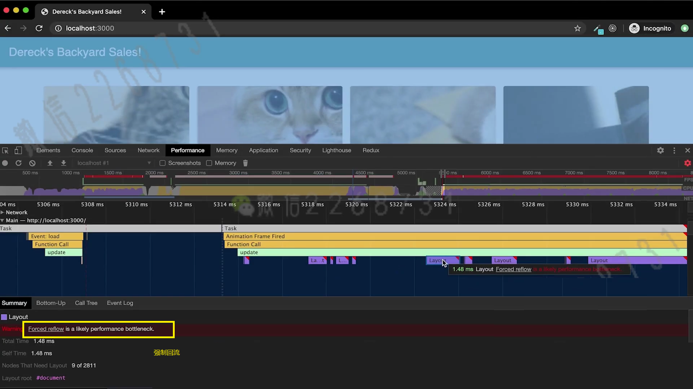

# Web性能优化

寻找性能瓶颈

- 了解性能指标——多快才算快
- 利用测量工具和APIs
- 优化问题，重新测量（迭代）


移动端✨

- 设备硬件，网速，屏幕尺寸，交互方式
- 用户更缺少耐心，>3秒加载导致53%的跳出率（bounce rate）
- 持续增长的移动用户和移动电商业务


## 性能和优化指标

### 性能优化-加载

- 理解加载瀑布图
  - `Queueing` 队列等待时间
  - stalled
  - `DNS Lookup` => `DNS`解析
  - `initial connection Tcp`建立连接
  - `SSL`  => 安全性验证
  - `Request sent` 发送时间
  -  `**TTFB`(测量从响应发送出去，到请求回来的时间) 白屏时间优化**
  - Content Download 内容下载时间
  - 蓝色的线条是DOM加载完成的时间
  - 红色的线条是资源加载完成的时间
- 基于HAR存储于重建性能信息
  - 右键点击并选择Save all as HAR with content
- 速度指数(Speed index)
- 重要测量指标
  - `TTFB`(测量从响应发送出去，到请求回来的时间)
  - requests 请求数
  - resources 资源数
  - DOMContentLoaded: 759 ms DOM完成加载时间
  - Load: 1.93 s 总资源加载时间
  - 页面加载时间（所有资源加载完成）
  - 首次渲染（缓慢渐进渲染）


#### 网络加载性能


##### Lighthouse

###### Perfomance

- First Contentful Paint 用户首次看见有效内容
- Speed Index 速度指数
- Largest Contentful Paint 最大的有效内容
- Time to Interactive 和用户可以发生交互所需要的时间
- Total Blocking Time
- Cumulative Layout Shift

###### Opportunities

- Reduce unused JavaScript 减少无用的JS代码（是否是为了后面的体验更好）
- Eliminate render-blocking resources  减少渲染阻塞的资源

###### Diagnostics

- Does not use passive listeners to improve scrolling performance


- First Contentful Paint 第一个有内容的绘制时间

- Speed Index 网站速度


### 性能优化-响应

- 交互动作的反馈时间
- 帧率FPS
- 异步请求的完成时间（1s内完成不了，加loading动画）

##### Performance

查看页面帧数——人的肉眼60fps


### RAIL测量模型

R => Response 交互响应

A => Animation 动画

I =>  Idle空闲

L => Load加载


#### 评估标准

- 响应：处理事件应在50ms以内完成
  - 
- 动画：每10ms产生一帧（渲染准备也需要时间）
- 空闲：尽可能增加空闲时间（业务运算代码在后台做）
- 加载：在5s内完成内容加载并可以交互


#### 性能测试工具

- Chrome DevTools开发调试、性能评估

- Lighthouse 网站整体质量评估

- WebpageTest 多测试地点、全面性能报告（需要科学上网）


##### WebpageTest

多测试地点、全面性能报告（需要科学上网）

https://webpagetest.org/


###### 解读WebPageTest的报告

- waterfall chart请求瀑布图
- first view 首次访问
- repeat view 二次访问


###### 如何本地部署WebPageTest工具

- 安装Docker

```shell
docker pull webpagetest/server
docker pull webpagetest/agent
docker run -d -p 4000:80 webpagetest/server
docker run -d -p 4001:80 --network="host" -e "SERVER_URL=http://localhost:4000/work/" -e "LOCATION=Test" webpagetest/server

Mac
mkdir wpt-mac-server
cd mpt-mac-server
vim Dockerfile

FROM webpagetest/server
ADD locations.ini /var/www/html/settings/

:wq
vim locations.ini

[locations]
1=Test_loc
[Test_loc]
1=Test
label=Test Location
group=Desktop
[Test]
browser=Chrome,Firefox
label="Test Location"
connectivity=LAN

docker build -t wpt-mac-server

cd ..
mkdir wpt-mac-agent
cd wpt-mac-agent
vim Dockerfile

FROM webpagetest/agent
ADD script.sh /
ENTRYPOINT /script.sh

vim script.sh

#!/bin/bash
set -e
if [ -z "$SERVER_URL" ]; then
  echo >&2 'SERVER_URL' not set'
  exit 1
fi
if [ -z "$LOCATION" ]; then
  echo >&2 'LOCATION' not set'
  exit 1
fi
EXTRA_ARGS=""
if [ -z "$NAME" ]; then
  EXTRA_ARGS="$EXTRA_ARGS --name $NAME"
fi
python /wptagent/wptagent.py --server $SERVER_URL --location $LOCATION $EXTRA_ARGS --xvfb --dockerized -vvvvv --shaper none

chmod u+x script.sh
docker build -t wpt-mac-agent

docker ps
docker stop shhiliID shiliID

docker run -d -p 4000:80 wpt-mac-server
docker run -d -p 4001:80 --network="host" -e "SERVER_URL=http://localhost:4000/work/" -e "LOCATION=Test" wpt-mac-agent
```


##### 使用Lighthouse分析性能

###### 本地npm安装Lighthouse

```shell
npm i -g lighthouse
lighthouse http://www.bilibili.com
Y
```

分析报告结果位置（粘贴浏览器访问）


查看阻塞

`ctrl`+`shift` + `P`  => 搜索 block 选择 `Show Network request blocking `  => + => 过滤log*.js Add


###### Chrome DevTools中使用

F12

###### 通过chrome web store 安装插件


##### 使用Chrome DevTools分析性能

###### 压缩资源大小

```js
const express = require('express')
const app = express()
const compression = require('compression')
app.use(compression())
```


319KB是网络传输的大小

851KB是资源的实际大小


###### Audit（Lighthouse）


###### Throttling调整网络吞吐


###### Performance性能分析

记录页面开始到所有页面加载完成时的情况


###### Network网络加载分析


##### 常用的性能测量web标准`APIs`

- 关键时间节点（Navigation Timing，Resource Timing）
- 网络状态（`Network APIS`）
- 客户端服务协商(HTTP Client Hints)&网页显示状态前(`UI APIs`)

###### 关键时间节点（Navigation Timing，Resource Timing）

- ```
  DNS 解析耗时: domainLookupEnd - domainLookupStart
  TCP 连接耗时: connectEnd - connectStart
  SSL 安全连接耗时: connectEnd - secureConnectionStart
  网络请求耗时 (TTFB): responseStart - requestStart
  数据传输耗时: responseEnd - responseStart
  DOM 解析耗时: domInteractive - responseEnd
  资源加载耗时: loadEventStart - domContentLoadedEventEnd
  First Byte时间: responseStart - domainLookupStart
  白屏时间: responseEnd - fetchStart
  首次可交互时间: domInteractive - fetchStart
  DOM Ready 时间: domContentLoadEventEnd - fetchStart
  页面完全加载时间: loadEventStart - fetchStart
  http 头部大小： transferSize - encodedBodySize
  重定向次数：performance.navigation.redirectCount
  重定向耗时: redirectEnd - redirectStart
  ```

  

###### 计算一些关键的性能指标

###### 可交互时间TTI

```js
// load事件触发后
window.addEventListener('load', (event) => {
    // Time to Interactive 可交互时间
    let timing = performance.getEntriesByType('navigation')[0];
    console.log(timing.domInteractive);
    console.log(timing.fetchStart);
    let diff = timing.domInteractive - timing.fetchStart;
    console.log("TTI: " + diff);
})
```

###### 观察长任务

```js
// 通过PerformanceObserver得到所有的long tasks对象
const observer = new PerformanceObserver((list) => {
    for (const entry of list.getEntries()) {
        console.log(entry)
    }
})
// 监听long tasks
observer.observe({entryTypes: ['longtask']})
```

###### 页面可见性的状态监听

```js
// 页面可见性的状态监听
let vEvent = 'visibilitychange';
if (document.webkitHidden != undefined) {
    // webkit prefix detected
    vEvent = 'webkitvisibilitychange';
}

function visibilityChanged() {
    if (document.hidden || document.webkitHidden) {
        console.log("Web page is hidden.")
    } else {
        console.log("Web page is visible.")
    }
}

document.addEventListener(vEvent, visibilityChanged, false);
```

###### 网络状态（Network APIS）

```js
// Console输入
let connection = navigator.connection || navigator.mozConnection || navigator.webkitConnection;
var type = connection.effectiveType;

function updateConnectionStatus() {
  console.log("Connection type changed from " + type + " to " + connection.effectiveType);
  type = connection.effectiveType;
}

connection.addEventListener('change', updateConnectionStatus);
```


## 现代浏览器网页渲染原理关键渲染路径（critical rendering path）

### 浏览器的渲染

大致步骤：`JS` =>`Style` => `Layout` => `Paint` => `Composite`


**将文本翻译成浏览器可以理解的数据结构**

1️⃣**浏览器构建对象模型**

- 构建DOM对象

  `HTML => DOM`

- 构建`CSSDOM`对象

  `CSS => CSSDOM`

2️⃣**浏览器构建渲染树**

`DOM + CSSDOM => Render Tree`

 

### 布局（layouts）与绘制（paint）

- 渲染树只包含网页需要的节点
- 布局计算每个节点精确的位置和大小- “盒模型”
- 绘制是像素化每个节点的过程
- 消耗很高


#### 影响回流(`Reflow/Relayout`)的操作

主要是节点**元素的尺寸、位置、隐藏**等属性改变时，浏览器需要重新计算

- 添加/删除元素
- 操作styles
- display: none
- `offsetLeft，scrollTop，clientWidth`
- 移动元素位置
- 修改浏览器大小，字体大小


可以在chorme开发者工具Performance下查看

```js
let dom = document.getElementById('root')
const update = () => {
  dom.style.width = '800px'
}
window.addEventListener('load', update, false)
```


#### 避免页面抖动`layout thrashing`

- 避免回流
- 读写分离

```js
let dom = document.getElementsByClassName('root')
const update = timestamp => {
  for(let i = 0; i < dom.length; i++){
    // 通过offsetTop计算修改width
    dom[i].style.width = ((Math.sin(dom[i].offsetTop + timestamp / 1000) + 1) * 500) + 'px';
  }
  window.requestAnimatio nFrame(update)
}
window.addEventListener('load', update, false)
```

红色小三角表示操作任务过长


强制回流




##### 使用`FastDom`

> https://github.com/wilsonpage/fastdom
>
> 批量DOM读写分离

世界上没有绝望的处境，只有对处境绝望的人

```
npm i fastdom
or
<script src="/libs/fastdom.min.js"></script>
```

```js
const update = timestamp => {
  for(let i = 0; i < dom.length; i++){
    fastdom.measuer(() => {
      // 读取top值
      let top = dom[i].offsetTop
      fastdom.mutate(() => {
        // 获取top,设置width
        dom[i].style.width = ((Math.sin(top + timestamp / 1000) + 1) * 500) + 'px';
      })
    })
  }
  window.requestAnimatio nFrame(update)
}
```


#### 复合线程（compositor thread）与图层（layers）

##### 复合线程做什么

- 将页面拆分图层进行绘制再进行复合（类似PS）
- 利用`DevTools`了解网页的图层拆分情况
  -  `Performance` => `Frames` => `Layers`
- 哪些样式仅影响复合

four things a browser can animate cheaply(***只触发复合，不触发布局和重绘***)

| 属性     | CSS                             |
| -------- | ------------------------------- |
| Position | transform: translate(npx, npx); |
| Scale    | transform: scale(n)             |
| Rotation | transform: rotate(ndeg)         |
| Opacity  | opacity: 0 ... 1                |

Move all your visual effects to these things. Transition everything else at your own risk.


##### 减少重绘（reqaint）

- 利用`DevTools`识别`paint`的瓶颈
- 利用`will-change`创建新的图层


#### 高频事件处理函数

##### 防抖debounce

```js
let cards = document.getElementsByClassName('')
// 修改图片宽度
function changeWidth(rand) {
    for(let i = 0; i < cards.length; i++) {
        cards[i].style.width = (Math.sin(rand/1000) + 1) * 500 + 'px';
    }
}

let ticking = false;
// 利用Chorme DevTools打开时可以复现抖动的问题(pointer events)
windown.addEventListener('pointermove', e => {
    let pos = e.clientX;
    if(ticking) return 
    ticking = true
    window.requestAnimationFrame(() => {
        changeWidth(pos);
        ticking = false;
    })
    // changeWidth(pos);
})

```


#### React时间调度实现

基本原理

- requestIdleCallback的问题
- 通过rAF模拟rIC


