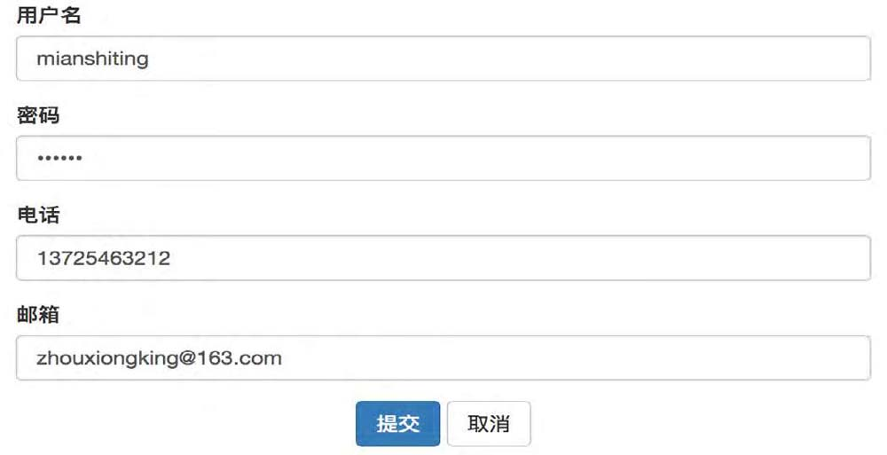
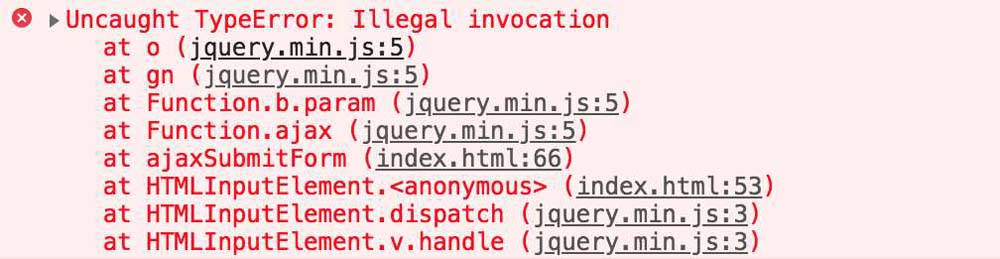

# Ajax
Ajax是目前最流行的前后端数据交互的方式，通过异步请求就可以在不需要刷新页面的情况下，达到局部刷新的效果。

Ajax并非是一种全新的技术，而是由以下技术组合而成。
- 使用CSS和XHTML做页面呈现。
- 使用DOM进行交互和动态显示。
- 使用XMLHttpRequest对象和服务器进行异步通信。
- 使用JavaScript进行绑定和调用，操作DOM。

在上面涉及的几种技术中，除了XMLHttpRequest外，其余几种都是基于Web标准并得到了广泛使用。

## 基本原理及执行过程
> 通过XMLHttpRequest对象向服务器发送异步请求，获取服务器返回的数据后，利用DOM的操作来更新页面。

[ajax原理](./assets/drowio/ajax.drawio ':include :type=code')

其中最核心的部分就是XMLHttpRequest对象。它是一个JavaScript对象，支持异步请求，可以及时向服务器发送请求和处理响应，并且不阻塞用户，达到不刷新页面的效果。

### XMLHttpRequest对象
XMLHttpRequest对象从创建到销毁存在一个完整的生命周期，在生命周期的每个阶段会调用XMLHttpRequest对象的不同函数，在函数中需要通过XMLHttpRequest对象的特定属性来判断函数执行情况。
#### XMLHttpRequest对象的函数
##### abort()函数
如果请求已经发送，则停止当前请求。
##### getAllResponseHeaders()函数
获取所有HTTP请求的响应头部，作为键值对返回；如果没有收到响应，则返回“null”。
##### getResponseHeader("key")函数
获取指定key的HTTP响应头，如果没有收到响应或者响应中不存在key对应的报头，则返回“null”。
##### open函数
建立对服务器的调用。
```js
open("method","URL",[asyncFlag],["userName"],["password"])
```
- method参数表示请求方式，可以为GET、POST或者PUT。
- URL参数表示请求的路径，可以是相对路径，也可以是绝对路径。
- 后面3个是可选参数，分别表示是否异步、用户名、密码。
  - 其中`asyncFlag = true`表示异步，`asyncFlag = false`表示同步，默认值为true。
##### send(content)函数
向服务器发送请求。
##### setRequestHeader(“key”, “value”)函数
设置请求头中属性为key的值为value。在设置请求头之前需要先调用open()函数，设置的header将随着send()函数一起发送。
#### XMLHttpRequest对象的属性
##### onreadystatechange
状态改变的事件触发器，每个状态改变时都会触发这个事件处理器，通常会调用一个JavaScript函数。
##### readyState
请求的状态，有5个可取的值。
- 0. 未初始化，XMLHttpRequest对象已创建。
- 1. open()函数已调用，send()函数未调用，请求还未发送。
- 2. send()函数已调用，HTTP请求已发送到服务器，未接收到响应。
- 3. 所有响应头接收完成，响应体开始接收但未完成。
- 4. HTTP响应接收完成。
##### responseText
接收的数据文本格式的服务器响应体（不包括响应头）。
##### responseXML
服务器的响应，兼容DOM的XML对象，解析后可得到DOM对象。
##### status
服务器返回的HTTP状态码，用数字表示，如200表示“成功”，404表示“资源未找到”。
##### statusText
HTTP状态码的文本表示，如状态码为200时，对应返回“OK”；状态码为404时，对应返回“Not Found”。

### XMLHttpRequest对象生命周期
由于浏览器的差异性，创建XMLHttpRequest对象时需要使用不同的方法，主要体现在IE浏览器与其他浏览器之间。
#### 创建XMLHttPRequest对象
```js
function createXMLHttp() {
    // code for IE7+, Firefox, Chrome, Opera, Safari
    if (window.XMLHttpRequest) {
        xmlhttp = new XMLHttpRequest();
    }
    // code for IE6, IE5
    if (window.ActiveXObject) {
        try {
            xmlhttp = new ActiveXObject("Microsoft.XMLHTTP");
        }
        catch (e) {
            try {
                xmlhttp = new ActiveXObject("msxml2.XMLHTTP");
            }
            catch (ex) { }
        }
    }
}
```
#### 建立连接
当XMLHttPRequest对象创建完毕后，便可以通过open()函数建立连接，它指定了请求的url地址以及通过url传递的参数；数据传输方式，默认值为true，表示采用异步传输方式。
```js
var xhr = createXMLHttp();
xhr.open('post', '/admin/w/saveUser', true);
```
#### 发送请求并传递数据
在使用open()函数建立连接后，便可以使用send()函数发送请求，并传递数据content。由于传递的数据并不是必需的，所以content值可以为空。
```js
var content = { username: 'ming', password: '123456' };
xhr.send(content);
```
#### 处理响应
在XMLHttpRequest对象中有一个很重要的onreadystatechange属性，它表示XMLHttpRequest对象状态改变的事件触发器，每次readyState的取值变化时，属性onreadystatechange对应的函数都会被执行一次。

当readyState的值为4时代表响应接收完成，需要注意的是响应接收完成并不代表请求是成功的，我们需要通过HTTP请求status状态码来判断，当status值为200时代表请求成功。

因此在onreadystatechange()回调函数中，我们需要同时判断readyState和status两个值才能对响应值做正确的处理。
```js
xhr.onreadystatechange = function () {
  // 当readyState为4，且状态码为200时代表请求成功
  if (xhr.readyState === 4 && xhr.status === 200) {
    // 处理响应值
    document.write(xhr.responseText);
  }
}
```
### Ajax的优缺点
#### 优点
- 无刷新更新数据：最大优点是在不需要刷新页面的情况下，能够与服务端保持数据通信，这使得Web应用程序能够快速地响应用户请求，避免不必要的等待时间，提高用户体验。
- 异步通信：Ajax使用异步的方式与服务端通信，能够减少不必要的数据传输，降低网络数据流量，使得响应更加迅速。
- 前后端分离：Ajax可以使得前后端分离开发更加完善，后端专注于接收请求、响应数据，前端专注于页面逻辑的处理。
- 前后端负载均衡：在前后端进行分离开发后，以往由后端处理的数据逻辑，现在也可以交给前端处理，减轻服务端压力。
- 标准化支持：Ajax是一种基于Web标准化并被浏览器广泛支持的技术，不需要下载额外的插件，只需要客户允许JavaScript在浏览器上执行即可。
#### 缺点
- 破坏浏览器的正常后退功能：浏览器有一个很重要的功能是对历史记录的追溯，通过后退按钮可以退到浏览器之前访问过的页面，但是该按钮却没有办法和JavaScript进行很好的合作，从而导致Ajax对浏览器后退机制的破坏。
- 安全性问题：Ajax的逻辑可以将前端安全扫描技术隐藏起来，允许黑客从远端服务器上建立新的链接。同时Ajax也难以避免一些已知的安全性弱点，例如跨域脚本攻击、SQL注入攻击和基于Credentials的安全漏洞等。
- 对搜索引擎支持较弱：浏览器在进行SEO（Search Engine Optimization，搜索引擎优化）时，会屏蔽掉所有的JavaScript代码，而JavaScript是Ajax技术组成中至关重要的一部分，这就导致了SEO对Ajax支持不友好。
- 违背URL唯一资源定位的初衷：由于Ajax请求并不会改变浏览器地址栏的URL，因此对于相同的URL，不同的用户看到的内容可能是不一样的，这就违背了URL定位唯一资源的初衷。

## 使用Nodejs搭建简易服务器
- Nodejs环境，参考版本为v16.14.2。
- 基于Nodejs的Express框架。

### 创建项目
在硬盘上创建一个项目ajaxTest，并放入文件夹中。
```bash
$ mkdir ajaxTest
$ cd ajaxTest
```
### 项目初始化
```bash
npm init -y
```
初始化完成后，会在项目根目录下生成一个package.json文件。

### 安装Express框架与body-parser插件
```js
npm i -D express 
```
在处理post请求时，需要使用body-parser插件，因此也需要提前安装该插件。
```js
npm i -D body-parser
```
### 创建server.js文件
在项目根目录下创建一个server.js文件，文件名可以自定义，用于最后启动服务器。
其中有几点需要注意的地方。
- 在接收post请求传递的数据时，需要使用body-parser插件。
- 通过处理“/”请求可以指定首页。
- 监听的端口号需要唯一，不可与其他应用端口号一样。

```js
// server.js
var express = require('express');
// 接收post请求体数据的插件
var bodyParser = require('body-parser');

var app = express();
app.use(bodyParser());

// 接收“/”请求，指定首页
app.get('/', function (req, res) {
    res.sendFile(_ _dirname + '/index.html');
});

// 处理get请求
app.get('/getUser', function (req, res) {
    console.log(req.query);
});

// 处理post请求
app.post('/saveUser', function (req, res) {
    var responseObj = {
        code: 200,
        message: '执行成功'
    };
    res.write(JSON.stringify(responseObj));
    res.end('end');
});

// 执行监听的端口号
var server = app.listen(3000, function () {});
```
### 编写首页index.html的内容

```html
<!DOCTYPE html>
<html>
<head>
    <meta charset="UTF-8">
    <title>Title</title>
</head>
<body>

  这是一个简易server的首页，Hello Nodejs

</body>
</html>
```
### 运行server
```bash
 node server.js
```
### 查看运行效果
在浏览器地址栏中输入“http://localhost:3000”即可看到首页内容

在本地成功地启动了一个服务器，对于后文中Ajax请求的处理和响应，都是基于这个server.js去实现的。

## 使用Ajax提交form表单
form表单的默认提交方式会刷新页面，而且会在页面之间进行跳转。如果需要保持当前用户对表单状态的改变，就要在后台控制器和前端页面中传递更多的参数，因此对于前端与后台处理信息交互比较频繁的场景，form表单默认的提交方式并不友好。

为了应对以上的场景，使用Ajax提交form表单是一种很好的解决办法。因为Ajax可以在不刷新页面的情况下提交请求，然后在处理响应时通过JavaScript操作DOM，并展示后台处理的信息。

### 通用处理
在使用Ajax提交form表单时，需要对form表单进行特殊的处理，包括以下几点。
- 将form标签的action属性和method属性去掉。
- 将提交form表单按钮的type="submit"改为type="button"。

```html
<form name="userForm" id="userForm">
  <div class="form-group">
    <label for="username">用户名</label>
    <input type="text" class="form-control" name="username" id="username" />>
  </div>
  <div class="form-group">
    <label for="password">密码</label>
    <input type="password" class="form-control" name="password" id="password" />
  </div>
  <div class="form-group">
    <label for="email">邮箱</label>
    <input type="text" class="form-control" name="email" id="email" />
  </div>
  <div class="text-center">
    <input type="button" class="btn btn-default btn-primary" value="提交" id="submit" />
    <input type="button" class="btn btn-default" value="取消" id="cancel" />
  </div>
</form>
```
这是一段类似于用户注册页面的代码，包含用户名、密码、电话、邮箱等几个输入文本框，通过提交按钮可以将用户输入的信息提交到服务端。

### 使用原生Ajax进行提交
提交form表单包含以下过程：
- 绑定提交按钮事件。
- 创建XMLHttpRequest对象。
- 建立连接。
- 设置请求头。
- 获取数据。
- 发送请求。
- 处理响应。

接下来一步步讲解实现过程。
#### 绑定提交按钮事件
在单击提交按钮时，触发Ajax请求的操作，将整个Ajax操作封装在ajaxSubmitForm()函数里。按钮获取与事件绑定使用原生的JavaScript语法。
```js
var submitBtn = document.getElementById('submit');
submitBtn.addEventListener('click', function() {
  ajaxSubmitForm();
})
```
#### 创建XMLHttpRequest对象
```js
function createXMLHttp() {
    // code for IE7+, Firefox, Chrome, Opera, Safari
    var xmlhttp;
    if (window.XMLHttpRequest) {
        xmlhttp = new XMLHttpRequest();
    }
    // code for IE6, IE5
    if (window.ActiveXObject) {
        try {
            xmlhttp = new ActiveXObject(“Microsoft.XMLHTTP”);
        }
        catch (e) {
            try {
                xmlhttp = new ActiveXObject(“msxml2.XMLHTTP”);
            }
            catch (ex) { }
        }
    }
    return xmlhttp;
}
var xhr = createXMLHttp();
```
#### 建立连接
本实例可以理解为一个用户的注册操作，发送的请求为POST请求，使用异步处理的方式。
```js
xhr.open('post', '/saveUser', true);
```
#### 设置请求头
由于本实例中发送的是POST请求，需要设置数据传输格式，即设置Content-type属性值。可以通过setRequestHeader()函数对其进行设置，将其值设置为比较普遍的JSON数据格式。
```js
xhr.setRequestHeader('Content-type', 'application/json;charset=UTF-8');
```
需要注意的一点是：在设置请求头之前，需要调用XMLHttpRequest实例的open()函数，以保证已经建立连接请求。
#### 获取数据
通过原生的DOM操作方式获取页面填写的数据。
```js
var username = document.getElementById('username').value;
var password = document.getElementById('password').value;
var telphone = document.getElementById('telphone').value;
var email = document.getElementById('email').value;
var content = {
    username: username,
    password: password,
    telphone: telphone,
    email: email
};
```
因为在请求头中设置了数据传输格式为json，所以需要将content对象处理为json字符串。
```js
content = JSON.stringify(content);
```
#### 发送请求
```js
xhr.send(content);
```
#### 处理响应
设置onreadystatechange属性对应的回调函数，在回调函数中进行判断。当响应接收完毕，readyState为4，同时请求状态码status为200时，即表示请求成功，然后就可以编写对应的处理逻辑。
```js
xhr.onreadystatechange = function () {
    // 当readyState为4，且状态码为200时代表请求成功
    if (xhr.readyState === 4 && xhr.status === 200) {
        // 处理响应值
        document.write(xhr.responseText);
    }
}
```
在使用原生Ajax提交form表单内容时，需要考虑浏览器兼容性问题，并且该方式的代码冗余度高，需要经常进行状态的判断，因此这并不是一种很好的处理form表单的方式。

### 使用jQuery处理Ajax请求进行提交
使用jQuery处理Ajax请求，解决了浏览器兼容性的问题，对原生Ajax请求的高度封装也使得代码变得精简。
只需要关注在使用Ajax时需要什么，然后传递对应的参数，处理不同的回调即可。

#### 文件引入
```html
<script src="https://cdn.bootcss.com/jquery/1.9.1/jquery.min.js"></script>
```
#### 页面加载完成，绑定事件
在页面加载完成时，会执行`$(document).ready()`函数，可简写为`$(function() {})`，然后在该函数中绑定提交按钮的事件。
```js
$(function () {
  var submitBtn = $('#submit');
  submitBtn.click(function () {
    ajaxSubmitForm();
  })
})
```

#### 获取传递的数据
```js
var content = {
    username: $('#username').val(),
    password: $('#password').val(),
    telphone: $('#telphone').val(),
    email: $('#email').val()
};
```

#### 使用$.ajax()函数发送请求
需要关注以下这些内容。
- 请求类型。
- 请求url。
- 请求数据类型。
- 传递的数据。
- 响应数据类型。
- 回调函数。
其中的回调函数包括在发送请求之前调用的beforeSend()函数、请求出错的error()函数、请求成功的success()函数、请求完成的complete()函数。

```js
$.ajax({
    // 请求类型
    type: 'POST',
    // 请求URL
    url: '/saveUser',
    // 请求数据类型设置
    contentType: 'application/json;charset=UTF-8',
    // 响应数据类型设置
    dataType: 'json',
    // 传递的参数
    data: JSON.stringify(content),
    // 执行成功的回调函数
    success: function (response) {
        console.log('函数执行成功');
    },
    // 执行完成的回调函数
    complete: function (response) {
        console.log('函数执行完成');
    },
    // 执行失败的回调函数
    error: function () {
        console.log('函数执行失败');
    }
});
```
需要注意的是如果设置了contentType为json数据格式传递，则通过data传递参数时也需要处理为json字符串。
在上面的例子中也可以不用设置contentType，直接通过对象的形式传递，并在服务端接收到的参数是一样的，可以简写为以下形式。
```js
$.ajax({
    // 请求类型
    type: 'POST',
    // 请求URL
    url: '/saveUser',
    // 响应数据类型设置
    dataType: 'json',
    // 传递的参数
   data: content,
    // 执行成功的回调函数
    success: function (response) {
        console.log('函数执行成功');
    },
    // 执行完成的回调函数
    complete: function (response) {
        console.log('函数执行完成');
    },
    // 执行失败的回调函数
    error: function () {
        console.log('函数执行失败');
    }
});
```
上面的写法是不是很完美的一个写法呢？
并不是的，主要问题是在数据的获取上，我们需要写很多的JS语句来获取数据，例如下面的代码。
```js
var username = $('#username').val();
var password = $('#password').val();
```
如果form表单项过多，会写很多冗余的$('#id').val()代码，看起来十分麻烦，那有没有简单的处理方法呢？
可以使用jQuery的serialize()函数或者serializeArray()函数，序列化form表单进行提交。
### 使用jQuery序列化form表单进行提交
表单的序列化，表示的是可以自动将表单内填写的内容自动处理为字符串或者对象格式，便于与服务端进行传递，从而避免重复性地通过代码获取单个表单元素输入值。

在使用jQuery序列化form表单时，可以调用serialize()函数或者serializeArray()函数，它们的基本语法如下所示。
```js
$(selector).serialize()
$(selector).serializeArray()
```
其中，$(selector)表示通过选择器获取到的jQuery对象。
jQuery提供了这两种方法来序列化form表单，它们有相同点也有不同点，一一来看。
#### 相同点
- 需要对form表单元素设置name属性值，序列化后的值都为键值对类型，键为name属性值，值为输入的值。
- 只会序列化特定标签的元素，包括input、textarea、select等，对于type='file'的元素不会进行序列化。
- 两种方法都是对form表单元素或者form表单本身对应的jQuery对象进行序列化。
#### 不同点
两个方法的不同点主要表现在返回的结果值上。
1. serialize()函数序列化后的值为基本的字符串类型
主要作用是序列化form表单，返回URL格式的字符串类型的数据。

单击“提交”按钮时，将调用serialize()函数，把输入的值对应地展示在页面上。
```js
$('#result').text($('#userForm').serialize());
```
得到的结果如下所示。
```bash
username=mianshiting&password=123456&telphone=13725463212&email=zhouxiongking%40163.com
```
从中可以看出序列化后的值表示成了URL中请求参数的形式，通过“&”符号相连，而且会进行字符转义，类似邮箱中的“@”符号会被转义成“%40”。
2. serializeArray()函数序列化后的值为JSON对象数组类型。
serializeArray()函数的主要作用是序列化form表单，返回JSON对象数组类型的数据。数组中的每个元素为一个JSON对象，键分别为name和value，name对应的值为form表单元素设置的name属性值，value对应的值为用户输入的值。
调用serializeArray()函数时，会将值输出在控制台中。
```js
console.log($('#userForm').serializeArray());
```
得到的结果如下所示。
```js
0: {name: "username", value: "mianshiting"}
1: {name: "password", value: "123456"}
2: {name: "telphone", value: "13725463212"}
3: {name: "email", value: "zhouxiongking@163.com"}
length: 4
_ _proto_ _:  Array(0)
```
可以很明显地看出来，返回的结果是一个数组，数组中的每个元素都是一个JSON对象，键和值与分析的结果是一样的。
在掌握了如何序列化form表单数据后，我们就可以将序列化后的数据进行提交，在本质上还是需要使用$.ajax()函数，只是在传递数据时会做不同的处理。
因为序列化后数据格式为字符串或者JSON对象数组，可以直接通过data参数传递，所以我们只需要对$.ajax()函数中的data参数稍作处理即可，调用serialize()函数或者serializeArray()函数均可。
```js
$.ajax({
    // 请求类型
    type: 'POST',
    // 请求URL
    url: '/saveUser',
    // 响应数据类型设置
    dataType: 'json',
    // 传递的参数，使用序列化的方式
    data: $('#userForm').serialize(),
    // 执行成功的回调函数
    success: function (response) {
        console.log('函数执行成功');
    },
    // 执行完成的回调函数
    complete: function (response) {
        console.log('函数执行完成');
    },
    // 执行失败的回调函数
    error: function () {
        console.log('函数执行失败');
    }
});
```
通过Nodejs本地启动服务器后进行验证，不管是使用serialize()函数还是serializeArray()函数，在服务端接收到的都是一个JSON对象的形式，输出的值如下所示。
```js
{ username: 'mianshiting',
  password: '123456',
  telphone: '13725463212',
  email: 'zhouxiongking@163.com' }
```
通过以上的分析与实践，我们得知使用jQuery序列化可以很好地实现form表单的提交，那么它是不是一种十全十美的方法呢？
答案是否定的，因为使用序列化存在一个很大的缺陷，它并不能处理文件流的数据，只能处理普通的文本数据。

那么，有什么比较完美的方法来实现各种元素的form表单的提交吗？
使用FormData对象进行提交。

### 使用FormData对象进行提交
FormData对象是HTML5中新增的对象，目前主流的浏览器都已经支持，它的诞生主要是服务于Ajax请求，用于发送数据。

FormData对象将数据编译成key-value类型的键值对，以便于XMLHttpRequest对象发送数据。其主要用于发送form表单数据，但也可以独立于form表单，发送带有键的数据。

FormData对象提交的最大的优势是可以异步上传文件。

FormData对象的提交既可以支持原生Ajax请求，也可以支持jQuery请求。
#### 原生Ajax请求使用FormData对象发送form表单数据
为了更能体现FormData对象在数据传输上的优势，在form表单中加上了type='file'的元素进行文件上传的操作。
```html
<form name="userForm" id="userForm" class="container">
    <div class="form-group">
        <label for="username">用户名</label>
        <input type="text" class="form-control" name="username" id="username">
    </div>
    <div class="form-group">
        <label for="password">密码</label>
        <input type="password" class="form-control" name="password" id="password">
    </div>
    <div class="form-group">
        <label for="telphone">电话</label>
        <input type="text" class="form-control" name="telphone" id="telphone">
    </div>
    <div class="form-group">
        <label for="email">邮箱</label>
        <input type="text" class="form-control" name="email" id="email">
    </div>
    <div class="form-group">
        <label for="email">简历</label>
        <input type="file" name="resume" id="resume">
    </div>
    <div class="text-center">
        <input type="button" class="btn btn-default btn-primary" value="提交" id="submit">
        <input type="button" class="btn btn-default" value="取消" id="cancel">
    </div>
</form>
```
1. 请求头设置
当使用原生Ajax请求发送带有文件流的FormData数据时，需要对请求头进行对应的设置，即将Content-type属性设置为application/x-www-form-urlencoded，代码如下所示。
```js
xhr.setRequestHeader('Content-type', 'application/x-www-form-urlencoded');
```
2. 生成FormData实例
通过FormData的构造函数，可以new一个FormData对象的实例，取值为formData。
```js
var formData = new FormData();
```
3. 添加数据
通过append()函数向formData对象中添加需要发送的数据，不管是简单的文本类型数据还是文件类型数据，都可以添加到formData对象中。

对于type='file'类型的form表单元素，调用document.getElementById()函数获取到DOM元素后，通过访问files属性即可获取到上传的文件。
```js
// 获取数据
var username = document.getElementById('username').value;
var password = document.getElementById('password').value;
var telphone = document.getElementById('telphone').value;
var email = document.getElementById('email').value;
var resume = document.getElementById('resume');
// 创建FormData实例
var formData = new FormData();
// 添加至formData对象中
formData.append('username', username);
formData.append('password', password);
formData.append('telphone', telphone);
formData.append('email', email);
formData.append('resume', resume.files[0]);
```
4. 发送数据
只需要调用send()函数传递FormData对象即可。
```js
xhr.send(formData);
```
通过以上的4步再结合[使用原生Ajax进行提交](#使用原生Ajax进行提交)通用的代码结构，就可以完成原生Ajax通过FormData发送数据的功能了。

FormData实例的数据需要先使用document.getElementById()函数获取到，再使用append()函数添加至FormData实例中，如果form表单的内容比较复杂，需要写很多冗余的代码。

FormData对象的构造函数还可以接收一个form表单，会自动将form表单内的元素进行序列化，在发送请求之前可以使用append()函数附加需要传递的数据。
```js
var formData = new FormData(document.getElementById('userForm'));
```
#### jQuery使用FormData对象发送form表单数据
使用jQuery发送FormData格式的form表单数据时，和原生Ajax请求是一样的，有两种使用方式。
- 使用append()函数逐个添加form表单元素的值。
- 通过form表单直接生成FormData的实例。
以第二种使用方式为例
```js
$.ajax({
    // 请求类型
    type: 'POST',
    // 请求URL
    url: '/saveUser',
    // 不处理请求数据类型
    contentType: false,
    // 不处理发送的数据
    processData: false,
    // 响应数据类型设置
    dataType: 'json',
    // 传递的参数
    data: new FormData($('#userForm')[0]),
    // 执行成功的回调函数
    success: function (response) {
        console.log('函数执行成功');
    },
    // 执行完成的回调函数
    complete: function (response) {
        console.log('函数执行完成');
    },
    // 执行失败的回调函数
    error: function () {
       console.log('函数执行失败');
    }
});
```
在上面的代码中，有两点是需要特别注意的，一个是contentType参数的设置，一个是processData参数的设置。
- 关于contentType参数的设置。
  - 当发送的数据不包含file文件流的数据时，contentType值可以取默认值application/x-www-form-urlencoded，即可以不对contentType做设置。
  - 也可以将contentType值设置为application/json，进行json格式的数据传输，如果设置为json格式传输后，需要对FormData对象中的数据进行特殊处理。
实际上FormData是一个类数组的结构，可以通过遍历的方式获取到键与值，然后构造成json对象，最后再转换为json字符串。
```js
// 将FormData对象转换为json格式的数据
function formData2JSON(formData) {
    var  jsonObj = {};
    formData.forEach(function (value, index) {
        jsonObj[index] = value;
    });
    return JSON.stringify(jsonObj);
}
```
当FormData对象中包含了file文件流的数据时，需要设置contentType参数值为默认值application/x-www-form-urlencoded，而不能设置为application/json，因为文件流二进制数据不能直接转换为json格式。

- 关于processData参数的设置。
  - processData参数是jQuery特有的，用于对data进行序列化处理的参数，默认值为true，表示在默认情况下，data传输的数据会进行序列化处理。
  - 而在使用FormData对象进行数据传输时，是不能进行序列化处理的，如果进行序列化处理，则会直接抛出异常，如图所示。

因此需要设置processData参数值为false。

## 关于Ajax请求的get方式和post方式
### get方式和post方式的区别
使用get方式和post方式都可以向服务器发送请求，只是发送的机制不同，主要体现在以下几点。
- 参数传递。
  - get请求会将参数添加到请求URL的后面，没有请求主体，调用send()函数时，传递的参数为null，即xhr.send()；post请求的数据会放请求体中，用户是无法通过URL直接看到的，调用send()函数时，传递的参数为data，即xhr.send(data)。
- 服务端参数获取。
  - 使用Express作为服务端框架，get请求通过Request.query来获取参数；而使用post请求时需要添加中间件，同时通过Request.body来获取参数。
- 传递的数据量。
  - get请求传输的数据量小，对于不同的浏览器有所差异，Chrome浏览器限制为8K，IE限制为2K；post请求传递的数据量大，一般默认不受限制，但实际上服务器会规定post请求传递的数据量大小。
- 安全性。
  - get请求安全性较低，因为其请求的参数会出现在URL上，而且采用明文进行数据传输，通过浏览器缓存或者历史记录可以很容易获取到某些隐私请求的参数；post请求通过请求体进行数据传输，数据不会出现在URL上，隐藏了请求数据的信息，安全性较高。
- 处理form表单的差异性。
  - 在使用form表单进行提交时，get请求和post请求也会体现出很大的差异性，以下面这段form表单代码为例进行讲解。
```html
<form name="userForm" method="get" action="/getUser?param=面试厅" class="container">
    <div class="form-group">
        <label for="username">用户名</label>
        <input type="text" class="form-control" id="username" name="username">
    </div>
    <div class="form-group">
        <label for="password">密码</label>
        <input type="password" class="form-control" id="password" name="password">
    </div>
    <div class="text-center">
        <input type="submit" class="btn btn-default btn-primary" value="提交" id="submit">
    </div>
</form>
```
在上面的代码中，需要关注以下两点内容。
- form表单元素添加了method="get"，表示使用get方式进行提交，在不指定method属性时，默认采用get请求。
- action属性为请求的url，在url后携带了请求的参数"param=面试厅"。

当在用户名文本框中输入“ming”，在密码文本框中输入“123456”时，单击“提交”按钮后，在服务端获取的数据如下所示。
```js
{ username: 'ming', password: '123456' }
```
发现只有form表单内的元素值传递到了后端，而action指定的url后面携带的参数"param=面试厅"并未被服务端获取到，这是为什么呢？
这是因为form表单采用get请求时，action指定的url中的请求参数会被丢弃，提交时只会将form表单内的元素值进行拼接并向服务端传递。
既然form表单使用get请求不能通过action的url传递参数，那么使用post请求可不可以呢？

将form表单的method属性值改为post，并将请求的url换为saveUser，同样在url中携带请求参数"param=面试厅"。
```html
<form name="userForm" method="post" action="/saveUser?param1=面试厅" class="container">
    ...
</form>
```
在Nodejs服务端启用post请求格式的saveUser()函数，函数主要代码如下所示。
```js
app.post('/saveUser', multipleMiddleware, function (req, res) {
    // 请求体中的参数
    console.log(req.body);
    // 请求url中的参数
    console.log(req.query);
});
```
当在文本框中输入用户名为“ming”，密码为“123456”，并单击“提交”按钮后，在服务端获取的数据如下所示。
```js
{ username: 'ming', password: '123456' }  // 请求体中的参数
{ param1: '面试厅' }  // 请求url中的参数
```
可以发现form表单内的元素和请求url中携带的参数都被服务端接收到了，其中form表单内的元素通过Request.body请求体被服务端接收到，而url中携带的参数通过Request.query被服务端接收到。

### 使用get方式和post方式需要注意的点
在使用get方式和post方式发送Ajax请求时，由于请求方式本身的特性，所以有一些需要注意的点。
- 使用get方式请求时，**如果请求的url不发生改变，可能会存在缓存的问题**，因此在请求的url后一般会拼接上一个时间戳，以避免出现缓存。
- 使用get方式请求时，请求的参数会拼接在url后，如果浏览器编码、服务器编码、数据库编码格式不一致，可能会**导致乱码**的问题。通常的做法是**对请求的参数经过encodeURIComponent()函数处理**。
```js
xhr.open('get', '/getUser?username=' + encodeURIComponent(username), true)
```
- 使用post方式请求时，需要设置请求头中的content-type属性，表示数据在发送至服务器时的编码类型。默认情况下，使用post方式提交form表单时，content-type值为application/x-www-form-unlencoded，另外还可以支持multipart/formdata、application/json等格式。
```js
xhr.setRequestHeader('content-type','application/x-www-form-urlencoded')
```
### get方式和post方式的使用场景
#### Ajax使用get方式的场景
- 请求是为了检索资源，form表单的数据仅用于帮助搜索。
- 传递的数据量小，适合于url中传递参数。
- 数据安全性低，适合明文传输。

#### Ajax使用post方式的场景
- 请求会修改数据库中的资源，例如新增、修改、删除等操作。
- 传递的数据量大，超出url中携带参数长度的限制。
- 用于用户名、密码及身份证号等类似敏感信息的数据传输。
### Ajax进度事件👍👍👍
在之前的内容里，通过监听readystatechange事件，在回调函数中获取readyState和status的值并判断请求是否成功。在XHR2草案中，增加了Ajax请求进度事件Progress Events规范，使得XMLHttpRequest对象能在请求的不同阶段触发不同类型的事件，所以可以不再需要判断readyState的属性，也可以处理请求成功和失败的操作。

在Progress Events规范中增加了7个进度事件，如下所示。
- loadstart：在开始接收响应时触发。
- progress：在接收响应期间不断触发，直至请求完成。
- error：在请求失败时触发。
- abort：在主动调用abort()函数时触发，表示请求终止。
- load：在数据接收完成时触发。
- loadend：在通信完成或者error、abort、load事件后触发。
- timeout：在请求超时时触发。

一个完整的ajax请求都会从loadstart事件开始，然后不间断地触发progress事件，然后触发load、abort、timeout或者error事件中的一个，注意这里是只会触发load、abort、timeout或者error事件其中的一个，最后触发loadend事件。
### load事件
load事件的诞生是用以代替readystatechange事件的，表示的是数据接收完成后触发，不用去判断readyState属性值的变化也可以执行事件处理成功的操作。

但是有一点需要注意的是，只要浏览器接收到了服务器的响应，不管其状态如何都会触发load事件。例如，对于状态码为404的请求，仍然会触发load事件，所以在进行请求成功的处理时，需要判断status的值。一般我们判断status值大于等于200且小于300，或者status值等于304时，都是当作请求成功进行处理。

在loadstart、load等事件的回调函数中，都会接收一个event对象，通过event对象的target属性可以获取到XMLHttpRequest对象的实例，因此可以访问到XMLHttpRequest对象的所有属性和函数。

通过一个实例来看看load事件的使用，同时我们也加上对loadstart, loadend等事件的监听。
- 创建一个XMLHttpRequest对象。
```js
function createXMLHttp() {
    // code for IE7+, Firefox, Chrome, Opera, Safari
    var xmlhttp;
    if (window.XMLHttpRequest) {
        xmlhttp = new XMLHttpRequest();
    }
   // code for IE6, IE5
    if (window.ActiveXObject) {
        try {
            xmlhttp = new ActiveXObject("Microsoft.XMLHTTP");
        }
        catch (e) {
            try {
                xmlhttp = new ActiveXObject("msxml2.XMLHTTP");
            }
            catch (ex) {
            }
        }
    }
    return xmlhttp;
}

var xhr = createXMLHttp();
```
- 设置loadstart事件监听。
```js
 xhr.onloadstart = function (event) {
     console.log('loadstart事件-开始接收数据');
};
```
- 设置error事件监听。
```js
xhr.onerror = function (event) {
    console.log('error事件-请求异常');
};
```
- 设置timeout事件监听。
```js
xhr.ontimeout = function () {
    console.log('timeout事件-请求超时');
};
```
- 设置load事件监听。
  - load事件并不一定是请求成功才会触发的，所以需要对status值进行判断。而获取status值的方式也有两种，一种是直接通过外层的XMLHttpRequest对象获取，另一种是通过event对象的target属性获取。
```js
xhr.onload = function (event) {
    // 方式1获取status
    var status = xhr.status;
    // 方式2获取status
    var status = event.target.status;
    console.log('load事件状态码:' + status);
        if (status >= 200 && status < 300 || status === 304) {
        console.log('load事件-数据接收完成');
    }
};
```
- 设置loadend事件监听。
```js
xhr.onloadend = function () {
    console.log('loadend事件-通信完成');
};
```
- ajax请求发送。
  - send()函数的调用一定要出现在各种事件处理程序绑定之后，否则会报错。
```js
xhr.open('post', '/saveUser', true);
xhr.send();
```
控制台的输出信息如下。
```js
loadstart事件-开始接收数据
load事件状态码:200
load事件-数据接收完成
loadend事件-通信完成
```
可以看到loadstart、load和loadend事件得到了触发，在load事件中status状态码为“200”。然后我们测试下发送一个错误请求的情况，将请求的url修改为“/saveUser2”。
```js
xhr.open('post', '/saveUser2', true);
xhr.send(content);
```
控制台输出的信息如下。
```js
loadstart事件-开始接收数据
POST http://localhost:3000/saveUser2 404 (Not Found)
load事件状态码:404
loadend事件-通信完成
```
从信息中可以看出，即使发送的是404的请求，仍然触发了load事件，这也证明了前文所讲述的内容。因此在load事件中做请求成功的处理时，需要判断status值的范围。

### progress事件
progress事件会在浏览器接收数据的过程中周期性调用。progress事件处理程序会接收一个event对象，通过它的target属性同样可以获取到XMLHttpRequest对象的实例，而且在event对象中增加了3个有用的属性，分别是lengthComputable、loaded和total。
- lengthComputable是一个布尔值，表示进度信息是否可用。
- loaded表示已经接收到的字节数，它的值是根据Content-Length响应头部确定的预期字节数。
- total表示响应的实际字节数。

通过loaded和total属性值就可以计算出接收响应的数据百分比，从而实现进度条的操作。

通过ajax请求本地的一个mp3文件，然后测试progress事件的执行过程。
创建XMLHttpRequest对象的操作，以及loadstart、load、loadend等事件处理程序的代码与前面load事件的代码相同，这里不赘述。
为确保正常执行，必须在send()函数调用之前添加progress事件处理程序，在progress事件处理程序中计算并输出接收数据的百分比。
```js
xhr.onprogress = function (event) {
    event = event || window.event;
    if (event.lengthComputable) {
        console.log('持续接收数据:' + (event.loaded / event.total).
toFixed(2) * 100 + '%');
    }
};
```
然后发送ajax请求。
```js
xhr.open('get', 'yanyuan.mp3', 'true');
xhr.send(content);
```
实际运行结果如下所示。
```js
loadstart事件-开始接收数据
持续接收数据:0%
持续接收数据:39%
持续接收数据:79%
持续接收数据:100%
load事件状态码:200
load事件-数据接收完成
loadend事件-通信完成
```
## JSON序列化和反序列化
JSON数据在网络传输时存在两种类型，一种是JSON对象类型，一种是JSON字符串类型，两种类型的转换涉及JSON序列化和反序列化的知识。
### JSON序列化
JSON序列化即将JSON对象处理为JSON字符串的过程，以方便数据的传输。

JSON序列化可以通过两种方式来实现，一种是调用JSON对象内置的stringify()函数，一种是为对象自定义toJSON()函数。
#### JSON.stringify()函数
将一个JavaScript对象或者数组转换为JSON字符串，它的基本用法如下所示。
```js
JSON.stringify(value[, replacer [, space]])
```
其中各个参数含义如下。
- value参数表示待处理成JSON字符串的JavaScript值，通常为对象或者数组。
- replacer参数是一个可选参数。
  - 如果其值为一个函数，则表示在序列化过程中，被序列化值的每个属性都会经过该函数的处理；
  - 如果其值为一个数组，则表示只有包含在这个数组中的属性名才会被序列化到最终的JSON字符串中；
  - 如果该值为null或者未传递，则value参数对应值的所有属性都会被序列化。
- space是一个可选参数，用于指定缩进用的空白字符串，美化输出。
  - 如果参数是个数字，则代表有多少个空格，上限值为10；
  - 如果该参数的值小于1，则意味着没有空格；
  - 如果参数为字符串，则取字符串的前十个字符作为空格；
  - 如果没有传入参数或者传入的值为null，将没有空格。
```js
var obj = {
    name: 'ming',
    age: 15,
    address: String('北京市'),
    interest: ['basketball', 'football'],
    email: 'heisming@gmail.com'
};
console.log(JSON.stringify(obj));
```
当只传递第一个参数时，输出的结果如下所示。
```js
{"name":"ming","age":15,"address":" 北京市","interest":["basketball","football"],  "email":"heisming@gmail.com"}
```
当传递了replacer参数并且值为一个函数时，函数所做的处理是，假如属性值为字符串类型，则将值转换为大写。
```js
function replacerFn(key, value) {
    if (typeof value === 'string') {
        return value.toUpperCase();
    }
    return value;
};
console.log(JSON.stringify(obj, replacerFn));
```
输出的结果如下所示。
```js
{"name":"MING","age":15,"address":"北京市","interest":["BASKETBALL","FOOTBALL"],"email":"HEISMING@GMAIL.COM"}
```
通过结果可以看出，name、address、email属性值为字符串类型，其值都转换成了大写字母，但是interest属性值为数组类型，为什么数组中的值也转换成了大写字母呢？

这就涉及递归调用的问题，在JSON序列化时，如果属性值为对象或者数组，则会继续序列化该属性值，直到属性值为基本类型、函数或者Symbol类型才结束。

针对上面的实例，obj对象的name、address、email属性值经过replacerFn()函数处理后，会返回大写的值；age属性值为数字类型，不做任何处理，会直接返回值本身；而interest属性值类型为数组，return回来后数组中的每个值会再次经过replacerFn()函数处理，因为数组中的元素此时都为string类型，返回的值会转换成大写。

当replacer参数为一个数组时，数组元素的值代表将要进行序列化成JSON字符串的属性名。
```js
// 调用以下函数，并且只序列化name属性和age属性的值。
console.log(JSON.stringify(obj, ['name', 'age'])); // {"name":"ming","age":15}
```
关于JSON序列化，有以下一些注意事项。
- 非数组对象的属性不能保证以特定的顺序出现在序列化后的字符串中。
- 布尔值、字符串、数字的包装对象在序列化过程中会被转换为对应的原始值。
```js
// 以下是一段序列化数组元素为多种包装类型的的代码。
JSON.stringify([new Number(1), new String("false"), new Boolean(false)]); // '[1,"false",false]'
```
- 在非数组对象中，undefined、任意的函数及Symbol值，在序列化时会被忽略；在数组对象中，它们会被序列化为null。
在非数组对象中输出的结果如下所示。
```js
JSON.stringify({x: undefined, y: Object, z: Symbol("")}); // '{}'
```
在数组对象中输出的结果如下所示。
```js
JSON.stringify([undefined, Object, Symbol("")]); // '[null,null,null]'
```
- 对包含循环引用对象进行序列化时会抛出异常。
```js
// 定义两个循环引用的对象，并调用stringify()函数输出结果。
var a = {"name": "z z z"};
var b = {"name": "vvv"};
a.child = b;
b.parent = a;

console.log(JSON.stringify(a));
```
运行后，控制台会抛出异常。提示信息为循环引用结果转换为JSON失败。
```js
TypeError: Converting circular structure to JSON
```
- 所有以symbol为属性键的属性都会被完全忽略掉。
```js
JSON.stringify({[Symbol("foo")]: "foo"}); // '{}'
```
- 不可枚举的属性值会被忽略。
```js
// 创建一个对象，包含一个可枚举的属性、一个不可枚举的属性，对其进行序列化。
var p = Object.create(null, {
    name: {
        value: 'xiaoming',
        enumerable: false
    },
        age: {
        value: 15,
        enumerable: true
    }
});
console.log(JSON.stringify(p)); // {"age":15}
```
#### 自定义toJSON()函数
如果一个被序列化的对象拥有toJSON()函数，那么**toJSON()函数就会覆盖默认的序列化行为**，被序列化的值将不再是原来的属性值，而是toJSON()函数的返回值。

toJSON()函数用于更精确的控制序列化，可以看作是对stringify()函数的补充。

同样使用前面例子，定义一个对象，增加toJSON()函数。
```js
var obj2 = {
    name: 'ming',
    age: 15,
    address: String('北京市'),
    interest: ['basketball', 'football'],
    email: 'heisming@gmail.com',
    toJSON: function () {
          // 只返回name和age属性值，并且修改key
        return {
            Name: this.name,
            Age: this.age
        };
    }
};
```
调用JSON.stringify()函数。
```js
console.log(JSON.stringify(obj2)); // {"Name":"ming","Age":15}
console.log(JSON.stringify({name: obj2}, ['name'])); // {"name":{}}
```
对于第一个结果，因为obj2有toJSON()函数，所以返回值为带有Name和Age属性的值“{"Name":"ming","Age":15}”，然后直接进行序列化，得到结果。

对于第二个结果，obj2对象在调用toJSON()函数后的返回值是“`{"Name":"ming","Age":15}`”，实际进行序列化的值为“`{name:{"Name":"ming","Age":15}}`”。此时传递了replacer参数，因为replacer为一个数组，过滤的是name属性，但是name属性值为一个对象，则需要对对象中的每个属性递归序列化，而“Name”和“Age”与要过滤的属性“name”值不相等，所以过滤后的值就为一个空对象{}，所以最终结果为“`{"name":{}}`”。
因此，序列化处理的顺序如下。
- 如果待序列化的对象存在toJSON()函数，则优先调用toJSON()函数，以toJSON()函数的返回值作为待序列化的值，否则返回JSON对象本身。
- 如果stringify()函数提供了第二个参数replacer，则对上一步的返回值经过replacer参数处理。
- 如果stringify()函数提供了第三个参数，则对JSON字符串进行格式化处理，返回最终的结果。

### JSON反序列化
JSON反序列化的实现方式有两种，一种是使用JSON对象内置的parse()函数，一种是使用eval()函数。

#### JSON.parse()函数
用来解析JSON字符串，构造由字符串描述的JavaScript值或对象，它的语法如下所示。
```js
JSON.parse(text[, reviver])
```
其中各个参数的含义如下。
- text表示待解析的JSON字符串。
- reviver是一个可选参数。如果是一个函数，则规定了原始值在返回之前如何被解析改造。如果被解析的JSON字符串是非法的，则会抛出异常。
```js
JSON.parse('[1,2,3,true]');         // Array [1, 2, 3, true]
JSON.parse('{"name":"小明","age":14}'); // Object {name: '小明', age: 14}
JSON.parse('true'); // true
JSON.parse('123.45'); // 123.45
```
JSON.parse()函数还可以接收一个函数，用来处理JSON字符串中的每个属性值。当属性值为一个数组或者对象时，数组中的每个元素或者对象的每个属性都会经过reviver参数对应的函数处理。执行的顺序是从最内层开始，按照层级顺序，依次向外遍历。
```js
var jsonStr = '{"name":"ming","age":15,"address":"北京市","interest":["basketball", 
"football"],"children":[{"name":"ming2","age":20}],"email":"heimsing@gmail.com"}';

var result = JSON.parse(jsonStr, function (key, value) {
    if (key === 'name') {
        return value + '同学';
    }
    if (key === 'age') {
        return value * 2;
    }
    return value;
});

console.log(result);
```
输出的结果如下所示。
```js
{
    name: 'ming同学',
    age: 30,
    address: '北京市',
    interest: ['basketball', 'football'],
    children: [{
        name: 'ming2同学',
        age: 40
    }],
    email: 'heimsing@gmail.com'
}
```
需要注意两点。
- JSON字符串中的属性名必须用双引号括起来，否则会解析错误。
```js
var json = '{"name":"ming"}'; // 这个是正确的JSON格式
var json = "{\"name\":\"ming\"}"; // 这个也是正确的JSON格式
var json = '{name:"ming"}'; // 这个是错误的JSON格式，因为属性名没有用双引号括起来
var json = "{'name':'ming'}"; //这个也是错误的JSON格式，属性名应该用双引号括起来，而它用了单引号
```
- JSON字符串不能以逗号结尾，否则会解析异常。
```js
JSON.parse("[1, 2, 3, 4, ]"); // 解析异常，数组最后一个元素后面出现逗号
JSON.parse('{"foo" : 1, }'); // 解析异常，最后一个属性值后面出现逗号
```
#### eval()函数
eval()函数用于计算JavaScript字符串，并把它作为脚本来执行。
在使用eval()函数进行JSON反序列化时，其语法如下所示。
```js
eval("(" + str + ")") // str表示待处理的字符串。
```
这里为什么要使用括号将拼接出来的字符串括起来呢？

因为JSON字符串是以“{}”开始和结束的，在JavaScript中它会被当作一个语句块来处理，所以必须强制将它处理成一个表达式，所以采用括号。
```js
var json1 = '{"name":"ming"}';
var json2 = '{"address":["beijing","shanghai"]}';
console.log(eval("(" + json1 + ")"));// {name: "ming"}
console.log(eval("(" + json2 + ")"));// {address: ["beijing", "shanghai"]}
```
## Ajax跨域解决方案
### 浏览器同源策略
是浏览器最基本也是最核心的安全功能，它约定客户端脚本在没有明确授权的情况下，不能读写不同源的目标资源。

同源明确地表示为相同协议、域名和端口号，如果两个资源路径在协议、域名、端口号上有任何一点不同，则它们就不属于同源的资源。

另外在同源策略上，又分为两种表现形式。
- DOM同源策略。
  - 禁止对不同页面进行DOM操作，主要的场景是iframe跨域，不同域名下的iframe是会限制访问的。
- XMLHttpRequest同源策略。
  - 禁止使用XMLHttpRequest向不是同源的服务器发送Ajax请求。
### 浏览器跨域限制
浏览器为什么会有跨域限制的问题呢？主要是由没有遵守浏览器的同源策略引起的，浏览器对跨域访问的限制，可以在很大程度上保护用户的隐私数据安全。
#### 没有DOM同源策略限制
假如浏览器没有DOM同源策略限制，那么不同域的iframe可以相互访问，黑客就可以采用以下的方式发起攻击。
- 做一个假网站，里面用iframe嵌套一个银行网站。
- 把iframe宽高调整到占据浏览器可视区的全部空间，这样用户在进入网站后，除了域名，其余看到的内容和其他银行网站是一样的。
- 用户在输入用户名和密码后，主网站就可以跨域访问到所嵌套的银行网站的DOM节点，从而黑客就拿到用户输入的用户名和密码了。
#### 没有XMLHttpRequest同源策略限制
假如浏览器没有XMLHttpRequest同源策略限制，那么黑客可以进行跨站请求伪造CSRF攻击，具体方式如下。
- 用户登录了个人银行页面A，页面A会在Cookie中添加用户信息。
- 用户浏览了恶意页面B，在恶意页面中执行了恶意Ajax请求的代码。
- 此时页面B会向页面A发送Ajax请求，该请求会默认发送用户Cookie信息。
- 页面A会从请求的cookie中提取用户信息，验证用户无误，就会返回用户的隐私数据，而此时数据就会被恶意页面B获取到，从而造成用户隐私数据的泄露。
- 由于Ajax请求的发送会自动执行，所以用户是无感知的。

#### Ajax跨域请求场景
虽然浏览器有跨域访问的限制，但是在某些实际的业务场景中，不可避免地需要进行跨域访问。在这种情况下，应该怎么处理呢？

在讲解跨域处理方式之前，先来看看如果不进行跨域处理会有什么情况发生。

页面中有个文本框，在文本框中输入学生的学号，单击“搜索”按钮后，可以发送跨域请求，查询到学生的学号、姓名、年龄等信息。

根据以上的描述，需要创建一个index.html，其中HTML代码如下。因为用到了bootstrap样式，大家可以自行补充对bootstrap的引用。
```html
<form name="userForm">
    <div class="form-group">
        <label for="studentNo">学号</label>
        <input type="text" class="form-control" id="studentNo" name="studentNo">
    </div>
    <div class="text-center">
        <input type="button" class="btn btn-default btn-primary" value="搜索" id="btn">
    </div>
</form>
```
1. 客户端实现
- 按钮绑定事件。
  - 在单击“搜索”按钮时触发请求，所以需要在“搜索”按钮上绑定事件。为了避免获取的元素为null的情况，我们将事件绑定的代码写在window.onload中。
```js
window.onload = function () {
    var btn = document.querySelector('#btn');
    btn.addEventListener('click', function () {
        sendRequest();
    });
};
```
- 发送Ajax请求。
  - 发送请求的url为http://localhost:3000/getUserByStudentNo，实际为一个跨域请求。

```js
function sendRequest() {
    // 输入参数—学号
    var studentNo = document.querySelector('#studentNo').value;

    function createXMLHttp() {
        // code for IE7+, Firefox, Chrome, Opera, Safari
        var xmlhttp;
        if (window.XMLHttpRequest) {
            xmlhttp = new XMLHttpRequest();
        }
        // code for IE6, IE5
        if (window.ActiveXObject) {
            try {
                xmlhttp = new ActiveXObject("Microsoft.XMLHTTP");
            }
            catch (e) {
                try {
                    xmlhttp = new ActiveXObject("msxml2.XMLHTTP");
                }
                catch (ex) {
                }
            }
        }
        return xmlhttp;
    }

    var xhr = createXMLHttp();
    // 跨域请求
    let url = 'http://localhost:3000/getUserByStudentNo?studentNo=' + studentNo;
    xhr.open('get', url, true);
    xhr.send();

    xhr.onreadystatechange = function () {
        // 当readyState为4，且状态码为200时代表请求成功
        if (xhr.readyState === 4 && xhr.status === 200) {
            // 处理响应值
            console.log(xhr.responseText);
        }
    };
}
```
2. 本地服务器
为了模仿跨域请求的操作，需要启动两个服务器。
- 一个是本地用于访问index.html的服务器，端口号为4000。
- 另一个是接收跨域请求的服务器，即上面代码中端口号为3000的服务器，包含getUserByStudentNo()函数的部分。

首先来看看用于访问index.html的服务器代码，定义一个request-server.js文件，其代码如下所示。
```js
var express = require('express');
var app = express();
app.get('/', function (req, res) {
    res.sendFile(_ _dirname + '/index.html');
});

var server = app.listen(4000, function () {});
```
3. 处理跨域请求的服务器
然后再来看看处理跨域请求的服务器代码，定义一个response-server.js文件，其代码如下所示。
```js
var express = require('express');
var app = express();
app.get('/getUserByStudentNo', function (req, res) {
    // 获取请求参数studentNo
    var studentNo = req.query.studentNo;
    var result;
    // 模仿服务端查询请求
    if (+studentNo === 1001) {
        result = {
            studentNo: 1001,
            name: 'ming1',
            age: 18
        };
    } else {
        result = {
            studentNo: 1002,
            name: 'ming2',
            age: 20
        };
    }
    // 将数据处理为JSON格式
    var data = JSON.stringify(result);
    // 向客户端发送响应
    res.writeHead(200, {'Content-type': 'application/json'});
    res.write(data);
    res.end();
});

var server = app.listen(3000, function () {});
```
4. 结果演示
接下来将上面所有的文件完整地串联起来，进行操作演示。
- 启动跨域请求服务器。
```bash
$ node response-server.js
```
开启跨域请求的server后，监听3000端口，可以接收getUserByStudentNo()函数的get请求。
- 启动访问首页的服务器。
```bash
$ node request-server.js
```
启动访问首页的server后，通过`http://localhost:4000/地址`即可访问通过学号搜索的页面。
- 查询
在文本框中输入“1001”，单击“搜索”按钮后，浏览器控制台会输出以下异常提示。
```js
Failed to load http://localhost:3000/getUserByStudentNo?studentNo=: NO 'Access-
Control-Allow-Origin' header is present on the request source. Origin 'http://
localhost:4000' is therefore not allowed access;
```
- 分析
这就是典型的跨域请求处理的异常问题，提示的信息可以理解为http://localhost:3000/域下没有设置Access-Control-Allow-Origin属性，不允许http://localhost:4000/的域发送请求。

### CORS
通过上面的跨域请求异常信息可以知道，客户端不能发送跨域请求是因为服务端并不接收跨域的请求，那么如果将服务端设置为可以接收跨域请求，能不能成功呢？

当然是可以的，这就是本小节将要讲到的CORS解决办法，主要实现方式是服务端通过对响应头的设置，接收跨域请求处理。

不同的服务端框架采用的处理方式不同，这里基于Nodejs的Express框架来做对跨域访问的处理。

在response-server.js文件中加入以下代码
```js
app.all('*', function (req, res, next) {
    // 设置可以接收请求的域名
    res.header('Access-Control-Allow-Origin', 'http://localhost:4000');
    // 是否可以携带cookie
    res.header('Access-Control-Allow-Credentials', true); 
    res.header('Access-Control-Allow-Headers', 'Content-Type');
    res.header('Access-Control-Allow-Methods', '*');
    res.header('Content-Type', 'application/json;charset=utf-8');
    next();
});
```
其中第一个响应头的设置是必须的，表示服务器可以接收哪个域发送的请求，可以用通配符“*”表示接收全部的域。但是为了安全性，最好设置特定的域，例如代码中的http://localhost:4000。

后面几个请求头信息可以选择性设置，例如接收的请求方法、数据传输格式等。
重新启动处理跨域请求的server。
```bash
$ node response-server.js
```
- 查询

在文本框中输入“1001”，单击“搜索”按钮后，浏览器控制台的输出如下所示。
```js
{studentNo: 1001, name: "ming1", age: 18}
```
在文本框中输入“1002”，单击“搜索”按钮后，浏览器控制台的输出如下所示。
```js
{studentNo: 1002, name: "ming2", age: 20}
```
通过服务端的处理不会对前端代码做任何修改，但是由于服务端采用的语言、框架多变，跨域的处理方式会依赖各种语言的特性

### JSONP
JSONP是客户端与服务器端跨域通信最常用的解决办法，它的特点是简单适用、兼容老式浏览器、对服务器端影响小。

主要思想可以分两步理解。
- 在网页中动态添加一个script标签，通过script标签向服务器发送请求，在请求中会携带一个请求的callback回调函数名。
- 服务器在接收到请求后，会处理响应获取返回的参数，然后将参数放在callback回调函数中对应的位置，并将callback回调函数通过json格式进行返回。

基于搜学号的场景，来完成JSONP的代码。
- 构建JSONP请求。
实际是创建一个新的script元素，通过src属性指定跨域请求的url，并在url中携带请求成功的回调函数作为参数。
```js
var buildJSONP = function () {
    // 输入参数——学号
    var studentNo = document.querySelector('#studentNo').value;
    // 请求参数，其中包含回调函数
    var param = 'studentNo=' + studentNo + '&callback=successFn';
    // 请求的url
    var url = 'http://localhost:3000/getUserByStudentNo?param';

    var script = document.createElement('script');
    script.src = url; // ✨✨✨✨✨
    document.body.appendChild(script);
};
```
从url中可以看出请求的是localhost下3000端口号的getUserByStudentNo()函数。

- 回调函数。
回调函数名为successFn，用于输出服务端响应的返回值。
```js
var successFn = function (result) {
    console.log(result);
};
```
这里有一点需要注意的是，回调函数必须设置为全局函数。因为服务端在响应后会从全局查找回调函数，所以如果回调函数不是定义在全局作用域中，那么会报以下错误。
```js
Uncaught ReferenceError: successFn is not defined
```
- 处理跨域请求的服务器。
服务器在处理JSONP请求时，返回值需要有特定的格式，需要通过代码的拼接返回对回调函数的调用。
```js
app.get('/getUserByStudentNo', function (req, res) {
    // 获取请求参数studentNo
    var studentNo = req.query.studentNo;
    // 获取请求的回调函数callback
    var callbackFn = req.query.callback;
    var result;
    if (+studentNo === 1001) {
        result = {
            studentNo: 1001,
            name: 'ming1',
            age: 18
        };
    } else {
        result = {
            studentNo: 1002,
            name: 'ming2',
            age: 20
        };
    }
    
    var data = JSON.stringify(result);
    res.writeHead(200, {'Content-type': 'application/json'});
    // 返回值是对回调函数的调用，将data作为参数传入
    res.write(callbackFn + '(' + data + ')');
    res.write(data);
    res.end();
});
```
接下来我们基于搜学号中结果演示的部分继续操作。
- 查询
在文本框中输入“1001”，单击“搜索”按钮后，浏览器控制台的输出如下所示。
```js
{studentNo: 1001, name: "ming1", age: 18}
```
在文本框中输入“1002”，单击“搜索”按钮后，浏览器控制台的输出如下所示。
```js
{studentNo: 1002, name: "ming2", age: 20}
```
发现输入的值被服务端接收到了，而且根据输入的不同学号，返回了不同的响应结果。这就证明采用JSONP的方法成功地处理了跨域请求。

#### 使用JSONP方法的优缺点
1. 优点
使用简单，不会有兼容性问题，是目前比较流行的跨域解决方案。
2. 缺点
- 只支持get请求，这是JSONP目前最大的缺点。如果是post请求，那么JSONP则无法完成跨域处理。
- 响应依赖于其他域的实现，如果请求的其他域不安全，可能会对本域造成一定的安全性影响。
- 很难确定JSONP请求是否失败，虽然在HTML5中给script标签增加了onerror事件处理程序，但是存在兼容性问题。
