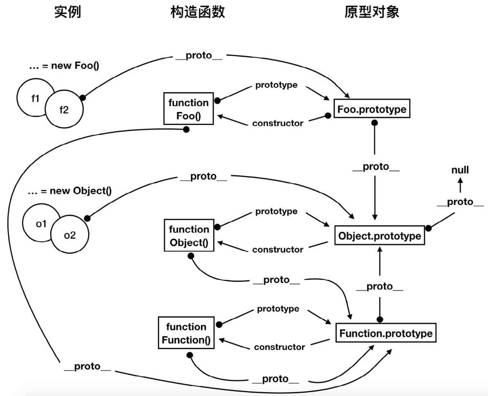

# 对象
JavaScript虽然是一门弱类型语言，但它同样是一门面向对象的语言，严格来说它是一门基于原型的面向对象的语言。
## 对象的属性和访问方式
### 对象的属性👍👍👍
ECMA-262规范把对象定义为：无序属性的集合，其属性值可以包含基本类型值、对象或者函数等。
通俗点讲，对象是一组键值对的集合，键表示的是属性名称，值表示的是属性的值。
#### 数据属性
具有4个描述其行为的特性，因为这些特性是内部值，所以ECMA-262规范将其放在了两对方括号中。
- `[[Configurable]]`：表示属性能否删除而重新定义，或者是否可以修改为访问器属性，默认值为**true**。
-  `[[Enumerable]]`：表示属性是否可枚举，可枚举的属性能够通过for...in循环返回，默认值为**true**。
-  `[[Writable]]`：表示属性值能否被修改，默认值为**true**。
-  `[[Value]]`：表示属性的真实值，属性的读取和写入均通过此属性完成，默认值为**undefined**。

例如，通过以下代码定义了一个包含name属性的对象person，name属性的`[[Configurable]]`、`[[Enumerable]]`、`[[Writable]]`特性值都为true，`[[Value]]`特性值为'ming'。
```js
var person = {
  name: "ming"
};
```
如果需要修改数据属性默认的特性，则必须使用Object.defineProperty()函数，语法如下。
```js
Object.defineProperty(target, property, {
  configurable: true,
  enumerable: false,
  writable: false,
  value: 'ming'
});
```
- 其中target表示目标对象
- property表示将要修改特性的属性
- 第三个参数是一个描述符对象，描述符对象的属性必须为configurable、enumerable、writable、value，以分别对应4个特性值，可以同时设置其中一个或多个值。

Demo
```js
var person = {
  name: 'ming'
};
// 设置其name属性的writable值为false，表示name属性值无法被修改。
Object.defineProperty(person, 'name', {
  writable: false,
});
person.name = 'mingli';
console.log(person.name); // 'min'
```
#### 访问器属性
访问器属性同样包含4个特性:
- `[[Configurable]]`：表示属性能否删除而重新定义，或者是否可以修改为访问器属性，默认值为**true**。
- `[[Enumerable]]`：表示属性是否可枚举，可枚举的属性能够通过for...in循环返回，默认值为**true**。
- `[[Get]]`：在读取属性值时调用的函数（一般称为getter()函数），负责返回有效的值，默认值为**undefined**。
- `[[Set]]`：在写入属性值时调用的函数（一般称为setter()函数），负责处理数据，默认值为**undefined**。

同样使用Object.defineProperty()函数

getter()函数和setter()函数的存在在一定程度上可以实现对象的私有属性，私有属性不对外暴露。如果想要读取和写入私有属性的值，则需要通过设置额外属性的getter()函数和setter()函数来实现，具体可以看下面的例子。
```js
1  var person = {
2     _age: 10
3  };
4  Object.defineProperty(person, "age", {
5      get: function(){
6          return this._age;
7      },
8      set: function(newValue) {
9          if (newValue > 10) {
10             this._age = newValue;
11             console.log('设置成功');
12     }
13 }
14 });
15 console.log(person.age); // 10
16 person.age = 9; 
17 console.log(person.age); // 10
18 person.age = 19; // “设置成功”
19 console.log(person.age); // 19
```
### 属性的访问方式
对象属性的访问方式有两种，一种是使用点操作符（.），另一种是使用中括号操作符（[]）。
#### 使用“.”来访问属性
```js
ObjectName.propertyName // 语法
```
其中objectName为对象名称，propertyName为属性名称。
例如person.name，表示访问person对象的name属性值。
#### 使用“[]”来访问属性
```js
ObjectName[propertyName] // 语法
```
中objectName为对象名称，propertyName为属性名称。
例如person['name']，表示访问person对象的name属性值。

#### 二者不同之处
第一点，点操作符是**静态**的，只能是一个以属性名称命名的简单描述符，而且无法修改；而中括号操作符是**动态**的，可以传递字符串或者变量，并且支持在运行时修改。
```js
var obj = {};
obj.name = '张三';
var myName = 'name';
console.log(obj.myName); // undefined
console.log(obj[myName]); // 张三
```
第二点，点操作符不能以数字作为属性名，而中括号操作符可以。
```js
var obj = {};
obj.1 = 1; // Unexpected number
obj[2] = 2;
console.log(obj.1); // missing ) after argument list
console.log(obj[2]); // 2
```
第三点，如果属性名中包含会导致语法错误的字符，或者**属性名中含有关键字或者保留字**，可以使用方括号操作符，而不能使用点操作符。
```js
var person = {};
person['first name'] = 'ming';
console.log(person['first name']); // ming
console.log(person.first name); // missing ) after argument list
```
## 创建对象
在JavaScript中，**对象是一系列无序属性的集合**，属性值可以为基本数据类型、对象或者函数，因此对象实际就是一组键值对的组合。
```js
// 对象
var person = {
  // 基本数据类型的属性
  name: 'ming', age: 11,
  // 函数类型的属性
  getName: function () {
    return this.name;
  },
  // 对象类型的属性
  address: {
    name: '北京市',
    code: '100000'
  }
};
```
### 基于Object()构造函数
通过Object对象的构造函数生成一个实例，然后给它增加需要的各种属性。
```js
// Object()构造函数生成实例
var person = new Object();
// 为实例新增各种属性
person.name = 'ming';
person.age = 11;
person.getName = function () {
  return this.name;
}
person.address = {
  name: '北京市',
  code: '100000'
}
```
### 基于对象字面量
对象字面量本身就是一系列键值对的组合，每个属性之间通过逗号分隔。
```js
var person = {
   name: 'kingx',
   age: 11,
   getName: function () {
       return this.name;
   },
   address: {
       name: '北京市',
       code: '100000'
   }
};
```
方法1与方法2在创建对象时都具有相同的优点，即简单、容易理解。但是对象的属性值是通过对象自身进行设置的，如果需要同时创建若干个属性名相同，而只是属性值不同的对象时，则会产生很多的重复代码，造成代码冗余，因此不推荐使用方法1与方法2来批量创建对象。
### 基于工厂方法模式
工厂方法模式是一种比较重要的设计模式，用于创建对象，旨在抽象出创建对象和属性赋值的过程，只对外暴露出需要设置的属性值。
```js
// 工厂方法，对外暴露接收的name、age、address属性值
function createPerson(name, age, address) {
  // 内部通过Object()构造函数生成一个对象，并添加各种属性
  var o = new Object();
  o.name = name;
  o.age = age;
  o.address = address;
  o.getName = function () {
    return this.name;
  }
  return o; // 返回创建的对象
}
var person = createPerson('ming', 11, {
  name: '北京市',
  code: '100000'
});
```
> 使用工厂方法可以减少很多重复的代码，但是**创建的所有实例都是Object类型**，无法更进一步区分具体的类型。
### 基于构造函数模式
构造函数是通过this为对象添加属性的，属性值类型可以为基本类型、对象或者函数，然后通过new操作符创建对象的实例。
```js
function Person(name, age, address) {
  this.name = name;
  this.age = age;
  this.address = address;
  this.getName = function () {
    return this.name;
  }
}
var p = new Person('ming', 11, { name: '北京市', code: '100000' });
console.log(p instanceof Person) // true
```
使用构造函数创建的对象可以确定其所属类型，解决了工厂方法存在的问题。但是使用构造函数创建的对象存在一个问题，即相同实例的函数是不一样的。
```js
var p1 = new Person('ming', 11, { name: '北京市', code: '100000' });
var p2 = new Person('ming', 11, { name: '北京市', code: '100000' });
console.log(p1.getName === p2.getName); // false
```
这就意味着每个实例的函数都会占据一定的内存空间，其实这是没有必要的，会造成资源的浪费，另外函数也没有必要在代码执行前就绑定在对象上。
### 基于原型对象的模式
基于原型对象的模式是将所有的函数和属性都封装在对象的prototype属性上。
```js
// 定义函数
function Person() {}
// 通过prototype属性增加属性和函数
Person.prototype.name = 'ming';
Person.prototype.age = 11;
Person.prototype.address = {
  name: '北京市',
  code: '100000'
}
Person.prototype.getName = function() {
  return this.name;
}
// 生成两个实例
var p1 = new Person();
var p2 = new Person();
console.log(p1.name === p2.name); // true
console.log(p1.getName === p2.getName); // true
```
通过上面的代码可以发现，使用基于原型对象的模式创建的实例，其属性和函数都是相等的，不同的实例会共享原型上的属性和函数，解决了基于构造函数存在的问题。

new Q:因为所有的实例会共享相同的属性，那么改变其中一个实例的属性值，便会引起其他实例的属性值变化
```js
var p1 = new Person();
var p2 = new Person();
console.log(p1.name); // ming
p2.name = 'li';
console.log(p1.name); // li
```
### 构造函数和原型混合的模式
> 构造函数和原型混合的模式是目前最常见的创建自定义类型对象的方式。

构造函数中用于定义实例的属性，原型对象中用于定义实例共享的属性和函数。通过构造函数传递参数，这样每个实例都能拥有自己的属性值，同时实例还能共享函数的引用，最大限度地节省了内存空间。混合模式可谓是集二者之所长。
```js
// 构造函数中定义实例的属性
function Person(name, age, address) {
  this.name = name;
  this.age = age;
  this.address = address;
}
// 原型中添加实例共享的函数
Person.prototype.getName = function () {
  return this.name;
}
// 生成两个实例
var p1 = new Person('ming', 11, { name: '北京市', code: '100000'} );
var p2 = new Person('ming2', 11, { name: '上海市', code: '200000'} );
// 输出实例初始的name属性值
console.log(p1.name); // ming
console.log(p2.name); // ming2
// 改变一个实例的属性值
person.address.name = '广州市';
person.address.code = '510000';
// 不影响另一个实例的属性值
console.log(p2.address.name); // 上海市
// 不同的实例共享相同的函数，英雌在比较时是相等的
console.log(p1.getName === p2.getName); // true
// 改变一个实例的属性，函数仍然能正常执行
p2.name = 'ming3';
console.log(p1.getName()); // ming
console.log(p2.getName()); // ming3
```
### 基于动态原型模式
动态原型模式是将原型对象放在构造函数内部，通过变量进行控制，只在第一次生成实例的时候进行原型的设置。
动态原型的模式相当于懒汉模式，只在生成实例时设置原型对象，但是功能与构造函数和原型混合模式是相同的。
```js
// 动态原型模式
function Person(name, age, address) {
  this.name = name;
  this.age = age;
  this.address = address;
}
// 如果Person对象中_initialized为undefined，则表明还没有为Person的原型对象添加函数
if (typeof Person._initialized === 'undefined') {
  Person.prototype.getName = function () {
    return this.name;
  }
  Person._initialized = true;
}
// 生成两个实例
var p1 = new Person('ming', 11, { name: '北京市', code: '100000' });
var p2 = new Person('ming2', 11, { name: '上海市', code: '200000' });
// 改变其中一个实例的属性
p1.address.name = '广州市';
p1.address.code = '510000';
// 不会影响到另一个实例的属性
console.log(p2.address.name); // 上海市
// 改变一个实例的属性，函数仍能正常执行
p2.name = 'ming3';
console.log(p1.getName()); // ming
console.log(p2.getName()); // ming3
```
## 对象克隆
克隆是指通过一定的程序将某个变量的值复制至另一个变量的过程。根据复制后的变量与原始变量值的影响情况，克隆可以分为浅克隆和深克隆两种方式。
针对不同的数据类型，浅克隆和深克隆会有不同的表现，主要表现于基本数据类型和引用数据类型在内存中存储的值不同。
对于基本数据类型的值，变量存储的是值本身，存放在栈内存的简单数据段中，可以直接进行访问。
对于引用类型的值，变量存储的是值在内存中的地址，地址指向内存中的某个位置。如果有多个变量同时指向同一个内存地址，则其中一个变量对值进行修改时，会影响到其他的变量。
以数组为例来看看实际效果。
```js
var arr1 = [1, 2, 3];
var arr2 = arr1;
arr2[1] = 4;
console.log(arr1); // [1, 4, 3];
console.log(arr2); // [1, 4, 3];
```
将arr1和arr2这两个变量指向同一个数组，对arr2变量值的修改，会导致arr1变量值的变化，最后输出的arr1与arr2变量值都会被修改。
正是由于数据类型的差异性，这会导致它们在浅克隆和深克隆的表现上不同，基本数据类型不管是浅克隆还是深克隆都是对值本身的克隆，对克隆后值的修改不会影响到原始值。
引用数据类型如果执行的是浅克隆，对克隆后值的修改会影响到原始值；如果执行的是深克隆，则克隆的对象和原始对象相互独立，不会彼此影响。
### 浅克隆
浅克隆由于只克隆对象最外层的属性，如果对象存在更深层的属性，则不进行处理，这就会导致克隆对象和原始对象的深层属性仍然指向同一块内存。
#### 简单的引用复制
即遍历对象最外层的所有属性，直接将属性值复制到另一个变量中。
```js
function shallowClone(origin) {
  var result = {};
  // 遍历最外层属性
  for (var key in origin) {
    // 判断是否是对象自身的属性
    if (origin.hasOwnProperty(key)) {
      result[key] = origin[key];
    }
  }
  return result;
}
```
定义一个具有复合属性的对象，并进行测试，具体代码如下。
```js
// 原始对象
var origin = {
   a: 1,
   b: [2, 3, 4],
   c: {
      d: 'name'
   }
};
// 克隆后的对象
var result = shallowClone(origin);
console.log(origin);  // { a: 1, b: [ 2, 3, 4 ], c: { d: 'name' } }
console.log(result);  // { a: 1, b: [ 2, 3, 4 ], c: { d: 'name' } }
// 克隆后的对象的值与原始对象的值相同
```
#### ES6的Object.assign()函数
用于将源对象的可枚举属性复制到目标对象中。
```js
var origin = {
   a: 1,
   b: [2, 3, 4],
   c: {
      d: 'name'
   }
};
// 通过Object.assign()函数克隆对象
var result = Object.assign({}, origin);
console.log(origin);  // { a: 1, b: [ 2, 3, 4 ], c: { d: 'name' } }
console.log(result);  // { a: 1, b: [ 2, 3, 4 ], c: { d: 'name' } }
```
浅克隆实现方案都会存在一个相同的问题，即如果原始对象是引用数据类型的值，则对克隆对象的值的修改会影响到原始对象的值。
```js
// 修改克隆对象的内部属性
result.c.d = 'city';
console.log(origin); // { a: 1, b: [ 2, 3, 4 ], c: { d: 'city' } }
console.log(result); // { a: 1, b: [ 2, 3, 4 ], c: { d: 'city' } }
```
### 深克隆
#### JSON序列化和反序列化👍👍👍
**如果一个对象中的全部属性都是可以序列化的**，那么我们可以先使用JSON.stringify()函数将原始对象序列化为字符串，再使用JSON.parse()函数将字符串反序列化为一个对象，这样得到的对象就是深克隆后的对象。
```js
var origin = {
   a: 1,
   b: [2, 3, 4],
   c: {
       d: 'name'
   }
};
// 先反序列化为字符串，再序列化为对象，得到深克隆后的对象
var result = JSON.parse(JSON.stringify(origin));
console.log(origin); // { a: 1, b: [ 2, 3, 4 ], c: { d: 'name' } }
console.log(result); // { a: 1, b: [ 2, 3, 4 ], c: { d: 'name' } }
```
这种方法能够解决大部分JSON类型对象的深克隆问题，但是对于以下几个问题不能很好地解决。
- 无法实现对函数、RegExp等特殊对象的克隆。
- 对象的constructor会被抛弃，所有的构造函数会指向Object，原型链关系断裂。
- 对象中如果存在循环引用，会抛出异常。

定义一个原始对象，其中一个属性为函数，一个属性为正则表达式对象，一个属性为某个对象的实例。
```js
function Animal(name) {
  this.name = name;
}
var animal = new Animal('dog');
// 原始对象
var origin = {
  // 属性为函数
  a: function () {
    return 'a';
  },
  // 属性为正则表达式对象
  b: new RegExp('\d', 'g'),
  // 属性为某个对象的实例
  c: animal
}
var result = JSON.parse(JSON.stringify(origin));
console.log(origin); // { a: [Function: a], b: /d/g, c: Animal { name: 'dog'}}
console.log(result); // { b: {}, c: { name: 'dog' }}
console.log(origin.c.constructor) // [Function: Animal]
console.log(result.c.constructor) // [Function: Object]
```
从得到的结果中，验证了上述的观点。
- 值为Function类型的a属性丢失。
- b属性应该为一个正则表达式，在克隆后得到的是一个空对象。
- c属性值虽然都是一个具有name属性的对象，但是克隆后对象的c属性值对象的构造函数却不再指向Animal，而是指向Object，构造函数被丢失，导致原型链关系的断裂。

关于循环引用，同样列举一个特定的实例。
定义一个原始对象，为原始对象添加一个属性指向自身，形成循环引用。
```js
var origin = {
   a: 'name'
};
origin.b = origin;
// TypeError: Converting circular structure to JSON
var result = JSON.parse(JSON.stringify(origin));
```
当在调用JSON.stringify(origin)时，就会抛出异常，表示“循环引用的结构无法序列化成JSON字符串”。
#### 自定义实现深克隆
在自定义实现深克隆时，需要针对不同的数据类型做针对性的处理，因此我们会先实现判断数据类型的函数，并将所有函数封装在一个辅助类对象中，这里用“_”表示（类似于underscore类库对外暴露的对象）。
```js
/**
 * 类型判断
 */
(function(_) {
  // 列举可能存在的数据类型
  var types = 'Array Object String Date RegExp Function Boolean Number Null Undefined Symbol Null'.split(' ');
  function type() {
    // 通过调用toString函数，从索引为8时截取字符串，得到数据类型的值
    return Object.prototype.toString.call(this).slice(8, -1);
  }
  for (var i = types.length; i--;) {
    _['is' + types[i]] = (function( self) {
      return function (elem) {
        return type.call(elem) === self;
      }
    })(types[i]);
  }
  return _;
})(_ = {});
```
执行上面的代码后，_ 对象便具有了isArray()函数、isObject()函数等一系列判断数据类型的函数。然后再调用_.isArray(param)函数判断param是否是数组类型、调用_.isObject(param)函数判断param是否是对象类型。
```js
/**
 * 深克隆实现方案
 * @param source 待克隆的对象
 * @returns {*} 返回克隆后的对象
 */
function deepClone(source) {
  // 维护两个存储循环引用的数组
  var parents = [];
  var children = [];
  // 用于获得正则表达式的修饰符, /igm
  function getRegExp(reg) {
    var result = '';
    if (reg.ignoreCase) {
      result += 'i';
    }
    if (reg.global) {
      result += 'g';
    }
    if (reg.multiline) {
      result += 'm';
    }
    return result;
  }
  // 便于递归的_clone函数
  function _clone(parent) {
    if (parent === null) return null;
    if (typeof parent !== 'object') return parent;
    var child, proto;
    // 对数组做特殊处理
    if (_.isArray(parent)) {
      child = [];
    } else if(_.isRegExp(parent)) {
      // 对正则对象做特殊处理
      child = new RegExp(parent.source, getRegExp(parent));
      if (parent.lastIndex) child.lastIndex = parent.lastIndex;
    } else if (_.isDate(parent)) {
      // 对Date对象做特殊处理
      child = new Date(parent.getTime());
    } else {
      // 处理对象原型
      proto = Object.getPrototypeOf(parent);
      // 利用Object.create)切换原型链
      child = Object.create(proto);
    }
    // 处理循环引用
    var index = parents.indexOf(parent);
    if (index !== -1) {
      // 如果父数组存在本对象，说明之前已经被引用过，直接返回此对象
      return children[index];
    }
    // 没有引用过，则添加至parents和children数组中
    parents.push(parent);
    children.push(child);
    // 遍历对象属性
    for (var prop in parent) {
      if (parent.hasOwnProperty(prop)) {
        // 递归处理
        child[prop] = _clone(parent[prop]);
      }
    }
    return child;
  }
  return _clone(source);
}
// 首先是使用最基本的JSON格式对象进行测试。
var origin = {
   a: 1,
   b: [2, 3, 4],
   c: {
       d: 'name'
   }
};
var result = deepClone(origin);
console.log(origin); // { a: 1, b: [ 2, 3, 4 ], c: { d: 'name' } }
console.log(result); // { a: 1, b: [ 2, 3, 4 ], c: { d: 'name' } }

// 使用具有Function类型属性、RegExp类型属性、实例属性的对象进行测试。
function Animal(name) {
   this.name = name;
}
var animal = new Animal('tom');
var origin = {
   a: function () {
       return 'a';
   },
   b: new RegExp('\d', 'g'),
   c: animal
};
var result = deepClone(origin);
console.log(origin); // { a: [Function: a], b: /d/g, c: Animal { name: 'tom' } }
console.log(result); // { a: [Function: a], b: /d/g, c: Animal { name: 'tom' } }

// 最后是使用具有循环引用属性的对象进行测试。
var origin = {
   a: 'name'
};
origin.b = origin;
var result = deepClone(origin);
console.log(origin); // { a: 'name', b: [Circular] }
console.log(result); // { a: 'name', b: [Circular] }
```
#### jQuery实现——$.clone()函数和$.extend()
在jQuery中提供了一个$.clone()函数，但是它是用于复制DOM对象的。
真正用于实现克隆的函数是$.extend()，下面来看看对应的源码
```js
jQuery.extend = jQuery.fn.extend = function() {
    // options是一个缓存变量，用来缓存arguments[i]，
    // name是用来接收将要被扩展对象的key，src改变之前target对象上每个key对应的value
    // copy传入对象上每个key对应的value，copyIsArray判定copy是否为一个数组
    // clone深克隆中用来临时存对象或数组的src
    var src, copyIsArray, copy, name, options, clone,
        target = arguments[0] || {},
        i = 1,
        length = arguments.length,
        deep = false;

     // 如果传递的第一个参数为boolean类型，为true代表深克隆，为false代表浅克隆
    if ( typeof target === "boolean" ) {
        deep = target;
        // 如果传递了第一个参数为boolean值，则待克隆的对象为第二个参数
        target = arguments[ i ] || {};
        i++;
    }
    // 如果是简单类型数据
    if ( typeof target !== "object" && !jQuery.isFunction(target) ) {
        target = {};
    }
    // 如果只传递一个参数，那么克隆的是jQuery自身
    if ( i === length ) {
        target = this;
        i--;
    }
    for ( ; i < length; i++ ) {
        // 仅需要处理不是null与undefined类型的数据
        if ( (options = arguments[ i ]) != null ) {
            // 遍历对象的所有属性
            for ( name in options ) {
                src = target[ name ];
                copy = options[ name ];
                // 阻止循环引用
                if ( target === copy ) {
                    continue;
                }

                // 递归处理对象和数组
                if ( deep && copy && ( jQuery.isPlainObject(copy)                   || (copyIsArray = jQuery.isArray(copy)) ) ) {
                    if ( copyIsArray ) {
                        copyIsArray = false;
                        clone = src && jQuery.isArray(src) ? src : [];
                    } else {
                        clone = src && jQuery.isPlainObject(src) ? src : {};
                    }
                    // 将原始值的name属性值赋给target目标对象
                    target[ name ] = jQuery.extend( deep, clone, copy );
                } else if ( copy !== undefined ) {
                  // 对于简单类型，直接赋值
                    target[ name ] = copy;
                }
            }
        }
   }
   // 返回clone后的目标对象
   return target;
};
```
使用$.extend()函数可以实现函数与正则表达式等类型的克隆，还能保持克隆对象的原型链关系，解决了深克隆中存在的3个问题中的前两个，但是却无法解决循环引用的问题。
```js
var origin = {};
origin.d = origin;
var result = $.extend(true, {}, origin); // Uncaught RangeError: Maximum call stack size exceeded
```
## 原型对象
每一个函数在创建时都会被赋予一个prototype属性，它指向函数的原型对象，这个对象可以包含所有实例共享的属性和函数。因此在使用prototype属性后，就可以将实例共享的属性和函数抽离出构造函数，将它们添加在prototype属性中。
### 原型对象、构造函数、实例之间的关系
构造函数的prototype属性会指向它的原型对象，而通过构造函数可以生成具体的实例。
这里就会涉及3个概念，分别是构造函数、原型对象和实例。
- 原型对象、构造函数和实例之间的关系是什么样的？
- 使用原型对象创建了对象的实例后，实例的属性读取顺序是什么样的？
- 假如重写了原型对象，会带来什么样的问题？
#### 原型对象、构造函数和实例之间的关系
每一个函数在创建时都会被赋予一个prototype属性。在默认情况下，所有的原型对象都会增加一个constructor属性，指向prototype属性所在的函数，即构造函数。

当通过new操作符调用构造函数创建一个实例时，实例具有一个__proto__属性，指向构造函数的原型对象，因此__proto__属性可以看作是一个连接实例与构造函数的原型对象的桥梁。
```js
// 通过下面这段代码为构造函数的原型对象添加了4个属性，同时生成两个实例
function Person() {}
Person.prototype.name = 'Nicholas';
Person.prototype.age = 29;
Person.prototype.job = 'Software Engineer';
Person.prototype.sayName = function() { console.log(this.name); }
var person1 = new Person();
var person2 = new Person();
```
[原型图](./assets/drowio/prototype.drawio ':include :type=code')

构造函数Person有个prototype属性，指向的是Person的原型对象。在原型对象中有constructor属性和另外4个原型对象上的属性，其中constructor属性指向构造函数本身。
通过new操作符创建的两个实例person1和person2，都具有一个__proto__属性（图中的`[[Prototype]]`即__proto__属性），指向的是Person的原型对象。

#### 实例的属性读取顺序
当通过对象的实例读取某个属性时，是有一个搜索过程的。
1. 它会先在**实例本身**去找指定的属性，如果找到了，则直接返回该属性的值；*
2. 如果没找到，则会继续沿着**原型对象**寻找；如果在原型对象中找到了该属性，则返回该属性的值。
```js
function Person() {
   this.name = 'ming';
}
Person.prototype.name = 'Nicholas';
Person.prototype.age = 29;
Person.prototype.job = 'Software Engineer';
Person.prototype.sayName = function(){
   console.log(this.name);
};
var person1 = new Person();
console.log(person1.name);  // ming
```
同样，假如Person()构造函数同时具有相同名称的实例属性和原型对象上的属性，在生成了实例后，删除了实例的实例属性，那么会输出原型对象上的属性的值。
```js
function Person() {
   // 这里的name是实例属性
   this.name = 'ming';
}
// 这里的name是原型对象上的属性
Person.prototype.name = 'Nicholas';
var person1 = new Person();
// 删除实例的实例属性
delete person1.name;
console.log(person1.name); // Nicholas，输出的是原型对象上的属性的值
```
#### 重写原型对象👍👍👍
可以将所有需要绑定在原型对象上的属性写成一个对象字面量的形式，并赋值给prototype属性。
```js
function Person() {}
Person.prototype = {
   constructor: Person,  // 重要
   name: 'Nicholas',
   age: 29,
   job: 'Software Engineer',
   sayName: function () {
       console.log(this.name);
   }
};
```
当创建Person对象的实例时仍然可以正常访问各个原型对象上的属性。
```js
var person = new Person();
person.sayName(); // Nicholas
```
将一个对象字面量赋给prototype属性的方式实际是重写了原型对象，等同于切断了构造函数和最初原型之间的关系。
因此，如果仍然想使用constructor属性做后续处理，则应该在对象字面量中增加一个constructor属性，指向构造函数本身，否则原型的constructor属性会指向Object类型的构造函数，从而导致constructor属性与构造函数的脱离。
```js
// 进行简单改写。
function Person() {}
Person.prototype = {
   name: 'Nicholas',
   sayName: function () {
       console.log(this.name);
   }
 };
Person.prototype.constructor === Object; // true
// 重写原型对象会切断构造函数和最初原型之间的关系
Person.prototype.constructor === Person; // false
```
如果在重写原型对象之前，已经生成了对象的实例，则该实例将无法访问到新的原型对象中的函数。
```js
function Person() {}
// 先生成一个实例person1
// 实例person1实际指向的是最初的原型，而将原型对象手动重写以后，就脱离了与最初原型的关系。
var person1 = new Person(); 
// 重写对象的原型
Person.prototype = {
   name: 'Nicholas',
   sayName: function () {
       console.log(this.name);
   }
};
// 再生成一个实例person2
// 实例person2是在原型重写之后生成的，它能访问到新原型中的sayName()函数
var person2 = new Person();

person1.sayName(); // TypeError: person1.sayName is not a function
person2.sayName(); // Nicholas
```
### 原型链
> 对象的每个实例都具有一个__proto__属性，指向的是构造函数的原型对象，而原型对象同样存在一个__proto__属性指向上一级构造函数的原型对象，就这样层层往上，直到最上层某个原型对象为null。

  在JavaScript中几乎所有的对象都具有__proto__属性，由__proto__属性连接而成的链路构成了JavaScript的原型链，原型链的顶端是Object.prototype，它的__proto__属性为null。
```js
// 简单的原型链过程
function Person() {}
var person = new Person();
person.__proto__ === Person.prototype; // true
person.__proto__.__proto__ === Person.prototype.__proto__ === Object.prototype;
person.__proto__.__proto__.__proto__ = Object.prototype.__proto__ === null;
```
关系如图：

- 第一部分
  - 自定义的Foo()函数，Foo()函数的prototype属性指向Foo.prototype对象，通过Foo()构造函数生成实例f1、f2，它们的__proto__属性指向Foo.prototype对象。
  - 而Foo()函数本身可以作为Function对象的实例，可以理解为`var Foo = new Function();`代码。
  - 因此Foo.__proto__指向Function.prototype。
- 第二部分
  - 与Object()构造函数有关，Object()构造函数本身也是Function类型，因此Object.__proto__指向Function.prototype，通过Object()构造函数生成的实例o1、o2，它们的__proto__属性指向Object.prototype对象。
- 第三部分
  - 与Function()构造函数有关，Function.__proto__指向Function.prototype，而Function.prototype为一个对象，它的__proto__属性指向Object.prototype对象。
> 所有的对象通过__proto__属性向上寻找一定会追溯到Object.prototype的。
#### 原型链的特点
1. 由于原型链的存在，属性查找的过程不再是只查找自身的原型对象，而是会沿着整个原型链一直向上，直到追溯到Object.prototype。
如果Object.prototype上也找不到该属性，则返回“undefined”。如果期间在实例本身或者某个原型对象上找到了该属性，则会直接返回结果，因此会存在属性覆盖的问题。
```js
// 在生成自定义对象的实例时，也可以调用到某些未在自定义构造函数上的函数，例如toString()函数。
function Person() {}
var p = new Person();
p.toString();  // [object Object]，实际调用的是Object.prototype.toString()函数
```
2. 由于属性查找会经历整个原型链，因此查找的链路越长，对性能的影响越大。
#### 属性区分
> 如何区分属性是实例自身的还是原型链中继承的呢
Object()构造函数的原型对象中提供了一个hasOwnProperty()函数，用于判断属性是否为自身拥有的。
```js
function Person(name) {
   // 实例属性name
   this.name = name;
}
// 原型对象上的属性age
Person.prototype.age = 12;
var person = new Person('ming');

console.log(person.hasOwnProperty('name')); // true
console.log(person.hasOwnProperty('age')); // false
```
在使用for...in运算符遍历对象的属性时，一般可以配合hasOwnProperty()函数一起使用，检测是否是对象自身的属性，然后做后续处理。
```js
for (var prop in person) {
   if (person.hasOwnProperty(prop)) {
       // do something
   }
}
```
#### 内置构造函数
JavaScript中有一些特定的内置构造函数，如String()构造函数、Number()构造函数、Array()构造函数、Object()构造函数等。
```js
// 它们本身的__proto__属性都统一指向Function.prototype。
String.__proto__ === Function.prototype; // true
Number.__proto__ === Function.prototype; // true
Array.__proto__ === Function.prototype;  // true
Date.__proto__ === Function.prototype;   // true
Object.__proto__ === Function.prototype; // true
Function.__proto__ === Function.prototype; // true
```
#### __proto__属性
> 在JavaScript的原型链体系中，最重要的是__proto__属性，只有通过它才能将原型链串联起来。


```js
// 先实例化一个字符串，然后输出字符串的值，具体代码如下。
var str = new String('ming');
console.log(str);
/**
 * String {'ming'}
 * 0: "m"
 * 1: "i"
 * 2: "n"
 * 3: "g"
 * length: 4
 * [[Prototype]]: String 
 *      => ... 
 *      => sub: ƒ sub()
 *      => substr: ƒ substr()
 *      => substring: ƒ substring()
 *      => sup: ƒ sup()
 *      => ...
 * [[PrimitiveValue]]: "ming"
 */
str.substring(1, 3); // in
```

```js
Function.prototype.a = 'a';
Object.prototype.b = 'b';

function Person() {}

var p = new Person();

console.log('p.a:', p.a); // undefined
console.log('p.b:', p.b); // b
// 属性的查找是根据__proto__属性沿着原型链来完成的

// 实例p直接原型
p.__proto__ =  Person.prototype;
// Person原型对象的原型
Person.prototype.__proto__ = Object.prototype;
```
## 继承
继承作为面向对象语言的三大特性之一，可以在不影响父类对象实现的情况下，使得子类对象具有父类对象的特性；
同时还能在不影响父类对象行为的情况下扩展子类对象独有的特性。
```js
// 定义一个父类Animal
function Animal(name) {
   // 属性
   this.type = 'Animal';
   this.name = name || '动物';
   // 实例函数
   this.sleep = function () {
       console.log(this.name + '正在睡觉！');
   }
}
// 原型函数
Animal.prototype.eat = function (food) {
   console.log(this.name + '正在吃：' + food);
};
```
### 原型链继承
> 主要思想是：重写子类的prototype属性，将其指向父类的实例。

```js
// 子类Cat
function Cat(name) {
   this.name = name;
}
// 原型继承
Cat.prototype = new Animal();
// 很关键的一句，将Cat的构造函数指向自身✨✨✨
// 这是因为如果不将Cat原型对象的constructor属性指向自身的构造函数的话，那将会指向父类Animal的构造函数。
// 所以在设置了子类的prototype属性后，需要将其constructor属性指向Cat。
Cat.prototype.constructor = Cat; // Cat.prototype.constructor === Animal; // true
var cat = new Cat('加菲猫');
// 在子类Cat中，我们没有增加type属性，因此会直接继承父类Animal的type属性，输出字符串“Animal”
console.log(cat.type);    // Animal
// 在子类Cat中，我们增加了name属性，在生成子类Cat的实例时，name属性值会覆盖父类Animal的name属性值，因此输出字符串“加菲猫”，而并不会输出父类Animal的name属性“动物”。
console.log(cat.name);    // 加菲猫
// 同样因为Cat的prototype属性指向了Animal类型的实例，因此在生成实例cat时，会继承实例函数和原型函数，在调用sleep()函数和eat()函数时，this指向了实例cat，从而输出“加菲猫正在睡觉！”和“加菲猫正在吃：猫粮”。
console.log(cat.sleep()); // 加菲猫正在睡觉！
console.log(cat.eat('猫粮'));  // 加菲猫正在吃：猫粮
```
#### 优点
1. 简单，易于实现
只需要设置子类的prototype属性为父类的实例即可，实现起来简单。
2. 继承关系纯粹
生成的实例既是子类的实例，也是父类的实例。
```js
console.log(cat instanceof Cat);    // true,是子类的实例
console.log(cat instanceof Animal); // true,是父类的实例
```
3. 可通过子类直接访问父类原型链属性和函数
通过原型链继承的子类，可以直接访问到父类原型链上新增的函数和属性。
```js
// 继续沿用前面的代码
// 父类原型链上增加属性
Animal.prototype.bodyType = 'small';
// 父类原型链上增加函数
Animal.prototype.run = function () {
   return this.name + '正在奔跑';
};
// 结果验证
console.log(cat.bodyType);  // small
console.log(cat.run());     // 加菲猫正在奔跑
```
#### 缺点
1. 子类的所有实例将共享父类的属性
```js
Cat.prototype = new Animal();
```
在使用原型链继承时，是直接改写了子类Cat的prototype属性，将其指向一个Animal的实例，那么所有生成Cat对象的实例都将共享Animal实例的属性。
```js
// 以上描述可以理解为如下所码。
// 生成一个Animal的实例animal
var animal = new Animal();
// 通过改变Cat的原型链，所有的Cat实例将共享animal中的属性
Cat.prototype = animal;
```
这就会带来一个很严重的问题，如果父类Animal中有个值为引用数据类型的属性，那么改变Cat某个实例的属性值将会影响其他实例的属性值。
```js
// 定义父类
function Animal() {
   this.feature = ['fat', 'thin', 'tall'];
}
// 定义子类
function Cat() {}
// 原型链继承
Cat.prototype = new Animal();
Cat.prototype.constructor = Cat;
// 生成
var cat1 = new Cat();
var cat2 = new Cat();
// 先输出两个实例的feature值
console.log(cat1.feature);  // [ 'fat', 'thin', 'tall' ]
console.log(cat2.feature);  // [ 'fat', 'thin', 'tall' ]
// 改变cat1实例的feature值
cat1.feature.push('small');
// 再次输出两个实例的feature值，发现cat2实例也受到影响
console.log(cat1.feature);  // [ 'fat', 'thin', 'tall', 'small' ]
console.log(cat2.feature);  // [ 'fat', 'thin', 'tall', 'small' ]
```
2. 在创建子类实例时，无法向父类的构造函数传递参数
在通过new操作符创建子类的实例时，会调用子类的构造函数，而在子类的构造函数中并没有设置与父类的关联，从而导致无法向父类的构造函数传递参数。
3. 无法实现多继承
由于子类Cat的prototype属性只能设置为一个值，如果同时设置为多个值的话，后面的值会覆盖前面的值，导致Cat只能继承一个父类，而无法实现多继承。
4. 为子类增加原型对象上的属性和函数时，必须放在new Animal()函数之后
实现继承的关键语句是下面这句代码，它实现了对子类的prototype属性的改写。
```js
Cat.prototype = new Animal();
```
如果想要为子类新增原型对象上的属性和函数，那么需要在这个语句之后进行添加。因为如果在这个语句之前设置了prototype属性，后面执行的语句会直接重写prototype属性，导致之前设置的全部失效。
```js
// 先设置prototype属性
Cat.prototype.introduce = 'this is a cat';
// 原型链继承
Cat.prototype = new Animal();
// 生成子类实例
var cat1 = new Cat();
console.log(cat1.introduce);  // undefined
```
### 构造继承
主要思想是在子类的构造函数中通过call()函数改变this的指向，调用父类的构造函数，从而能将父类的实例的属性和函数绑定到子类的this上。
```js
// 父类
function Animal(age) {
   // 属性
   this.name = 'Animal';
   this.age = age;
   // 实例函数
   this.sleep = function () {
       return this.name + '正在睡觉！';
   }
}
// 父类原型函数
Animal.prototype.eat = function (food) {
   return this.name + '正在吃：' + food;
};
// 子类
function Cat(name) {
   // 核心，通过call()函数实现Animal的实例的属性和函数的继承✨✨✨
   Animal.call(this);
   this.name = name || 'tom';
}
// 生成子类的实例
var cat = new Cat('tony');
// 可以正常调用父类实例函数
console.log(cat.sleep());  // tony正在睡觉！
// 不能调用父类原型函数
console.log(cat.eat());  // TypeError: cat.eat is not a function
```
子类可以正常调用父类的实例函数，而无法调用父类原型对象上的函数，这是因为子类并没有通过某种方式来调用父类原型对象上的函数。
#### 优点
1. 可解决子类实例共享父类属性的问题
call()函数实际是改变了父类Animal构造函数中this的指向，调用后this指向了子类Cat，相当于将父类的type、age和sleep等属性和函数直接绑定到了子类的this中，成了子类实例的属性和函数，因此生成的子类实例中是各自拥有自己的type、age和sleep属性和函数，不会相互影响。
2. 创建子类的实例时，可以向父类传递参数
在call()函数中，我们可以传递参数，这个时候参数是传递给父类的，就可以对父类的属性进行设置，同时由子类继承下来。
```js
// 写下上面的代码
function Cat(name, parentAge) {
   // 在子类生成实例时，传递参数给call()函数，间接地传递给父类，然后被子类继承
   Animal.call(this, parentAge);
   this.name = name || 'tom';
}
// 生成子类实例
var cat = new Cat('tony', 11); 
console.log(cat.age);  // 11，因为子类继承了父类的age属性
```
3. 可以实现多继承
在子类的构造函数中，可以通过多次调用call()函数来继承多个父对象，每调用一次call()函数就会将父类的实例的属性和函数绑定到子类的this中。
#### 缺点
1. 实例只是子类的实例，并不是父类的实例
因为并未通过原型对象将子类与父类进行串联，所以生成的实例与父类并没有关系，这样就失去了继承的意义。
```js
var cat = new Cat('tony');
console.log(cat instanceof Cat);    // true，实例是子类的实例
console.log(cat instanceof Animal); // false，实例并不是父类的实例
```
2. 只能继承父类实例的属性和函数，并不能继承原型对象上的属性和函数
子类的实例并不能访问到父类原型对象上的属性和函数。
3. 无法复用父类的实例函数
由于父类的实例函数将通过call()函数绑定到子类的this中，因此子类生成的每个实例都会拥有父类实例函数的引用，这会造成不必要的内存消耗，影响性能。

### 复制继承
复制继承的主要思想是首先生成父类的实例，然后通过for...in遍历父类实例的属性和函数，并将其依次设置为子类实例的属性和函数或者原型对象上的属性和函数。
```js
// 父类
function Animal(parentAge) {
   // 实例属性
   this.name = 'Animal';
   this.age = parentAge;
   // 实例函数
   this.sleep = function () {
       return this.name + '正在睡觉！';
   }
}
// 原型函数
Animal.prototype.eat = function (food) {
   return this.name + '正在吃：' + food;
};
// 子类
function Cat(name, age) {
   var animal = new Animal(age);
   // 父类的属性和函数，全部添加至子类中
   for (var key in animal) {
       // 实例属性和函数
       if (animal.hasOwnProperty(key)) {
           this[key] = animal[key];
       } else {
           // 原型对象上的属性和函数
           Cat.prototype[key] = animal[key];
       }
   }
   // 子类自身的属性
   this.name = name;
}
// 子类自身原型函数
Cat.prototype.eat = function (food) {
   return this.name + '正在吃：' + food;
};

var cat = new Cat('tony', 12);
console.log(cat.age);  // 12
console.log(cat.sleep()); // tony正在睡觉！
console.log(cat.eat('猫粮')); // tony正在吃：猫粮
```
在子类的构造函数中，对父类实例的所有属性进行for...in遍历，如果animal.hasOwnProperty(key)返回“true”，则表示是实例的属性和函数，则直接绑定到子类的this上，成为子类实例的属性和函数；如果animal.hasOwnProperty(key)返回“false”，则表示是原型对象上的属性和函数，则将其添加至子类的prototype属性上，成为子类的原型对象上的属性和函数。
生成的子类实例cat可以访问到继承的age属性，同时还能够调用继承的sleep()函数与自身原型对象上的eat()函数。
#### 优点
1. 支持多继承
只需要在子类的构造函数中生成多个父类的实例，然后通过相同的for...in处理即可。
2. 能同时继承实例的属性和函数与原型对象上的属性和函数
因为对所有的属性进行for...in处理时，会通过hasOwnProperty()函数判断其是实例的属性和函数还是原型对象上的属性和函数，并根据结果进行不同的设置，从而既能继承实例的属性和函数又能继承原型对象上的属性和函数。
3. 可以向父类构造函数中传递值
在生成子类的实例时，可以在构造函数中传递父类的属性值，然后在子类构造函数中，直接将值传递给父类的构造函数。
```js
function Cat(name, age) {
   var animal = new Animal(age);
   // 代码省略
}
// 以下的参数12就是传递给父类的参数
var cat = new Cat('tony', 12);
```
#### 缺点
1. 父类的所有属性都需要复制，消耗内存
对于父类的所有属性都需要复制一遍，这会造成内存的重复利用，降低性能。
2. 实例只是子类的实例，并不是父类的实例
只是通过遍历父类的属性和函数并将其复制至子类上，并没有通过原型对象串联起父类和子类，因此子类的实例不是父类的实例。
```js
console.log(cat instanceof Cat);   // true
console.log(cat instanceof Animal);// false
```
### 组合继承
组合了构造继承和原型继承两种方法，
- 一方面在子类的构造函数中通过call()函数调用父类的构造函数，将父类的实例的属性和函数绑定到子类的this中；
- 另一方面，通过改变子类的prototype属性，继承父类的原型对象上的属性和函数。
```js
// 父类
function Animal(parentAge) {
   // 实例属性
   this.name = 'Animal';
   this.age = parentAge;
   // 实例函数
   this.sleep = function () {
       return this.name + '正在睡觉！';
   };
   this.feature = ['fat', 'thin', 'tall'];
}
// 原型函数
Animal.prototype.eat = function (food) {
   return this.name + '正在吃：' + food;
};
// 子类
function Cat(name) {
   // 通过构造函数继承实例的属性和函数
   Animal.call(this);
   this.name = name;
}
// 通过原型继承原型对象上的属性和函数
Cat.prototype = new Animal();
Cat.prototype.constructor = Cat;

var cat = new Cat('tony');
console.log(cat.name);   // tony
console.log(cat.sleep()); // tony正在睡觉！
console.log(cat.eat('猫粮'));  // tony正在吃：猫粮
```
#### 优点
1. 既能继承父类实例的属性和函数，又能继承原型对象上的属性和函数
  - 一方面，通过Animal.call(this)可以将父类实例的属性和函数绑定到Cat构造函数的this中；
  - 另一方面，通过Cat.prototype =new Animal()可以将父类的原型对象上的属性和函数绑定到Cat的原型对象上。
2. 既是子类的实例，又是父类的实例
```js
console.log(cat instanceof Cat);   // true
console.log(cat instanceof Animal);// true
```
3. 不存在引用属性共享的问题
  因为在子类的构造函数中已经将父类的实例属性指向了子类的this，所以即使后面将父类的实例属性绑定到子类的prototype属性中，也会因为构造函数作用域优先级比原型链优先级高，所以不会出现引用属性共享的问题。

4. 可以向父类的构造函数中传递参数
  通过call()函数可以向父类的构造函数中传递参数。

#### 缺点
组合继承的缺点为父类的实例属性会绑定两次。
- 在子类的构造函数中，通过call()函数调用了一次父类的构造函数；在改写子类的prototype属性、生成父类的实例时调用了一次父类的构造函数。
- 通过两次调用，父类实例的属性和函数会进行两次绑定，一次会绑定到子类的构造函数的this中，即实例属性和函数，另一次会绑定到子类的prototype属性中，即原型对象上的属性和函数，但是实例属性优先级会比原型对象上的属性优先级高，因此实例属性会覆盖原型对象上的属性。

### 寄生组合继承
在进行子类的prototype属性的设置时，可以去掉父类实例的属性和函数。
```js
// 子类
function Cat(name) {
   // 继承父类的实例属性和函数
   Animal.call(this);
   this.name = name;
}
// 立即执行函数
(function () {
   // 设置任意函数Super()
   var Super = function () {};
   // 关键语句，Super()函数的原型指向父类Animal的原型，去掉父类的实例属性
   Super.prototype = Animal.prototype;
   Cat.prototype = new Super();
   Cat.prototype.constructor = Cat;
})();
```
只取父类Animal的prototype属性，过滤掉Animal的实例属性，从而避免了父类的实例属性绑定两次。
寄生组合继承的方式是实现继承最完美的一种，但是实现起来较为复杂，一般不太容易想到。

> 在大多数情况下，使用组合继承的方式就已经足够，当然能够使用寄生组合继承更好。

## instanceof运算符
> 如何确定一个对象是不是某个构造函数的实例，从而确定它的原型链呢？

typeof运算符，在判断一个变量的类型时，总是优先使用它，但存在一个比较大的问题，即对于任何引用数据类型的值都会返回“object”，从而无法判断对象的具体类型。因此，在JavaScript中，又引入了一个新的运算符instanceof，用来帮助我们确定对象的具体类型。
```js
// 语法
target instanceof constructor
```
表示的是构造函数constructor()的prototype属性是否出现在target对象的原型链中，说得通俗一点就是，target对象是不是构造函数constructor()的实例。

### 常规用法
分别通过原生数据类型的包装类型和Function类型来看看instanceof运算符的常规用
```js
// 原生数据类型的包装类型
var stringObject = new String('hello world');
stringObject instanceof String;  // true
```
代码是判断变量stringObject是否是String类型的实例，因为变量stringObject是通过new操作符，由String的构造函数生成的，所以变量stringObject是String类型的实例，最终返回“true”。

```js
// Function类型
function Foo() {} // Foo()构造函数
var foo = new Foo(); // 通过new操作符生成一个实例
foo instanceof Foo; // true
```
### 用于继承判断
在继承关系中，判断一个实例对象是否属于它的父类。
```js
// 定义构造函数
function C() {}
function D() {}

var o = new C();
o instanceof C; // true
o instanceof D; // false，因为D.prototype属性不在o的原型链上
o instanceof Object; // true，因为Object.prototype属性在o的原型链上

D.prototype = new C(); // 继承

var o2 = new D();
o2 instanceof D; // true
o2 instanceof C; // true，因为通过继承关系，C.prototype出现在o2的原型链上
```
> 如果一个表达式obj instanceof Foo返回“true”，并不意味着这个表达式会永远返回“true”，我们可以有两种方法改变这个结果。

- 第一种方法是改变Foo.prototype属性值，使得改变后的Foo.prototype不在实例obj的原型链上。
```js
// 以前面的代码为例，在改变之前，o2 instanceof C与o2instanceof D都返回“true”。
D.prototype = {};
var o3 = new D();
o3 instanceof D; // true
o3 instanceof C; // false
```
因为D.prototype属性指向了一个空对象，那么C()构造函数的prototype属性将不再处于实例o3的原型链上，因此返回“false”。

第二种方法是改变实例obj的原型链，使得改变后的Foo()构造函数不在实例obj的原型链上。
在目前的ECMAScript规范中，某个对象实例的原型是只读而不能修改的，但是该规范提供了一个非标准的__proto__属性，用于访问其构造函数的原型对象。
同样基于前面的代码，我们改变实例o3的__proto__属性，将其置为一个空对象。
```js
o3.__proto__ = {};
o3 instanceof D; // false
```
因为对实例o3的原型链进行了修改，D.prototype属性并不在实例o3的原型链上，所以返回“false”。
### 复杂用法👍👍👍
```js
function Foo() {}
Object instanceof Object;  //true
Function instanceof Function;  //true
Number instanceof Number;  //false
String instanceof String;  //false
Function instanceof Object;  //true
Foo instanceof Function;  //true
Foo instanceof Foo;  //false
```
为什么Object()构造函数和Function()构造函数在使用instanceof运算符处理自身的时候会返回“true”，而Number()构造函数和String()构造函数在使用instanceof运算符处理自身的时候返回“false”呢？
```js
/**
 * instanceof 运算符实现原理
 * @param L 表示左表达式
 * @param R 表示右表达式
 * @returns {boolean}
 */
function instance_of(L, R) {
   var O = R.prototype; // 取 R 的显示原型
   L = L.__proto__; // 取 L 的隐式原型
   while (true) {
       if (L === null)
           return false;
       if (O === L) // 这里是重点：当 O 严格等于 L 时，返回“true”
           return true;
       L = L.__proto__;  // 如果不相等则重新取L的隐式原型
   }
}
```
对上面代码的理解如下:
- 获取右表达式R的prototype属性为O，左表达式的__proto__隐式原型为L。
- 首先判断左表达式__proto__隐式原型L是否为空，如果为空，则直接返回“false”。实际上只有Object.prototype.__proto__属性为null，即到了原型链的最顶层。
- 然后判断O与L是否严格相等，需要注意的是只有在严格相等的时候，才返回“true”。
- 如果不相等，则递归L的__proto__属性，直到L为null或者O===L，得到最终结果。

### 复杂用法的详细处理过程
#### Object instanceof Object
```js
// 将左、右侧值进行赋值
ObjectL = Object, ObjectR = Object;
// 根据原理获取对应值
L = ObjectL.__proto__ = Function.prototype;
R = ObjectR.prototype;
// 执行第一次判断
L != R;
// 继续寻找L.__pro__
L = L.__proto__ = Function.prototype.__proto__ = Object.prototype;
// 执行第二次判断成功，返回“true”
L === R;
```
#### Function instanceof Function
```js
// 将左、右侧值进行赋值
FunctionL = Function, FunctionR = Function;
// 根据原理获取对应值
L = FunctionL.__proto__ = Function.prototype;
R = FunctionR.prototype = Function.prototype;
// 执行第一次判断成功，返回“true”
L === R;
```
#### Foo instanceof Foo
```js
// 将左、右侧值进行赋值
FooL = Foo, FooR = Foo;
// 根据原理获取对应值
L = FooL.__proto__ = Function.prototype;
R = FooR.prototype = Foo.prototype;
// 第一次判断失败，返回“false”
L !== R;
// 继续寻找L.__proto__
L = L.__proto__ = Function.prototype.__proto__ = Object.prototype;
// 第二次判断失败，返回“false”
L !== R;
// 继续寻找L.__proto__
L = L.__proto__ = Object.prototype.__proto__ = null;
// L为null,返回“false”
L === null;
```
#### String instanceof String
```js
// 将左、右侧值进行赋值
StringL = String, StringR = String;
// 根据原理获取对应值
L = StringL.__proto__ = Function.prototype;
R = StringR.prototype = String.prototype;
// 第一次判断失败，返回“false”
L !== R;
// 继续寻找L.__proto__
L = L.__proto__ = Function.prototype.__proto__ = Object.prototype;
// 第二次判断失败，返回“false”
L !== R;
// 继续寻找L.__proto__
L = L.__proto__ = Object.prototype.__proto__ = null;
// L为null，返回“false”
L === null;
```

```js

```

```js

```

```js

```

```js

```

```js

```

```js

```

```js

```

```js

```

```js

```

```js

```

```js

```

```js

```

```js

```

```js

```

```js

```

```js

```

```js

```

```js

```

```js

```

```js

```

```js

```

```js

```

```js

```

```js

```

```js

```

```js

```

```js

```

```js

```

```js

```

```js

```

```js

```

```js

```

```js

```

```js

```

```js

```

```js

```

```js

```

```js

```

```js

```

```js

```

```js

```

```js

```

```js

```

```js

```

```js

```

```js

```

```js

```

```js

```

```js

```

```js

```

```js

```

```js

```

```js

```

```js

```

```js

```

```js

```

```js

```

```js

```

```js

```

```js

```

```js

```

```js

```

```js

```

```js

```

```js

```

```js

```

```js

```

```js

```

```js

```

```js

```

```js

```

```js

```

```js

```

```js

```

```js

```

```js

```

```js

```

```js

```

```js

```

```js

```

```js

```

```js

```

```js

```

```js

```

```js

```

```js

```

```js

```

```js

```

```js

```

```js

```

```js

```

```js

```

```js

```

```js

```

```js

```

```js

```

```js

```

```js

```

```js

```

```js

```

```js

```

```js

```

```js

```

```js

```

```js

```

```js

```

```js

```

```js

```

```js

```

```js

```

```js

```

```js

```

```js

```

```js

```

```js

```

```js

```

```js

```

```js

```

```js

```

```js

```

```js

```

```js

```

```js

```

```js

```

```js

```

```js

```

```js

```

```js

```

```js

```

```js

```

```js

```

```js

```

```js

```

```js

```

```js

```

```js

```

```js

```

```js

```

```js

```

```js

```

```js

```

```js

```

```js

```

```js

```

```js

```

```js

```

```js

```

```js

```

```js

```

```js

```

```js

```

```js

```

```js

```

```js

```

```js

```

```js

```

```js

```

```js

```

```js

```

```js

```

```js

```

```js

```

```js

```

```js

```

```js

```

```js

```

```js

```

```js

```

```js

```

```js

```

```js

```

```js

```

```js

```

```js

```

```js

```

```js

```

```js

```

```js

```

```js

```

```js

```

```js

```

```js

```

```js

```

```js

```

```js

```

```js

```

```js

```

```js

```

```js

```

```js

```

```js

```

```js

```

```js

```

```js

```

```js

```

```js

```

```js

```

```js

```

```js

```

```js

```

```js

```

```js

```

```js

```

```js

```

```js

```

```js

```

```js

```

```js

```

```js

```

```js

```
