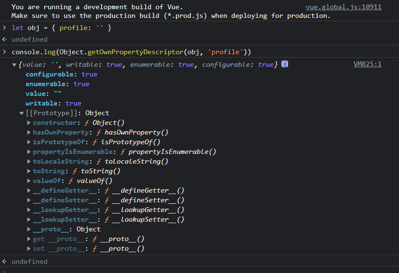
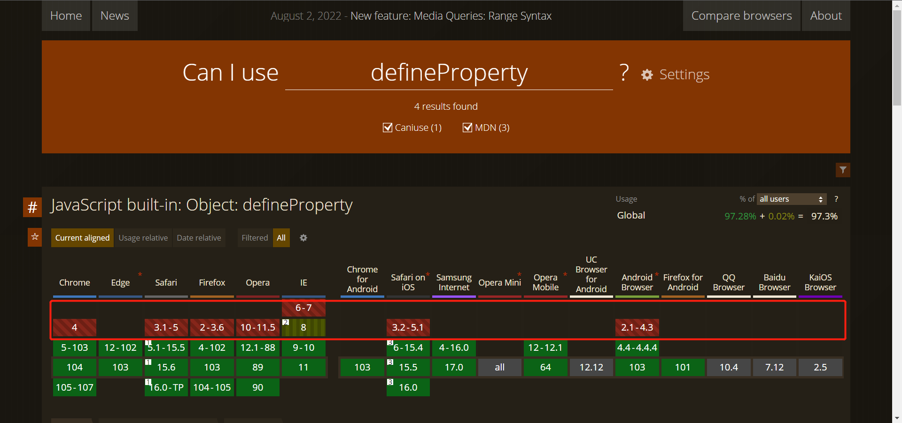

# 随心记录

## page 24 => 数据响应式原理
> 在Vue中，最重要的概念就是响应式数据集；一方面指衍生数据和元数据之间的响应，通过数`数据链`来实现，另一方面指视图与数据之间的绑定。

### 数据链
> 数据链在学术上被定义为连通数据的链路。这条链路上有一个到多个数据起点（即`元数据`），并通过改点不断衍生拓展新的节点（衍生数据），形成一个庞大的网状结构。当你修改数据起点时，所有存在于网上的节点值都将同步更新。

**单一起点数据链**
| 元数据 | 网状节点 | 网状节点 |
|  ---- | ----    |  ----  |
|       | b=a*3-2 |  e=b+2 |
| a=3   | c=a%3+1 |  f=b+c |
|       | d=a%3   |  g=c-d |

**多起点数据链**
| 元数据 | 网状节点 | 网状节点 |
|  ---- | ----    |  ----  |
|       | c=a*2+2 |   |
| a=3   | d=a+b*2 |  f=c+d |
| b=4   | e=b/2   |  g=d-e |

## 函数式编程
元数据a与b通过变量声明即可获取：
```js
let a = 3, b = 4;
```
那么衍生数据怎么实现才能保证其值只依赖于元数据而不允许被外界修改呢？

这里就引出了函数式编程的概念：
一种结构化编程，力求将运算过程写成一系列嵌套的函数调用。（个人理解类似纯函数）

认定函数是“第一等公民”，可以赋值给其他变量，用作另一个函数的参数或者作为函数返回值来用。

函数体只包含运算过程，而且必带返回值。
```js
const double = function (num) {
  return num * 2;
}
```
### 核心
根据元数据生成新的衍生数据，提供唯一确定的输入，函数将返回唯一确定的输出，它并不会修改原有变量的值。这在运用javascript闭包概念进行开始时尤为重要，在函数作用域内调用域外或全局变量时不并不会修改它们的值，安全无污染（无副作用）。
```js
const x = (x = (x => x * 9)(x) + 3) (5)
const y = y => (y => y * 9) + 3
console.log(x); // 48
console.log(y(5)); // 48
```

Vue中的数据链：computed
```html
<html lang="en">
<head>
    <meta charset="UTF-8">
    <meta http-equiv="X-UA-Compatible" content="IE=edge">
    <meta name="viewport" content="width=device-width, initial-scale=1.0">
    <title>hi~vue</title>
    <script src="https://cdn.bootcdn.net/ajax/libs/vue/3.2.37/vue.global.js"></script>
</head>
<style>
  p {
    width: 300px;
  }
  .data-label {
    width: 100px;
    margin-right: 30px;
  }
</style>
<body>
    <div id="app">
      <p><strong class="data-label">A</strong><input type="text" v-model="a"/></p>
      <p><strong class="data-label">B</strong><input type="text" v-model="b"/></p>
      <p><strong class="data-label">C=A*2+2</strong>{{c}}</p>
      <p><strong class="data-label">D=A+B*2</strong>{{d}}</p>
      <p><strong class="data-label">E=B/2</strong>{{e}}</p>
      <p><strong class="data-label">F=C+D</strong>{{f}}</p>
      <p><strong class="data-label">G=D-E</strong>{{g}}</p>
    </div>
</body>
<script type="text/javascript">
  const app = {
    data() {
      return {
        a: 3,
        b: 4
      }
    },
    computed: {
      c() {
        return this.a * 2 + 2
      },
      d() {
        return Number(this.a) + this.b * 2
      },
      e() {
        return this.b / 2
      },
      f() {
        return Number(this.c) + Number(this.d)
      },
      g() {
        return this.d - this.e 
      }
    },
    // 以函数的形式创建数据链以实现数据之间的响应
    methods: {
      getC (suf) {
        return this. a  * 2 + (suf || 2)
      }
    }
  }
  Vue.createApp(app).mount('#app');
</script>
</html>

```

## 数据绑定视图原理
下面是一个含有字符串类型属性的`profile`的对象:
```js
let obj = {
  profile: ''
}
```
作为对象属性profile仅仅是一个字符串吗？
看下图：


我们可以使用Object API的 `defineProperty` 方法对其进行配置。对象属性配置项（描述符）如下表
| 名称 | 默认值 | 说明 | 
| --- | --- | --- |
| configurable | false | 标示属性配置是否可更改和该属性能否从对象中删除 |
| enumerable | false | 标示属性是否可被枚举 |
| writable | false | 标示属性是否可通过赋值运算符修改，不与set共存 |
| value | undefined | 属性值，可为任意Javascript数据类型，不与set共存 |
| **set** | undefined | 函数类型，属性被赋值时调用 |
| get | undefined | 函数类型，返回值将作为属性值 |

对象属性被赋值调用的set有何妙用？看代码
```html
<html lang="en">
<head>
    <meta charset="UTF-8">
    <meta http-equiv="X-UA-Compatible" content="IE=edge">
    <meta name="viewport" content="width=device-width, initial-scale=1.0">
    <title>hi~vue</title>
    <!-- <script src="https://cdn.bootcdn.net/ajax/libs/vue/3.2.37/vue.global.js"></script> -->
</head>
<body>
  <span id="harry" style="line-height: 32px;">&nbsp;</span><br>
  <input id="trigger" type="text" />
</body>
<script type="text/javascript">
  let harry = document.getElementById('harry');
  let trigger = document.getElementById('trigger');
  let key = 'profile'; // 对象属性键名
  let store = {} // 辅助get取值
  let obj = {  // 对象
    profile: ''
  }

  Object.defineProperty(obj, key, {
    set(value) {
      harry.innerText = value // 重点在此：修改DOM节点视图
      store[key] = value
    },
    get() {
      return  store[key]
    }
  })
  trigger.addEventListener('keyup', function() {
    obj[key] = this.value;
    console.log(obj[key]);
    // this指向trigger的DOM实例
    console.log(this);
  })

  // TODO Q:上面的代码与下面这段代码有什么区别呢？
  // trigger.addEventListener('keyup', function() {
  //   harry.innerText = this.value;
  // })
</script>
</html>

```
在上面的代码中，在对象属性的**setter**函数中修改文本节点的值，所以当obj.profile被重新赋值时，节点视图也会同步更新；然后对输入框添加事件监听，当用户事件触发时，输入值将被赋予obj.profile。
至此，我们实现了数据与视图之间的“双向绑定”。

在Vue2中，当我们把普通的js对象赋值给Vue实例的data选项时，Vue将遍历对象属性，并使用Object.defineProperty将其全部转换为getter/setter，并在组件渲染时将属性记录为依赖。之后当依赖项的setter函数被调用时，Vue会通知watcher重新计算并更新其关联的所有组件。
> 因为兼容性问题，Object.defineProperty是ES5中一个无法shim（自定义拓展）的特性，所以IE8以下无法使用Vue


在Vue3中，用Proxy（ES6）替代了它，它支持开发者为一个对象定义一个Proxy对象，并定义其代理方法，而不破坏或改变对象的特性。语法如下：
```js
// target 需要被代理的对象
// handler 开发者自定义的代理方法
let p = new Proxy(target, handler);
```

代理一个空的对象的getter和setter，仅在其属性setter和getter被调用时输出一行日志，如下：
```js
let proxied = {};
let p = new Proxy(proxied, {
  get(target, property) {
    console.log(`${property} getter is called`);
    return property in target ? target[property] : 3;
  },
  set(target, property, value) {
    console.log(`${property} setter is called`);
    target[property] = value;
  }
});
p.name = 'test';
console.log(p.name);

// name setter is called
// name getter is called
// test
```

Vue3全面（IE11除外）使用Proxy取代了Object.defineProperty，性能Proxy更强。

无论是变量、表达式、执行函数 ，还是DOM代码，Vue都只将结果当文本处理。

## 事件绑定
```js
// Cannot read properties of undefined (reading 'log')
<button v-on:click="console.log('A Vue App')">输出消息</button>
// Cannot read properties of undefined (reading 'console')
<button v-on:click=" () => console.log('A Vue App')">输出消息</button>

```

V2中，这一行代码可以正常输出，V3不行，因为V3中这段代码在当前Vue视图对象作用域中运行，实际运行的是`this.console.log('A Vue App')`, 当前的Vue对象是没有这个console属性的。

### 获得事件对象
```html
<html lang="en">
<head>
    <meta charset="UTF-8">
    <meta http-equiv="X-UA-Compatible" content="IE=edge">
    <meta name="viewport" content="width=device-width, initial-scale=1.0">
    <title>hi~vue</title>
    <script src="https://cdn.bootcdn.net/ajax/libs/vue/3.2.37/vue.global.js"></script>
</head>
<body>
  <div id="app">
    <!-- 1.在事件函数不必传参时，可以这样写，注意：不能带() -->
    <input type="text" @keyup="handleKeyUp" />
    <br>
    <!-- 2.手动传入$event对象 -->
    <input type="text" @keyup="handleKeyUp($event)" />
  </div>
</body>
<script type="text/javascript">
  const app = {
    methods: {
      handleKeyUp (event) {
        console.log(event.key, event);
      }
    }
  }
  Vue.createApp(app).mount('#app');
</script>
</html>

```

运行上例代码：发现都输出了事件对象。

onclick和@click的区别：
- 事件绑定解决了不同浏览器之间的兼容问题；
- 事件绑定提供了语法糖——事件绑定修饰符。

### 常见事件修饰符
js原生：
```js
event.preventDefault(); // 阻止节点数默认行为
event.stopPropagation(); // 阻止事件冒泡
```
[Vue](https://cn.vuejs.org/guide/essentials/event-handling.html#event-modifiers)封装后：
| 名称 | 可用版本 | 可用事件 | 说明 |
| ---- | ---- | ----| ----|
| .stop | 所有 | 任意 | 当事件触发时，阻止事件冒泡 |
| .prevent | 所有 | 任意 | 当事件触发时，阻止元素默认行为 |
| .capture | 所有 | 任意 | 当事件触发时，阻止事件捕获 |
| .self | 所有 | 任意 | 限制事件仅作用于节点自身 |
| .once | 2.1.4+ | 任意 | 事件被触发一次后即解除监听 |
| .passive | 2.3.0+ | 滚动 | 移动端，限制事件永不调用preventDefault()方法 |

上代码：
```html
<html lang="en">
<head>
    <meta charset="UTF-8">
    <meta http-equiv="X-UA-Compatible" content="IE=edge">
    <meta name="viewport" content="width=device-width, initial-scale=1.0">
    <title>hi~vue</title>
    <script src="https://cdn.bootcdn.net/ajax/libs/vue/3.2.37/vue.global.js"></script>
</head>
<body>
  <div id="app">
    <form @submit="handleSubmit">
      <h2>不使用修饰符时</h2>
      <button type="submit">提交</button>
    </form>
    <form @submit.prevent="handleSubmit">
      <h2>使用.prevent修饰符时</h2>
      <button type="submit">提交(.prevent)</button>
    </form>
  </div>
</body>
<script type="text/javascript">
  const app = {
    data() {
      return {
        counter: 0
      }
    },
    methods: {
      handleSubmit () {
        console.log(`submit ${++this.counter} timers`);
      }
    }
  }
  Vue.createApp(app).mount('#app');
</script>
</html>
```

点击<button>提交</button>可以看到页面不断刷新重载, 点击<button>提交(.prevent)</button>，可以看到控制台不停的输出累加值。

#### 多修饰符
当事件名称后有多个修饰符时，要注意修饰符的排列顺序，相应的代码会根据排列顺序依次产生。
`@click.prevent.self`：Vue先执行了event.preventDefault(), 因此会阻止元素上的所有单击事件；
`@click.self.prevent`: Vue先会配置event.self，只会阻止对元素自身的点击。

### 按键修饰符
V2允许将按键值作用修饰符来使用，如监听回车键（键盘13）是否被按下？
```html
  <input type="text" @keyup.13="console.log($event)" />
```
[V3](https://cn.vuejs.org/guide/essentials/event-handling.html#key-modifiers)，已被遗弃，只提供常用别名按键修饰符
| 别名修饰符 | 对应按键 | 
| ---- | ---- |
| .delete | 回格/删除 |
| .tab | 制表 | 
| .enter | 回车 |
| .esc | 退出 |
| .space | 空格 | 
| .left | 左 |
| .up | 上 |
| .right | 右 |
| .down | 下 |
V3版：
```html
  <input type="text" @keyup.enter="() => console.log($event)" />
```

### 鼠标按键事件
| 别名修饰符|  可用版本 | 对应按键 | 
| ----   | ---- | ---- |
| .left     | 2.2.0+ | 左键 |
| .right    |  2.2.0+ | 右键 |
| .middle   |  2.2.0+ | 中键 |

### 组合修饰符
| 别名修饰符|  可用版本 | 对应按键 | 
| ----   | ---- | ---- |
| .ctrl     | 2.1.0+ | Ctrl |
| .alt    |  2.1.0+ | Alt |
| .shift   |  2.1.0+ | Shift |
| .meta   |  2.1.0+ | meat键(win===田) |

Demo: 
```html
<html lang="en">
<head>
    <meta charset="UTF-8">
    <meta http-equiv="X-UA-Compatible" content="IE=edge">
    <meta name="viewport" content="width=device-width, initial-scale=1.0">
    <title>hi~vue</title>
    <script src="https://cdn.bootcdn.net/ajax/libs/vue/3.2.37/vue.global.js"></script>
</head>
<body>
  <div id="app">
    <h1 @click.ctrl="logWithCtrl" @click="logSingle">没有Ctrl别来点我</h1>
  </div>
</body>
<script type="text/javascript">
  const app = {
    methods: {
      logWithCtrl (event) {
        console.log(`---------分割线---------`);
        console.log(`$event.ctrlKey:`, event.ctrlKey);
        console.log('按住，是的；按住Ctrl');
      },
      logSingle() {
        if(!event.ctrlKey) {
          console.log(`---------分割线---------`);
          console.log(`$event.ctrlKey:`, event.ctrlKey);
          console.log('点我干啥，单身汪！');
        } else {
          console.log('不错，进步很快呀！');
        }
      }
    }
  }
  Vue.createApp(app).mount('#app');
</script>
</html>
```

### 双向绑定❗
v-model：输入元素（input & textarea）创建双向数据绑定。
```html
<html lang="en">
<head>
    <meta charset="UTF-8">
    <meta http-equiv="X-UA-Compatible" content="IE=edge">
    <meta name="viewport" content="width=device-width, initial-scale=1.0">
    <title>hi~vue</title>
    <script src="https://cdn.bootcdn.net/ajax/libs/vue/3.2.37/vue.global.js"></script>
</head>
<body>
  <div id="app">
   <h3>单行文本框</h3>
   <input type="text" v-model="singleText" style="width: 240px"/>
   <p>{{singleText}}</p>
   <hr>

   <h3>多行文本框</h3>
   <textarea v-model="multiText" style="width: 240px"></textarea>
   <p>{{multiText}}</p>
   <hr>

   <h3>单选框</h3>
   <!-- 由于点击被选中的单选项无法取消其被选中的状态，所以实战中一般没有使用单个单选项的场景。
    这里，设置v-model共用一个变量(radioValue)可实现RadioGroup的效果
   -->
   <input id="ra" type="radio" value="杨玉环" v-model="radioValue" />
   <label for="ra">A.杨玉环</label>
   <input id="ra" type="radio" value="赵飞燕" v-model="radioValue" />
   <label for="rb">B.赵飞燕</label>
   <p>{{radioValue}}</p>
   <hr>

   <h3>单个复选框</h3>
   <!-- 单个复选框被用于true和false的切换 -->
   <input id="c" type="checkbox" v-model="toggleValue" />
   <label for="c">天生丽质</label>
   <p>{{toggleValue}}</p>
   <hr>

   <h3>多个复选框</h3>
   <!-- 多个复选框，v-model接受数组类型变量 -->
   <input id="ca" type="checkbox" value="漂亮" v-model="checkedValues" />
   <label for="ca">A.回眸一笑百媚生</label>
   <input id="cb" type="checkbox" value="瘦弱" v-model="checkedValues" />
   <label for="cb">B.体轻能为掌上舞</label>
   <input id="cc" type="checkbox" value="得宠" v-model="checkedValues" />
   <label for="cc">C.三千宠爱在一身</label>
   <p>{{ checkedValues.join(',') }}</p>
  </div>
</body>
<script type="text/javascript">
  const app = {
    data() {
      return {
        singleText: '',
        multiText: '',
        radioValue: '',
        toggleValue: false,
        checkedValues: []
      }
    }
  }
  Vue.createApp(app).mount('#app');
</script>
</html>
```

#### 下拉选择框
```html
<html lang="en">
<head>
    <meta charset="UTF-8">
    <meta http-equiv="X-UA-Compatible" content="IE=edge">
    <meta name="viewport" content="width=device-width, initial-scale=1.0">
    <title>hi~vue</title>
    <script src="https://cdn.bootcdn.net/ajax/libs/vue/3.2.37/vue.global.js"></script>
</head>
<body>
  <div id="app">
   <h3>下拉选择框</h3>
   <select v-model="singleSelect">
    <!-- 如果没有设置value,则option节点的文本值会被当做value值 -->
    <option value="汉代">汉代</option>
    <option>唐代</option>
   </select>
   <p>{{singleSelect}}</p>
   <hr>

   <h3>多选下拉选择框</h3>
   <select multiple v-model="multiSelect">
    <!-- 按住Ctrl键,可执行多选 -->
    <option value="1">出生微寒</option>
    <option value="2">饱受争议</option>
    <!-- TODO why? -->
    <option :value="3">结局悲凉</option>
   </select>
   <p>{{multiSelect.join(',')}}</p>
   <hr>
  </div>
</body>
<script type="text/javascript">
  const app = {
    data() {
      return {
        singleSelect: '唐代', // 根据value设置默认
        multiSelect: [1, 3]
      }
    }
  }
  Vue.createApp(app).mount('#app');
</script>
</html>
```