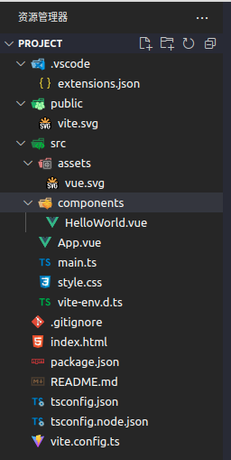
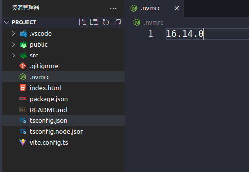
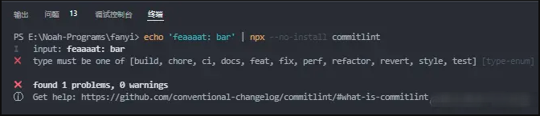

# 江西微校通

## 工程化搭建
`package.json`
```json
{
  "name": "admin",
  "private": true,
  "version": "0.0.0",
  "scripts": {
    "postinstall": "husky install",
    "start": "vite --host 0.0.0.0",
    "build": "vite build",
    "build:staging": "vite build --mode staging",
    "preview": "vite preview"
  },
  "dependencies": {
    "@element-plus/icons-vue": "^1.1.4",
    "@sentry/tracing": "^6.19.7",
    "@sentry/vue": "^6.19.7",
    "@vueuse/core": "^8.2.6",
    "ali-oss": "^6.17.1",
    "axios": "^0.26.1",
    "dayjs": "^1.11.1",
    "element-plus": "^2.2.5",
    "html2canvas": "^1.4.1",
    "jsoneditor": "^9.7.4",
    "marked": "^4.0.14",
    "md5": "^2.3.0",
    "normalize.css": "^8.0.1",// Normalize.css是一种CSS reset的替代方案。https://jerryzou.com/posts/aboutNormalizeCss/
    "nprogress": "^0.2.0",// NProgress是页面跳转是出现在浏览器顶部的进度条 https://ricostacruz.com/nprogress/ https://www.jianshu.com/p/346c05d4d9d8
    "path-browserify": "^1.0.1",// 整合 vite 后，path模块会报错，原因是 vite 源码中设定了不允许在客户端代码中访问内置模块代码，使用 path-browserify 代替 path 模块 https://juejin.cn/post/7130090422651191333
    "path-to-regexp": "^6.2.0", // 该方法的作用是把字符串转为正则表达式。一个对URL进行解析的模块，支持正则表达式验证、匹配、反向解析，可用于增加 koa 框架对于 koa-router 对 path 的解析工作。
    "pinia": "^2.0.13",
    "qrcode-vue3": "1.4.15",
    "socket.io-client": "^4.5.0",
    "sortablejs": "^1.15.0",
    "vue": "^3.2.25",
    "vue-qr": "^4.0.6",
    "vue-router": "^4.0.14",
    "xlsx": "^0.18.5"
  },
  "devDependencies": {
    "@types/ali-oss": "^6.16.3",
    "@types/jsoneditor": "^9.5.1",
    "@types/marked": "^4.0.3",
    "@types/md5": "^2.3.2",
    "@types/nprogress": "^0.2.0",
    "@types/path-browserify": "^1.0.0",
    "@types/path-to-regexp": "^1.7.0",
    "@types/sortablejs": "^1.10.7",
    "@typescript-eslint/eslint-plugin": "^5.19.0",
    "@typescript-eslint/parser": "^5.19.0",
    "@vitejs/plugin-vue": "^2.3.1", // 框架自带
    "cross-env": "^7.0.3", // 就是针对相同的语句和命令，我们希望这条语句能够同时在 Windows 和 Linux 上使用。 https://juejin.cn/post/7006650325931130916
    "eslint": "^8.13.0",
    "eslint-config-airbnb-base": "^15.0.0",
    "eslint-config-airbnb-typescript": "^17.0.0",
    "eslint-config-prettier": "^8.5.0",
    "eslint-import-resolver-typescript": "^2.7.1",
    "eslint-plugin-import": "^2.26.0",
    "eslint-plugin-prettier": "^4.0.0",
    "eslint-plugin-vue": "^8.6.0",
    "husky": "^7.0.4",
    "lint-staged": "^12.3.8",
    "prettier": "^2.6.2",
    "rollup-plugin-external-globals": "^0.6.1",
    "sass": "^1.50.0",
    "typescript": "^4.5.4",
    "vite": "^2.9.2",
    "vite-plugin-pwa": "^0.11.13",
    "vite-plugin-svg-icons": "^2.0.1", // 当你使用该插件的时候，指定好存放svg的文件夹。再按照指定的方式去访问svg图片。就可以再不产生http请求的情况下渲染出svg图片。// https://www.kuxiaoxin.com/archives/66
    "vue-tsc": "^0.29.8",
    "workbox-window": "^6.5.3"
  }
}
```
### 分析
技术栈
- 编程语言： typescript
- 构建工具：vite
- 语言框架：vue3
- 路由管理：vue-router
- 状态管理：pinia
- UI框架：element-plus
- CSS预编译：scss
- 代码规范：prettier&eslint
- 提交规范：husky&lint-staged
<!-- - 桌面应用：electron -->

### 从头开始

#### Vite
node 14.18+ or 16+
```bash
npm create vite@latest
yarn create vite
pnpm create vite

# 结果
✔ Project name: … project
✔ Select a framework: › vue
✔ Select a variant: › vue-ts

Scaffolding project in /home/liming/code/temp/project...

Done. Now run:

  cd project
  pnpm install
  pnpm run dev

--------------------------------------------------------------------------------
~/code/temp »
```

打开文件夹会发现



此时的`package.json`文件如下:
```json
{
  "name": "project",
  "private": true,
  "version": "0.0.0",
  "type": "module",
  "scripts": {
    "dev": "vite",
    "build": "vue-tsc --noEmit && vite build",
    "preview": "vite preview"
  },
  "dependencies": {
    "vue": "^3.2.37"
  },
  "devDependencies": {
    "@vitejs/plugin-vue": "^3.0.3",
    "typescript": "^4.6.4",
    "vite": "^3.0.7",
    "vue-tsc": "^0.39.5"
  }
}
```

再根目录增加一个`.nvmrc`文件来控制node版本
```
16.14.0
```


`.npmrc`
```
home="https://npmmirror.com"
registry="https://registry.npmmirror.com/"

sass_binary_site="https://npmmirror.com/mirrors/node-sass/"
canvas_binary_host_mirror="https://npmmirror.com/mirrors/node-canvas-prebuilt/"
phantomjs_cdnurl="https://npmmirror.com/dist/phantomjs/"
electron_mirror="https://npmmirror.com/mirrors/electron/"
sqlite3_binary_host_mirror="http://npmmirror.com/mirrors/"
profiler_binary_host_mirror="https://npmmirror.com/mirrors/node-inspector/"
chromedriver_cdnurl="http://npmmirror.com/mirrors/chromedriver/"
operadriver_cdnurl="http://npmmirror.com/mirrors/operadriver/"
electron_builder_binaries_mirror="http://npmmirror.com/mirrors/electron-builder-binaries/"
```

环境变量与模式
[官网](https://vitejs.cn/guide/env-and-mode.html)
根目录还需要增加Vite
`.env.development`
```
NODE_ENV = 'development'
VITE_BASE_API = 'http://xxx.xxx.xxx/xxx'
```
`.env.production`
```
NODE_ENV = 'production'
VITE_BASE_API = 'http://xxx.xxx.xxx/xxx'
```
`.env.staging`
```
NODE_ENV = 'staging'
VITE_BASE_API = 'http://xxx.xxx.xxx/xxx'
```

配置vite
> 配置前需要引入**path-browserify**包，因为整合 vite 后，path模块会报错，原因是 vite 源码中设定了不允许在客户端代码中访问内置模块代码，所以使用 path-browserify 代替 path 模块
```bash
pnpm i --save(-S) path-browserify
pnpm i --save-dev(-D) @types/path-browserify
```

`vite.config.ts`文件
```ts
import { defineConfig } from 'vite'
import vue from '@vitejs/plugin-vue'
// 找不到模块“path”或其相应的类型声明: pnpm i @types/node
// 请在tsconfig.json下compilerOptions增加"paths": {"@/*": ["src/*"]},  "baseUrl": ".",
import { resolve } from 'path' 

// https://vitejs.dev/config/
export default defineConfig({
  // https://cn.vitejs.dev/config/shared-options.html#resolve-alias
  // 当使用文件系统路径的别名时，请始终使用绝对路径。相对路径的别名值会原封不动地被使用，因此无法被正常解析。
  resolve: {
    alias: {
      '@/': `${resolve(__dirname, 'src')}/`
    }
  },
  plugins: [vue()]
})
```
`tsconfig.json`文件
```json
{
  "compilerOptions": {
    "target": "ESNext",
    "useDefineForClassFields": true,
    "module": "ESNext",
    "moduleResolution": "Node",
    "strict": true,
    "jsx": "preserve",
    "sourceMap": true,
    "resolveJsonModule": true,
    "isolatedModules": true,
    "esModuleInterop": true,
    "lib": ["ESNext", "DOM"],
    "skipLibCheck": true,
    // 新增
    "baseUrl": ".",
    "paths": {
      "@/*": ["src/*"]
    }
  },
  "include": ["src/**/*.ts", "src/**/*.d.ts", "src/**/*.tsx", "src/**/*.vue"],
  "references": [{ "path": "./tsconfig.node.json" }]
}
```

css-reset
```bash
pnpm i --save normalize.css
```

再安装补充几个常用的Vue生态库
```bash
pnpm i --save @vueuse/core vue-router pinia 
```

pinia
在`src`目录下新建`store`文件夹，并新建文件`user.ts`
```ts
import { useLocalStorage } from "@vueuse/core";
import { defineStore } from "pinia";

const useUserStore = defineStore('user', {
  state: () => ({
    token: useLocalStorage<string | null>('token', null)
  }),
  actions: {
    logout() {
      this.token = null;
    }
  }
})

export default useUserStore;
```

在`src`目录下新建`views/dashboard/`文件夹，并新建文件`index.vue`
```vue
<template>
  <div>
    dashboard
  </div>
</template>
<script lang='ts' setup>
import { defineComponent, ref, reactive } from 'vue';
</script>
<script lang='ts'>
defineComponent({
  // 这里的name和路由的有什么区别？
  name: 'DashboardView', 
});
</script>
<style lang='scss' scoped>
</style>
```
在`src`目录下新建`views/login/`文件夹，并新建文件`index.vue`
```vue
<template>
  <div class="login-container">
    login
  </div>
</template>
<script lang='ts' setup>
import { defineComponent, ref, reactive } from 'vue';
</script>
<script lang='ts'>
defineComponent({
  name: 'LoginView', 
});
</script>
<style lang='scss' scoped>
.login-container {
  color: $blue;
  font-size: 20px;
}
</style>
```
在`src`目录下新建`views/notFound/`文件夹，并新建文件`index.vue`
```vue
<template>
  <div>
    404
  </div>
</template>
<script lang='ts' setup>
import { defineComponent, ref, reactive } from 'vue';
</script>
<script lang='ts'>
defineComponent({
  name: 'NotFoundView', 
});
</script>
<style lang='scss' scoped>
</style>
```

在`src`目录下新建`views/log/`文件夹，并新建文件`index.vue`
```vue
<template>
  <div>
    SystemLogView
  </div>
</template>
<script lang='ts' setup>
import { defineComponent, ref, reactive } from 'vue';
</script>
<script lang='ts'>
defineComponent({
  name: 'SystemLogView', 
});
</script>
<style lang='scss' scoped>
</style>
```

router
在`src`目录下新建`router/route`文件夹，并新建文件`router/index.ts`和`routes/log.ts`
log.ts
```ts
import { RouteRecordRaw } from "vue-router";
const LogRoutes: Array<RouteRecordRaw> = [
  {
    path: '/log',
    name: 'Log',
    redirect: '/log/system',
    meta: { title: '日志管理', icon: 'vue' },
    // 嵌套路由的父路由样式(未定义)
    // component: Layout,
    children: [
      {
        path: '/log/system',
        name: 'SystemLogView',
        meta: { title: '系统日志', cache: true },
        component: () => import('@/views/log/index.vue')
      }
    ]
  }
]
export default LogRoutes;
```

index.ts
```ts
import { createRouter, createWebHashHistory, RouteRecordRaw } from "vue-router"
import logRoutes from './routes/log'

export const routes: Array<RouteRecordRaw> = [
  {
    path: '/',
    name: 'App',
    redirect: '/dashboard',
    children: [
      {
        path: '/dashboard',
        meta: { title: '首页', icon: "vue", affix: true, cache: true },
        name: 'DashboardView',
        component: () => import('@/views/dashboard/index.vue')
      }
    ]
  },
  ...logRoutes,
  {
    path: '/login',
    name: 'LoginView',
    meta: { title: '用户登录', icon: "vue", hidden: true },
    component: () => import('@/views/login/index.vue')
  },
  {
    // TODO 这是一种什么匹配模式
    path: '/:pathMatch(.*)*',
    name: 'NotFount',
    redirect: '/404'
  }
]

const router = createRouter({
  // 选择hash模式路由
  history: createWebHashHistory(),
  routes,
})

export default router;
```
当然还需要一个路由守卫`guard.ts`
```ts
import { NavigationGuardNext, RouteLocationNormalized } from 'vue-router';
import useUserStore from '@/store/user';
import router from './index';

// 白名单路由
const whiteList = ['/login']

router.beforeEach((to: RouteLocationNormalized, from: RouteLocationNormalized, next: NavigationGuardNext) => {
  const userStore = useUserStore()
  // 满足条件
  if(whiteList.includes(to.path)) return next();
  // 不满足条件
  if(!userStore.token) return next(`/login?redirect=${to.path}`);
  return next();
})
```

网络请求相关：

```bash
pnpm i --save axios
```
在`src`目录下新建`utils`文件夹，并新建文件`request.ts`
```ts
import router from '@/router';
import useUserStore from '@/store/user';
import axios, { AxiosError, AxiosInstance, AxiosRequestConfig, AxiosResponse } from 'axios';

class VAxios {
  private axiosInstance: AxiosInstance;

  private static VAxiosInstance: VAxios;

  private constructor(config: AxiosRequestConfig) {
    this.axiosInstance = axios.create(config);
    this.setRequestInterceptors();
    this.setResponseInterceptors();
  }

  /** 创建 axios 实例 */
  public static getInstance() {
    if (!this.VAxiosInstance) {
      this.VAxiosInstance = new this({
        baseURL: import.meta.env.VITE_BASE_API as string,
        timeout: 120000,
        headers: {
          'Content-Type': 'application/json; charset=utf-8',
          Accept: '*/*',
        },
      });
    }

    return this.VAxiosInstance;
  }

  /** 设置请求拦截器 */
  private setRequestInterceptors() {
    // 配置 && 错误处理
    this.axiosInstance.interceptors.request.use(
      (config: AxiosRequestConfig) => {
        config.headers!.Authorization = useUserStore().token as string;

        return config;
      },
      error => Promise.reject(error)
    );
  }

  /** 设置响应拦截器 */
  private setResponseInterceptors() {
    // 配置 && 错误处理
    this.axiosInstance.interceptors.response.use(
      (response: AxiosResponse) => response.data,

      (error: AxiosError | Error) => {
        if (!axios.isAxiosError(error)) return Promise.reject(error.message);
        if (!error.response) return Promise.reject(error.message);

        switch (error.response.status) {
          case 401:
            useUserStore().logout();
            return Promise.reject(new Error('请登陆后操作'));
          case 403:
            router.replace('/403');
            return Promise.reject(new Error('权限不足'));
          case 404:
            return Promise.reject(new Error('请求地址不存在'));
          case 500:
            return Promise.reject(new Error('服务器内部错误'));
          case 502:
            return Promise.reject(new Error('服务器网络错误'));
          default:
            return Promise.reject(
              typeof error.response.data === 'string' || error.response.data instanceof String
                ? error.response.data
                : error.response.data?.message ?? error.response.data?.error
            );
        }
      }
    );
  }

  /** 请求 */
  async request<T = any>(config: AxiosRequestConfig): Promise<T> {
    return this.axiosInstance.request(config);
  }

  /**
   * post
   * @param url 请求地址
   * @param data body参数
   * @param config axios 配置
   */
  async post<T = any>(url: string, data?: any, config?: AxiosRequestConfig): Promise<T> {
    return this.axiosInstance.post(url, data, config);
  }

  /**
   * delete
   * @param url 请求地址
   * @param config axios 配置
   */
  async delete<T = any>(url: string, config?: AxiosRequestConfig): Promise<T> {
    return this.axiosInstance.delete(url, config);
  }

  /**
   * put
   * @param url 请求地址
   * @param data body参数
   * @param config axios 配置
   */
  async put<T = any>(url: string, data?: any, config?: AxiosRequestConfig): Promise<T> {
    return this.axiosInstance.put(url, data, config);
  }

  /**
   * patch
   * @param url 请求地址
   * @param data body参数
   * @param config axios 配置
   */
  async patch<T = any>(url: string, data?: any, config?: AxiosRequestConfig): Promise<T> {
    return this.axiosInstance.patch(url, data, config);
  }

  /**
   * get
   * @param url 请求地址
   * @param config axios 配置
   */
  async get<T = any>(url: string, config?: AxiosRequestConfig): Promise<T> {
    return this.axiosInstance.get(url, config);
  }
}

export default VAxios.getInstance();
```

UI框架：
[官网](https://element-plus.org/zh-CN/guide/i18n.html)
```bash
pnpm i --save element-plus @element-plus/icons-vue
```

MD5加密:
```bash
pnpm i --save md5
pnpm i --save-dev @types/md5
```

CSS预处理器(vite内置支持）：
[官网](https://vitejs.cn/guide/features.html#css-pre-processors)
```bash
pnpm i --save-dev sass
```
在`src`目录下新建`styles`文件夹，并新建文件`index.scss`
```scss
$blue: #abcdef;
$menuText: #bfc;
// TODO
:export {
  menuText: $menuText
}
```

使用插件让访问svg不用产生http请求
[github](https://github.com/vbenjs/vite-plugin-svg-icons/blob/main/README.zh_CN.md)
```bash 
pnpm i --save-dev vite-plugin-svg-icons
```
修改`vite.config.ts`中的插件plugins配置
```ts
import { defineConfig } from 'vite'
import vue from '@vitejs/plugin-vue'
// 找不到模块“path”或其相应的类型声明: pnpm i @types/node
// 请在tsconfig.json下compilerOptions增加"paths": {"@/*": ["src/*"]},  "baseUrl": ".",
import { resolve } from 'path' 

import { createSvgIconsPlugin } from 'vite-plugin-svg-icons'

// https://vitejs.dev/config/
export default defineConfig({
  // https://cn.vitejs.dev/config/shared-options.html#resolve-alias
  // 当使用文件系统路径的别名时，请始终使用绝对路径。相对路径的别名值会原封不动地被使用，因此无法被正常解析。
  resolve: {
    alias: {
      '@/': `${resolve(__dirname, 'src')}/`
    }
  },
  plugins: [
    vue(),
    createSvgIconsPlugin({
      // 指定要缓存的图标文件夹
      iconDirs: [resolve(process.cwd(), 'src/assets/svg')],
      // 执行 icon name 的格式
      symbolId: 'icon-[dir]-[name]',
    })
  ]
})
```

在`src/component/`下新建文件`SvgIcon.vue`
```vue
<template>
  <svg :class="svgClass" :style="style">
    <use :xlink:href="iconName" />
  </svg>
</template>

<script lang="ts" setup>
import { computed, toRefs } from 'vue';

const props = defineProps<{
  name?: string;
  style?: { [key: string]: string };
}>();

const { style } = toRefs(props);
const iconName = computed(() => `#icon-${props.name}`);
const svgClass = computed(() => (props.name ? `svg-icon icon-${props.name}` : 'svg-icon'));
</script>

<style lang="scss" scoped>
.svg-icon {
  fill: currentColor;
  vertical-align: middle;
  width: 1em;
  height: 1em;
}
</style>
```

将各个模块添加至`main.ts`中
src/App.vue
```vue
<template>
  <!-- 父级路由 -->
  <router-view></router-view>
</template>

<script setup lang="ts"></script>

<style scoped></style>
```

main.ts
```ts
import { createApp } from 'vue'
// import './style.css'
import router from '@/router'
import SvgIcon from '@/components/SvgIcon.vue'
import ElementPlus  from 'element-plus'
// TODO 可以不这样引入吗？
import 'element-plus/dist/index.css'
import 'normalize.css'
// 这是虚拟模块的引入方式，用于给脚手架插件在打包和开发时做相应的处理。Vite 和 Rollup 中都约定以 virtual: 作为虚拟模块的前缀：
import 'virtual:svg-icons-register' 
import { createPinia } from 'pinia'
// 国际化 
import ElementPlusLocaleZhCN from 'element-plus/es/locale/lang/zh-cn'
import App from './App.vue'
import '@/router/guard'

const app = createApp(App)
// 注意引用顺序
app.use(createPinia())
app.use(router)
app.use(ElementPlus, { locale: ElementPlusLocaleZhCN })
// 全局组件
app.component('SvgIcon', SvgIcon)

app.mount('#app')
```
哎？SCSS样式怎么没引入呢？
`vite.config.ts`
```ts
// https://vitejs.dev/config/
export default defineConfig({
  // https://cn.vitejs.dev/config/shared-options.html#resolve-alias
  // 当使用文件系统路径的别名时，请始终使用绝对路径。相对路径的别名值会原封不动地被使用，因此无法被正常解析。
  resolve: {
    alias: {
      '@/': `${resolve(__dirname, 'src')}/`
    }
  },
  plugins: [
    vue(),
    createSvgIconsPlugin({
      // 指定要缓存的图标文件夹
      iconDirs: [resolve(process.cwd(), 'src/assets/svg')],
      // 执行 icon name 的格式
      symbolId: 'icon-[dir]-[name]',
    })
  ],
  // 引入index.scss
  css: {
    preprocessorOptions: {
      scss: {
        additionalData: `@import "./src/styles/index.scss";`,
      }
    }
  }
})
```

此时运行`pnpm start(dev)`发现报错了
```bash
failed to load config from /home/liming/code/temp/project/vite.config.ts
error when starting dev server:
Error [ERR_MODULE_NOT_FOUND]: Cannot find package 'fast-glob' imported from /home/liming/code/temp/project/node_modules/.pnpm/vite-plugin-svg-icons@2.0.1_vite@3.0.9/node_modules/vite-plugin-svg-icons/dist/index.mjs
```
于是安装它就可以了
```bash
pnpm i -D fast-glob
```

## 增加开发规范
[掘金](https://juejin.cn/post/6909788084666105864)

先通过husky+eslint完成一个最简单的代码规范校验，然后逐步优化，最后通过husky+eslint+lint-stage+commitlint+prettier实现一个强有力的限制。
最后再配合commitizen,通过commitlint-config-cz+cz-customizable实现自定义的提交模板和限制规则来实现团队最终的项目提交限制规约。

- 代码规范：prettier&eslint
- 提交规范：husky&lint-staged

### eslint

```bash
$ pnpm i -D eslint
$ npx eslint --init # npm init @eslint/config

# 选择如下
~/code/temp/second » npx eslint --init                                                                                                                           
You can also run this command directly using 'npm init @eslint/config'.
? How would you like to use ESLint? … 
  To check syntax only # 只检查语法
▸ To check syntax and find problems # 检查语法和查找错误
  To check syntax, find problems, and enforce code style # 检查语法，查找错误并且强制保持风格

? What type of modules does your project use? …  # 项目使用的模块规范
▸ JavaScript modules (import/export)
  CommonJS (require/exports)
  None of these

? Which framework does your project use? … 
  React
▸ Vue.js
  None of these

? Does your project use TypeScript? ‣ No / Yes #YES

? Where does your code run? …  (Press <space> to select, <a> to toggle all, <i> to invert selection) # 可以多选
✔ Browser # 只需要选浏览器
✔ Node 

? What format do you want your config file to be in? …  # 配置文件的类型
▸ JavaScript 
  YAML
  JSON

The config that you've selected requires the following dependencies:

eslint-plugin-vue@latest @typescript-eslint/eslint-plugin@latest @typescript-eslint/parser@latest
? Would you like to install them now? ‣ No / Yes #YES

? Which package manager do you want to use? … 
  npm
  yarn
▸ pnpm

# 安装完成后
devDependencies:
+ @typescript-eslint/eslint-plugin 5.36.1
+ @typescript-eslint/parser 5.36.1
+ eslint-plugin-vue 9.4.0
```
init 命令会自动生成`.eslintrc.cjs`
```js
module.exports = {
    // 环境
    "env": {
        "browser": true,
        "es2021": true
    },
    // 拓展
    "extends": [
        "eslint:recommended",
        "plugin:vue/vue3-essential",
        "plugin:@typescript-eslint/recommended"
    ],
    "overrides": [
    ],
    // 解析器，本解析器支持Ts
    "parser": "@typescript-eslint/parser",
    // 解析器配置选项
    "parserOptions": {
        // 指定es版本
        "ecmaVersion": "latest",
        // 代码支持es6，使用module
        "sourceType": "module"
    },
    // 插件
    "plugins": [
        "vue",
        "@typescript-eslint"
    ],
    // 规则
    "rules": {
    }
}
```

补充
```bash
pnpm add eslint-config-airbnb-base eslint-config-airbnb-typescript eslint-plugin-import eslint-import-resolver-typescript -D
```
`.eslintrc.js`
```js
module.exports = {
  root: true,
  env: {
    node: true,
    browser: true,
    es6: true,
    'vue/setup-compiler-macros': true,
  },
  extends: ['plugin:vue/vue3-recommended', 'airbnb-base', 'airbnb-typescript/base', 'prettier'],
  parser: 'vue-eslint-parser',
  parserOptions: {
    ecmaVersion: 'latest',
    parser: '@typescript-eslint/parser',
    sourceType: 'module',
    project: ['./tsconfig.json'],
    extraFileExtensions: ['.vue'],
  },
  plugins: ['vue', '@typescript-eslint'],
  rules: {
    'no-console': process.env.NODE_ENV === 'production' ? ['error', { allow: ['warn', 'error'] }] : 'off',
    'no-debugger': process.env.NODE_ENV === 'production' ? 'error' : 'off',
    'no-param-reassign': ['error', { props: false }],
    'vue/script-setup-uses-vars': 'error',
    'vue/html-self-closing': [
      'error',
      {
        html: {
          void: 'always',
          normal: 'never',
          component: 'always',
        },
        svg: 'always',
        math: 'always',
      },
    ],
    'vue/multi-word-component-names': [
      'error',
      {
        ignores: ['index'],
      },
    ],
    'import/extensions': 'off',
    'import/no-extraneous-dependencies': ['error', { devDependencies: true }],
    'import/no-unresolved': 'off',
    'import/prefer-default-export': 'off',
    'import/no-cycle': 'off',
    'no-shadow': 'off',
    'no-restricted-syntax': 'off',
    '@typescript-eslint/no-use-before-define': ['error', { variables: false }],
  },
  settings: {
    'import/resolver': {
      node: {
        extensions: ['.js', '.jsx', '.ts', '.tsx'],
      },
      typescript: {
        alwaysTryTypes: true,
      },
    },
  },
};
```

### prettier
```bash 
pnpm i -D prettier eslint-config-prettier eslint-plugin-prettier
```

在`.eslintrc` 中,extend中添加 "prettier" 解决 eslint 和 prettier 的冲突
```js
   "extends": [
        "eslint:recommended",
        "plugin:vue/vue3-essential",
        "plugin:@typescript-eslint/recommended",
        "prettier" // 因为eslint-config-prettier新版本更新之后,只需要写一个 "prettier" 即可,无需多言指令
    ],
```
也可以配置忽略
`.eslintignore`
```
vite.config.ts
.eslintrc.js
```
根目录创建`.prettierrc.js`
```js
// 看自己怎么配置了
module.exports = {
  singleQuote: true,// 使用单引号
  semi: true, // 句末使用分号
  tabWidth: 2,// 缩进长度
  useTabs: false, // 使用空格代替tab缩进
  printWidth: 160, // 单行长度
  endOfLine: 'auto', // 结束行形式
  bracketSpacing: true, // 在对象前后添加空格-eg: { foo: bar }
  jsxBracketSameLine: true, // 多属性html标签的‘>’折行放置
  arrowParens: 'avoid', // (x) => {} 箭头函数参数只有一个时是否要有小括号。avoid：省略括号
  eslintIntegration: true,
  htmlWhitespaceSensitivity: 'ignore', // 对HTML全局空白不敏感
  'editor.codeActionsOnSave': {
    'source.fixAll.eslint': true,
  },
};
```

git规范
> Git 有很多的 hooks, 让我们在不同的阶段,对代码进行不同的操作,控制提交到仓库的代码的规范性,和准确性, 以下只是几个常用的钩子
提交的代码规范
pre-commit
描述: 通过钩子函数,判断提交的代码是否符合规范

提交的信息规范
commit-msg
描述: 通过钩子函数,判断 commit 信息是否符合规范

提交的代码影响
pre-push
描述: 通过钩子,执行测试,避免对以前的内容造成影响

工具
husky
为我们的项目添加git hooks, 操作 git 钩子的工具。
```bash
$ pnpm i husky -D
```
> 目前我所安装的版本是husky@7.0.4,由于husky@6.0.0 后做了breaking change，所以在6.0.0版本之前的那种设置钩子的方法已经不适用了,这里我们只介绍最新的方式
当前项目中创建一个.husky目录并指定该目录为 git hooks 所在的目录。
使用以下命令快速创建
```bash
#--no-install 参数表示强制npx使用项目中node_modules目录下的husky依赖包
$ npx --no-install husky install
# error: fatal: 不是 git 仓库（或者任何父目录）：.git (需要有git信息)
# success: husky - Git hooks installed 
```

为了让其他人在此项目中安装依赖后也能自动创建.husky目录并指定该目录为 git hooks 所在的目录，我们需要在 package.json 里面添加一条脚本"prepare": "husky install"
```bash
npm set-script prepare "husky install"
```
`package.json`
```json
  "scripts": {
    "dev": "vite",
    "build": "vue-tsc --noEmit && vite build",
    "preview": "vite preview",
    "prepare": "husky install" // 多了一条命令
  },
```

> prepare 脚本会在 npm i或者其他yarn or yarn add 之后自动执行。也就是说当我们安装依赖后会自动执行 husky install 命令，从而自动创建.husky目录并指定该目录为 git hooks 所在的目录。
`package.json`
```json
"scripts": { "lint": "eslint . --ext .vue,.js,.ts,.jsx,.tsx --fix" }
```
使用以下命令快速创建
```bash
$ npx --no-install husky add .husky/pre-commit "npm run [你要执行的命令]"
# husky - created .husky/pre-commit
```
完成后`.husky`下会增加一个`pre-commit文件`内有命令`"npm run lint"`,其中的内容为:
```
#!/usr/bin/env sh
. "$(dirname -- "$0")/_/husky.sh"

npm run lint
```
这里我用的是npm run lint，这样我们就可以配合 Eslint 的代码校验,来限制不规范代码的提交了
```bash
~/code/temp/study (master*) » git commit -m 'test: 测试提交代码规范体验'    

> second@0.0.0 lint
> eslint . --ext .vue,.js,.ts,.jsx,.tsx --fix


/home/liming/code/temp/study/src/App.vue
  1:8  error  Parsing error: '>' expected
```

可以看到，不符合 Eslint 校验规则的代码是没法提交的；
当然，这里的报错问题只是由于缩进不规范引起的，类似这种的问题还有引号，句尾分号，换行符等等...都可以通过 eslint 的参数 --fix来自动修复，这样就可以在提交前，先将能实现自动修复的简单代码风格问题后 commit。复杂的情况还是要自己去手动处理的。
> 说到换行符，这里我们需要了解的是：在 Windows 上默认的是回车换行（Carriage Return Line Feed, CRLF），然而，在 Linux/MacOS 上则是换行（Line Feed, LF）。

我们可以试一下将原先换行符为crlf的文件格式化为换行符为lf后，执行`git add .`的情况。
```bash
~/code/temp/study (master*) » git add .   
```
可以看到最终 LF 换行符还是被 CRLF 转化了；

如果你们不会跨平台协作（都在 Mac/Linux，或者都在 Windows 上协同），只需要在当前项目中通过`git config core.autocrlf false`来阻止这种情况的发生。

为了保险起见，你需要新建一个.gitattributes文件（主要用于定义每种文件的属性，以方便 git 帮我们统一管理。），设置 eol(end of line)为指定的换行符（lf/crlf），这里我把所有文件`*.*`的换行符都设置为了 LF，并且将一些非文本文件进行了标记（排除它们），你也可以对每一种文件类型分别设置对应的属性 => `*.js eol=lf`，`*.ts eol=lf`...
`.gitattributes`
```
*.* eol=lf
*.jpg -text
*.png -text
  ...
# 或者

*.js eol=lf
*.ts eol=lf
*.json eol=lf
```

这样，我们不管在什么平台上开发，文件换行符都统一为 LF。
可以看到使用.gitattributes配置文件后执行git add,所有不是指定换行符的文件都会被自动更换为你指定的换行符，例如我这里指定了lf,那么 git add . 后，不是以 lf 换行的文件都会被转换为 lf ，并在终端输出warning: CRLF will be replaced by LF in xxxx/filename，如图 

`.gitattributes`有很多用处，具体可以查看 [gitattributes](https://git-scm.com/docs/gitattributes)。


lint-staged
什么是lint-staged?顾名思义，借助这个工具只是用来检查 git 暂存区文件的，就是在你`git add file1，2，3...` 后的暂存区文件中运行 lint 的一个工具。
每次提交一两个文件，却都要 lint 所有文件话，是很没有必要的，我们只对需要提交的代码进行 lint,这样可以减少很多没必要的时间开销。（如果你每次修改一个文件，都要去 lint 所有文件，这个工具对你来说就没有什么意义了，husky 就管够 ）

使用方法
我们将`.husky/pre-commit`中之前写代码改为
```
#!/bin/sh
. "$(dirname "$0")/_/husky.sh"
- npm run lint
+ npx --no-install lint-staged
```
然后在 `package.json` 中添加以下代码,`lint-staged`对象中采用键值对的方式进行配置，键名是你想处理的单个文件或一个文件类型，多个类型可以写在`{}`中，用逗号分隔；键值是一个数组，数组中为 lint 时需要执行的命令组。
```json
  "lint-staged": {
    "*.{ts,js,vue}": [
      "eslint",
      "echo '没问题！'"
    ]
  }
```
或者在根目录添加`.lintstagedrc.json`文件
```json
{
   "*.{ts,js,vue}": [
      "eslint",
      "echo '没问题！'"
    ]
}
// admin
{
  "*{.js,.jsx,.ts,.tsx,.vue}": ["prettier --write", "cross-env NODE_ENV=production eslint --fix"]
}
```
添加玩上述代码后，我们通过测试，将两个文件的缩进改为不符合规范的情况，然后将其中一个文件暂存后，我们运行git commit后发现终端的报错中，只有一个文件的 lint 报错信息,另一个文件的报错并没有出现。

当所有暂存区代码都符合规范时，才会通过校验执行提交。
```bash
✔ Preparing lint-staged...
✔ Hiding unstaged changes to partially staged files...
✔ Running tasks for staged files...
✔ Restoring unstaged changes to partially staged files...
✔ Cleaning up temporary files...
```

commitizen
Commitizen 是一个撰写符合上面 Commit Message 标准的一款工具。通过它可以实现交互式撰写规范的 Commit Message。
```bash
# 如果只在本仓库使用
$ npm install commitizen -D
# 如果你想全局都用 commitizen 来帮你做 commit
$ npm install commitizen -g
```
安装完成后，一般我们都采用符合 Angular 的 Commit message 格式的提交规范（当然也可以自定义，后面会讲到~），运行以下命令生成符合 Angular 提交规范格式的 Commit message。
```bash
# 你项目用的是 npm
npx --no-install commitizen init cz-conventional-changelog --save-dev --save-exact
# 如果你项目用的是yarn
npx --no-install commitizen init cz-conventional-changelog --yarn --dev --exact
# 如果你项目用的是pnpm
npx --no-install commitizen init cz-conventional-changelog --save-dev --save-exact
```

运行了上述命令后，它将为你项目安装 cz-conventional-changelog 适配器模块，把 config.commitizen 的密钥添加到文件的根目录添加到 package.json 中
可以在package.json 中看到，自动的新增了以下内容
```json
{
  ...
  "config": {
    "commitizen": {
      "path": "./node_modules/cz-conventional-changelog"
    }
  }
  ...
}
```
完成后，通过命令yarn cz，你如果是全局安装的 commitizen，那你直接 git cz，都可以通过以下交互式的撰写 commit messag 然后提交

### 限制 commitlint
由于 commitizen 并不是强制使用的，仍然可以通过git commit来提交，所以我们必须在不管是通过cz还是git commit提交前，都要对 commit messag 进行一次校验，不符合规范的情况下是不允许进行 commit 的

首先我们需要安装commitlint,commitlint/config-conventional
```bash
yarn add @commitlint/cli @commitlint/config-conventional -D
```
使用以下命令快速创建 git hooks 的 commit-msg 钩子, 这样每次 commit 的时候都会由 commitlint 对 commit message 进行一次检验
```bash
npx --no-instal husky add .husky/commit-msg 'npx --no-install commitlint --edit "$1"'
```
然后我们创建一个commitlint 配置文件commitlint.config.js 到项目根目录
他将继承@commitlint/config-conventional中的 Commit message 规范。（"feat", "fix", "perf", "refactor"...）
```js
module.exports = {
  extends: ["@commitlint/config-conventional"],
};
```
然后我们在终端进行测试
```bash
echo 'feat: bar' | npx --no-install commitlint
```
可以看到，不符合规范的 commit-msg 是会导致报错的，也就 commit 不了了，说明我们的 commitlint 已经生效了


到此，commit-msg 的校验也已经完成 ✔

如果，你想自定义 commitlint 的交互文本（不用 feat，fix...，很多人都喜欢在 commit message 前面加一个 emoji 表情符号），当然也可以。
```bash
yarn add commitlint-config-cz  cz-customizable -D
```
在项目根目录，创建一个`.cz-config.js`文件，并复制[cz-config-EXAMPLE.js](https://github.com/leoforfree/cz-customizable/blob/master/cz-config-EXAMPLE.js) 中的内容到其中。然后改成你自己想要的规则即可。
```js
module.exports = {
  types: [
    { value: "feat", name: "feat: 一个新的特性" },
    { value: "fix", name: "fix: 修复一个Bug" },
    { value: "docs", name: "docs: 变更的只有文档" },
    { value: "style", name: "style: 代码风格,格式修复" },
    { value: "refactor", name: "refactor: 代码重构，注意和feat、fix区分开" },
    { value: "perf", name: "perf: 码优化,改善性能" },
    { value: "test", name: "test: 测试" },
    { alue: "chore", name: "chore: 变更构建流程或辅助工具" },
    { value: "revert", name: "revert: 代码回退" },
    { value: "init", name: "init: 项目初始化" },
    { value: "build", name: "build: 变更项目构建或外部依赖" },
    { value: "WIP", name: "WIP: 进行中的工作" },
  ],
  scopes: [],
  allowTicketNumber: false,
  isTicketNumberRequired: false,
  ticketNumberPrefix: "TICKET-",
  ticketNumberRegExp: "\\d{1,5}",
  // it needs to match the value for field type. Eg.: 'fix'
  /*
  scopeOverrides: {
    fix: [
      {name: 'merge'},
      {name: 'style'},
      {name: 'e2eTest'},
      {name: 'unitTest'}
    ]
  },
  */
  // override the messages, defaults are as follows
  messages: {
    type: "选择一种你的提交类型:",
    scope: "选择一个scope (可选):",
    // used if allowCustomScopes is true
    customScope: "Denote the SCOPE of this change:",
    subject: "简短说明(最多40个字):",
    body: '长说明，使用"|"换行(可选)：\n',
    breaking: "非兼容性说明 (可选):\n",
    footer: "关联关闭的issue，例如：#12, #34(可选):\n",
    confirmCommit: "确定提交?",
  },
  allowCustomScopes: true,
  allowBreakingChanges: ["feat", "fix"],
  // skip any questions you want
  skipQuestions: ["scope", "body", "breaking"],
  // limit subject length
  subjectLimit: 100,
  // breaklineChar: '|', // It is supported for fields body and footer.
  // footerPrefix : 'ISSUES CLOSED:'
  // askForBreakingChangeFirst : true, // default is false
};
```
创建完.cz-config.js文件后，我们需要回到 package.json 文件中，将 config.commitizen.path 更改为"node_modules/cz-customizable",如果你的.cz-config.js文件在项目根目录下，那么可以不配置下面这条，commitlint-config-cz 会自动在项目根目录下寻找: .cz-config.js或 .config/cz-config.js
```json
...
{
  "config": {
    "commitizen": {
      "path": "node_modules/cz-customizable"
    },
    // 如果你的.cz-config.js文件在项目根目录下，那么可以不配置下面这条，commitlint-config-cz会自动在项目根目录下寻找: .cz-config.js 或 .config/cz-config.js
    "cz-customizable": {
      "config": "你的文件路径/xxxconfig.js"
    }
  }
}
...
```
关于commitlint-config-cz更高级的用法可以查看 👉[commitlint-config-cz](https://github.com/whizark/commitlint-config-cz)
最后我们将之前创建过的commitlint.config.js中的代码进行更改 
```js
module.exports = {
- extends: ["@commitlint/config-conventional"],
+ extends: ["cz"],
};
```
或者你也可以在commitlint.config.js中手动添加自定义的规则 ,他将覆盖 extends 中的规则
```js

module.exports = {
  extends: ["@commitlint/config-conventional"，"cz"],
  rules: {
    "type-enum": [
      2,
      "always",
      [
        "init",
        "build",
        "ci",
        "chore",
        "docs",
        "feat",
        "fix",
        "perf",
        "refactor",
        "revert",
        "style",
        "test",
      ],
    ],
  },
};
```
## 增加打包条件、线上运维监控


## 增加样式与交互优化