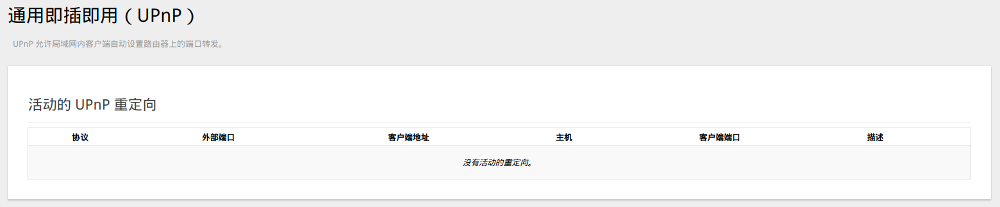
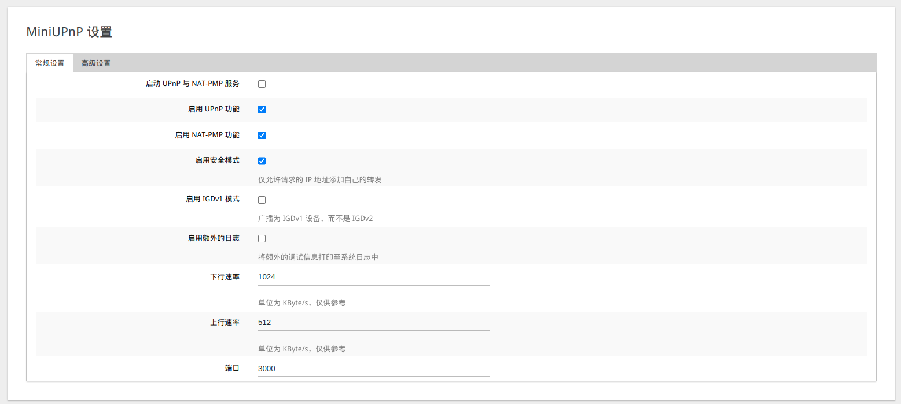
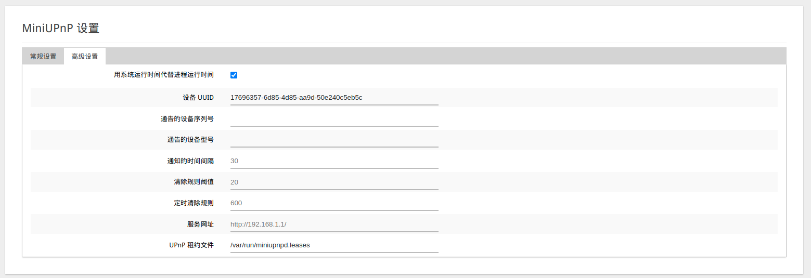
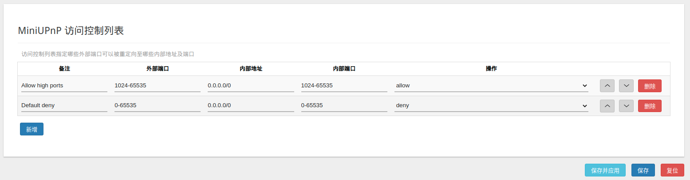
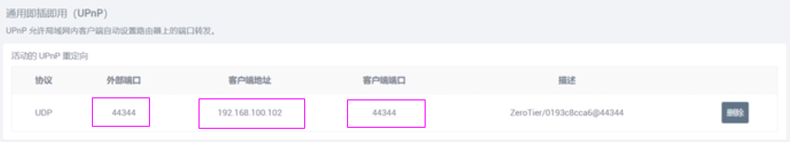
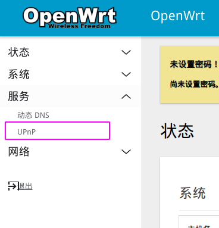
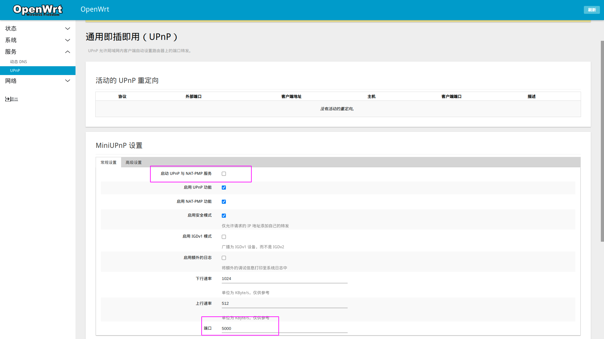
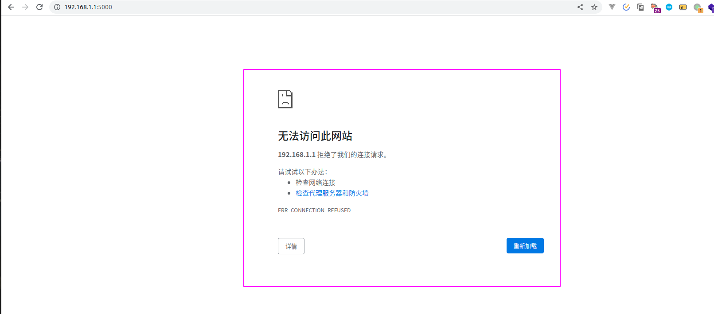
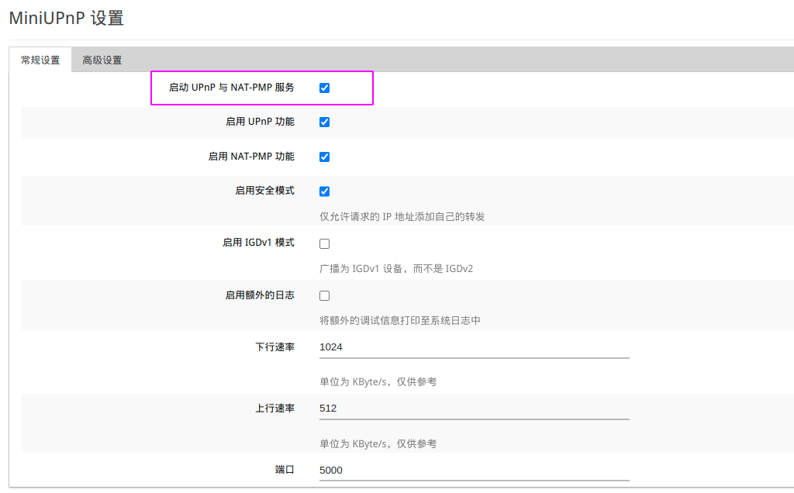
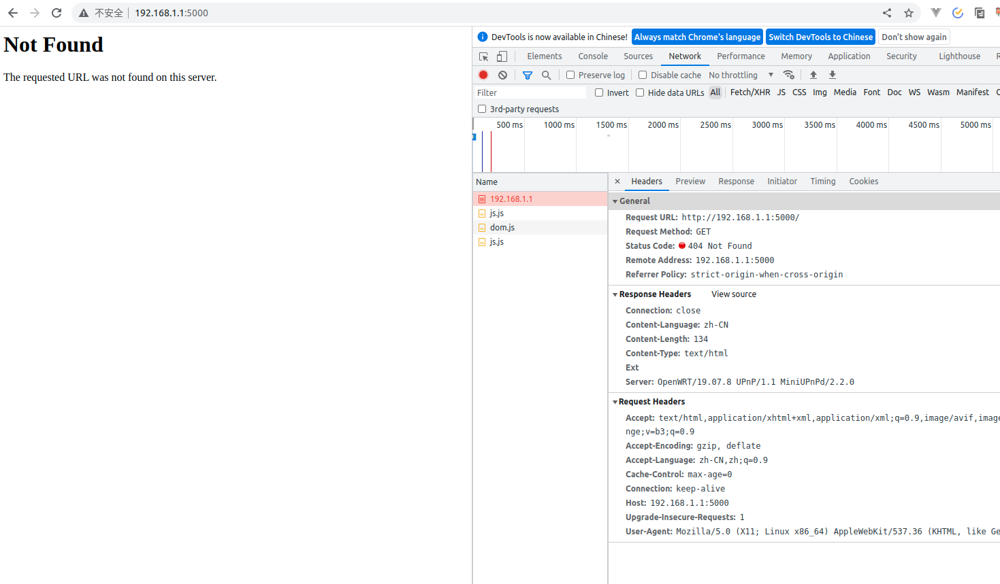

# OpenWrt uPnp
[深入研究](https://cool-y.github.io/2019/04/21/XIAOMI-UPnP/) or [讲解视频](https://www.bilibili.com/video/av927265001/)

通用即插即用（UPnP）:简单来说就一个使用端口号来穿透NAT访问外网的协议。

## 来看演示
> 下面这个是目前处于活动状态的设备服务列表

> 这个`MiniUPnP`你可以认为它是一个用于测试UPnP功能是否正常开启的一个功能
- `启动UPnP 与 NAT-PMP服务`：就是开启UPnP和NAT-PMP服务功能
- `启用UPnP功能`：就是启用UPnP功能功能
- `启用NAT-PMP功能`：就是启用NAT端口映射协议功能
  - NAT-PMP：自动建立网络地址转换（NAT）设置和端口映射配置而无需用户介入的网络协议。
- 启用安全模式：如下图所述
- 启用 IGDv1 模式：（某些版本的openWrt不兼容）
- 启用额外的日志：如下图所述
- 上下行速率：如下图所述
- 端口号：测试使用

> 高级一般是不需要进行改动的（测试功能是否正常情况下）

> 端口规则，一般是不需要进行改动的（特殊需求需要进行配置）
- 备注：规则说明
- 外部端口：要访问的IP地址的外部端口
- 内部地址：内部可以访问的地址
- 内部端口：内部可以访问的端口出口

## 演示
> 这个是开启功能后自动产生的

**操作**
1. 进入菜单功能

2. 一般默认是不开启此功能的，端口号默认为`5000`

3. 此时看下我们的浏览器的访问地址

将它改为：`192.168.1.1:5000`，然后访问

会发现我们被拒绝访问了

然后我们去`启动UPnP 与 NAT-PMP服务`

在底部点击

然后浏览器刷新

发现是可以访问了，就是代表使用端口的外网访问是成功的，404是因为没有找到对于的服务

## 总结图

[系统架构图](./assets/UPnP.drawio ':include :type=code')