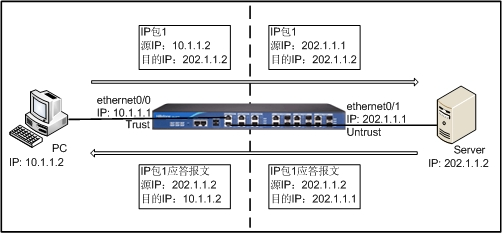

# 网络地址转换(NAT)
网络地址转换（Network Address Translation）简称为NAT，是将IP数据包包头中的IP地址转换为另一个IP地址的协议。当IP数据包通过路由器或者安全网关时，路由器或者安全网关会把IP数据包的源IP地址和/或者目的IP地址进行转换。在实际应用中，NAT主要用于私有网络访问外部网络或外部网络访问私有网络的情况。
NAT有以下优点：
- 通过使用少量的公有IP地址代表多数的私有IP地址，缓解了可用IP地址空间枯竭的速度。
- NAT可以隐藏私有网络，达到保护私有网络的目的。
  
私有网络一般使用私有地址，RFC1918规定的三类私有地址如下：

- A类：10.0.0.0 - 10.255.255.255（10.0.0.0/8）
- B类：172.16.0.0 - 172.31.255.255（172.16.0.0/12）
- C类：192.168.0.0 - 192.168.255.255（192.168.0.0/16）

## NAT的基本转换过程
安全网关执行NAT功能时，处于公有网络和私有网络的连接处。下图描述了NAT的基本转换过程：

如上图所示，安全网关处于私有网络和公有网络的连接处。当内部PC（10.1.1.2）向外部服务器（202.1.1.2）发送一个IP包1时，IP包将通过安全网关。安全网关查看包头内容，发现该IP包是发向公有网络的，然后它将IP包1的源地址10.1.1.2换成一个可以在Internet上选路的公有地址202.1.1.1，并将该IP包发送到外部服务器，与此同时，安全网关还在网络地址转换表中记录这一映射。外部服务器给内部PC发送IP包1的应答报文2（其初始目的地址为202.1.1.1），到达安全网关后，安全网关再次查看包头内容，然后查找当前网络地址转换表的记录，用内部PC的私有地址10.1.1.2替换目的地址。这个过程中，安全网关对PC和Server来说是透明的。对外部服务器来说，它认为内部PC的地址就是202.1.1.1，并不知道10.1.1.2这个地址。因此，NAT“隐藏”了企业的私有网络。

## Hillstone 安全网关的NAT功能
Hillstone 安全网关的NAT功能将内部网络主机的IP地址和端口替换为安全网关外部网络的地址和端口，以及将安全网关的外部网络地址和端口转换为内部网络主机的IP地址和端口。也就是“私有地址+端口”与“公有地址+端口”之间的转换。

安全网关通过创建并执行NAT规则来实现NAT功能。NAT规则有两类，分别为源NAT规则（SNAT Rule）和目的NAT规则（DNAT Rule）。SNAT转换源IP地址，从而隐藏内部IP地址或者分享有限的IP地址；DNAT转换目的IP地址，通常是将受安全网关保护的内部服务器（如WWW服务器或者SMTP服务器）的IP地址转换成公网IP地址。