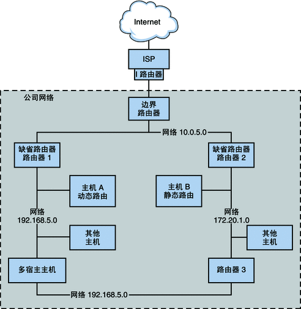

# 路由
[OpenWrt](https://www.cnblogs.com/ccky/p/15510855.html)

## 概念
通俗来说，网络数据就像“快递包裹”（里面有目的地址和起始地址），路由就相当于物流的“快递站点”，路由表就是站点维护这个“快递”要发到哪个下一站或者直接派送给站点下目的地址的一个表格，每到一个“站点”都会进行的路由表查询，直到包裹被送达或者没有查询到下一个站点被丢弃。

## 路由表
>路由表是一个存储在路由器或者我们计算机中的电子表格或类数据库。路由表存储着指向特定网络地址的路径（在有些情况下，还记录有路径的路由度量值）。

路由器和主机PC都维护路由表。
### 命令

#### win
```bash
route print

# arp表
arp -a 
```
#### linux

```bash
ip route

# 前提安装
sudo apt-get install net-tools 

route
# arp表
arp -a
```

#### route
```bash
route
```

每个系统上的路由选择守护进程都使用所有的已知路由来更新该表。

在将包转发到本地网络之前，系统的内核读取路由表。
路由表列出了系统知晓的网络的 IP 地址，包括系统本地缺省网络的 IP 地址。

该表还列出了每个已知网络的网关系统的 IP 地址。
网关是一个系统，它可以接收传出包并将它们转发到距本地网络一个跃点的位置。

以下是一个仅启用了 IPv4 的网络中某系统的简单路由表：

**Routing Table: IPv4**
| Destination | Gateway | Flags | Ref | Use | Interface |
| ---- | ---- |  ---- |  ---- |  ---- |  ---- |  ---- | 
| default | 172.20.1.10 | UG  |    1  |  532  | ce0|
| 224.0.0.0 | 10.0.5.100 | U |       1 |     0 |  bge0|
| 10.0.0.0 | 10.0.5.100 | U |       1  |    0 |  bge0|
| 127.0.0.1 | 127.0.0.1 | UH |      1  |   57|   lo0|

```bash
root@OpenWrt:~# ip route 
default via 192.168.5.1 dev eth0.2  src 192.168.5.130                     
192.168.1.0/24 dev br-lan scope link  src 192.168.1.1                     
192.168.5.0/24 dev eth0.2 scope link  src 192.168.5.130  
```

以默认路由来举例，在Windows系统中，指明了到达目的网段的下一跳地址，可以将其描述为，192.168.1.147前往本地路由表中未知的网段时，会选择默认路由进行传递，（全0代表全网），此时他的下一跳地址就是192.168.1.1。

何为下一跳，何为出接口？

下一跳：指前往某个网段时，需要先指明将数据包给谁，可以理解为你有一个快递要从北京传递到上海，此时你要首先将快递给快递小哥，对于这个传递快递的过程来说，快递小哥就是你的下一跳。

出接口：和下一跳同理，不过唯一区别就是出接口指的是自己本地出去的接口，而下一跳是直连路由器的ip地址，一个是接口，一个是IP地址，一个是本地，一个是下一路由器。

## 路由类型
| 路由类型 | 最适用于 |
| ---- | ---- |
| 静态 | 小型网络、从缺省路由器获取其路由的主机，以及仅需要知晓接下来几个跃点上一个或两个路由器的缺省路由器。|
| 动态 | 较大的互联网络、具有多个主机的本地网络中的路由器以及大型自治系统上的主机。动态路由是大多数网络中系统的最佳选择。|
| 组合的静态和动态路由 |将静态路由网络和动态路由网络连接在一起的路由器，以及将内部自治系统与外部网络连接在一起的边界路由器。将系统上的静态路由和动态路由组合在一起是一种常见的做法。 |
如图所示的 AS 将静态路由和动态路由组合在一起。

