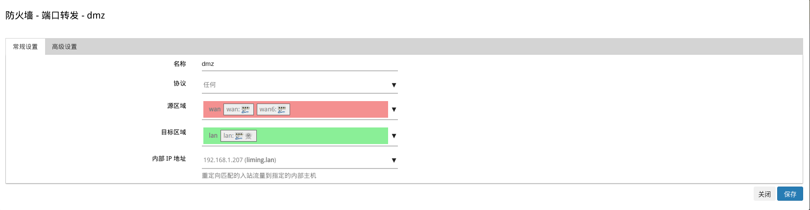
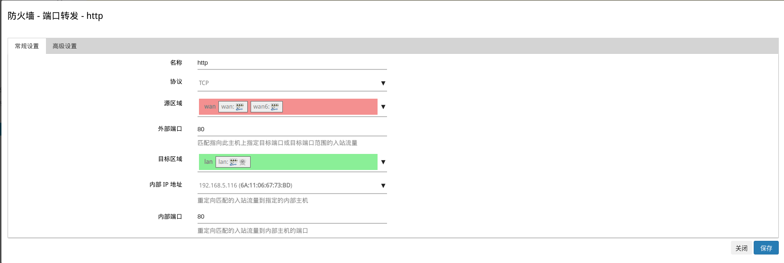
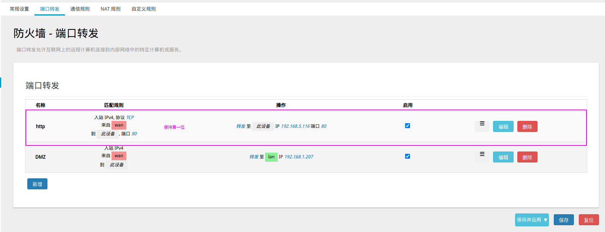

# DMZ
[使用 VLAN 的 fw3 DMZ 配置](https://openwrt.org/docs/guide-user/firewall/fw3_configurations/fw3_dmz)

> 为了解决安装防火墙后外部网络的访问用户不能访问内部网络服务器的问题。 
> 
> 启用 DMZ 主机后，可以直接从因特网访问设置为 DMZ 主机的计算机。


## 操作演示
> 案例使用**端口转发**实现

[整体测试图示](./assets/DMZ.drawio ':include :type=code')


只需要在端口转发页面配置如下规则：



也可以使用命令行配置
```bash
ssh root@192.168.1.1
vim /etc/config/firewall

# 配置中加入如下
config redirect
        option src 'wan'
        option name 'DMZ'
        option target 'DNAT'
        option dest_ip '192.168.1.207'
        option dest 'lan'
        option proto 'all'

# 重启firewall
/etc/init.d/firewall reload
```

这样就可以实现DMZ功能了

## 问题
> 配置完DMZ后会导致80端口也会被转发，导致TP-LINK设备下的所有PC无法进入OpenWrt配置页面

### 解决
> 前提条件[通信规则](./WLAN%E8%AE%BF%E9%97%AE/README.md#规则解析)开启了80端口入站

只需要在端口转发页面配置如下规则：(一定要放在最前面)



> 192.168.5.116 设备是[上层路由](#操作演示)DHCP分配给OpenWrt的ip地址



