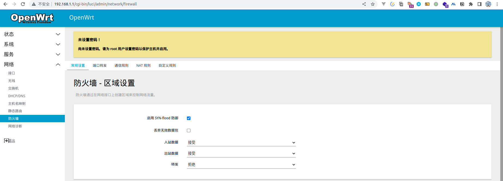
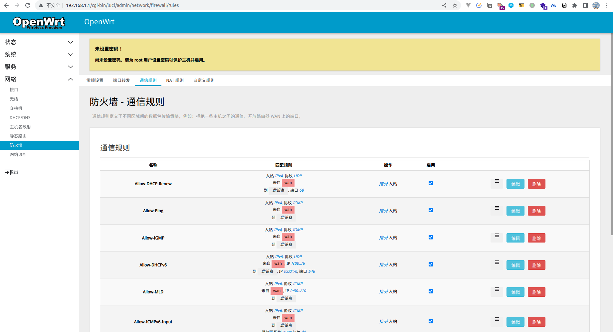
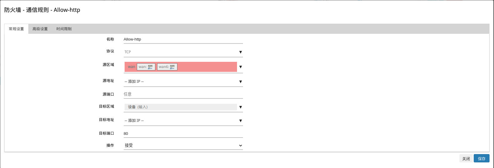
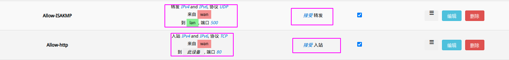

# WLAN访问

## 路由访问
- 如果是openwrt官方的默认设置，用二级路由器访问一级路由器本来就可以
- 如果要用二级路由器下的电脑访问一级路由器，要设置电脑的路由表
- 从一级访问二级，要在二级路由器的防火墙设置里，允许二级路由器接收wan区域的入站数据（默认不允许）
- 从外网访问二级，要设置客户端路由表，设置一级路由器允许wan区域到lan区域的转发，再加上上一行的设置
- A路由器LAN下的电脑如何访问B路由器LAN下的电脑，要设置B路由器允许wan区域到lan区域的转发，再加上端口转发的设置
  
## 操作演示

[整体测试图示](../assets/Network.drawio ':include :type=code')

> 默认情况下`TP-LINK`下的`PC1`是无法访问到`OpenWrt`的配置页的，因为默认情况下是会被其防火墙拦截掉的

所以此时需要去配置**通行规则**

1. 使用`PC2`的电脑的浏览器输入`192.168.1.1`（默认）， 进入到**防火墙**功能



2. 选择`通信功能`
> 默认配置的`ICMP`, `UDP`, `IPSEC`协议，不需要去关注




3. 在底部找到`新增`按钮进行规则如下配置



保存，之后进行`应用`


也可以使用命令行配置
```bash
ssh root@192.168.1.1
vim /etc/config/firewall

# 配置中rule最后加入如下
config rule
        option target 'ACCEPT'
        option src 'wan'
        option proto 'tcp'
        option dest_port '80'
        option name 'Allow-http'

# 重启firewall
/etc/init.d/firewall reload
```

**规则解析**
- wlan => lan ：表示可以转发到lan
- wlan => 此设备 ：表示通信到此路由设备（入站）


  
此时`PC1`就可以访问`OpenWrt`了
