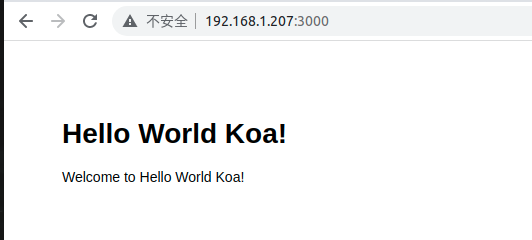
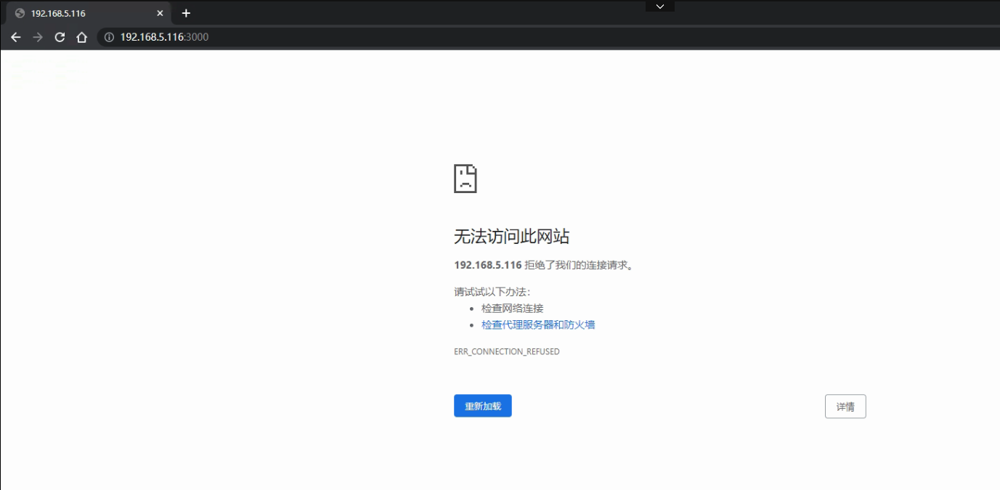
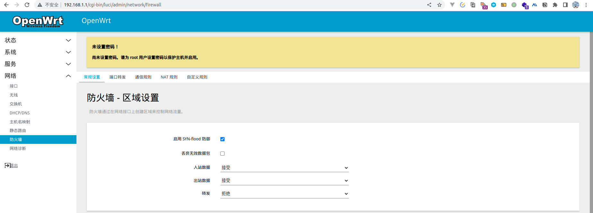
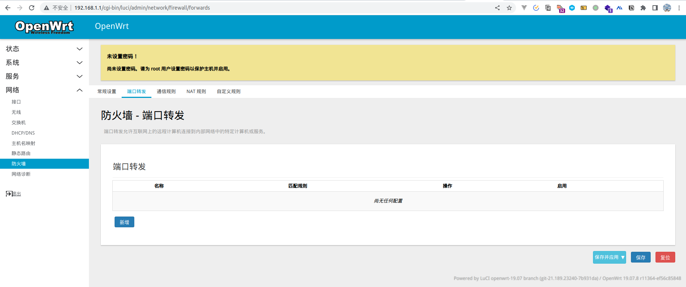
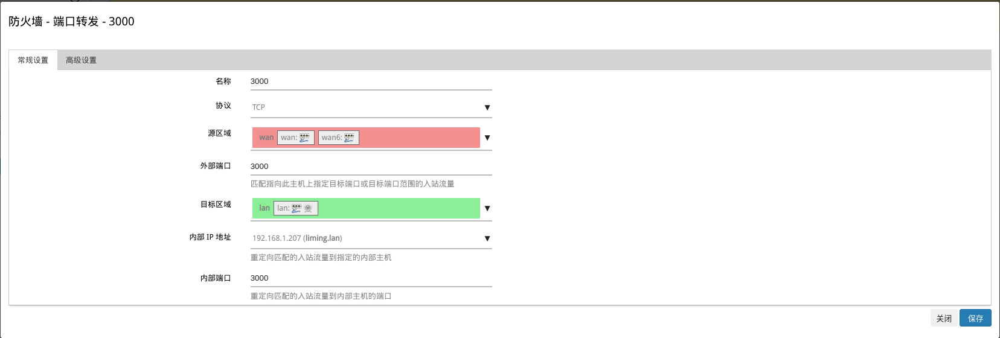
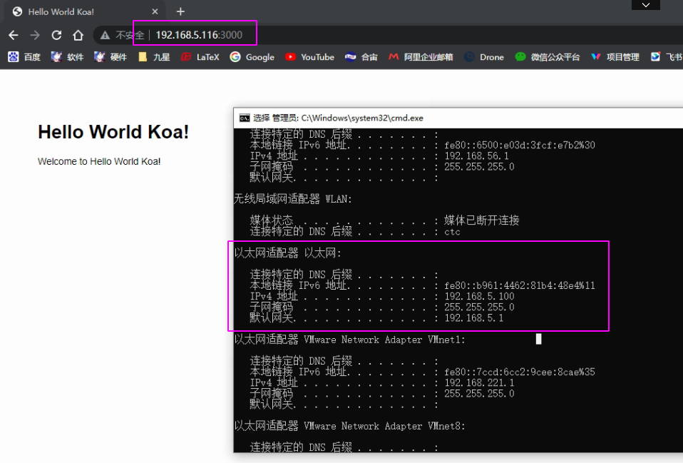
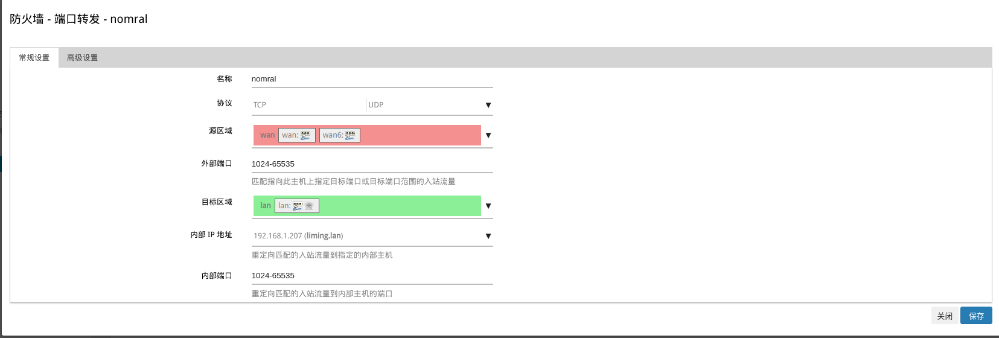

# 端口转发
> 二级路由上的PC设备想要使用一级路由下设备上的服务，此时就需要用到端口转发

## 操作演示

> `PC1`想要访问`PC2`上一些特定端口服务

### 前期准备
- PC2-模拟启动node服务器


- PC1-浏览器输入`192.168.5.116：300`, 会发现是无法进行访问的




### 开始
[整体测试图示](./assets/PortForwards.drawio ':include :type=code')

1. 使用`PC2`的电脑的浏览器输入`192.168.1.1`（默认）， 进入到**防火墙**功能



2. 选择`端口转发`




3. 在底部找到`新增`按钮进行规则如下配置
> 指定某一台`设备IP`转发



保存，之后进行`应用`

也可以使用命令行配置
```bash
ssh root@192.168.1.1
vim /etc/config/firewall

# 配置中加入如下
config redirect
        option dest 'lan'
        option dest_port '3000'
        option dest_ip '192.168.1.207'
        option src 'wan'
        option src_dport '3000'
        option proto 'tcp'
        option target 'DNAT'
        option name '3000'

# 重启firewall
/etc/init.d/firewall restart
```

再次刷新输入, `success`



最后：
- 访问设备ip：192.168.5.100
- 192.168.5.116是路由的ip地址
- 访问的服务是192.168.1.207:3000的服务

### 多端口一个ip的配置(类似DMZ)



```bash
config redirect
        option dest_port '1024-65535'
        option src 'wan'
        option name 'nomral'
        option src_dport '1024-65535'
        option target 'DNAT'
        option dest_ip '192.168.1.207'
        option dest 'lan'
```
### 多端口多ip配置
> 需要一条一条的进行配置


### 补充
> 对于防火墙配置的实时修改，对于已经建立连接会话的设备是存在延迟生效的情况。