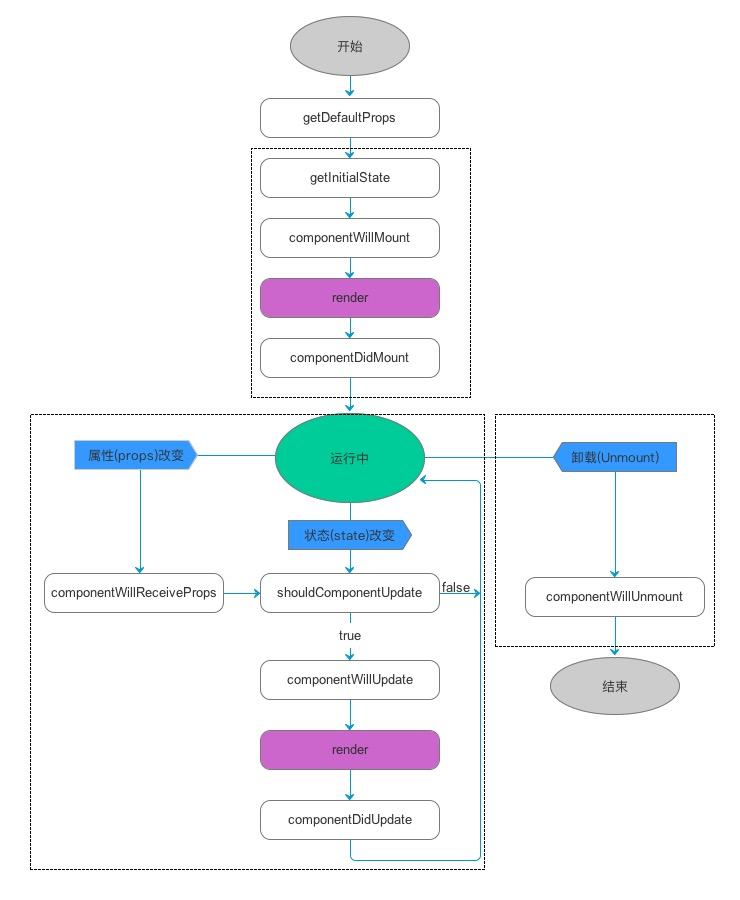

# React
>[官网](https://zh-hans.reactjs.org/)
## 虚拟DOM

```js
/**
 * 1、state数据
 * 2、JSX数
 * 3、数据 + 模板 结合，生成真实的DOM，来显示
 * 4、state 数据发生改变
 * 5、数据 + 模板 结合，生成真实的DMO，替换原始的DOM
 * 
 * 缺陷：
 * 第一次生成了一个完整的DOM片段
 * 第二次生成了一个完整的DOM片段
 * 第二次的DOM替换了第一次的DOM，非常耗性能
 * 
 * 
 * 1、state数据
 * 2、JSX数
 * 3、数据 + 模板 结合，生成真实的DOM，来显示
 * 4、state 数据发生改变
 * 5、数据 + 模板 结合，生成真实的DMO，并不直接替换原始的DOM
 * 6、新的DOM（DocumentFragment）和原始的DOM做对比，找差异
 * 7、找出input框发生了变化
 * 8、只用新的DOM中的input元素，替换掉老的DOM中的input元素
 * 
 * 缺陷：
 * 性能的提升并不明显
 * 
 * 虚拟DOM
 * 1、state 数据
 * 2、JSX 模板
 * 3 数据 + 模板 生成虚拟DOM（虚拟DOM就是一个JS对象，用它描述真实DOM）（损耗了极小性能）
 *    ['div', { id: 'abc' }, ['span', {}, 'Hello World']]
 * 4、用虚拟DOM的结构生成真实的DOM，来显示
 *    (<div id="abc"><span>Hello World</span></div>)
 * 5、state 数据发生变化
 * 6、数据 + 模板 生成新的虚拟DOM（极大的提升了性能）
 *    ['div', { id: 'abc' }, ['span', {}, 'bye bye']]
 * 7、比较原始虚拟DOM和新的虚拟DOM的区别，找到区别是span中的内容（极大的提升了性能）
 *    Diff算法，diffence
 *      同级比较 => 顶层 => 
 *      循环之中：Key值做关联，用来对比DOM是否更新，如果使用index做为key，会导致key变化，难以做比较
 * 8、直接操作DOM，改变span中的内容
 * 
 * 优点：
 * 1、性能提升了
 * 2、它使得跨端应用得以实现 React Native
 */
```

```jsx
render(){
  return (
    // 虚拟DOM
    // JSX => createElement => 虚拟DOM(JS对象) => 真实的DOM
    React.createElement('div', {}, 'item') // === <div>item</div>
    React.createElement('div', {}, React.createElement('span', {}, 'item')) // === <div><span>item</span></div>
  )
}
```

## 生命周期

生命周期函数指在某一时刻组件会自动调用执行的函数

针对组件




