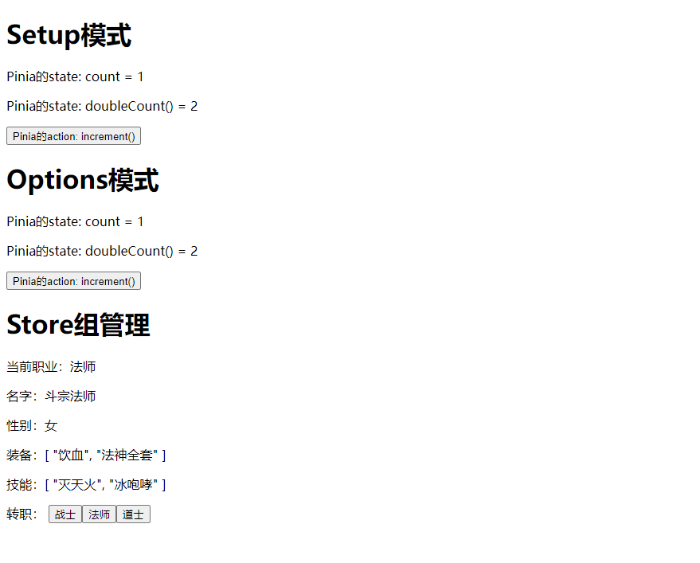
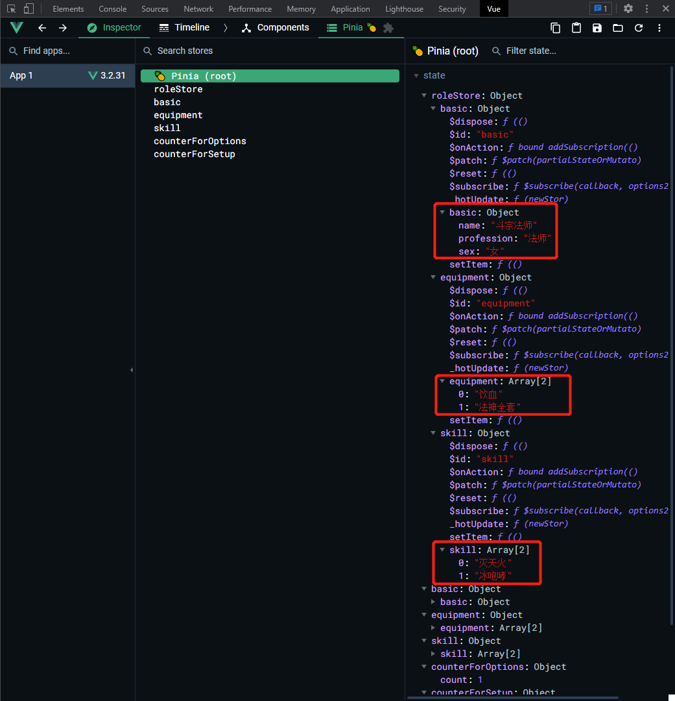

# pinia封装
>https://juejin.cn/post/7057439040911441957

## 项目目录结构
```bash
   src
    │  App.vue
    │  env.d.ts
    │  main.ts
    │
    ├─assets
    │      logo.png
    │
    ├─components
    │      PiniaBasicOptions.vue
    │      PiniaBasicSetup.vue
    │      ShowRoleInfo.vue
    │
    └─store
        │  counterForOptions.ts
        │  counterForSetup.ts
        │  index.ts
        │
        └─roleStore
                basic.ts
                constants.ts
                equipment.ts
                index.ts
                skill.ts
```

Demo总览


`main.ts`
```ts
import { createApp } from 'vue';
import { createPinia } from 'pinia';
import App from './App.vue';

import { registerStore } from './store';

const app = createApp(App);
app.use(createPinia());
registerStore();
app.mount('#app');
```

`./store/index.ts`
```ts
import { roleStore } from './roleStore'
import { useCounterForSetup } from "./counterForSetup";
import { useCounterForOptions } from "./counterForOptions";

const appStore: any = {}

export const registerStore = () =>{
  appStore.roleStore = roleStore();
  appStore.counterForOptions = useCounterForOptions();
  appStore.counterForSetup = useCounterForSetup();
}

export default appStore;
```

### Options的用法
`./src/store/counterForOptions.ts`
```ts
import { defineStore } from "pinia";

export const useCounterForOptions = defineStore("counterForOptions", {
  state: () => {
    return {
      count: 1
    }
  },
  getters: {
    doubleCount(state) {
      return state.count * 2
    }
  },
  actions: { 
    increment() {
      this.count++
    }
  }
})
```
`./src/components/PiniaBasicOptions.vue`
```vue
<template>
 <div>
   <h1>Options模式</h1>
   <p>Pinia的state: count = {{ this.count }}</p>    
   <p>Pinia的state: doubleCount() = {{ this.doubleCount }}</p>    
   <button @click="this.increment">Pinia的action: increment()</button>
 </div>
</template>

<script lang="ts">
import { mapState, mapActions } from "pinia";
import { useCounterForOptions } from "../store/counterForOptions";
export default {
  name: "component-PiniaBasicOptions",
  computed: {
    ...mapState(useCounterForOptions, ["count", "doubleCount"])
  },
  methods: {
    ...mapActions(useCounterForOptions, { increment: "increment"})
  }
}
</script>
```

### Setup的用法
`./src/store/counterForSetup.ts`
```ts
import { defineStore } from "pinia";
import { ref } from 'vue';

export const useCounterForSetup = defineStore("counterForSetup", () => {
  const count = ref<number>(1)

  const increment = () => {
    count.value++
  }

  const doubleCount = () => {
    return count.value * 2
  }

  return { count, increment, doubleCount }
})
```

`./src/components/counterForSetup.vue`
```vue
<template>
  <div>
    <h1>Setup模式</h1>
    <p>Pinia的state: count = {{ count }}</p>    
    <p>Pinia的state: doubleCount() = {{ doubleCount() }}</p>    
    <button @click="increment">Pinia的action: increment()</button>
  </div>
</template>

<script setup lang="ts" name="component-PiniaBasicSetup">
import appStore from '../store';
import { storeToRefs } from 'pinia';

const { count } = storeToRefs(appStore.counterForSetup)
const { increment, doubleCount } = appStore.counterForSetup
</script>
```

### 选择游戏角色数据
`./src/store/roleStore/contants.ts`
```ts
export const ROLE_INIT_INFO = {
  // 战士
  warrior: {
    basic: {
      name: "天下无双",
      profession: "战士",
      sex: "男"
    },
    equipment: ["裁决", "战天全套"],
    skill: ["半月弯刀", "烈火剑法"]
  },
  // 法师
  mage: {
    basic: {
      name: "斗宗法师",
      profession: "法师",
      sex: "女"
    },
    equipment: ["饮血", "法神全套"],
    skill: ["灭天火", "冰咆哮"]
  },
  // 道士
  warlock: {
    basic: {
      name: "道家战佛",
      profession: "道士",
      sex: "男"
    },
    equipment: ["龙纹剑", "道士全套"],
    skill: ["召唤神龙", "召唤麒麟"]
  }
}
```

`./src/store/roleStore/index.ts`
```ts
import { defineStore } from "pinia";
import { roleBasic } from "./basic";
import { roleEquipment } from "./equipment";
import { roleSkill } from "./skill";
import { ROLE_INIT_INFO } from './constants'

type TProfession = "warrior" | "mage" | "warlock"

export const roleStore = defineStore("roleStore", () => {
  // 注册组内store
  const basic = roleBasic();
  const equipment = roleEquipment();
  const skill = roleSkill();

  function changeProfession(profession: TProfession) {
    basic.setItem(ROLE_INIT_INFO[profession].basic);
    equipment.setItem(ROLE_INIT_INFO[profession].equipment);
    skill.setItem(ROLE_INIT_INFO[profession].skill);
  }
  changeProfession("mage")
  return { basic, equipment, skill, changeProfession}
})
```

`./src/store/roleStore/basic.ts`
```ts
import { defineStore } from "pinia";
import { reactive } from 'vue'

interface Ibaisc {
  name: string;
  profession: string;
  sex: string;
  [key: string]: any;
}

export const roleBasic = defineStore("basic", () => {
  const basic = reactive<Ibaisc>({
    name: '',
    profession: '',
    sex: ''
  })

  function setItem(data: Ibaisc) {
    if(typeof data === "object") {
      Object.keys(data).forEach((key) => {
        if(data.hasOwnProperty(key)) {
          basic[key] = data[key]
        }
      })
    }
  }
  return { basic, setItem }
})
```

`./src/store/roleStore/equipment.ts`
```ts
import { defineStore } from "pinia";
import { ref } from 'vue';

export const roleEquipment = defineStore("equipment", () => {
  const equipment = ref<string[]>()

  function setItem(data: string[]) {
    equipment.value = data
  }
  return { equipment, setItem }
})
```

`./src/store/roleStore/skill.ts`
```ts
import { defineStore } from "pinia";
import { ref } from 'vue';

export const roleSkill = defineStore("skill", () => {
  const skill = ref<string[]>()
  
  function setItem(data: string[]) {
    skill.value = data
  }
  return { skill, setItem }
})
```

#### 组件中使用
```vue
<template>
 <div>
   <h1>Store组管理</h1>
   <p>
     当前职业：{{ appStore.roleStore.basic.basic.profession }}
   </p>
   <p>
     名字：{{ appStore.roleStore.basic.basic.name }}
   </p>
   <p>
     性别：{{ appStore.roleStore.basic.basic.sex }}
   </p>
   <p>
     装备：{{ appStore.roleStore.equipment.equipment }}
   </p>
   <p>
     技能：{{ appStore.roleStore.skill.skill }}
   </p>
   <div>
     转职：
     <button @click="appStore.roleStore.changeProfession('warrior')">战士</button>
     <button @click="appStore.roleStore.changeProfession('mage')">法师</button>
     <button @click="appStore.roleStore.changeProfession('warlock')">道士</button>
   </div>
 </div>
</template>

<script lang="ts" setup>
import appStore from '../store';
</script>
```
#### vue-devtools查看state结构
