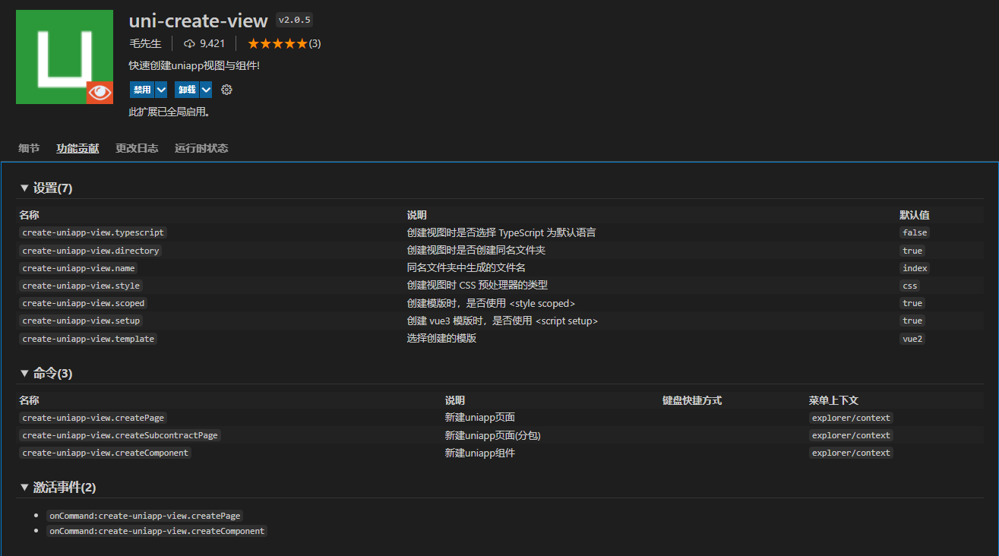
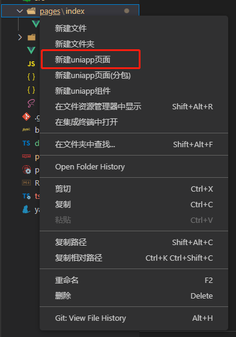
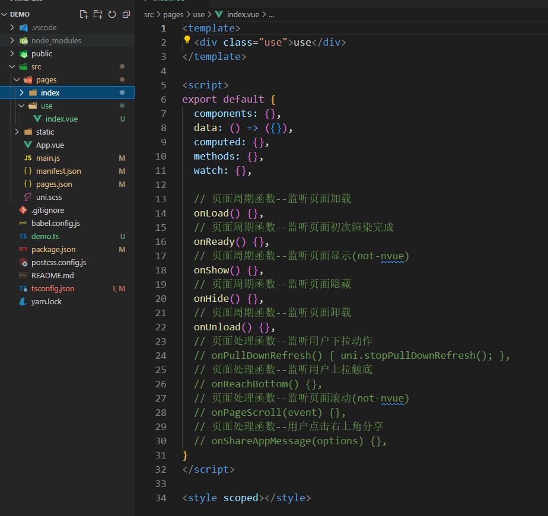
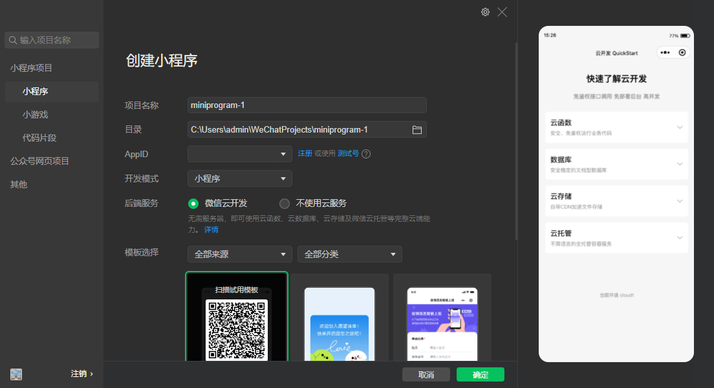
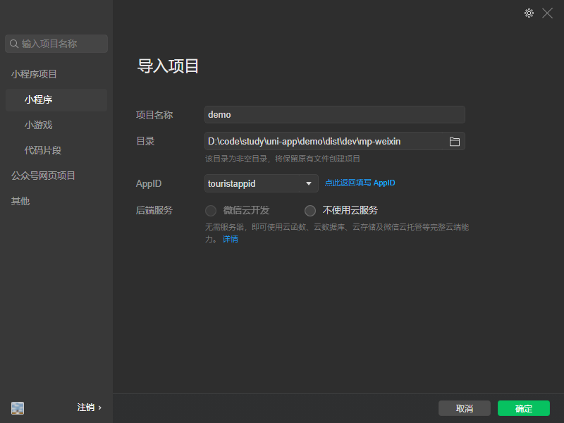
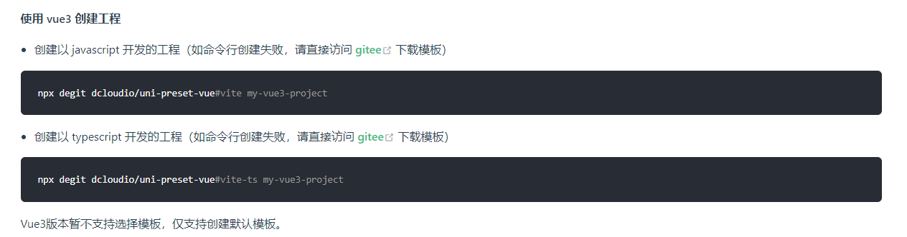
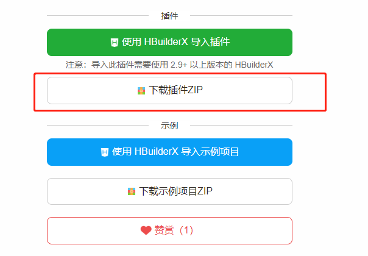

# uni-app
>[原](https://ask.dcloud.net.cn/article/36286)[文](https://juejin.cn/post/7090532271257714695)

简述一下这个教程能给VSCode开发 uni-app带来的体验
- 增强pages.json和manifest.json开发体验（语法提示、颜色块、写注释）
- 一键创建页面、组件、分包
- 完善的API，组件，uni.scss语法提示
- 条件编译注释高亮

## 初始化项目
我们使用 vue2 创建工程作为示例，uni-app中Vue2版的组件库和插件也比较多，稳定、问题少，可以先参考下官方文档：[工程化](https://uniapp.dcloud.io/worktile/CLI.html#uni-cli)

既然是使用vue脚手架，那肯定要全局安装@vue/cli，已安装的可以跳过。

>注意：Vue2创建的项目，脚手架版本要用@4的版本，用@5的版本运行项目会报错，这里推荐 @4.5.15

```bash
npm i -g @vue/cli@4.5.15
```
创建项目，后面是你的项目名字。
```bash
vue create -p dcloudio/uni-preset-vue demo-name
```

这里我们选择默认模板。
```bash
Preset options: 
? 请选择uni-app模板
> 默认模板
  默认模板(TypeScrip)
  Hello uni-app
  前后一体登录模板
  看图模板
  新闻/资讯类模板
  自定义模板
```
在VSCode打开这个项目，可以看看整个项目项目结构，src下项目结构跟HbuilderX创建的根目录基本一样，说明两种项目转换还是比较方便的。
>提示：既然是Vue2项目，有scss文件，那肯定要装vetur和sass这两个插件吧

```bash
 src
  │  App.vue
  │  main.js
  │  manifest.json
  │  pages.json
  │  uni.scss
  │
  ├─pages
  │  └─index
  │      index.vue
  │
  ├─static
  │     logo.png
 babel.config.js
 package.json
 postcss.config.js
 README.md
 tsconfig.json
 yarn.lock
```

## tsconfig.json报错问题
创建tsconfig.json配置文件时，VSCode会自动检测当前项目当中是否有ts文件，若没有则报错，提示用户需要创建一个ts文件后，再去使用typescript。其实即使报红，但运行项目是没有问题的，但有强迫症的人肯定受不了，不可能一直看着报错吧。
解决方案很简单，就是在项目根目录下，随便建一个ts文件，不用写任何东西，然后在tsconfig.json配置`files`这个就好了。
我们在项目`根目录`下新建一个demo.ts
```bash
 ...
 babel.config.js
 demo.ts <=
 package.json
 postcss.config.js
 README.md
 tsconfig.json
 yarn.lock
```
`tsconfig.json`：
```json
{
  "compilerOptions": {
    "types": [
      "@dcloudio/types",
      "miniprogram-api-typings",
      "mini-types"
    ],
  },
  "files": ["demo.ts"]
}
```
## 增强pages.json和manifest.json开发体验
### json文件写注释
我们打开`pages.json`和`manifest.json`，发现会报红，这是因为在`json`中是不能写注释的，而在`jsonc`是可以写注释的。
```bash
{
    "files.associations": {
        "pages.json": "jsonc",
        "manifest.json": "jsonc"
    },
}
```
千万不要把所有`json`文件都关联到jsonc中，你感觉在json中都能写注释了，觉得更好用了，其实不然，`json`就是`json`，`jsonc`就是`jsonc`，这两个是不一样的，例如，你在package.json写注释VSCode是不报错了，但编译的时候还是会报错的，因为package.json就是不能写注释的。

### 语法提示
`pages.json`
VScode使用`uni-app-schemas`插件

### 颜色块显示
VSCode在json文件是不显示像css中一样的颜色块，但有个插件可以帮我们做到。
VScode使用`Color Highlight`插件
当然，我们要对这个插件进行相关的配置，以便更好的使用。
`setting.json`
```json
{
    "files.associations": {
        "pages.json": "jsonc",
        "manifest.json": "jsonc"
    },
    "launch": {
        "configurations": [],
        "compounds": []
    },
    "color-highlight.enable": true, // 开启插件
    // 颜色块的样式，这里我选择了跟VSCode中css差不多样子的颜色块，自己选择喜欢的就行
    "color-highlight.markerType": "dot-before", 
    // 这个插件起效果的语言，这里设置只在jsonc起作用
    "color-highlight.languages": ["jsonc"],
    // 是否在旁边的滚条显示颜色，个人觉得不好看，关了
    "color-highlight.markRuler": false,
    // 是否匹配单词，如white，black
    "color-highlight.matchWords": false,
}
```
### 一键创建页面、组件、分包
然后就是怎么快速创建页面、组件、分包，那就要推荐以下这款插件了，支持一键创建，并且添加到`pages.json`中。
VScode使用`uni-create-view`插件




### 条件编译注释高亮
在Hubilder X条件注释是有高亮的，以便区分开普通注释.
VScode使用`Better Comments`插件


这个插件可以定制化我们的注释，比如颜色、加粗、斜体，怎么好看怎么来。
`setting.json`
```json
{
"better-comments.tags":[
  {
    "tag": "#",
    "color": "#18b566",
    "strikethrough": false,
    "underline": false,
    "backgroundColor": "transparent",
    "bold": true,
    "italic": false
   },
]
}
```

## API，组件，uni.scss语法提示

### API语法提示
用Vue2创建的uni-app的cli项目默认是已经安装对应的Api语法提示，并且默认已经在`tscongfig.json`配置好了，有三个：
- @dcloudio/types，uni语法提示
- miniprogram-api-typings，微信小程序wx语法提示
- mini-types，支付宝小程序my语法提示
```json
{
  "compilerOptions": {
    "types": [
      "@dcloudio/types",
      "miniprogram-api-typings",
      "mini-types"
    ],
  },
  "files": ["demo.ts"]
}
```

### 组件提示
接下来就是组件语法提示，如`<view>`、`<button>`等uni-app原生组件，这个需要我们手动安装对应的依赖包。
```bash
yarn add @dcloudio/uni-helper-json
```
如果你觉得还不够好用，你还可以安装第三方插件来提供和Hbuilder X一样的代码块，推荐插件：[uniapp小程序扩展](https://marketplace.visualstudio.com/items?itemName=evils.uniapp-vscode)、[uni-app-snippets](https://marketplace.visualstudio.com/items?itemName=ModyQyW.vscode-uni-app-snippets)

### uni.scss变量提示

>注意：cli创建的uni-app项目，跟web项目一样，需要安装对应的sass模块，才能写scss。安装sass-loader，建议版本@10，否则可能会导致vue与sass的兼容问题而报错。
```bash
yarn add sass sass-loader@10 -D
```
安装SCSS IntelliSense插件，就可以提示你项目中scss文件中定义的变量了。

## 运行、发布项目
对应的命令在package.json，中，可以自行查看。

```bash
yarn dev:mp-weixin
yarn build:mp-weixin
```
如果出现以下错误：

```bash
PS D:\code\study\uni-app\demo> yarn dev:mp-weixin
yarn run v1.22.18
$ cross-env NODE_ENV=development UNI_PLATFORM=mp-weixin vue-cli-service uni-build --watch
请注意运行模式下，因日志输出、sourcemap以及未压缩源码等原因，性能和包体积，均不及发行模式。若要正式发布，请点击发行菜单或使用cli发布命令进行发布
ERROR  Failed to compile with 1 error                                                                                                                                                                     21:18:07

This relative module was not found:

* ./pages/use/index.vue in ./src/main.js?{"page":"pages%2Fuse%2Findex"}
 ERROR  Build failed with errors.
error Command failed with exit code 1.
info Visit https://yarnpkg.com/en/docs/cli/run for documentation about this command.
PS D:\code\study\uni-app\demo> 
```
是因为我刚删除了新建的uniapp的use页面
```json
{
	"pages": [
		{
			"path": "pages/index/index",
			"style": {
				"navigationBarTitleText": "uni-app"
			}
		},
    // 删除 **********************************
		{
			"path": "pages/use/index",
			"style": {
				"navigationBarTitleText": "use"
			}
		}
    // ***************************************
	],
	"globalStyle": {
		"navigationBarTextStyle": "black",
		"navigationBarTitleText": "uni-app",
		"navigationBarBackgroundColor": "#ABCDEF",
		"backgroundColor": "#F8F8F8"
	}
}
```
开发模式打包成功
```bash
PS D:\code\study\uni-app\demo> yarn dev:mp-weixin
yarn run v1.22.18
$ cross-env NODE_ENV=development UNI_PLATFORM=mp-weixin vue-cli-service uni-build --watch
Done in 1.11s.
PS D:\code\study\uni-app\demo> 
```

VSCode跟Hbuilder x 不同的是，VSCode不会自动在微信开发者工具导入项目并打开，我们需要手动导入项目，只需要导入一次就行了，以后直接打开微信开发者工具就行了。

需要注意的是，需要在`manifest.json`配置微信小程序appid，不然微信开发者工具会报错。
```json
{
	"name": "heisming",
	"appid": "wxd************",
}
```
然后使用[**微信开发者工具**](https://developers.weixin.qq.com/miniprogram/dev/devtools/devtools.html)导入打包出来的文件夹。


根目录下生成的`/dist`文件，选择mp-weixin进行导入
```bash
└─dev
    ├─.automator    
    │  └─mp-weixin  
    ├─.sourcemap    
    │  └─mp-weixin  
    │      ├─common 
    │      └─pages  
    │          ├─index
    │          ├─se   
    │          └─use  
    └─mp-weixin 
        ├─common
        ├─pages
        │  ├─index
        │  └─use
        └─static
```


然后，就可以愉快的写代码了。不管是运行项目，还是差量化编译速度还是非常快的。

## 使用 vue3 创建工程
[官网](https://uniapp.dcloud.net.cn/worktile/CLI.html#uni-cli)

使用Vue3创建项目跟Vue2有点区别，Vue3创建的项目采用的是vite，有一说一，vite是真的快.


```
$ npx degit dcloudio/uni-preset-vue#vite my-vue3-project
npm WARN exec The following package was not found and will be installed: degit
> cloned dcloudio/uni-preset-vue#vite to my-vue3-project

```

访问仓库失败，去更新下@dcloudio/uvm。
```bash
npx @dcloudio/uvm
```
然后再试一下就没问题了，这里以javascript模板为例
```bash
npx degit dcloudio/uni-preset-vue#vite uni_vue3_cli
```
还有一个坑，就是Vue3创建的项目默认不安装API语法提示依赖，所以要我们手动去安装一下，然后去tsconfig.json配置一下。
```bash
yarn add @dcloudio/types miniprogram-api-typings mini-types -D
```
插件使用骷髅头`Volar`


## DCloud插件市场的使用
>[插件市场](https://uniapp.dcloud.net.cn/plugin/)
VSCode不能像`Hbuilder X`一样一键导入插件，一般用cli创建的项目要使用插件，一般有两种方式，第一种是支持npm安装的，那就用npm最好，如uViewUI，另一种不支持npm安装的，那就下载对应的zip压缩包，放到项目中，这种一般会有两个版本，我们选择非uni_modules版本，如uCharts。


