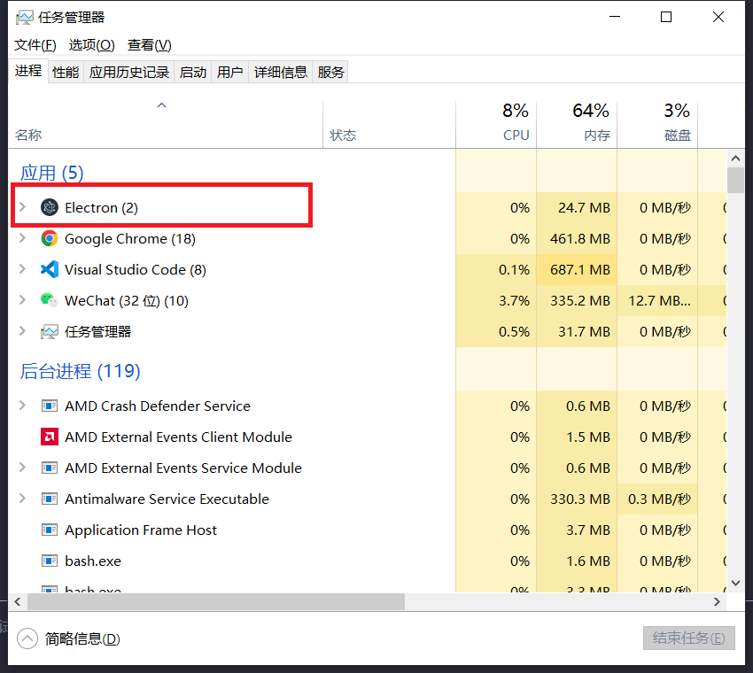

# Electron
>[官网](https://www.electronjs.org/)
- Web技术-基于Chromium和Node.js
- 开源-众多贡献者组成的活跃社区共同维护的开源项目
- 跨平台-兼容Mac，Windows和Linux

```bash
# 克隆示例项目的仓库
$ git clone https://github.com/electron/electron-quick-start

# 进入这个仓库
$ cd electron-quick-start

# 安装依赖并运行
$ npm install && npm start
```

## 主进程&渲染进程
什么是Process-进程?
An instance of a computer program that is being executed

用Chromium来举例
- 只有一个Main Process
  - 可以使用和系统对接的Electron API - 创建菜单，上传文件等等
  - 创建渲染进程- Renderer Process
  - 全面支持Node.js
  - 只有一个，作为整个程序的入口点
- 还有很多个Renderer Process
  - 可以有多个，每一个对应一个窗口(TAB)
  - 每个都是一个单独的进程
  - 全面支持Node.js和DOM API
  - 可以使用一部分Electron提供的API




监控文件变化
```bash
$ npm i nodemon --save-dev
```
将package.json中做出修改
```json
  "scripts": {
    // "start": "electron ."
    "start": "nodemon --watch main.js --exec electron ."
  },
```

### BrowserWindow
[文档](https://www.electronjs.org/zh/docs/latest/api/browser-window)
`main.js`
```js
// Modules to control application life and create native browser window
const {app, BrowserWindow} = require('electron')
const path = require('path')

function createWindow () {
  // Create the browser window.
  // 创建一个浏览器窗口
  const mainWindow = new BrowserWindow({
    width: 800,
    height: 600,
    minHeight: 600,
    minWidth: 800,
    webPreferences: {
      preload: path.join(__dirname, 'preload.js'),
      // 允许使用node API
      nodeIntegration: true,
    }
  })

  // and load the index.html of the app.
  // 主进程应用加载index.html
  mainWindow.loadFile('index.html')

  // Open the DevTools.
  // 打开开发者工具
  mainWindow.webContents.openDevTools()

  const sendWindow = new BrowserWindow({
    width: 400,
    height: 200,
    webPreferences: {
      // 允许使用node API
      nodeIntegration: true
    },
    // 父窗口关闭会连带关闭
    parent: mainWindow
  })
  sendWindow.loadFile('second.html')
}

// This method will be called when Electron has finished
// initialization and is ready to create browser windows.
// Some APIs can only be used after this event occurs.
// 这个方法将在Electron完成后被调用
// 初始化并准备创建浏览器窗口
// 有些api只能在此事件发生后使用。
app.whenReady().then(() => {
  createWindow()

  app.on('activate', function () {
    // On macOS it's common to re-create a window in the app when the
    // dock icon is clicked and there are no other windows open.
    if (BrowserWindow.getAllWindows().length === 0) createWindow()
  })
})

// Quit when all windows are closed, except on macOS. There, it's common
// for applications and their menu bar to stay active until the user quits
// explicitly with Cmd + Q.
app.on('window-all-closed', function () {
  if (process.platform !== 'darwin') app.quit()
})

// In this file you can include the rest of your app's specific main process
// code. You can also put them in separate files and require them here.

```

preload.js
```js
// 所有Node.js api都可以在预加载过程中使用。
// All of the Node.js APIs are available in the preload process.
// 它有与Chrome扩展相同的沙箱环境。
// It has the same sandbox as a Chrome extension.
// DOM API
window.addEventListener('DOMContentLoaded', () => {
  const replaceText = (selector, text) => {
    const element = document.getElementById(selector)
    if (element) element.innerText = text
  }

  for (const type of ['chrome', 'node', 'electron']) {
    replaceText(`${type}-version`, process.versions[type])
  }
})
// node API
alert(process.versions.node);
// window.addEventListener('DOMContentLoaded', () => {
//   alert('greeting from the DOM side')
// })

```

renderer.js
```js
// This file is required by the index.html file and will
// be executed in the renderer process for that window.
// No Node.js APIs are available in this process because
// `nodeIntegration` is turned off. Use `preload.js` to
// selectively enable features needed in the rendering
// process.
// 这个文件是index.html文件所需要的
// 在该窗口的渲染进程中执行。
// 在这个过程中没有Node.js api可用，因为
// ' nodeIntegration '已关闭。使用“preload.js”
// 有选择地启用呈现中需要的特性的过程。

/**
 * 以下代码不会被执行
 * */
alert(process.versions.node);
window.addEventListener('DOMContentLoaded', () => {
  alert('greeting from the DOM side')
})
```

进程之间的通讯方式
> Electron使用过IPC(inter process communication) 在进程之间进行通讯和Chromium完全一致
`Main Process` <=> `IPC` <=> `Renderer Process`
- ipcMain
- ipcRenderer

main.js
```js
const {app, BrowserWindow, ipcMain} = require('electron')
function createWindow () {
  // Create the browser window.
  // 创建一个浏览器窗口
  const mainWindow = new BrowserWindow({
    width: 800,
    height: 600,
    minHeight: 600,
    minWidth: 800,
    webPreferences: {
      preload: path.join(__dirname, 'preload.js'),
      // 允许使用node API
      nodeIntegration: true,
    }
  })

  // and load the index.html of the app.
  // 主进程应用加载index.html
  mainWindow.loadFile('index.html')

  // Open the DevTools.
  // 打开开发者工具
  mainWindow.webContents.openDevTools()

  // 主进程监听message事件
  ipcMain.on('message', (event, arg) => {
    console.log(arg);
    event.sender.send('reply', 'I received')
    // 等价写法
    // mainWindow.send('reply', 'I received')
  })
}
```

preload.js
```js
const { ipcRenderer } = require('electron');
window.addEventListener('DOMContentLoaded', () => {
  const replaceText = (selector, text) => {
    const element = document.getElementById(selector)
    if (element) element.innerText = text
  }

  for (const type of ['chrome', 'node', 'electron']) {
    replaceText(`${type}-version`, process.versions[type])
  }

  // 事件发送
  ipcRenderer.send('message', 'heisming');
  // 事件监听
  ipcRenderer.on('reply', (event, arg) => {
   document.getElementById('message').innerText = arg;
  })
})
```

