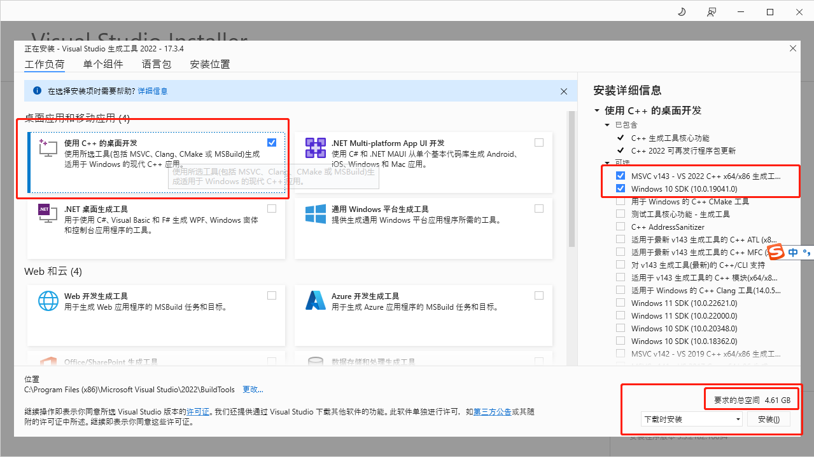
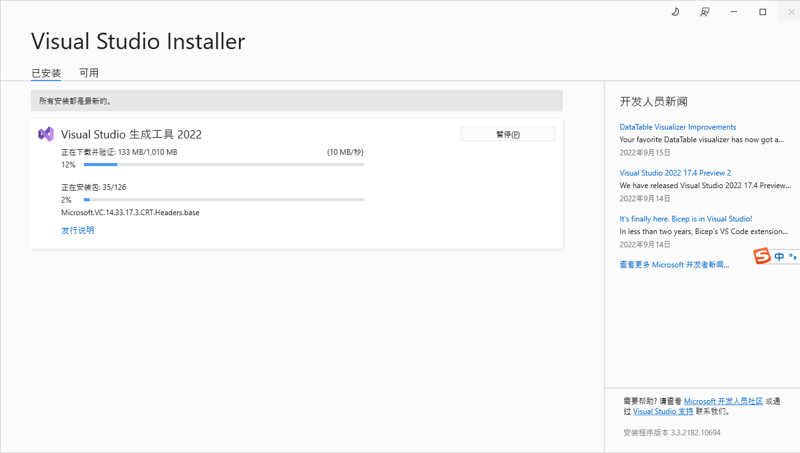
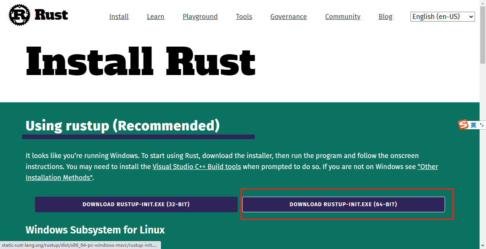
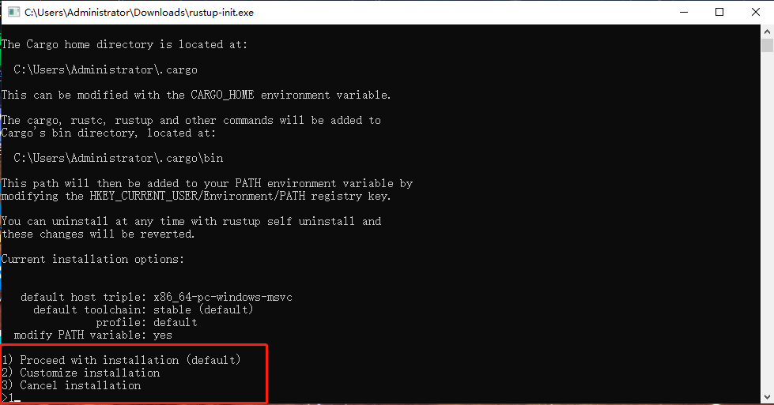
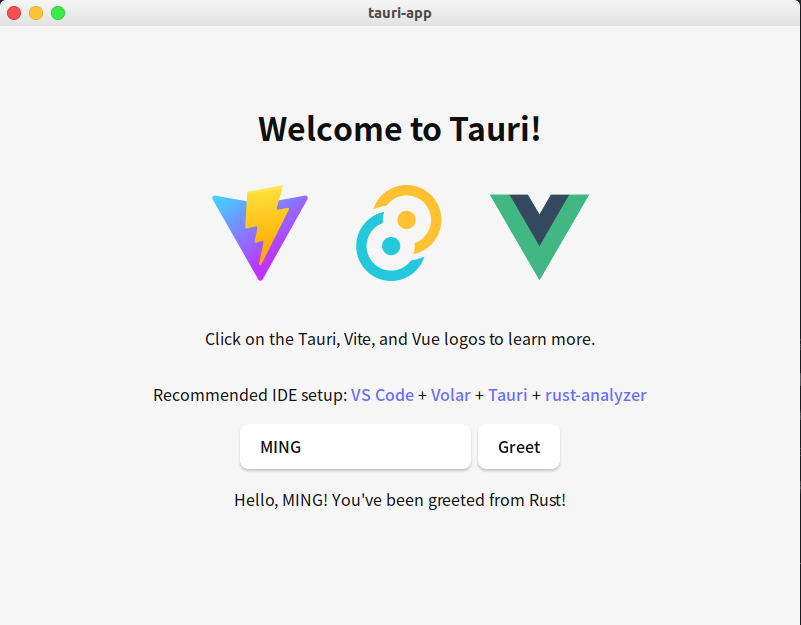
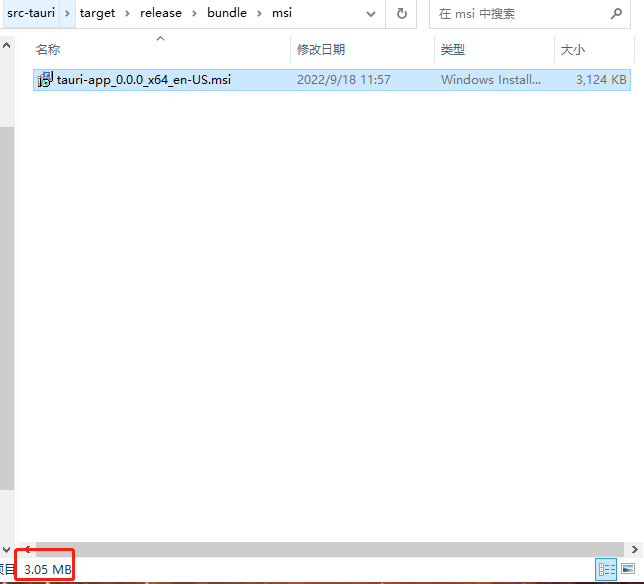
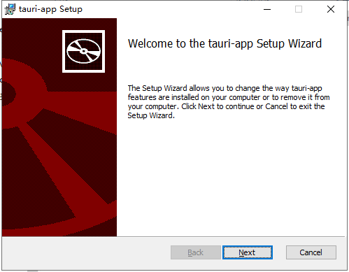

# Tauri
[官网](https://tauri.app/zh/)
[Demo](https://gitee.com/stringlxd/cassie_admin)

## 概念

## 与Electron的对比

## 前提条件
首先需要安装 Rust 及其他系统依赖。
### windows
1. Microsoft Visual Studio C++ 生成工具
下载 [Visual Studio 2022 生成工具](https://visualstudio.microsoft.com/visual-cpp-build-tools/)。 
> 没有科学上网会下载很慢，可以和下载VScode一样改变地址,或者[点我下载](assets/zip/vs_BuildTools.zip)

双击进行安装选择时，请勾选 "C++ 生成工具" 和 Windows 10 SDK。



2. WebView2
> Windows 11 已预装了 WebView2。

Tauri 需要 WebView2 才能在 Windows 上呈现网页内容，所以您必须先安装 WebView2。 最简单的方法是从[微软网站](https://developer.microsoft.com/zh-cn/microsoft-edge/webview2/#download-section)下载和运行常青版引导程序。


安装脚本会自动下载适合电脑架构的版本。 
> 如果遇到问题 (特别是 Windows on ARM)，可以自己手动选择正确版本。

1. Rust
最后，前往 https://www.rust-lang.org/zh-CN/tools/install 来安装 rustup (Rust 安装程序)。 



双击运行：输入1(安装默认版本就行)，回车



检查是否OK
```bash
Administrator@DESKTOP-D8C1AEA MINGW64 ~/Desktop
$ rustup --version
rustup 1.25.1 (bb60b1e89 2022-07-12)
info: This is the version for the rustup toolchain manager, not the rustc compiler.
info: The currently active `rustc` version is `rustc 1.63.0 (4b91a6ea7 2022-08-08)`
```

### Linux
> 我这里使用的是ubantu

1. 系统依赖
您需要安装几个系统依赖，如 C 语言编译器和 webkit2gtk。 下方是适用于部分热门发行版的安装命令：
```bash
# Debian
sudo apt update
sudo apt install libwebkit2gtk-4.0-dev \
    build-essential \
    curl \
    wget \
    libssl-dev \
    libgtk-3-dev \
    libayatana-appindicator3-dev \
    librsvg2-dev
```

2. Rust
要在 Linux 上安装 Rust，请打开终端并输入以下命令：
```bash
curl --proto '=https' --tlsv1.2 https://sh.rustup.rs -sSf | sh
```
此命令将下载以上脚本并开始安装用来安装最新版 Rust 的 rustup 工具。 
若安装成功，终端将显示以下内容：
```bash
Rust is installed now. Great!
```

3. 检查
```bash
$ rustc --version
# 我的
~/code/temp/tauri-app » rustc --version
rustc 1.62.1 (e092d0b6b 2022-07-16)
```


## 搭建
### Vite
#### windows
```bash
PS M:\code>  node -v  
v16.13.1
```
```bash
npm create tauri-app
yarn create tauri-app
pnpm create tauri-app
```
> ❗发现GIT BASH 新建不了，用了powershell

```bash
PS M:\code> pnpm create tauri-app
../.pnpm-store/v3/tmp/dlx-1688           |   +2 +
Packages are copied from the content-addressable store to the virtual store.
  Content-addressable store is at: M:\.pnpm-store\v3
  Virtual store is at:             ../.pnpm-store/v3/tmp/dlx-1688/node_modules/.pnpm
../.pnpm-store/v3/tmp/dlx-1688           | Progress: resolved 10, reused 2, downloaded 0, added 2, done

✔ Project name · tauri-app
✔ Choose your package manager · pnpm
✔ Choose your UI template · vue-ts

Please follow https://tauri.app/v1/guides/getting-started/prerequisites to install the needed prerequisites, if you haven't already.

Done, Now run:
  cd tauri-app
  pnpm install
  pnpm tauri dev

PS M:\code>
```
在VScode中打开项目并运行
```bash
# 安装依赖
pnpm i
# 运行开发程序
pnpm tauri dev
```
**发现会开始安装一大堆的依赖，大概会有4G左右大小，这部分代码是不会提交到Git仓库的，本地使用**
```bash
Administrator@DESKTOP-D8C1AEA MINGW64 /m/code/tauri-app
$ pnpm tauri dev

> tauri-app@0.0.0 tauri M:\code\tauri-app
> tauri "dev"

     Running BeforeDevCommand (`pnpm dev`)

> tauri-app@0.0.0 dev M:\code\tauri-app
> vite

        Warn Waiting for your frontend dev server to start on http://localhost:1420/...

  VITE v3.1.2  ready in 8621 ms

  ➜  Local:   http://127.0.0.1:1420/
  ➜  Network: use --host to expose
        Info Watching M:\code\tauri-app\src-tauri for changes...
    Blocking waiting for file lock on package cache
    Blocking waiting for file lock on build directory
   Compiling winapi v0.3.9
   Compiling unicode-segmentation v1.10.0
   Compiling lazy_static v1.4.0
   Compiling cty v0.2.2
   ......
   Compiling tauri-utils v1.1.1
   Compiling webview2-com v0.19.1
   Compiling wry v0.21.1
    Finished dev [unoptimized + debuginfo] target(s) in 8m 52s
```
完成运行后:


#### linux
```bash
~/code/temp/tauri-app » node -v  
v16.14.0
```
```bash
npm create tauri-app
yarn create tauri-app
pnpm create tauri-app
```

```bash
$ pnpm create tauri
✔ Project name · tauri-app
✔ Choose your package manager · pnpm
✔ Choose your UI template · vue-ts

Please follow https://tauri.app/v1/guides/getting-started/prerequisites to install the needed prerequisites, if you haven't already.

Done, Now run:
  cd tauri-app
  pnpm install
  pnpm tauri dev

--------------------------------------------------------------------------------
~/code/temp »  

```
> ✅此时我们得到的就是一个基于vue-ts-vite的项目了

```bash
# 安装依赖
pnpm i
# 运行开发程序
pnpm tauri dev
```
**发现会开始安装一大堆的依赖，大概会有4G左右大小，这部分代码是不会提交到Git仓库的，本地使用**
```bash
~/code/temp/tauri-app » pnpm tauri dev                                                                                                                                    1 ↵ liming@barry

> tauri-app@0.0.0 tauri /home/liming/code/temp/tauri-app
> tauri "dev"

     Running BeforeDevCommand (`pnpm dev`)

> tauri-app@0.0.0 dev /home/liming/code/temp/tauri-app
> vite

  VITE v3.1.2  ready in 348 ms

  ➜  Local:   http://localhost:1420/
  ➜  Network: use --host to expose
        Info Watching /home/liming/code/temp/tauri-app/src-tauri for changes...
    Blocking waiting for file lock on package cache
    Updating crates.io index
    Blocking waiting for file lock on package cache
    Blocking waiting for file lock on package cache
   Compiling proc-macro2 v1.0.43
   Compiling unicode-ident v1.0.4
   ...
   Compiling webkit2gtk v0.18.0
    Finished dev [unoptimized + debuginfo] target(s) in 4m 40s
```
> ❗此时如果出现失败就多尝试几次

完成运行后:


#### build
[官网](https://tauri.app/zh/v1/guides/building/)

Tauri Bundler 是一个 Rust 工具，用于编译二进制文件、打包资源文件并准备最终的构建。

它将检测您的操作系统并相应地构建安装包。
它目前支持格式：
- Windows: .msi
- macOS: .app, .dmg
- Linux: .deb, .appimage

**命令**
```bash
$ pnpm tauri build
```
**windows**
```bash
Administrator@DESKTOP-D8C1AEA MINGW64 /m/code/tauri-app
$ pnpm tauri build

> tauri-app@0.0.0 tauri M:\code\tauri-app
> tauri "build"

       Error You must change the bundle identifier in `tauri.conf.json > tauri > bundle > identifier`. The default value `com.tauri.dev` is not allowed as it must be unique across applications.
 ELIFECYCLE  Command failed with exit code 1.
```
**linux**
```
~/code/temp/tauri-app » pnpm tauri build                                                                                                                      liming@barry

> tauri-app@0.0.0 tauri /home/liming/code/temp/tauri-app
> tauri "build"

       Error You must change the bundle identifier in `tauri.conf.json > tauri > bundle > identifier`. The default value `com.tauri.dev` is not allowed as it must be unique across applications.
 ELIFECYCLE  Command failed with exit code 1.
```

>直接运行都会报错

需要修改项目`src-tauri > tauri.conf.json`
`tauri > bundle > identifier`下的配置
```json
{
  "build": {},
  "tauri": {
    "bundle": {
      // 修改前
      // "identifier": "com.tarui.dev"
      // (任意)修改后
      "identifier": "com.ming.dev"
    }
  }
}
```
再次尝试(windows)：
```
Administrator@DESKTOP-D8C1AEA MINGW64 /m/code/tauri-app
$ pnpm tauri build

> tauri-app@0.0.0 tauri M:\code\tauri-app
> tauri "build"

       Error You must change the bundle identifier in `tauri.conf.json > tauri > bundle > identifier`. The default value `com.tauri.dev` is not allowed as it must be unique across applications.
 ELIFECYCLE  Command failed with exit code 1.

Administrator@DESKTOP-D8C1AEA MINGW64 /m/code/tauri-app
$ pnpm tauri build

> tauri-app@0.0.0 tauri M:\code\tauri-app
> tauri "build"

     Running beforeBuildCommand `pnpm build`

> tauri-app@0.0.0 build M:\code\tauri-app
> vue-tsc --noEmit && vite build

vite v3.1.2 building for production...
✓ 21 modules transformed.
dist/assets/vue.5532db34.svg     0.48 KiB
dist/index.html                  0.46 KiB
dist/assets/index.90b72022.css   1.27 KiB / gzip: 0.63 KiB
dist/assets/index.b87e9d04.js    56.70 KiB / gzip: 22.80 KiB
   Compiling proc-macro2 v1.0.43
   Compiling unicode-ident v1.0.4
   Compiling quote v1.0.21
   Compiling syn v1.0.99
   Compiling autocfg v1.1.0
   Compiling cfg-if v1.0.0
   Compiling serde_derive v1.0.144
   ...  
   Compiling kuchiki v0.8.1
   Compiling tauri-utils v1.1.1
   Compiling tauri-build v1.1.1
   Compiling tauri-codegen v1.1.1
   Compiling tauri-macros v1.1.1
   Compiling tauri-app v0.0.0 (M:\code\tauri-app\src-tauri)
   Compiling webview2-com v0.19.1
    Finished release [optimized] target(s) in 8m 21s
        Info Verifying wix package
 Downloading https://github.com/wixtoolset/wix3/releases/download/wix3112rtm/wix311-binaries.zip
       Error failed to bundle project: `Tls Error: 由于连接方在一段时间后没有正确答复或连接的主机没有反应，连接尝试失败。 (os error 10060)`: 
Tls Error: 由于连接方在一段时间后没有正确答复或连接的主机没有反应，连接尝试失败。 (os error 10060)
 ELIFECYCLE  Command failed with exit code 1.
```
> 8分钟21秒，这个时间有点长，而且还失败了，最后下载一个包失败了。

解决方案：
1. [下载此包](https://github.com/wixtoolset/wix3/releases/download/wix3112rtm/wix311-binaries.zip)
2. 在`C:\Users\\[UserName]\AppData\Local\`下新建文件夹`tauri\WixTools`
3. 解压wix311-binaries.zip到WixTools目录
4. 再次执行打包命令即可

```bash
Administrator@DESKTOP-D8C1AEA MINGW64 /m/code/tauri-app
$ pnpm tauri build

> tauri-app@0.0.0 tauri M:\code\tauri-app
> tauri "build"

     Running beforeBuildCommand `pnpm build`

> tauri-app@0.0.0 build M:\code\tauri-app
> vue-tsc --noEmit && vite build

vite v3.1.2 building for production...
✓ 21 modules transformed.
dist/assets/vue.5532db34.svg     0.48 KiB
dist/index.html                  0.46 KiB
dist/assets/index.90b72022.css   1.27 KiB / gzip: 0.63 KiB
dist/assets/index.b87e9d04.js    56.70 KiB / gzip: 22.80 KiB
   Compiling tauri-app v0.0.0 (M:\code\tauri-app\src-tauri)
    Finished release [optimized] target(s) in 57.39s
        Info Target: x64
     Running candle for "main.wxs"
     Running light to produce M:\code\tauri-app\src-tauri\target\release\bundle/msi/tauri-app_0.0.0_x64_en-US.msi
    Finished 1 bundle at:
        M:\code\tauri-app\src-tauri\target\release\bundle/msi/tauri-app_0.0.0_x64_en-US.msi
```
最后一行告诉我们目录在： `M:\code\tauri-app\src-tauri\target\release\bundle/msi/tauri-app_0.0.0_x64_en-US.msi`

打开目录：发现自己生成的很小

双击执行一个msi包：

安装完桌面出现一个图标可以运行：


### linux
```bash
~/code/temp/tauri-app » pnpm tauri build                                                                                                                  1 ↵ liming@barry

> tauri-app@0.0.0 tauri /home/liming/code/temp/tauri-app
> tauri "build"

     Running beforeBuildCommand `pnpm build`

> tauri-app@0.0.0 build /home/liming/code/temp/tauri-app
> vue-tsc --noEmit && vite build

vite v3.1.2 building for production...
✓ 21 modules transformed.
dist/assets/vue.5532db34.svg     0.48 KiB
dist/index.html                  0.45 KiB
dist/assets/index.6eb5cbf1.css   1.27 KiB / gzip: 0.63 KiB
dist/assets/index.72e6b845.js    56.70 KiB / gzip: 22.79 KiB
   Compiling proc-macro2 v1.0.43
   Compiling unicode-ident v1.0.4
   Compiling quote v1.0.21
   Compiling syn v1.0.99
   Compiling libc v0.2.132
   Compiling serde_derive v1.0.144
   Compiling serde v1.0.144
   ...
   Compiling soup2 v0.2.1
   Compiling tauri-macros v1.1.1
   Compiling gdk v0.15.4
   Compiling tauri-app v0.0.0 (/home/liming/code/temp/tauri-app/src-tauri)
   Compiling webkit2gtk v0.18.0
    Finished release [optimized] target(s) in 5m 11s
    Bundling tauri-app_0.0.0_amd64.deb (/home/liming/code/temp/tauri-app/src-tauri/target/release/bundle/deb/tauri-app_0.0.0_amd64.deb)
    Bundling tauri-app_0.0.0_amd64.AppImage (/home/liming/code/temp/tauri-app/src-tauri/target/release/bundle/appimage/tauri-app_0.0.0_amd64.AppImage)
       Error failed to bundle project: error running appimage.sh: error running appimage.sh: `failed to run /home/liming/code/temp/tauri-app/src-tauri/target/release/bundle/appimage/build_appimage.sh`
 ELIFECYCLE  Command failed with exit code 1.
```
解决方案：


## Mobile App