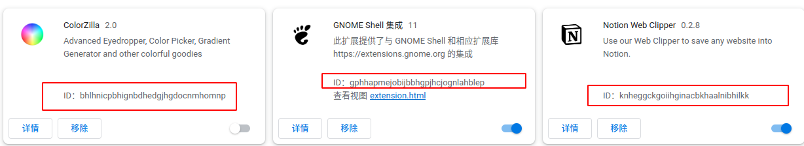

# Google Chrome

## 如何下载Chrome商店的插件crx到本地（科学上网）？
想把之前从chrome商店安装的插件保存成本地的crx文件用于以后离线安装。
查了几个方法：
1. 用浏览器的打包功能，打包出来的crx直接拖入会显示损坏。解包安装不能移动文件位置。
2. 插件id解析网站，查到的都不能用

> 当然最快的方法就是科学上网直接从谷歌浏览器应用商店下载了

### 获取插件ID
以我的浏览器插件ID为例：

> knheggckgoiihginacbkhaalnibhilkk

从 Chrome 商店搜索插件或直接通过链接进入插件的详情页面，其中地址栏最后的那一串字符就是ID，复制下来。

https://chrome.google.com/webstore/detail/vuejs-devtools/**`knheggckgoiihginacbkhaalnibhilkk`**

**直接下载插件**
通过ID拼凑一下下面的地址直接访问就可以下载crx到本地。

https://clients2.google.com/service/update2/crx?response=redirect&os=win&arch=x64&os_arch=x86_64&nacl_arch=x86-64&prod=chromecrx&prodchannel=&prodversion=77.0.3865.90&lang=zh-CN&acceptformat=crx2,crx3&x=id%3D`ljjemllljcmogpfapbkkighbhhppjdbg`%26installsource%3Dondemand%26uc

直接替换掉中间`XXXX`的即可下载.crx文件，而不是直接安装

### 安装
点击浏览器地址栏区域最右侧的菜单按钮，在菜单中选择更多工具，再点击扩展程序，或者直接在地址栏访问 chrome://extensions/ 进入扩展程序管理页面。

直接将下载好的crx插件文件拖到扩展程序页面就可以安装。

如果不行，请把开发者模式打开，也在扩展程序管理页面，然后将插件解压到一个空的英文目录下，通过加载已解压的扩展程序的功能去找到你解压的插件目录即可。
> 下载得的crx可直接拖入chrome扩展页安装！！