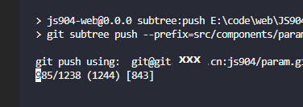
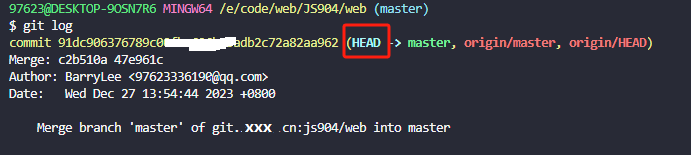
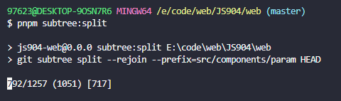
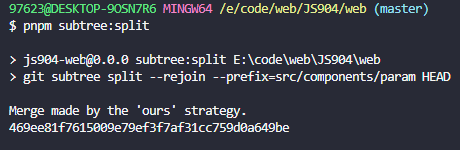
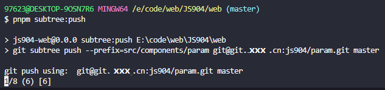

# 🌳🌲Git Subtree
> 是为了解决子仓库代码提交过慢的问题

目前网页端和桌面端项目需要共用的配置，所以是采用的`git subtree`的方案来解决。

1. 先**创建一个子仓库**用来存放公共的配置代码。

```bash
git remote add originName https://git.xxx.cn/js904/param.git

git subtree add --prefix=src/components/param originName master
```
**目前直接采用项目SSH地址方式来操作子仓库的。**

先切换到网页端项目根目录中将子仓库关联进去（无需创建目录）

```bash
git subtree add --prefix=src/components/param git@git.xxx.cn:js904/param.git master
```

再切换到桌面端项目根目录中将子仓库关联进去（无需创建目录）

```bash
git subtree add --prefix=src/components/param git@git.xxx.cn:js904/param.git master
```

在两个项目的`package.json`中添加关于拉取和提交代码的命令

```json
{
  "scripts": {
    "subtree:pull": "git subtree pull --prefix=src/components/param git@git.xxx.cn:js904/param.git master",
    "subtree:push": "git subtree push --prefix=src/components/param git@git.xxx.cn:js904/param.git master",
  }
}
```

操作流程：
1. 先拉取代码
```bash
git push
npm subtree:pull
```
2. 写完测试后提交代码
```bash
git add .
git commit -m xxx
git push
```
此时子仓库未更新，需要使用`npm subtree:push`提交代码

3. 带来的问题



随着子仓库代码不断的增多，每次执行 subtree 的 push 命令的时候，总会重新为子目录生成新的提交。然而这造成了一些很麻烦的问题：
1. 每个提交都需要重新计算，因此每次推送都需要把主仓库所有的提交计算一遍，非常耗时；
2. 每次 push 都是重新计算的，因此本地和远端新仓库的提交总是不一样的，关键还没有共同的父级，这导致 git 无法自动为我们解决冲突。

git subtree 提供了 split 命令，官方对此的描述是：
> 📌Extract a new, synthetic project history from the history of thefix> subtree. The new history includes only the commits (including merges) that affectedfix>, and each of those commits now has the contents offix> at the root of the project instead of in a subdirectory. Thus, the newly created history is suitable for export axs a separate git repository.
After splitting successfully, a single commit id is printed to stdout. This corresponds to the HEAD of the newly created tree, which you can manipulate however you want.
Repeated splits of exactly the same history are guaranteed to be identical (ie. to produce the same commit ids). Because of this, if you add new commits and then re-split, the new commits will be attached as commits on top of the history you generated last time, so ‘git merge’ and friends will work as expected.
Note that if you use ‘–squash’ when you merge, you should usually not just ‘–rejoin’ when you split.

意思是说，当使用了 split 命令后，git subtree 将确保对于相同历史的分割始终是相同的提交号。

于是，当需要 push 的时候，git 将只计算 split 之后的新提交；并且下次 split 的时候，以前相同的历史纪录将得到相同的 git 提交号。

```bash
git subtree split --rejoin --prefix=<prefix> <commit...>
```

## 操作

在两个项目的package.json中添加关于分割代码的命令
```json
{
  "scripts": {
    "subtree:pull": "git subtree pull --prefix=src/components/param git@git.xxx.cn:js904/param.git master",
    "subtree:split": "git subtree split --rejoin --prefix=src/components/param HEAD",
    "subtree:push": "git subtree push --prefix=src/components/param git@git.xxx.cn:js904/param.git master",
  }
}
```

在`commit`之后可以进行首次代码分割
```bash
git add .
git commit -m xxx：获得commit信息
git push
npm subtree:split
npm subtree:push
```



对HEAD进行分割



第一次的分割时间较长，等待分割完成之后。



上一次提交的代码被独立，这次只需要提交本次改动的子仓库代码。




> ✅上图所示是1/8, 会随着代码量增加而增多，过多的时候可以再次进行分割操作重置

## 使用建议
1. **尽量在一个项目中对child项目做split**
2. **尽量在一个项目中对child项目做提交，其他项目只pull**，不会产生很多merge记录，保持commit纯净
3. 定期split，防止push时间过长
4. 有问题删掉subtree重新add
5. git 列出所有的 subtree
```bash
git log | grep git-subtree-dir | tr -d ' ' | cut -d ":" -f2 | sort | uniq
```

> 💡参考资料
> 
> https://stackoverflow.com/questions/16134975/how-can-i-reduce-the-ever-increasing-time-to-push-a-subtree
>
> https://juejin.cn/post/7080931951808348168