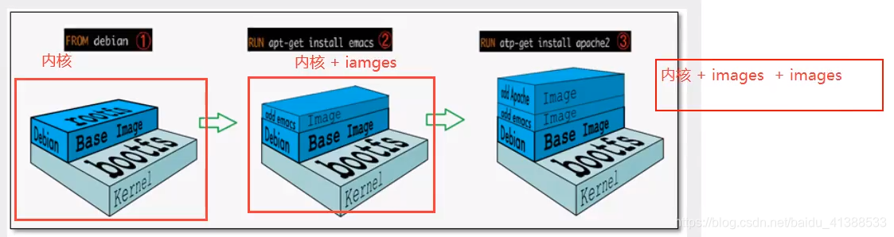
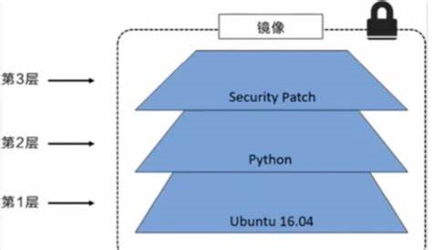
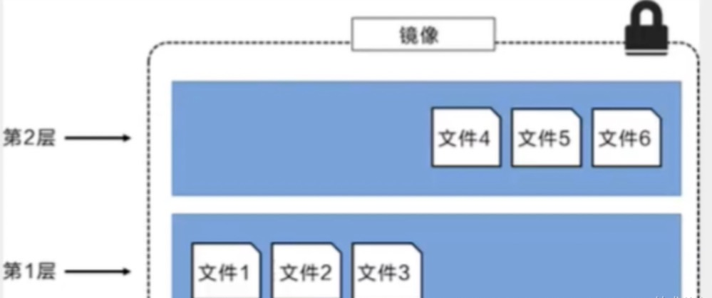
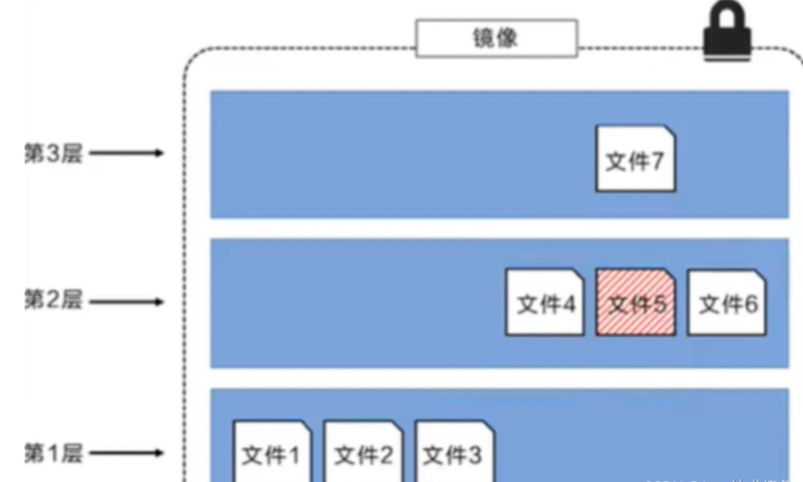
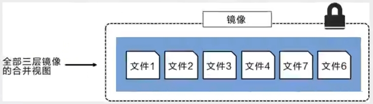

# Docker镜像👍👍👍
镜像是什么
镜像是一种轻量级、可执行的独立软件包，用来打包软件运行环境和基于运行环境开发的软件，它包含运行某个软件所需的所有内容，包括代码、运行时、系统工具、系统库、环境变量和配置文件。

所有应用，直接打包docker镜像，运行时直接运行镜像即可。

如何得到镜像：
1. 自己制作
2. 从Docker Hub上下载
3. 从其他用户制作的镜像中创建

## 镜像加载原理
> UnionFS 联合文件系统
是一种分层、轻量级并且高性能的文件系统，它支持对文件系统的修改作为一次提交来一层层的叠加，同时可以将不同目录挂载到同一个虚拟文件系统下（和Git类似）。Union文件系统是Docker镜像的基础。镜像可以通过分仓来进行继承，基于基础镜像（没有父镜像），可以制作各种具体的应用镜像。

特性：一次同时加载多个文件系统，但从外面看起来，只能看到一个文件系统，联合加载会把各层文件系统叠加起来，最终的文件系统会包含所有层的文件和目录。

> 加载原理
docker的镜像实际上由一层层的文件系统组成，这种层级的文件系统UnionFS。

bootfs(根文件系统:boot file system)主要包含bootloader和kernel，bootloader主要是引导加载kernel，linux刚启动时会加载bootfs，在Docker镜像的最底层是bootfs。这一层与典型的Linux/Unix系统的根文件系统是一样的，包含bootloader和kernel。当bootfs加载完后，整个内核就在内存中了，此时内存的使用权已由bootfs转交给内核，此时系统也会卸载bootfs。

rootfs(根文件系统:root file system)，在bootfs之上，包含的就是典型Linux系统中的/dev,/root,/bin等标准目录以及各种配置文件。rootfs就是各种不同操作系统发行版本，如Ubuntu、CentOS、Fedora、Debian等。

rootfs是Docker镜像真正的文件系统，在这个文件系统中可以包含各种应用程序，比如Apache、MySQL、PHP等。
在Docker镜像中，rootfs是最上层的文件系统，也是用户最终对容器操作的主要对象。


3.Apache Image
2.emacs Image
1.base Image 基础(公用)镜像
0.kernel + bootfs

一般在虚拟机的操作系统（例：ubuntu）都是几个G，为什么在Docker只有几百M甚至几十M？
```bash
liming@liming-virtual-machine:~$ sudo docker images ubuntu
REPOSITORY   TAG       IMAGE ID       CREATED       SIZE
ubuntu       latest    ba6acccedd29   2 years ago   72.8MB
```
对于一个精简的OS，rootfs可以很小，只需要包含最基本的命令，工具和程序库即可，因为底层直接用Host(主机)的kernel(内核)，只需要提供rootfs就可以了，由此可见对于不同的linux发行版，bootfs基本是一致的，而rootfs是不同的。因此不同的发行版可以公用一个bootfs。

## 分层理解
> 分层的镜像

下载一个镜像，可以看到日志面板上面有很多分层输出
```bash
liming@liming-virtual-machine:~$ sudo docker pull redis
Using default tag: latest
latest: Pulling from library/redis
a2318d6c47ec: Pull complete 
ed7fd66f27f2: Pull complete 
410a3d5b3155: Pull complete 
9312cf3f6b3e: Pull complete 
c39877ab23d0: Downloading [=======================>                           ]  7.192MB/15.32MB
01394ffc7248: Download complete 
4f4fb700ef54: Download complete 
5a03cb6163ab: Download complete 
```
为什么要采用分层的方式？
复用，可以减少镜像的大小。比如有多个镜像都从相同的Base镜像构建而来，那么Base镜像只需要在宿主机上保存一份即可。
同时内存中也只需要加载一份Base镜像，其他镜像都可以共享这一份Base镜像。
```bash
liming@liming-virtual-machine:~$ sudo docker image inspect redis:latest
[
    {
        "Id": "sha256:590b81f2fea1af9798db4580a6299dafba020c2f5dc7d8d734663e7fa5299ca0",
        "RepoTags": [
            "redis:latest"
        ],
        "RepoDigests": [
            "redis@sha256:eadf354977d428e347d93046bb1a5569d701e8deb68f090215534a99dbcb23b9"
        ],
        "Parent": "",
        "Comment": "buildkit.dockerfile.v0",
        "Created": "2024-07-29T07:59:06Z",
        "DockerVersion": "",
        "Author": "",
        "Config": {
            "Hostname": "",
            "Domainname": "",
            "User": "",
            "AttachStdin": false,
            "AttachStdout": false,
            "AttachStderr": false,
            "ExposedPorts": {
                "6379/tcp": {}
            },
            "Tty": false,
            "OpenStdin": false,
            "StdinOnce": false,
            "Env": [
                "PATH=/usr/local/sbin:/usr/local/bin:/usr/sbin:/usr/bin:/sbin:/bin",
                "GOSU_VERSION=1.17",
                "REDIS_VERSION=7.4.0",
                "REDIS_DOWNLOAD_URL=http://download.redis.io/releases/redis-7.4.0.tar.gz",
                "REDIS_DOWNLOAD_SHA=57b47c2c6682636d697dbf5d66d8d495b4e653afc9cd32b7adf9da3e433b8aaf"
            ],
            "Cmd": [
                "redis-server"
            ],
            "ArgsEscaped": true,
            "Image": "",
            "Volumes": {
                "/data": {}
            },
            "WorkingDir": "/data",
            "Entrypoint": [
                "docker-entrypoint.sh"
            ],
            "OnBuild": null,
            "Labels": null
        },
        "Architecture": "amd64",
        "Os": "linux",
        "Size": 116956143,
        "GraphDriver": {
            "Data": {
                "LowerDir": "/var/lib/docker/overlay2/3bee609cec8c0d85c079907d5eef6d9469eb48017fd54e6f86a3a74829a42c93/diff:/var/lib/docker/overlay2/4fe9fa47bd9d7a41a291ab619ab77305e3366b8d15988118eb7794c535825a0d/diff:/var/lib/docker/overlay2/7120dd27ce303c8d5986f75059698a33efb6c16023bc3509f0d674c96c922f37/diff:/var/lib/docker/overlay2/296404fad291b79d704bf132e393d71e76252214193d3e939ee0d3e644182bf6/diff:/var/lib/docker/overlay2/b083c48ebc02ebc12df7027f67ee38251fd17e28a59b052d809f12c9833fb258/diff:/var/lib/docker/overlay2/f9874038959ec427aaae87f4a61c6a130bf109df6874c807bd620accb2a7133b/diff:/var/lib/docker/overlay2/bb7643ee52d8d04dff0e354f3b949ad899bdc6cdf4d75f07bb81451dfc36e654/diff",
                "MergedDir": "/var/lib/docker/overlay2/ebf1564d3f55357b8a893450f7afcd5eeb6a4a2a1d5a04247cef5a1d997ab4af/merged",
                "UpperDir": "/var/lib/docker/overlay2/ebf1564d3f55357b8a893450f7afcd5eeb6a4a2a1d5a04247cef5a1d997ab4af/diff",
                "WorkDir": "/var/lib/docker/overlay2/ebf1564d3f55357b8a893450f7afcd5eeb6a4a2a1d5a04247cef5a1d997ab4af/work"
            },
            "Name": "overlay2"
        },
        "RootFS": {
            "Type": "layers", # 分层
            "Layers": [
                "sha256:8e2ab394fabf557b00041a8f080b10b4e91c7027b7c174f095332c7ebb6501cb",
                "sha256:9a978e3d8066b448323af0ea471da443c1e9da9dd8d0663d380b6af6a5ef14ed",
                "sha256:a64e92ee12394b08486442cb272116d6b0a4f363748434316a2e9ed2fdd379c0",
                "sha256:40710ab1222c055362a531507662df6177a4a2c97095b5ead8389c1e5b797615",
                "sha256:15ef09f0323042ab4d842cd2d5d53d1cdd99414ee787d08f7d7064bf69d2d146",
                "sha256:e4dbf0bd9d9df4561e608086d426c8edca8dd2fd9b83b2bc76b4fbc88066fc1d",
                "sha256:5f70bf18a086007016e948b04aed3b82103a36bea41755b6cddfaf10ace3c6ef",
                "sha256:950a085c0a1cd3e27102081e4a7bfb4bd0a624325b1cd3caf71f0d5f5eced6b6"
            ]
        },
        "Metadata": {
            "LastTagTime": "0001-01-01T00:00:00Z"
        }
    }
]
```
**理解：**
所有的Docker镜像都起始于一个基础镜像层，当进行修改或增加新的内容是，就会在当前镜像层之上，创建新的镜像层。

举个例子，例如基于 Ubuntu 16.04 创建一个新的镜像，这就是新镜像的第一层；如果在该镜像中添加 Python 包，就会在基础镜像层之上创建第二个镜像层；如果继续添加一个安全补丁，就会创建第三个镜像层。

如下图所示：


在添加额外的镜像层的同时，镜像始终保持是当前所有镜像的组合。
下图所示，每个镜像层包含3个文件，而镜像包含了来自两个镜像层的6个文件。


上图的镜像层与之前图中略有区别，主要目的是便于展示文件。

下图中展示了一个稍微复杂的三层镜像，在外部看来整个镜像只有6个文件，这是因为最上层的文件7是文件5的一个更新版本。


这种情况下，上层镜像中的文件覆盖了底层镜像中的文件。这样就使得文件的更新版本作为一个新镜像层添加到镜像当中。

Docker通过存储引擎（新版本采用快照机制）的方式来实现镜像层堆栈，并保证多镜像层对外展示为统一的文件系统。

Linux上可用用的存储引擎有很多，包括AUFS、Btrfs、DeviceMapper、Overlay2、ZFS等。每种存储引擎都基于Linux中对应文件系统或者块设备技术，并且每种存储引擎都有其独有的性能特点。

Docker在Windows上仅支持windowfilter一种存储引擎，该引擎基于NTFS文件系统上实现了分层和Cow。

下图展示了与系统显示相同的三层镜像。所有镜像层堆叠并合并，对外提供统一的视图。


> 参考资料：https://docs.docker.com/engine/storage/drivers/


> 特点

Docker镜像都是只读，当容器启动时，一个新的可写层被加载到镜像的顶部。
这一层就是容器层，容器之下的都叫镜像层。

[端口暴露](../assets/drawio/docker_commit.drawio ':include :type=code')


## commit镜像
```
docker commit 提交容器成为一个新的镜像

# 命令和git原理类似
docker commit -m="提交的描述信息" -a="作者" 容器id 目标镜像名:目标镜像标签
```

```bash
# 启动默认的tomcat镜像
liming@liming-virtual-machine:~$ sudo docker run -it -p 3355:8080 tomcat:9.0
Using CATALINA_BASE:   /usr/local/tomcat
Using CATALINA_HOME:   /usr/local/tomcat
Using CATALINA_TMPDIR: /usr/local/tomcat/temp
Using JRE_HOME:        /usr/local/openjdk-11
Using CLASSPATH:       /usr/local/tomcat/bin/bootstrap.jar:/usr/local/tomcat/bin/tomcat-juli.jar
Using CATALINA_OPTS:   
NOTE: Picked up JDK_JAVA_OPTIONS:  --add-opens=java.base/java.lang=ALL-UNNAMED --add-opens=java.base/java.io=ALL-UNNAMED --add-opens=java.base/java.util=ALL-UNNAMED --add-opens=java.base/java.util.concurrent=ALL-UNNAMED --add-opens=java.rmi/sun.rmi.transport=ALL-UNNAMED
11-Sep-2024 13:06:01.340 INFO [main] org.apache.catalina.startup.VersionLoggerListener.log Server version name:   Apache Tomcat/9.0.56
11-Sep-2024 13:06:01.343 INFO [main] org.apache.catalina.startup.VersionLoggerListener.log Server built:          Dec 2 2021 14:30:07 UTC
11-Sep-2024 13:06:01.343 INFO [main] org.apache.catalina.startup.VersionLoggerListener.log Server version number: 9.0.56.0
11-Sep-2024 13:06:01.344 INFO [main] org.apache.catalina.startup.VersionLoggerListener.log OS Name:               Linux
11-Sep-2024 13:06:01.344 INFO [main] org.apache.catalina.startup.VersionLoggerListener.log OS Version:            6.8.0-40-generic
11-Sep-2024 13:06:01.344 INFO [main] org.apache.catalina.startup.VersionLoggerListener.log Architecture:          amd64
11-Sep-2024 13:06:01.345 INFO [main] org.apache.catalina.startup.VersionLoggerListener.log Java Home:             /usr/local/openjdk-11
11-Sep-2024 13:06:01.345 INFO [main] org.apache.catalina.startup.VersionLoggerListener.log JVM Version:           11.0.13+8
11-Sep-2024 13:06:01.346 INFO [main] org.apache.catalina.startup.VersionLoggerListener.log JVM Vendor:            Oracle Corporation
11-Sep-2024 13:06:01.346 INFO [main] org.apache.catalina.startup.VersionLoggerListener.log CATALINA_BASE:         /usr/local/tomcat
11-Sep-2024 13:06:01.346 INFO [main] org.apache.catalina.startup.VersionLoggerListener.log CATALINA_HOME:         /usr/local/tomcat
11-Sep-2024 13:06:01.363 INFO [main] org.apache.catalina.startup.VersionLoggerListener.log Command line argument: --add-opens=java.base/java.lang=ALL-UNNAMED
11-Sep-2024 13:06:01.363 INFO [main] org.apache.catalina.startup.VersionLoggerListener.log Command line argument: --add-opens=java.base/java.io=ALL-UNNAMED
11-Sep-2024 13:06:01.363 INFO [main] org.apache.catalina.startup.VersionLoggerListener.log Command line argument: --add-opens=java.base/java.util=ALL-UNNAMED
11-Sep-2024 13:06:01.363 INFO [main] org.apache.catalina.startup.VersionLoggerListener.log Command line argument: --add-opens=java.base/java.util.concurrent=ALL-UNNAMED
11-Sep-2024 13:06:01.363 INFO [main] org.apache.catalina.startup.VersionLoggerListener.log Command line argument: --add-opens=java.rmi/sun.rmi.transport=ALL-UNNAMED
11-Sep-2024 13:06:01.363 INFO [main] org.apache.catalina.startup.VersionLoggerListener.log Command line argument: -Djava.util.logging.config.file=/usr/local/tomcat/conf/logging.properties
11-Sep-2024 13:06:01.363 INFO [main] org.apache.catalina.startup.VersionLoggerListener.log Command line argument: -Djava.util.logging.manager=org.apache.juli.ClassLoaderLogManager
11-Sep-2024 13:06:01.363 INFO [main] org.apache.catalina.startup.VersionLoggerListener.log Command line argument: -Djdk.tls.ephemeralDHKeySize=2048
11-Sep-2024 13:06:01.367 INFO [main] org.apache.catalina.startup.VersionLoggerListener.log Command line argument: -Djava.protocol.handler.pkgs=org.apache.catalina.webresources
11-Sep-2024 13:06:01.370 INFO [main] org.apache.catalina.startup.VersionLoggerListener.log Command line argument: -Dorg.apache.catalina.security.SecurityListener.UMASK=0027
11-Sep-2024 13:06:01.371 INFO [main] org.apache.catalina.startup.VersionLoggerListener.log Command line argument: -Dignore.endorsed.dirs=
11-Sep-2024 13:06:01.372 INFO [main] org.apache.catalina.startup.VersionLoggerListener.log Command line argument: -Dcatalina.base=/usr/local/tomcat
11-Sep-2024 13:06:01.374 INFO [main] org.apache.catalina.startup.VersionLoggerListener.log Command line argument: -Dcatalina.home=/usr/local/tomcat
11-Sep-2024 13:06:01.374 INFO [main] org.apache.catalina.startup.VersionLoggerListener.log Command line argument: -Djava.io.tmpdir=/usr/local/tomcat/temp
11-Sep-2024 13:06:01.383 INFO [main] org.apache.catalina.core.AprLifecycleListener.lifecycleEvent Loaded Apache Tomcat Native library [1.2.31] using APR version [1.7.0].
11-Sep-2024 13:06:01.384 INFO [main] org.apache.catalina.core.AprLifecycleListener.lifecycleEvent APR capabilities: IPv6 [true], sendfile [true], accept filters [false], random [true], UDS [true].
11-Sep-2024 13:06:01.384 INFO [main] org.apache.catalina.core.AprLifecycleListener.lifecycleEvent APR/OpenSSL configuration: useAprConnector [false], useOpenSSL [true]
11-Sep-2024 13:06:01.387 INFO [main] org.apache.catalina.core.AprLifecycleListener.initializeSSL OpenSSL successfully initialized [OpenSSL 1.1.1k  25 Mar 2021]
11-Sep-2024 13:06:01.762 INFO [main] org.apache.coyote.AbstractProtocol.init Initializing ProtocolHandler ["http-nio-8080"]
11-Sep-2024 13:06:01.786 INFO [main] org.apache.catalina.startup.Catalina.load Server initialization in [643] milliseconds
11-Sep-2024 13:06:01.852 INFO [main] org.apache.catalina.core.StandardService.startInternal Starting service [Catalina]
11-Sep-2024 13:06:01.852 INFO [main] org.apache.catalina.core.StandardEngine.startInternal Starting Servlet engine: [Apache Tomcat/9.0.56]
11-Sep-2024 13:06:01.861 INFO [main] org.apache.coyote.AbstractProtocol.start Starting ProtocolHandler ["http-nio-8080"]
11-Sep-2024 13:06:01.892 INFO [main] org.apache.catalina.startup.Catalina.start Server startup in [105] milliseconds

liming@liming-virtual-machine:~$ sudo docker ps
CONTAINER ID   IMAGE        COMMAND             CREATED         STATUS        PORTS                                       NAMES
0859a20ae6e6   tomcat:9.0   "catalina.sh run"   2 seconds ago   Up 1 second   0.0.0.0:8080->8080/tcp, :::8080->8080/tcp   flamboyant_kepler

# 进入容器，拷贝webapps.dist目录的文件至webapps（官方镜像默认没有webapps应用）。
liming@liming-virtual-machine:~$ sudo docker exec -it 0859a20ae6e6 /bin/bash
root@0859a20ae6e6:/usr/local/tomcat# cd webapps
root@0859a20ae6e6:/usr/local/tomcat/webapps# ls
root@0859a20ae6e6:/usr/local/tomcat/webapps# cd ..
root@0859a20ae6e6:/usr/local/tomcat# ls
BUILDING.txt  CONTRIBUTING.md  LICENSE	NOTICE	README.md  RELEASE-NOTES  RUNNING.txt  bin  conf  lib  logs  native-jni-lib  temp  webapps  webapps.dist  work
root@0859a20ae6e6:/usr/local/tomcat# cp -r webapps.dist/* webapps
root@0859a20ae6e6:/usr/local/tomcat# cd webapps
root@0859a20ae6e6:/usr/local/tomcat/webapps# ls
ROOT  docs  examples  host-manager  manager
root@0859a20ae6e6:/usr/local/tomcat/webapps# exit

ubuntu查看端口占用命令是？
liming@liming-virtual-machine:~$ sudo lsof -i:8080
COMMAND    PID   USER   FD   TYPE DEVICE SIZE/OFF NODE NAME
chrome    4082 liming   24u  IPv6  85425      0t0  TCP ip6-localhost:43588->ip6-localhost:http-alt (ESTABLISHED)
chrome    4082 liming   37u  IPv6  85456      0t0  TCP ip6-localhost:43594->ip6-localhost:http-alt (ESTABLISHED)
docker-pr 8169   root    4u  IPv4  84998      0t0  TCP *:http-alt (LISTEN)
docker-pr 8175   root    3u  IPv6  84484      0t0  TCP ip6-localhost:http-alt->ip6-localhost:43588 (ESTABLISHED)
docker-pr 8175   root    4u  IPv6  85003      0t0  TCP *:http-alt (LISTEN)
docker-pr 8175   root    5u  IPv4  84486      0t0  TCP 192.168.146.130:35590->172.17.0.2:http-alt (SYN_SENT)
docker-pr 8175   root    9u  IPv6  85459      0t0  TCP ip6-localhost:http-alt->ip6-localhost:43594 (ESTABLISHED)
docker-pr 8175   root   10u  IPv4  85461      0t0  TCP 192.168.146.130:35606->172.17.0.2:http-alt (SYN_SENT)

# 如果发现localhost:3355无法访问，检查以下项目
# 防火墙打开
liming@liming-virtual-machine:~$ sudo ufw allow 3355
防火墙规则已更新
规则已更新(v6)
# 重启docker服务
liming@liming-virtual-machine:~$ sudo service docker restart
# 需要重新重启镜像和拷贝webapps.dist目录

# 提交镜像（进行操作后的tomcat）
liming@liming-virtual-machine:~$ sudo docker commit -a="liming" -m="commit local image" da6c6681467b tomcat_commit:1.0
sha256:9d38ddd276a26da792fde63fdec1702ae50c908051ad2323daedcc18d2adde99
liming@liming-virtual-machine:~$ sudo docker images
REPOSITORY            TAG       IMAGE ID       CREATED         SIZE
tomcat_commit         1.0       9d38ddd276a2   6 seconds ago   685MB  <----- 提交的镜像
redis                 latest    590b81f2fea1   6 weeks ago     117MB
hello-world           latest    d2c94e258dcb   16 months ago   13.3kB
portainer/portainer   latest    5f11582196a4   22 months ago   287MB
nginx                 latest    605c77e624dd   2 years ago     141MB
tomcat                9.0       b8e65a4d736d   2 years ago     680MB
mysql                 latest    3218b38490ce   2 years ago     516MB
ubuntu                latest    ba6acccedd29   2 years ago     72.8MB
elasticsearch         7.6.2     f29a1ee41030   4 years ago     791MB

```