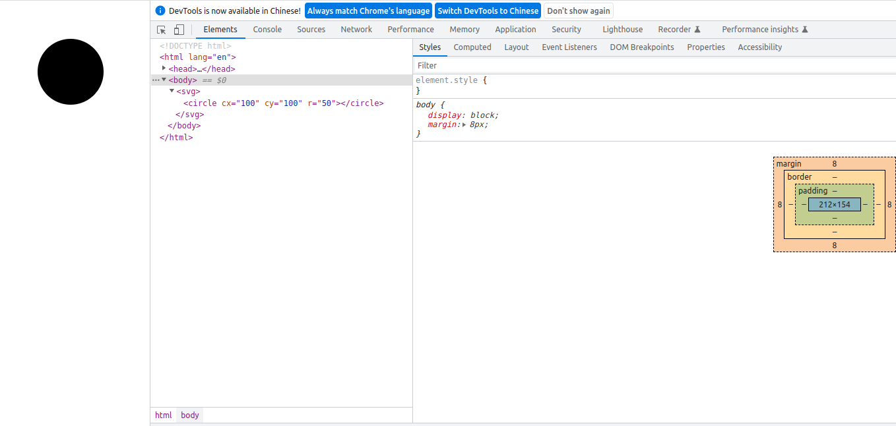

# SVG
> [mdn](https://developer.mozilla.org/zh-CN/docs/Web/SVG/Tutorial)

## 简介
SVG 是 Scalable Vector Graphics(可缩放矢量图形)的缩写。于2003年被Sun公司、Adobe、Apple、IBM以及柯达共同确立成为W3C推荐标准`SVG1.1`。
### 概念
1. SVG是可缩放矢量图形
2. SVG是一个基于文本的开放网络标准，用来定义用于网络的矢量图形
3. SVG图像在放大或改变尺寸的情况下其图形质量不会有所损失，因此能够优雅而简洁地渲染不同大小的图形，并和CSS,DOM,JS，SMIL等其他网络标准无缝衔接
4. SVG使用XML格式定义图形
5. SVG是万维网联盟与诸如DOM和XSL之类的W3C标准是一个整体

### 优势
1. SVG与JPEG和GIF图像比起来，尺寸更小，且压可压缩性更强
2. SVG图像中的文本是可选的，同时也是可搜索的，且可以与JS技术一起运行
3. SVG可在图像质量不下降的情况下被放大和缩小
4. SVG可被非常多的工具读取和修改（比如文本编辑器）
5. SVG图像不依赖分辨率，可在任何的分辨率下被高质量的打印
6. SVG文件是纯粹的XML
7. SVG是开放的标准

### 劣势
1. SVG复杂度越高渲染速度越慢（任何过度使用DOM的应用都不快）
2. SVG不适合游戏应用，只能结合Canvas来实现
3. SVG不能动态的修改动画内容
> ❗PS: 需要注意的是因为XML和HTML不同，**XML是区分大小写的**，而SVG是使用XML格式来定义图形，所以在编写SVG的的时候元素和属性必须按标准格式书写。

### 浏览器兼容性
[CANIUSE](https://caniuse.com/?search=svg)

## 语法
SVG的语法如下：
```html
<svg>
  <circle cx="100" cy="100" r="50" />
</svg>
```
如上面的语法所示，SVG的绘制其实就是一个SVG标签，然后在标签内绘制你要绘制的内容，比如上面的语法是在SVG标签中绘制了一个圆形(cx、cy为圆的坐标，r为圆的半径)。
代码如下：
```html
<!DOCTYPE html>
<html lang="en">
<head>
  <meta charset="UTF-8">
  <meta http-equiv="X-UA-Compatible" content="IE=edge">
  <meta name="viewport" content="width=device-width, initial-scale=1.0">
  <title>SVG - 语法</title>
</head>
<body>
  <svg>
    <circle cx="100" cy="100" r="50" />
  </svg>
</body>
</html>
```
效果如下：


## 属性
### width&height
用来设置SVG的宽和高
```html
<!DOCTYPE html>
<html lang="en">
<head>
  <meta charset="UTF-8">
  <meta http-equiv="X-UA-Compatible" content="IE=edge">
  <meta name="viewport" content="width=device-width, initial-scale=1.0">
  <title>SVG - 属性</title>
</head>
<body>
  <svg width="300" height="300">
    <circle cx="100" cy="100" r="50" />
  </svg>
</body>
</html>
```
效果如下：

> 注意：在不设置宽高的情况下，默认为300*150，当内部元素大于300*150时，大于部分会被隐藏。

在坐标（100，100）的地方绘制一个半径为100的源
```html
<body>
  <svg>
    <circle cx="100" cy="100" r="100" />
  </svg>
</body>
```

### viewBox
viewBox属性定义了SVG中可以显示的区域。

语法：`viewBox="x y w h"` => x、y为起始点，w、h为显示区域的宽高。

下面我们将在一个尺寸为300 * 300的SVG中绘制一个坐标为（100, 100）半径为100的圆，同时我们加上viewBox属性为"0 0 100 100"
```html
<body>
  <svg width="300" height="300" viewBox="0 0 100 100">
    <circle cx="100" cy="100" r="100" />
  </svg>
</body>
```
效果如下：
如图SVG里面的圆只显示了一部份，原因是viewBox定义了一个：从（0, 0）点开始，宽高为100 * 100的显示区域。而这个100 * 100的显示区域会放到300 * 300(svg宽高)的SVG中去显示，整体就放大了3倍。

### version
version属性用于指明SVG的版本，也就是指明SVG文档应该**遵循的规范**。

version属性纯粹就是一个说明，对渲染或处理没有任何影响。且目前只有1.0 和 1.1这两个版本。
```html
<svg version="1.1"></svg>
```

> 想要看版本差异请自行搜索


### xmlns和xmlns:xlink
SVG是使用XML格式来定义图形，SVG是纯粹的XML文件

在XML中，标签和属性属于命名空间，这是为了防止来自不同技术的标签和属性发生冲突。例如在SVG中存在a标签，在HTML中也存在a标签，那么怎么区分这个a标签属于哪一种技术，这就需要使用命名空间了。 加入命名空间以后我们就能知道哪一个是svg:a，哪一个又是html:a，这样我们就可以区分出不同的标签和属性。

xmlns用于声明命名空间（namespace），在此声明之下的所有子标签都属于这个空间内。这里看起来是一个url，但实际上仅仅是一个字符串，这样使用只是惯例。因此很多时候都会被称为”namespace url” 而不是”namespace name”。

当我们在SVG中加入xmlns时，因为它定义了默认命名空间，因此不需要前缀，我们直接在SVG标签中写一个a标签，a标签和UA就知道它是SVG的a标签而不是HTML的a标签
xmlns:xlink 表示前缀为xlink的标签和属性，应该由理解该规范的UA 使用xlink规范 来解释。

> 注解：UA是User Agent的简称。User Agent是Http协议中的一部分，属于头域的组成部分。通俗地讲UA是一种向访问网站提供你所使用的浏览器类型、操作系统、浏览器内核等信息的标识。通过这个标识，用户所访问的网站可以显示不同的排版，从而为用户提供更好的体验或者进行信息统计。

Demo: 
```html
<svg xmlns="http://www.w3.org/2000/svg" xmlns:xlink="http://www.w3.org/1999/xlink"></svg>
```

## 基本图形

基本图形其实就是我们插入到SVG标签中的元素，如上面示例中的圆形（circle）。

### 圆形（circle）

circle 标签能在屏幕上绘制一个圆形
- 语法：`<circle cx="100" cy="100" r="100"/>`
- 属性：cx、cy为圆的坐标，r为圆的半径
Demo:
```html
<body>
  <svg width="300" height="300">
    <circle cx="100" cy="100" r="100"/>
  </svg>
</body>
```

### 矩形（rect）
rect标签能在屏幕上绘制一个矩形
- 语法：`<rect x="0" y="0" rx="5" ry="5" width="300" height="200"/>`
- 属性：x、y为矩形的起始点坐标，rx、ry为圆角x、y轴方向的半径， width、height为矩形的宽高
Demo:
```html
<body>
  <svg width="300" height="300">
    <rect x="0" y="0" rx="5" ry="5" width="300" height="200"/>
  </svg>
</body>
```

### 椭圆（ellipse）
ellipse标签比circle标签功能更强大，ellipse标签也可以实现圆形的绘制，并且还可以分别缩放圆形的长轴半径和短轴半径，从而达到椭圆的效果。
- 语法：`<ellipse cx="100" cy="100" rx="100" ry="50"/>`
- 属性：cx、cy为椭圆的坐标，rx为椭圆的x轴半径、ry为椭圆的y轴半径
Demo:
```html
<body>
  <svg width="300" height="300">
    <ellipse cx="100" cy="100" rx="100" ry="50"/>
  </svg>
</body>
```

### 线条（line）
line标签可以根据两点的坐标绘制一条直线
- 语法：`<line x1="10" x2="50" y1="110" y2="150"/>`
- 属性：x1、y1为起点的坐标，x2、y2为终点的坐标
Demo:
```html
<body>
  <svg width="300" height="300">
    <!-- 不设置样式属性 style 是看不出效果的 -->
    <line x1="50" x2="50" y1="200" y2="50" style="stroke: #000000;"/>
  </svg>
</body>
```


### 折线（polyline）
polyline标签可以把很多个点链接在一起成为一条折线。
- 语法：`<polyline points="0 0, 20 40, 70 80, 100 90, 200 30, 250 50" />`
- 属性：points为点集数列，其中每个点都必须包含2个数字，一个是x坐标，一个是y坐标。
Demo:
```html
<body>
  <svg width="300" height="300">
    <!-- 不设置样式属性style是看不出效果的 并且polyline默认为填充需要把fill属性设置为none -->
    <polyline points="0 0, 20 40, 70 80, 100 90, 200 30, 250 50" fill="none" style="stroke: #000000;" />
  </svg>
</body>
```

### 多边形（polygon）
polygon标签和polyline标签类似，都是由很多个点链接在一起的。但不同的是polygon路径中的最后一个点和第一个点是默认闭合的。
- 语法：`<polygon points="0 0, 20 40, 70 80, 100 90, 200 30, 250 50" />`
- 属性：points为点集数列，其中每个点都必须包含2个数字，一个是x坐标，一个是y坐标。
Demo: 和折线（polyline）同样的数据
```html
<body>
  <svg width="300" height="300">
    <!-- 不设置样式属性style是看不出效果的 并且polygon默认为填充需要把fill属性设置为none -->
    <polygon points="0 0, 20 40, 70 80, 100 90, 200 30, 250 50" fill="none" style="stroke: #000000;" />
  </svg>
</body>
```

