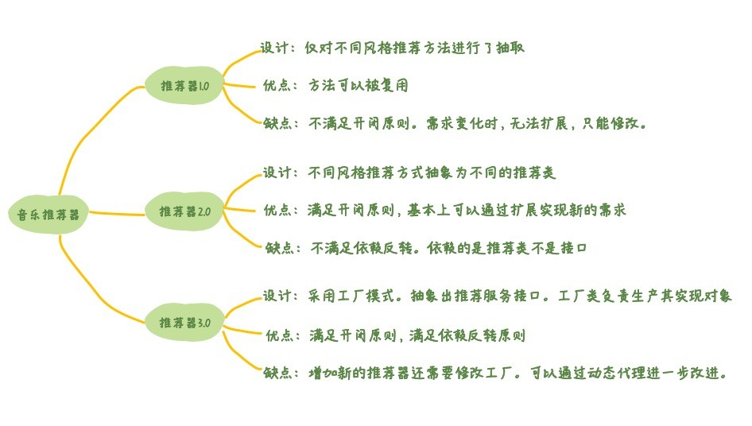

# 🏭工厂模式

## 定义
工厂模式是由一个方法来决定到底要创建哪个类的实例，而这些实例经常都拥有相同的接口。这种模式主要用在所实例化的类型在编译期并不能确定，而是在执行期决定的情况。

## 生活中的例子
试想你去麦当劳买一个汉堡。你只需要告诉收银员要一个xx汉堡。过一会就会有一个此类型的汉堡被制作出来。而你完全不需要知道这个汉堡是怎么被制作出来的。这个例子中你就是客户端代码，麦当劳就是工厂，负责生产汉堡。汉堡是接口，而具体的某一种汉堡，比如说香辣鸡腿堡，就是实现了汉堡接口的类。

## 分类
- 简单工厂
- 工厂方法

## 区别
简单工厂是将创建对象的步骤放在父类进行，工厂方法使延迟到子类在进行，它们两者都可以总结为：`根据传入的字符串来选择对应的类`

## 实现
### 简单工厂
```js
var UserFactory = function(role) {
  function Admin() {
    this.name = "管理员"
    this.viewpage = ["首页", "查询", "权限管理"]
  }
  function User() {
    this.name = "普通用户"
    this.viewPage = ["首页"， "查询"]
  }
  switch(role) {
    case: 'admin':
      return new Admin();
      break;
    case: 'user':
      return new User();
      break;
    default:
      throw new Error('参数错误，可选参数: admin、user');
  }
}
// admin.name可以修改值，这样是不安全的
var admin = UserFactory('admin');
var user = UserFactory('user');
```

### 工厂方法
```js
// 安全模式创建的工厂方法函数
var UserFactory = function(role) {
  if(this instanceof UserFactory) {
    var s = new this[role]();
    return s;
  } else {
    return new UserFactory(role);
  }
}
// 工厂方法函数的原型中设置所有对象的构造函数
UserFactory.prototype = {
   Admin: function() {
     this.name = "管理员"
     this.viewpage = ["首页", "查询", "权限管理"]
   },
   User: function() {
     this.name = "用户"
     this.viewpage = ["首页", "查询"]
   }
}
// 执行上下文是window对象
var admin = UserFactory('Admin')
var user = UserFactory('User')
admin instanceof UserFactory // false
```

### 再来一个TS的
```ts
interface Product {
  operation(): string;
}

abstract class Creator {
  public abstract factoryMethod(): Product
  public someOperation(): string {
    // this指向？
    const product = this.factoryMethod();
    return `Creator: The same creator's code has just worked with ${product.operation()}`;
  }
}

class ConcreteCreator1 extends Creator {
  public factoryMethod(): Product {
    return new ConcreteProduct1();
  }
}

class ConcreteCreator2 extends Creator {
  public factoryMethod(): Product {
    return new ConcreteProduct2();
  }
}

class ConcreteProduct1 implements Product{
  public operation(): string {
    return '{Result of the ConcreteProduct1}';
  }
}

class ConcreteProduct2 implements Product{
  public operation(): string {
    return '{Result of the ConcreteProduct2}';
  }
}

function clientCode(creator: Creator) {
  // ...
  console.log('Client: I\'m not aware of the creator\'s class, but it still works.');
  console.log(creator.someOperation());
  // ...
}

console.log('App: Launched with the ConcreteCreator1.');
clientCode(new ConcreteCreator1());
console.log('');

console.log('App: Launched with the ConcreteCreator2.');
clientCode(new ConcreteCreator2());
```

## 适合应用场景
- 当你在编写代码的过程中， 如果无法预知对象确切类别及其依赖关系时， 可使用工厂方法。

工厂方法将创建产品的代码与实际使用产品的代码分离， 从而能在不影响其他代码的情况下扩展产品创建部分代码。
例如， 如果需要向应用中添加一种新产品， 你只需要开发新的创建者子类， 然后重写其工厂方法即可。

## ✔Demo（循序渐进）
### 音乐推荐器1.0版本
需求：是能够根据用户选择的音乐风格，推荐不同风格的歌曲清单。
```ts
class RecommendMusicService {
  recommend(style: string): Array<string> {
    const recommendMusicList: string[] = []
    switch(style) {
      case 'metal':
        recommendMusicList.push("Don't cry")
        break;
      case 'country':
        recommendMusicList.push("Hotel california")
        break;
      case 'grunge':
        recommendMusicList.push("About a girl")
        break;
      default:
        recommendMusicList.push("My heart will go on")
        break;
    }
    return recommendMusicList
  }
}
```
recommed 方法太长了，重构下，把每种音乐风格的推荐逻辑封装到相应的方法中。这样推荐方法就可以复用了。
```ts
class RecommendMusicService {
  recommend(style: string): Array<string> {
    const recommendMusicList: string[] = []
    switch(style) {
      case 'metal':
        this.recommendMetal(recommendMusicList)
        break;
      case 'country':
        this.recommendCountry(recommendMusicList)
        break;
      case 'grunge':
        this.recommendGrunge(recommendMusicList)
        break;
      default:
        this.recommendPop(recommendMusicList)
        break;
    }
    return recommendMusicList
  }

  private recommendPop(recommendMusicList: Array<string>): void {
    recommendMusicList.push("My heart will go on")
    recommendMusicList.push("Beat it")
  }
  private recommendGrunge(recommendMusicList: Array<string>): void {
    recommendMusicList.push("About a girl")
    recommendMusicList.push("Smells like teen spirit")
  }
  private recommendCountry(recommendMusicList: Array<string>): void {
    recommendMusicList.push("Hotel california")
    recommendMusicList.push("Take Me Home Country Roads")
  }
  private recommendMetal(recommendMusicList: Array<string>): void {
    recommendMusicList.push("Don't cry")
    recommendMusicList.push("Fade to black")
  }
}
```
现在好了，但是违反了设计模式6大原则的开闭原则----对扩展开放，对修改关闭。
面对新风格推荐的需求，我们一直都在修改 RecommendMusicService 这个类。以后每次有新风格推荐要添加，都会导致修改 RecommendMusicService 。
那么如何做到实现新的风格推荐需求时，满足开闭原则呢？

### 音乐推荐器2.0版本
添加新需求时，如何做到不修改，去扩展？是不是想到了单一职责？是的，类的职责越单一，那么它就越稳定。RecommendMusicService 类的职责太多了，负责n种风格的推荐。OK，那么我们第一件事就是要减少 RecommendMusicService 类的职责，把每种不同风格的推荐提取到不同的类当中。
比如MetalMusicRecommendService、PopMusicRecommendService、CountryMusicRecommendService。这些类都可以通过 recommed 方法生成推荐的歌曲清单。而 RecommendMusicService 类只是通过调用不同 MusicRecommendService 的 recommed 方法来实现推荐。代码如下：

```ts
class CountryMusicRecommendService {
  recommend(): Array<string> {
    const recommendMusicList: string[] = []
    recommendMusicList.push("Hotel california")
    recommendMusicList.push("Take Me Home Country Roads")
    return recommendMusicList
  }
}

class GrungeMusicRecommendService {
  recommend(): Array<string> {
    const recommendMusicList: string[] = []
    recommendMusicList.push("About a girl")
    recommendMusicList.push("Smells like teen spirit")
    return recommendMusicList
  }
}

class PopMusicRecommendService {
  recommend(): Array<string> {
    const recommendMusicList: string[] = []
    recommendMusicList.push("My heart will go on")
    recommendMusicList.push("Beat it")
    return recommendMusicList
  }
}

class MetalMusicRecommendService {
  recommend(): Array<string> {
    const recommendMusicList: string[] = []
    recommendMusicList.push("Don't cry")
    recommendMusicList.push("Fade to black")
    return recommendMusicList
  }
}

class RecommendMusicService {
  private countryMusicRecommendService = new CountryMusicRecommendService()
  private grungeMusicRecommendService = new GrungeMusicRecommendService()
  private popMusicRecommendService = new PopMusicRecommendService()
  private metalMusicRecommendService = new MetalMusicRecommendService()

  recommend(style: string) {
    let recommendMusicList: string[] = []
    switch(style) {
      case 'metal':
        recommendMusicList = this.metalMusicRecommendService.recommend()
        break;
      case 'country':
        recommendMusicList = this.countryMusicRecommendService.recommend()
        break;
      case 'grunge':
        recommendMusicList = this.grungeMusicRecommendService.recommend()
        break;
      default:
        recommendMusicList = this.popMusicRecommendService.recommend()
        break;
    }
    return recommendMusicList;
  }
}

console.log(new RecommendMusicService().recommend(""));
```
改造后，如果有了新音乐风格推荐的需求，只需要增加相应的 xxxMusicRecommendService 类。然后在 RecommendMusicService 中增加相应分支即可。这样就做到了开闭原则。那么还有什么违背设计原则的地方吗？RecommendMusicService 是不是依赖的 xxMusicRecommendService 类太多了？
没错，而且这么多类，实际上都是做推荐的事情，且都是通过 recommend 方法提供推荐结果。这完全可以抽象出接口，比如 MusicRecommendInterface。那么 RecommendMusicService 依赖 MusicRecommendInterface 就可以了。这解决了依赖反转问题----**应该依赖接口，而不是依赖具体实现**。
单一职责和依赖反转原则。依赖 MusicRecommendInterface 没问题，但是不同的音乐风格，怎么能实例化 MusicRecommendInterface 的某个具体实现呢？工厂模式于是就应运而生了！

### 音乐推荐器3.0版本
工厂模式解决的是类的实例化。无论你需要哪种风格的 MusicRecommendService，只需要告诉工厂，工厂会给你实例化好你需要的具体实现。而工厂能做到这些是基于继承和多态。
RecommendMusicService 只需要依赖 MusicRecommendInterface，具体需要哪个MusicRecommendService 的实现，只需要告诉 RecommendServiceFactory 即可。MusicRecommendService 拿到具体的实现后调用它的 recommand 方法，就可以得到相应风格的推荐歌曲清单。
首先我们需要定义所有 MusicRecommendService 要实现的接口，很简单，只有一个 recommend 方法：

```ts
interface MusicRecommendInterface {
  recommend() : Array<string>;
}

class CountryMusicRecommendService implements MusicRecommendInterface {
  recommend(): Array<string> {
    const recommendMusicList: string[] = []
    recommendMusicList.push("Hotel california")
    recommendMusicList.push("Take Me Home Country Roads")
    return recommendMusicList
  }
}

class GrungeMusicRecommendService implements MusicRecommendInterface {
  recommend(): Array<string> {
    const recommendMusicList: string[] = []
    recommendMusicList.push("About a girl")
    recommendMusicList.push("Smells like teen spirit")
    return recommendMusicList
  }
}

class PopMusicRecommendService implements MusicRecommendInterface {
  recommend(): Array<string> {
    const recommendMusicList: string[] = []
    recommendMusicList.push("My heart will go on")
    recommendMusicList.push("Beat it")
    return recommendMusicList
  }
}

class MetalMusicRecommendService implements MusicRecommendInterface {
  recommend(): Array<string> {
    const recommendMusicList: string[] = []
    recommendMusicList.push("Don't cry")
    recommendMusicList.push("Fade to black")
    return recommendMusicList
  }
}

// 工厂模式中的工厂代码了
class MusicRecommendServiceFactory {
  createMusicRecommend(style: string): MusicRecommendInterface {
    switch (style) {
      case 'metal':
        return new MetalMusicRecommendService()
      case 'country':
        return new CountryMusicRecommendService()
      case 'grunge':
        return new GrungeMusicRecommendService()
      default:
        return new PopMusicRecommendService()
    }
  }
}

console.log(new MusicRecommendServiceFactory().createMusicRecommend("").recommend())
```
>工厂模式解决的是类的实例化问题。




## 概念
在父类中提供一个创建对象的方法,允许子类决定实例化对象的类型。

> 遇到new Class的地方，就要考虑工厂模式
- 工厂方法
- 抽象工厂
- 建造者
创建对象的一种方式。不用每次都亲自创建对象，而是通过一个既定的“工厂”来生产对象。

现在你想要买一个汉堡，你是去KFC买一个，还是自己动手做一个呢？这个问题，服务员就是工厂方法，而动手做一个其实就是`new Hamburg()`。
另外，从快餐店考虑，你想要生产香辣鸡腿堡，是让服务员做出来`new Hamburg()`给到客户，还是让客户自己做一个汉堡呢？

伪代码
OOP中，默认创建对象一般是new class，但是一些情况下用new class会很不方便
```js
let f1
class Foo()

if (a) { f1 = Foo(x) }
if (b) { f2 = Foo(x, y) }
``` 
此时就需要一个“工厂”，把创建者和class分离，符合开放封闭原则。
```js
function create(a, b) {
  if (a) { return Foo(x)}
  if (b) { return Foo(x, y)}
}
const f1 = create(a, b)
```

注意：工厂模式可以拆分三个：
- 工厂方法模式
- 抽象工厂模式
- 建造者模式

### 简易工厂模式
```ts
class Product {
  name: string
  constructor(name: string) {
    this.name = name
  }
  fn1() {
    alert('product fn1')
  }
  fn2() {
    alert('product fn2')
  }
}

class Creator {
  create(name): Product {
    return new Product(name)
  }
}

const creator = new Creator()
const p1 = creator.create('p1')
const p2 = creator.create('p2')
```

[简易工厂](./assets/drowio/simple_factory_mode.drawio ':include :type=code')


### 标准的工厂模式

```ts
type FnType = () => void

interface IProduct {
    name: string;
    fn1: FnType;
    fn2: FnType;
}

class Product1 implements IProduct {
    name: string
    constructor(name: string) {
        this.name = name
    }
    fn1() {
        alert('product1 fn1')
    }
    fn2() {
        alert('product1 fn2')
    }
}

class Product2 implements IProduct {
    name: string
    constructor(name: string) {
        this.name = name
    }
    fn1() {
        alert('product2 fn1')
    }
    fn2() {
        alert('product2 fn2')
    }
}

class Creator {
    // 依赖倒置原则（如果只返回Product1是无法返回Product2的）
    create(type: string, name: string): IProduct {
        // new 时候的逻辑
        if (type === 'p1') return new Product1(name);
        if (type === 'p2') return new Product2(name);
        throw new Error('Invalid type')
    }
}

const creator = new Creator()
const p1 = creator.create('p1', 'name1')
const p2 = creator.create('p2', 'name2')
```

[标准工厂](./assets/drowio/nomral_factory_mode.drawio ':include :type=code')


**是否符合设计原则？**
6大设计原则中，最重要的就是：开放封闭原则，对扩展开放，对修改封闭
- 工厂和类分离，解耦
- 可以扩展多个类（派生类，或平行的类）
- 工厂的创建逻辑也可以自由扩展

### 场景
#### jQuery $
```html
<body>
  <p>demo1</p>
  <p>demo2</p>
  <p>demo3</p>
</body>
```

```ts
// 扩展window（全局）的属性
// 修改错误
declare interface Window {
    $: (selector: string) => JQuery
}

class JQuery {
    selector: string
    length: number
    constructor(selector: string) {
        // 将类数组转换为数组
        const domList = Array.prototype.slice.call(document.querySelectorAll(selector))
        const length = domList.length
        for(let i = 0; i < length; i++) {
            // @ts-ignore
            // 修改错误
            this[i] = domList[i];
        }
        this.selector = selector;
        this.length = length
    }
    append(elem: HTMLElement): JQuery {
        // append 的操作
        return this;
    }
    addClass(className: string): JQuery {
        // addClass 的操作
        return this;
    },
    html(htmlStr: string) : JQuery | string {
      if (htmlStr) {
        // set html
        return this
      } else {
        // get html
        const html = 'xxx'
        return html
      }
    }
    // ... methods ...
}

// 修改错误
function $(selector: string) {
    return new JQuery(selector) 
}
const $div = $('div');
const $p = $('p');
window.$ = $;
console.log($('p'))


// 不用工厂
// const $div = new JQuery('div')

// 工厂模式
// window.$ = (selector: string) => {
//     // 逻辑封装代码...
//     return new JQuery(selector)
// }


// 伪代码  演示JQuery的实例结构
const jquery = {
    '0': div1, 
    '1': div2, 
    '2': div3,
    length: 3,
    selector : 'div',
}
```
做一个对比，如果开放给用户的不是$,然后让用户自己去`new JQuery(selector)`,带来的问题：
- 不方便链式操作，如`$('div').append($('$p1')).html()`
- 不宜将构造函数暴露给用户，尽量高内聚、低耦合

#### Vue _createElementVNode
Vue（template模板）和React（JSX）本质是语法糖，转化为render函数，再转化为VNode(Vue._createElementVNode、Vue._createElementBlock/React.createElement等)，然后进行diff算法对比完之后，会转换为真实PDOM渲染为页面。
[Vue Template Explorer](https://template-explorer.vuejs.org/#eyJzcmMiOiI8ZGl2PlxyXG4gIDxzcGFuPumdmeaAgeaWh+acrDwvc3Bhbj5cclxuICA8c3BhbiA6aWQ9XCJoZWxsb1wiIGNsYXNzPVwiYmFyXCI+e3sgbXNnIH19PC9zcGFuPlxyXG48L2Rpdj4iLCJvcHRpb25zIjp7fX0=)
```html
<div>
  <span>静态文本</span>
  <span :id="hello" class="bar">{{ msg }}</span>
</div>
```
```js
import { createElementVNode as _createElementVNode, toDisplayString as _toDisplayString, openBlock as _openBlock, createElementBlock as _createElementBlock } from "vue"

export function render(_ctx, _cache, $props, $setup, $data, $options) {
  return (_openBlock(), _createElementBlock("div", null, [
    _createElementVNode("span", null, "静态文本"),
    _createElementVNode("span", {
      id: _ctx.hello,
      class: "bar"
    }, _toDisplayString(_ctx.msg), 9 /* TEXT, PROPS */, ["id"])
  ]))
}

// Check the console for the AST
```
#### React createElement
[babel](https://babel.docschina.org/repl/#?browsers=defaults%2C%20not%20ie%2011%2C%20not%20ie_mob%2011&build=&builtIns=false&spec=false&loose=false&code_lz=MYewdgzgLgBADgJxAMwJYBsCmMC8MA8AJqgG4B8AUDAagLYDmMECwOARAB5cB0cY9basHQBDCBAByI2pnZ16ARjYB6StXwALAMxkA3jADaAVwiYE3NAmhSZAGhgmz3UdemYAutwBWIVGAAUAOQwgQCUMAC--MralNHE5EA&debug=false&forceAllTransforms=false&shippedProposals=false&circleciRepo=&evaluate=true&fileSize=false&timeTravel=false&sourceType=module&lineWrap=true&presets=env%2Creact%2Cenv&prettier=false&targets=&version=7.19.5&externalPlugins=)

```jsx
const profile = <div>
  
  <h3>{ [user.firstName, user.lastName].join(' ') }</h3>
</div>
```
```js
// 返回VNode
"use strict";

const profile = /*#__PURE__*/React.createElement("div", null, /*#__PURE__*/React.createElement("img", {
  src: "xxx.png",
  className: "img1"
}), /*#__PURE__*/React.createElement("h3", null, [user.firstName, user.lastName].join(' ')));
```

伪代码
```js
// a
new VNode()

// b
new VNode()

// c
new VNode()

// 使用工厂模式
function createElement() {
  return VNode()
}

createElement(a)
createElement(b)
createElement(c)
```
```js
class VNode(tag, attrs, children) {
  // ...
}
React.createElement = function (tag, attrs, children) {
  return new VNode(tag, attrs, children)
}
```
## Demo
```ts
interface IAniaml {
   legs: number
   eyes: number
   ears? :number
   cry: () => void
   fly?: () => void
   eat: (food: string) => string
}

class Dog implements IAniaml {
   legs: number
   eyes: number
   ears: number
   constructor(legs: number, eyes: number, ears: number) {
       this.legs = legs;
       this.eyes = eyes;
       this.ears = ears;
   }
   cry () {
       alert('The little dog can wang wang');
   }
   eat (food: string) {
       if (food === '骨头') {
           return '我喜欢吃'
       } else {
           return '我不喜欢吃'
       }
   }
}
class Bird implements IAniaml {
   legs: number
   eyes: number
   constructor(legs: number, eyes: number) {
       this.legs = legs;
       this.eyes = eyes;
   }
   cry() {
       alert('叽叽喳喳')
   }
   eat(food: string) {
       if (food === '稻子') {
           return '好吃'
       } else {
           return '可能好吃'
       }
   }
}
class Creator {
   create(className: string, legs: number, eyes: number, ears: number): IAniaml {
       if (className === 'dog') return new Dog(legs, eyes, ears);
       if (className === 'bird') return new Bird(legs, eyes);
       return new Bird(legs, eyes);
   }
}

const creator = new Creator();
const dog = creator.create('dog', 4, 2, 2);
const bird = creator.create('bird', 2, 2, 0);
```
