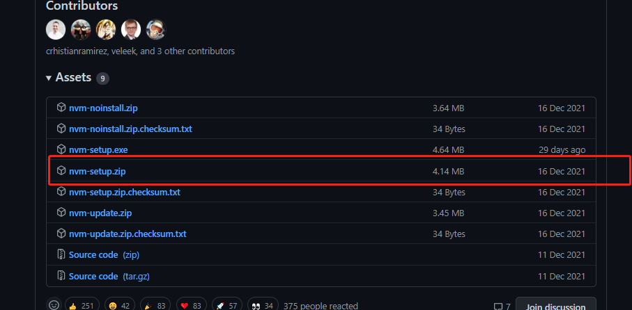

# nvm
>[原文](https://www.virtualbing.fun/#/NodeJS/%E7%89%88%E6%9C%AC%E6%8E%A7%E5%88%B6/nvm/Windows10%E5%AE%89%E8%A3%85)

## Windows10安装nvm

`nvm` 的底层设计是仅支持 `Linux/MaxOS` 的，因此 `Windows` 环境下需要使用其衍生版本，为： `nvm-windows` ，[Github地址](https://github.com/coreybutler/nvm-windows)

### 下载

去 `GitHub` 上下载即可，[下载地址](https://github.com/coreybutler/nvm-windows/releases/)



### 安装

下一步下载的压缩包解压后是一个 `exe` 文件，双击安装即可，注意 `安装的时候路径中不能有中文` 。

安装完成后测试，打开 `CMD` 终端，输入 `nvm` 即可。得到如下输出即表示安装成功。

```bash
$ nvm

Running version 1.1.8.

Usage:

  nvm arch                     : Show if node is running in 32 or 64 bit mode.
  nvm current                  : Display active version.
  nvm install <version> [arch] : The version can be a specific version, "latest" for the latest current version, or "lts" for the
                                 most recent LTS version. Optionally specify whether to install the 32 or 64 bit version (defaults
                                 to system arch). Set [arch] to "all" to install 32 AND 64 bit versions.
                                 Add --insecure to the end of this command to bypass SSL validation of the remote download server.
  nvm list [available]         : List the node.js installations. Type "available" at the end to see what can be installed. Aliased as ls.
  nvm on                       : Enable node.js version management.
  nvm off                      : Disable node.js version management.
  nvm proxy [url]              : Set a proxy to use for downloads. Leave [url] blank to see the current proxy.
                                 Set [url] to "none" to remove the proxy.
  nvm node_mirror [url]        : Set the node mirror. Defaults to https://nodejs.org/dist/. Leave [url] blank to use default url.
  nvm npm_mirror [url]         : Set the npm mirror. Defaults to https://github.com/npm/cli/archive/. Leave [url] blank to default url.
  nvm uninstall <version>      : The version must be a specific version.
  nvm use [version] [arch]     : Switch to use the specified version. Optionally use "latest", "lts", or "newest".
                                 "newest" is the latest installed version. Optionally specify 32/64bit architecture.
                                 nvm use <arch> will continue using the selected version, but switch to 32/64 bit mode.
  nvm root [path]              : Set the directory where nvm should store different versions of node.js.
                                 If <path> is not set, the current root will be displayed.
  nvm version                  : Displays the current running version of nvm for Windows. Aliased as v.

```


### 换源

```bash
$ nvm node_mirror https://npmmirror.com/mirrors/node
```


### 问题

> Cannot create a file when that file already exists

通过 `nvm install x.x.x` 之后启用这个版本，例如：

```
nvm install 14.18.0
nvm use 14.18.0
exit status 1: Cannot create a file when that file already exists.
```

#### 问题产生原因

安装 `nvm` 过程中，会要设置 `nodejs` 的快捷连接 `symlink` ， `windows` 默认是 `C:\Program Files\nodejs` 。

`nvm` 就是通过**修改快捷链接来改变node的版本**。

然而之前系统中已经安装了 `nvm` ，**有残留**，具体可以看此[issue](https://github.com/coreybutler/nvm-windows/issues/333#issuecomment-474391460)

#### 解决办法

卸载 `nvm` ，删除 `C:\Users\User Name\AppData\Roaming\nvm` 文件夹，重新安装。

#### Access is denied

```bash
$ nvm use 14.18.0
exit status 1: Access is denied.
```

#### 产生原因

由于安装路径自定义到了**E盘**，然后 `node` 后采用 `nvm use x.x.x` 来激活版本失败。

#### 解决办法

以**管理员身份**运行 `CMD` ，之后执行 `nvm use x.x.x` 命令即可。

```powershell
$ nvm use 16.14.2
```


## 基础用法

### 查看远端所有镜像版本

```bash
$ nvm ls-remote
```

### 查看本地已安装版本

```bash
$ nvm ls
```

### 安装指定版本node

```bash
$ nvm install 12.18.2
```

### 使用安装好的版本

```bash
$ nvm use node
```

### 查看node版本

```bash
$ nvm run node --version
```

### 指定默认版本

```bash
$ nvm alias default 14.15.0
default -> 14.15.0 (-> v14.15.0)
```

### 附

- 指定淘宝镜像源安装`nrm`

```bash
$ npm i nrm -g --registry=http://registry.npmmirror.com
```

> 在 `Windows` 环境下， `nrm` 由于不再更新，已经有开始报错的时候了。

- 直接配置`Register`地址

```bash
$ npm config set registry https://registry.npmmirror.com
```

