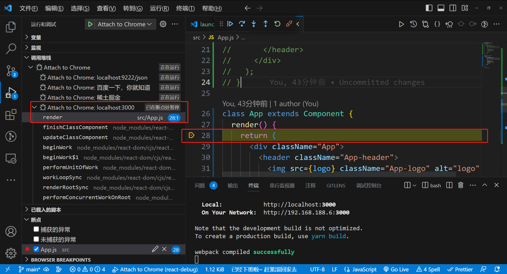

# 前端调试
以下是主要内容：
1. 用 VSCode Debugger 调试网页的 JS、
2. 用 VSCode Debugger 调试 Node.js、
3. 用 Chrome DevTools 调试网页
4. 调试工具的原理。

可以给调试下个定义：
> 代码在某个平台运行（浏览器、Node.js、Electron、小程序等任何能执行 JS 代码的平台），把运行时的状态（调用栈、执行上下文，或者 DOM 的结构，React 组件的状态等）通过某种方式（一般是通过基于 WebSocket 的调试协议）暴露出来，传递给开发工具做 UI 的展示和交互，辅助开发者排查问题、梳理流程、了解代码运行状态等，这个就是调试。

## 原理
### Chrome DevTools 原理
Chrome DevTools 分为两部分，backend 和 frontend：
- backend 和 Chrome 集成，负责把 Chrome 的网页运行时状态通过调试协议暴露出来。
- frontend 是独立的，负责对接调试协议，做 UI 的展示和交互。

两者之间的调试协议叫做 Chrome DevTools Protocol，简称 CDP。

传输协议数据的方式叫做信道（message channel），有很多种，比如 Chrome DevTools 嵌入在 Chrome 里时，两者通过全局的函数通信；当 Chrome DevTools 远程调试某个目标的代码时，两者通过 WebSocket 通信。

> frontend、backend、调试协议（CDP）、信道，这是 Chrome DevTools 的 4 个组成部分。


[Chrome DevTools原理](./assets/drowio/chrome_devtools_principle.drawio ':include :type=code')

backend 可以是 Chromium，也可以是 Node.js 或者 V8，这些 JS 的运行时都支持 Chrome DevTools Protocol。

这就是 Chrome DevTools 的调试原理。

### VSCode Debugger 原理
和 Chrome DevTools 差不多，也是分为 frontend、backend、调试协议这几部分，只不过它多了一层适配器协议。

[VSCode Debugger原理](./assets/drowio/VSCodeDebuggerProtocol.drawio ':include :type=code')

为了能直接用 Chrome DevTools 调试 Node.js 代码，Node.js 6 以上就使用 Chrome DevTools Protocol 作为调试协议了，所以 VSCode Debugger 要调试 Node.js 也是通过这个协议。

但是中间多了一层适配器协议 Debug Adapter Protocol，这是为什么呢？
  因为 VSCode 不是 JS 专用编辑器呀，它可能用来调试 Python 代码、Rust 代码等等，自然不能和某一种语言的调试协议深度耦合，所以多了一个适配器层。

[VSCode Debugger原理](./assets/drowio/VSCodeDebuggerAdapter.drawio.drawio ':include :type=code')

这样 VSCode Debugger 就可以用同一套 UI 和逻辑来调试各种语言的代码，只要对接不同的 Debug Adapter 做协议转换即可。

还有另一个好处，就是别的编辑器也可以用这个 Debug Adapter Protocol 来实现调试，这样就可以直接复用 VSCode 的各种语言的 Debug Adapter 了。

> VSCode Debugger 的 UI 的部分算是 frontend，而调试的目标语言算是 backend 部分，中间也是通过 WebSocket 传递调试协议。

### Vue/React DevTools
以 Chrome 插件（Chrome Extension）的形式存在的，要搞懂它们的原理就得了解 Chrome 插件的机制。

Chrome 插件中可以访问网页的 DOM 的部分叫做 Content Script，随页面启动而生效，可以写一些操作 DOM 的逻辑。还有一部分是后台运行的，叫做 Background，浏览器启动就生效了，生命周期比较长，可以做一些常驻的逻辑。

如果是扩展 DevTools 的 Chrome 插件，那还有一部分 DevTools Page，是在 DevTools 里显示的页面：

- Content Script 部分可以操作 DOM，可以监听 DOM Event。
- Backgroud 部分可以访问 extension api，可以和 Content Script 还有 DevTools Page 通信。
- DevTools Page 部分可以访问 devtools api，可以向当前 window 注入 JS 执行。

Vue DevTools 和 React DevTools 就是基于Chrome插件架构来实现的调试功能。

看 [Vue DevTools 的源码目录](https://github.com/vuejs/devtools/tree/main/packages)会发现，它也是分为 backend 和 frontend 的


那 backend 运行在哪，frontend 运行在哪，两者怎么通信呢？
- DevTools Page 是可以在页面 eval JS 的，那就可以注入 backend 的代码。
- backend 的代码可以拿到 Vue 组件的信息，通过 window message 的方式传递给 Background。
- Background 可以和 DevTools Page 通信，从而实现消息转发。
- DevTools Page 根据拿到的数据，渲染组件的信息，实现交互功能。

DevTools Page 部分渲染出的界面是这样的：

React DevTools 也是类似的，都是通过 backend 拿到组件信息，然后传递给 DevTools Page 做渲染和交互。


不过 React DevTools 还有独立的 Electron 应用，可以用于 React Native 的调试。

这种自定义调试工具也是用的 Chrome DevTools Protocol 协议么？
明显不是，CDP 协议用来调试 DOM、JS 等挺不错的，但是不好扩展，如果有别的需求，一般都是自定义调试协议。

都有 backend 部分负责拿到运行时的信息，有 frontend 部分负责渲染和交互，也有调试协议用来规定不同数据的格式，还有不同的信道，比如 WebSocket 、Chrome 插件的 background 转发等。

> frontend、backend、调试协议、信道，这是调试工具的四要素。

不过，不同的调试工具都会有不同的设计，比如 VSCode Debugger 为了跨语言复用，多了一层 Debugger Adapter，React DevTools 有独立的 electron 应用，用自定义调试协议，可以调试 React Native 代码。

## 调试网页的JS
以 React 项目为例，用 create-react-app 创建一个 react 项目：
```bash
$ yarn create react-app test-react-debug
```
进入项目目录，执行 `yarn start`。

它会启动一个开发服务，然后浏览器访问 localhost:3000：

打开 Chrome DevTools，在 Sources 面板找到 src/index.js，打上个断点：

然后刷新页面就可以开始调试了：


代码会在断点处断住，右边会显示当前 local 作用域的变量，global 作用域的变量，还有调用栈 call stack。


上面有几个控制执行的按钮，分别是：
恢复执行

单步执行

进入函数调用

跳出函数调用

代码执行下一步

让断点失效

在异常处断住

**可以控制代码的执行，可以看到每一步的调用栈和作用域的变量，那理清代码的逻辑，或者排查代码中的问题不就很容易了么？**

其实调试网页的 JS，除了 Chrome DevTools 外，还有一种更好用的调试方式： VSCode Debugger。

用 VSCode 打开项目目录，创建 .vscode/launch.json 文件：

点击右下角的 Add Configuration(添加配置)... 按钮，选择 Chrome: Launch(Chrome: 启动)


把访问的 url 改为开发服务器启动的地址：
```json
{
  "configurations": [
    {
      "name": "Launch Chrome",
      "request": "launch",
      "type": "chrome",
      // "url": "http://localhost:8080",
      "url": "http://localhost:3000",
      "webRoot": "${workspaceFolder}"
    }
  ]
}
```
然后进入 Debug 窗口，点击启动：

你会发现它启动了浏览器，并打开了这个 url：


在代码打个断点，然后点击刷新：


代码会执行到断点处断住，本地和全局作用域的变量，调用栈等都会展示在左边：


上面的控制按钮分别对应恢复执行、单步执行、进入函数调用、跳出函数调用，这个和 Chrome DevTools 一样：

还多了刷新和停止的按钮。

那异常断点的按钮呢？


可以在被 catch 的异常处断住，也可以在没有被 catch 的异常处断住。

看起来和 Chrome DevTools 里调试差不多呀，在 VSCode Debugger 里调试有啥好处么？

好处是不用切换工具呀，之前是调试在 Chrome DevTools，写代码在 VSCode，而现在写代码和调试都可以在 VSCode 里，可以边调试边写代码。

比如我想访问 this 的某个属性，可以在 Debug Console 里输入 this 看下它的值，然后再来写代码：


如果你用了 TypeScript 可能会有属性名的提示、属性值类型的提示，但并不知道属性的值是啥。

而边调试边写代码，能直接知道属性值是什么，有哪些函数可以调用。

> 边调试边写代码是推荐的写代码方式。

知道了怎么用，再来思考下：为什么 Chrome DevTools 和 VSCode Debugger 都可以调试网页呢？

这是因为调试协议是一样的，都是 CDP。Chrome DevTools 可以对接 CDP 来调试网页，VSCode Debugger 也可以。只不过 VSCode Debugger 会多一层 Debug Adapter Protocol 的转换。

这也是为什么两个调试工具的功能大同小异。

### 总结
Chrome DevTools 和 VSCode Debugger 都能调试网页的 JS，可以打断点，单步执行，可以看到本地和全局作用域的变量，还有函数调用栈。

但更推荐使用 VSCode Debugger 来调试，这样写代码和调试都用同一个工具，不用切换，而且还可以边调试边写代码。

这两个原理都是对接了 Chrome DevTools Protocol，用自己的 UI 来做展示和交互。

## VSCode Chrome Debugger配置详解

### launch/attach
创建 Chrome Debug 配置有两种方式：launch 和 attach：

它们只是 request 的配置不同：
```json
{
  "configurations": [
    {
      "name": "Attach to Chrome",
      "port": 9222,
      "request": "attach",
      "type": "chrome",
      "webRoot": "${workspaceFolder}"
    },
    {
      "name": "Launch Chrome",
      "request": "launch",
      "type": "chrome",
      // "url": "http://localhost:8080",
      "url": "http://localhost:3000",
      "webRoot": "${workspaceFolder}"
    }
  ]
}
```
我们知道，调试就是把浏览器跑起来，访问目标网页，这时候会有一个 ws 的调试服务，我们用 frontend 的 ws 客户端连接上这个 ws 服务，就可以进行调试了。


VSCode 的 Debugger 会多一层适配器协议的转换，但是原理差不多。

launch 的意思是把 url 对应的网页跑起来，指定调试端口，然后 frontend 自动 attach 到这个端口。

但如果你已经有一个在调试模式跑的浏览器了，那直接连接上就行，这时候就直接 attach。

比如我们手动把 Chrome 跑起来，指定调试端口 remote-debugging-port 为 9222，指定用户数据保存目录 user-data-dir 为你自己创建一个目录。

在命令行执行下面的命令：
```bash
# macos
/Applications/Google\ Chrome.app/Contents/MacOS/Google\ Chrome --remote-debugging-port=9222 --user-data-dir=你自己创建的某个目录

# window
# 步骤：
# chrome图标右键属性-找到目标路径-复制目录
# 我的电脑-右键属性-高级系统设置-环境变量-找到变量Path-新建-填入环境变量目录(注意是目录)
# 打开cmd-输入chrome.exe即可打开
chrome --remote-debugging-port=9222 --user-data-dir=D:\test
```

Chrome 跑起来之后，你可以打开几个网页，比如百度、掘金，然后你访问 localhost:9222/json，这时候你就会发现所有的 ws 服务的地址了：

为什么每个页面有单独的 ws 服务呢？

这个很正常呀，每个页面的调试都是独立的，自然就需要单独的 ws 服务。

然后你创建一个 attach 的 Chrome Debug 配置：
```json
{
  "configurations": [
    {
      "name": "Attach to Chrome",
      "port": 9222,
      "request": "attach",
      "type": "chrome",
      "webRoot": "${workspaceFolder}"
    }
  ]
}
```
点击启动，就会看到 VSCode Debugger 和每一个页面的 ws 调试服务建立起了链接：

比如访问(localhost:3000)之前的 React 项目，就可以进行调试了：


可以多个页面一起调试，每个页面都有独立的调试上下文。

### userDataDir
不知道你有没有注意到刚才手动启动 Chrome 的时候，除了指定调试端口 remote-debugging-port 外，还指定了用户数据目录 user-data-dir。

为什么要指定这个呢？

user data dir 是保存用户数据的地方，比如你的浏览记录、cookies、插件、书签、网站的数据等等，在 macOS 下是保存在这个位置：
```bash
~/Library/Application\ Support/Google/Chrome
```
比如你打开 Default/Bookmarks 看一下，是不是都是你保存的书签？
```bash
open ~/Library/Application\ Support/Google/Chrome/Default/Bookmarks
```


**windows**

你还可以删掉 Default/Cookies，之后再访问之前登陆过的网站试一下，是不是都需要登录了？

这就是用户数据目录的作用。

那为什么启动 Chrome 要手动指定这个呢？都用默认的不行么？

用户数据目录有个特点，就是只能被一个 Chrome 实例所访问，如果你之前启动了 Chrome 用了这个默认的 user data dir，那就不能再启动一个 Chrome 实例用它了。

如果用户数据目录已经跑了一个 Chrome 实例，再跑一个候会报这样的错误：

macos


windows


> 如果指定了位置可以开启多个


所以用调试模式启动 Chrome 的时候，需要单独指定一下 user data dir 的位置。或者你也把之前的 Chrome 实例关掉，这样才能用默认的。

launch 的配置项里也有 userDataDir 的配置：


- **默认是 true**，代表创建一个临时目录来保存用户数据。
  - 把 userDataDir 设置为 true 就每次都需要登录了：
- 也可以设置为 false，使用默认 user data dir 启动 chrome。
  - 这样的好处就是登录状态、历史记录啥的都有：

你也可以指定一个自定义的路径，这样用户数据就会保存在那个目录下：
```json
{
  "configurations": [
  {
    "name": "Launch Chrome",
    "request": "launch",
    "type": "chrome",
    "url": "http://localhost:8080",
    "userDataDir": "../../react-debug/test", // 指定
    "webRoot": "${workspaceFolder}"
  }
  ]
}
```
更重要的是，你安装的 React DevTools、Vue DevTools 插件都是在默认用户数据目录的，要是用临时数据目录跑调试，那这些不都没了？

比如你 userDataDir 设置为 true 的时候，React DevTools 插件是没有的，需要再安装：

userDataDir 设置为 false 的时候，安装过的插件都可以直接用：


但是除了调试用之外，平时也会用到 Chrome 呀，同一个 user data dir 只能跑一个 Chrome 实例的话，那不就冲突了？

这个问题可以用下面的配置解决：

### runtimeExecutable
调试网页的 JS，需要先把 Chrome 跑起来，默认跑的是 Google Chrome，其实它还有另外一个版本 Canary：


这是给开发者用的每日构建版，能够快速体验新特性，但是不稳定。

而 Google Chrome 是给普通用户用的，比较稳定。

这俩是独立的，相互之间没影响，可以都用同一个 user data dir 来启动。

你可以在官网[官网](https://www.google.com/intl/zh-CN/chrome/canary/)把 canary 下载下来。

然后指定 runtimeExecutable 为 canary，使用默认的用户数据目录启动：
```json
{
  "configurations": [
    {
      "name": "Launch Chrome",
      "request": "launch",
      "type": "chrome",
      "runtimeExecutable": "canary",
      "url": "http://localhost:3000",
      "userDataDir": false,
      "webRoot": "${workspaceFolder}"
    }
  ]
}
```
这样你就可以调试用 canary，平时用 chrome 了，两者都有各自的默认数据目录。

> 注意，一定要先安装了 canary，才能指定 canary run

当然，runtimeExecutable 还可以指定用别的浏览器跑：


- 可以是 stable，也就是稳定的 Google Chrome，
- 或者 canary，也就是每日构建版的 Google Chrome Canary，
- 还可以是 custom，然后用 CHROME_PATH 环境变量指定浏览器的地址。

不过常用的还是 Chrome 和 Canary。

### runtimeArgs

启动 Chrome 的时候，可以指定启动参数，比如每次打开网页都默认调起 Chrome DevTools，就可以加一个 --auto-open-devtools-for-tabs 的启动参数：
```json
{
  "configurations": [
    {
      "name": "Launch Chrome",
      "request": "launch",
      "type": "chrome",
      "runtimeExecutable": "canary",
      "runtimeArgs": ["--auto-open-devtools-for-tabs"],
      "url": "http://localhost:3000",
      "userDataDir": false,
      "webRoot": "${workspaceFolder}"
    }
  ]
}
```
效果就是这样的：


想要无痕模式启动，也就是不加载插件，没有登录状态，就可以加一个 --incognito 的启动参数：
```json
{
  "configurations": [
    {
      "name": "Launch Chrome",
      "request": "launch",
      "type": "chrome",
      "runtimeExecutable": "canary",
      "runtimeArgs": ["--incognito"],
      "url": "http://localhost:3000",
      "userDataDir": false,
      "webRoot": "${workspaceFolder}"
    }
  ]
}
```
调试用的浏览器就会以无痕模式启动了


> 其实设置的 userDataDir 就是指定了 --user-data-dir 的启动参数。

## sourceMapPathOverrides
代码是经过编译打包然后在浏览器运行的，比如这样：


却可以直接调试源码，这是通过 sourcemap 做到的。

调试工具都支持 sourcemap，并且是默认开启的：


当然也可以关掉:
Chrome DevTools 里这么关（macos: command(win: ctrl) + shift + p）：
然后输入sourcemap


VSCode Debugger 这么关：
```json
{
  "configurations": [
    {
      "name": "Launch Chrome",
      "request": "launch",
      "type": "chrome",
      "runtimeExecutable": "canary",
      "url": "http://localhost:3000",
      "webRoot": "${workspaceFolder}",
      "sourceMaps": false, // this
    }
  ]
}
```
这样调试的就是编译后的代码了：


在开启 sourcemap 的情况下，用 Chrome DevTools 可以看到，源文件的路径是 /static/js/bundle.js


被 sourcemap 到了 D:\front-end\conosle\react-debug\src\App.js


而在 VSCode 里，这个路径是有对应的文件的，所以就会打开对应文件的编辑器，这样就可以边调试边修改代码。

但有的时候，sourcemap 到的文件路径在本地里找不到，这时候代码就只读了，因为没有地方保存：


这种情况就需要对 sourcemap 到的路径再做一次映射：


通过 sourceMapPathOverrides 这个配置项。

默认有这么三个配置：
```json
{
  "configurations": [
    {
      "name": "Launch Chrome",
      "request": "launch",
      "type": "chrome",
      "runtimeExecutable": "canary",
      "runtimeArgs": ["--incognito"],
      "url": "http://localhost:3000",
      "userDataDir": false,
      "webRoot": "${workspaceFolder}",
      "sourceMapPathOverrides": { // this
        "meteor://💻app/*": "${workspaceFolder}/*",
        "webpack:///./~/*": "${workspaceFolder}/node_modules/*",
        "webpack://?:*/*": "${workspaceFolder}/*"
      }
    }
  ]
}
```
分别是把 meteor、webpack 开头的 path 映射到了本地的目录下。

其中 ?:* 代表匹配任意字符，但不映射，而 * 是用于匹配字符并映射的。

比如最后一个 webpack://?:*/* 到 ${workspaceFolder}/* 的映射，就是把 webpack:// 开头，后面接任意字符 + / 然后是任意字符的路径映射到了本地的项目目录。（workspaceFolder 是一个内置变量，代表项目根目录）

把调试的文件 sourcemap 到的路径映射到本地的文件，这样调试的代码就不再只读了：

### file
除了启动开发服务器然后连上 url 调试之外，也可以直接指定某个文件，VSCode Debugger 会启动静态服务器提供服务：
```json
{
  "configurations": [
    {
      "name": "Launch Chrome",
      "request": "launch",
      "type": "chrome",
      "runtimeExecutable": "canary",
      "userDataDir": false,
      "webRoot": "${workspaceFolder}",
      "file": "${workspaceFolder}/index.html" // 指定某个文件
    }
  ]
}
```
index.html(放在项目根(/)目录下) 的内容如下：

打了个断点，然后启动调试：

这样就可以直接调试静态网页了。

同样，要修改调试的内容需要把 url 映射到本地文件才行，所以有这样一个 pathMapping 的配置：
```json
{
  "configurations": [
    {
      "name": "Launch Chrome",
      "request": "launch",
      "type": "chrome",
      "runtimeExecutable": "canary",
      "runtimeArgs": ["--incognito"],
      "file": "${workspaceFolder}/index.html", // 指定某个文件
      "userDataDir": false,
      "webRoot": "${workspaceFolder}",
      "pathMapping": {
        "/static/js/": "${workspaceFolder}/src/"
      }
    }
  ]
}
```
webRoot 其实就相当于把 / 的 url 映射到了 ${workspaceFolder}/。
这些配置倒是很少用，一般我们还是启动 dev server，再调试某个 url 更多一些。

### 总结
- launch：调试模式启动浏览器，访问某个 url，然后连上进行调试
- attach：连接某个已经在调试模式启动的 url 进行调试
- userDataDir： user data dir 是保存用户数据的地方，比如浏览历史、cookie 等，一个数据目录只能跑一个 chrome，所以默认会创建临时用户数据目录，想用默认的目录可以把这个配置设为 false
- runtimeExecutable：切换调试用的浏览器，可以是 stable、canary 或者自定义的
- runtimeArgs：启动浏览器的时候传递的启动参数
- sourceMapPathOverrides：对 sourcemap 到的文件路径做一次映射，映射到 VSCode - workspace 下的文件，这样调试的文件就可以修改了
- file：可以直接指定某个文件，然后启动调试


## sourcemap的原理和作用
### 什么是 sourcemap
> sourcemap 是关联编译后的代码和源码的，通过一个个行列号的映射。

比如编译后代码的第 3 行第 4 列，对应着源码里的第 8 行第 5 列这种，这叫做一个 mapping。
```js
{
  version : 3,
  file: "out.js",
  sourceRoot : "",
  sources: ["foo.js", "bar.js"],
  names: ["a", "b"],
  mappings: "AAgBC,SAAQ,CAAEA;AAAEA",
  sourcesContent: ['const a = 1; console.log(a)', 'const b = 2; console.log(b)']
}
```
- version：sourcemap 的版本，一般为 3
- file：编译后的文件名
- sourceRoot：源码根目录
- names：转换前的变量名
- sources：源码文件名
- sourcesContent：每个 sources 对应的源码的内容
- mappings：一个个位置映射

为什么 sources 可以有多个呢？

因为可能编译产物是多个源文件合并的，比如打包，一个 bundle.js 就对应了 n 个 sources 源文件。

重点是 mappings 部分：

mappings 部分是通过`分号;` 和`逗号 ,` 分隔的：
```
mappings:"AAAAA,BBBBB;CCCCC"
```


