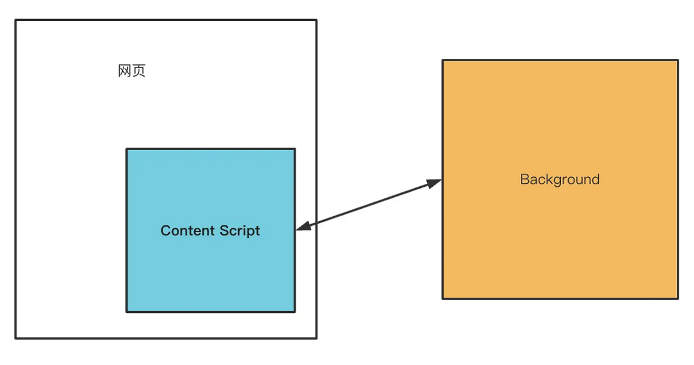

# 前端调试
用 VSCode Debugger 调试网页的 JS、用 VSCode Debugger 调试 Node.js、用 Chrome DevTools 调试网页、调试工具的原理。

可以给调试下个定义：
> 代码在某个平台运行（浏览器、Node.js、Electron、小程序等任何能执行 JS 代码的平台。），把运行时的状态（调用栈、执行上下文，或者 DOM 的结构，React 组件的状态等。）通过某种方式（一般是通过基于 WebSocket 的调试协议）暴露出来，传递给开发工具做 UI 的展示和交互，辅助开发者排查问题、梳理流程、了解代码运行状态等，这个就是调试。

## 原理
### Chrome DevTools 原理
Chrome DevTools 分为两部分，backend 和 frontend：
- backend 和 Chrome 集成，负责把 Chrome 的网页运行时状态通过调试协议暴露出来。
- frontend 是独立的，负责对接调试协议，做 UI 的展示和交互。

两者之间的调试协议叫做 Chrome DevTools Protocol，简称 CDP。

传输协议数据的方式叫做信道（message channel），有很多种，比如 Chrome DevTools 嵌入在 Chrome 里时，两者通过全局的函数通信；当 Chrome DevTools 远程调试某个目标的代码时，两者通过 WebSocket 通信。

frontend、backend、调试协议（CDP）、信道，这是 Chrome DevTools 的 4 个组成部分。

[Chrome DevTools原理](./assets/drowio/ChromeDevToolsProtocol.drawio ':include :type=code')

backend 可以是 Chromium，也可以是 Node.js 或者 V8，这些 JS 的运行时都支持 Chrome DevTools Protocol。

这就是 Chrome DevTools 的调试原理。

### VSCode Debugger 原理
和 Chrome DevTools 差不多，也是分为 frontend、backend、调试协议这几部分，只不过它多了一层适配器协议。
[VSCode Debugger原理](./assets/drowio/VSCodeDebuggerProtocol.drawio ':include :type=code')

为了能直接用 Chrome DevTools 调试 Node.js 代码，Node.js 6 以上就使用 Chrome DevTools Protocol 作为调试协议了，所以 VSCode Debugger 要调试 Node.js 也是通过这个协议。

但是中间多了一层适配器协议 Debug Adapter Protocol，这是为什么呢？
  因为 VSCode 不是 JS 专用编辑器呀，它可能用来调试 Python 代码、Rust 代码等等，自然不能和某一种语言的调试协议深度耦合，所以多了一个适配器层。

[VSCode Debugger原理](./assets/drowio/VSCodeDebuggerAdapter.drawio.drawio ':include :type=code')

这样 VSCode Debugger 就可以用同一套 UI 和逻辑来调试各种语言的代码，只要对接不同的 Debug Adapter 做协议转换即可。

还有另一个好处，就是别的编辑器也可以用这个 Debug Adapter Protocol 来实现调试，这样就可以直接复用 VSCode 的各种语言的 Debug Adapter 了。

> VSCode Debugger 的 UI 的部分算是 frontend，而调试的目标语言算是 backend 部分，中间也是通过 WebSocket 传递调试协议。

### Vue/React DevTools
以 Chrome 插件（Chrome Extension）的形式存在的，要搞懂它们的原理就得了解 Chrome 插件的机制。

Chrome 插件中可以访问网页的 DOM 的部分叫做 Content Script，随页面启动而生效，可以写一些操作 DOM 的逻辑。还有一部分是后台运行的，叫做 Background，浏览器启动就生效了，生命周期比较长，可以做一些常驻的逻辑。

如果是扩展 DevTools 的 Chrome 插件，那还有一部分 DevTools Page，是在 DevTools 里显示的页面：

- Content Script 部分可以操作 DOM，可以监听 DOM Event。
- Backgroud 部分可以访问 extension api，可以和 Content Script 还有 DevTools Page 通信。
- DevTools Page 部分可以访问 devtools api，可以向当前 window 注入 JS 执行。

Vue DevTools 和 React DevTools 就是基于Chrome插件架构来实现的调试功能。

看 [Vue DevTools 的源码目录](https://github.com/vuejs/devtools/tree/main/packages)会发现，它也是分为 backend 和 frontend 的

那 backend 运行在哪，frontend 运行在哪，两者怎么通信呢？
- DevTools Page 是可以在页面 eval JS 的，那就可以注入 backend 的代码。
- backend 的代码可以拿到 Vue 组件的信息，通过 window message 的方式传递给 Background。
- Background 可以和 DevTools Page 通信，从而实现消息转发。
- DevTools Page 根据拿到的数据，渲染组件的信息，实现交互功能。

DevTools Page 部分渲染出的界面是这样的：

React DevTools 也是类似的，都是通过 backend 拿到组件信息，然后传递给 DevTools Page 做渲染和交互。

不过 React DevTools 还有独立的 Electron 应用，可以用于 React Native 的调试。

这种自定义调试工具也是用的 Chrome DevTools Protocol 协议么？
明显不是，CDP 协议用来调试 DOM、JS 等挺不错的，但是不好扩展，如果有别的需求，一般都是自定义调试协议。

都有 backend 部分负责拿到运行时的信息，有 frontend 部分负责渲染和交互，也有调试协议用来规定不同数据的格式，还有不同的信道，比如 WebSocket 、Chrome 插件的 background 转发等。

> frontend、backend、调试协议、信道，这是调试工具的四要素。

不过，不同的调试工具都会有不同的设计，比如 VSCode Debugger 为了跨语言复用，多了一层 Debugger Adapter，React DevTools 有独立的 electron 应用，用自定义调试协议，可以调试 React Native 代码。
