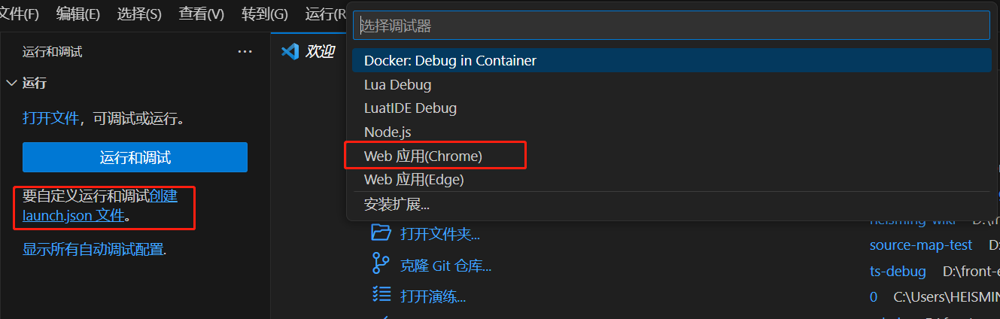
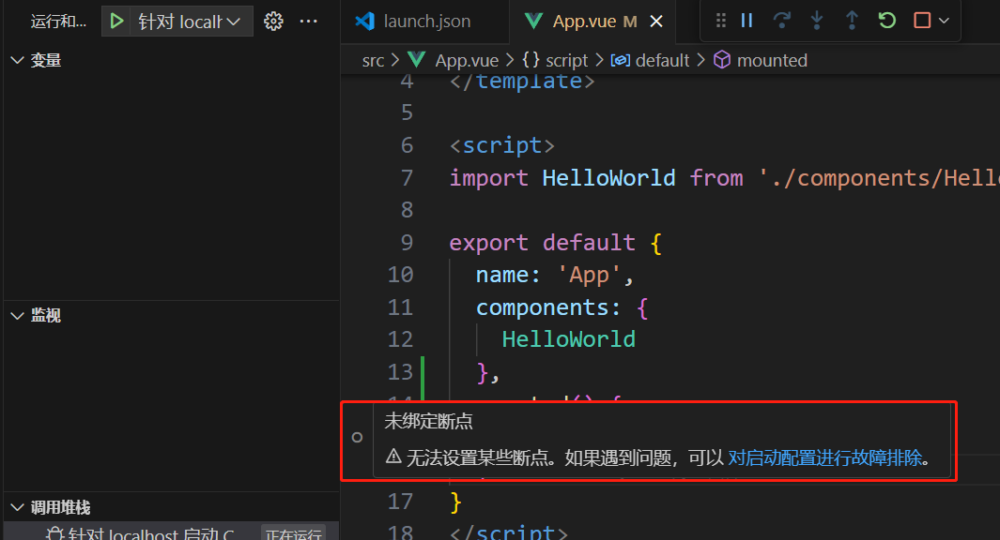
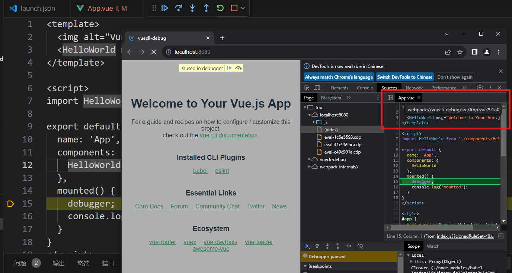
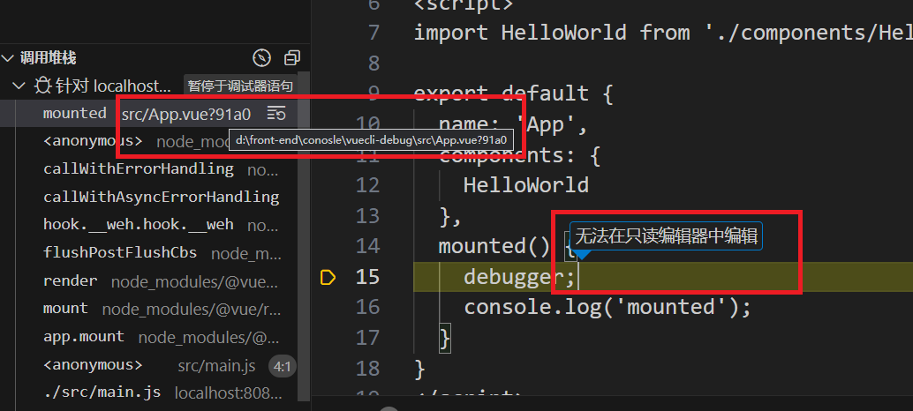
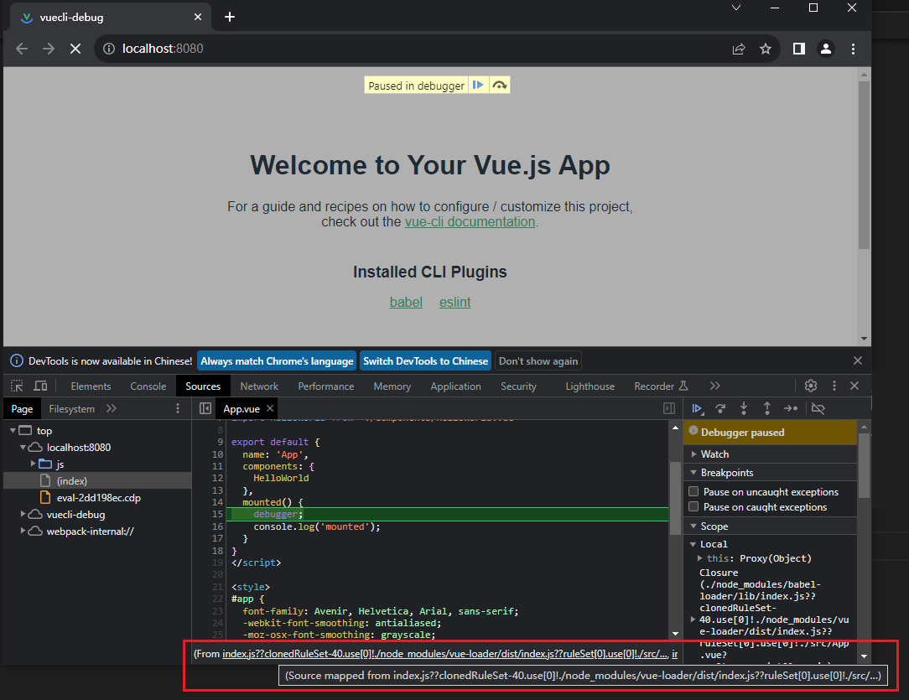
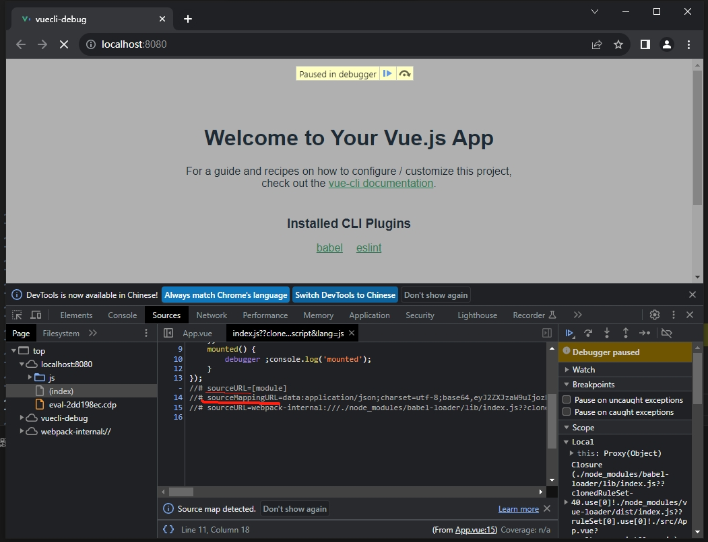

# 调试Vue项目

## 调试 @vue/cli 创建的 webpack 项目
```bash
$ yarn add -g @vue/cli
$ vue -V
```
然后执行 vue create vue-demo1 创建 vue 项目：
```bash
$ vue create vuecli-debug

Vue CLI v5.0.4
┌─────────────────────────────────────────┐
│                                         │
│   New version available 5.0.4 → 5.0.8   │
│                                         │
└─────────────────────────────────────────┘

? Please pick a preset: (Use arrow keys)
> Default ([Vue 3] babel, eslint)
  Default ([Vue 2] babel, eslint)
  Manually select features
```
选择 vue3 的模版。安装完之后把开发服务跑起来。
```bash
 $ cd vuecli-debug
 $ yarn serve
```
浏览器访问localhost:8080，会看到渲染出的页面。

然后我们进行调试：
点击调试窗口的 create a launch.json file(创建launch.json文件) 来创建调试配置文件：


把 Chrome 调试配置的 url 改成目标 url 就可以进行调试了：
```js
{
  // 使用 IntelliSense 了解相关属性。 
  // 悬停以查看现有属性的描述。
  // 欲了解更多信息，请访问: https://go.microsoft.com/fwlink/?linkid=830387
  "version": "0.2.0",
  "configurations": [
    {
      "type": "chrome",
      "request": "launch",
      "name": "针对 localhost 启动 Chrome",
      "url": "http://localhost:8080", // 保持与开发服务器一致
      "webRoot": "${workspaceFolder}"
    }
  ]
}
```
点击 debug 启动，在 vue 组件里打个断点，你会发现断点没生效：


这是为什么呢？

先加个 debugger 来跑一下：
```js
export default {
  name: 'App',
  components: {
    HelloWorld
  },
  mounted() {
    debugger;
    console.log('mounted');
  }
}
```
然后在 Chrome DevTools 里看下：


会发现他从一个乱七八糟的路径，映射到了`webpack://vuecli-debug/src/App.vue?91a0`的路径下。

然后在 VSCode Debugger 里看看这个路径：


发现是`D:\front-end\console\vuecli-debug\src\App.vue?91a0`
本地明显没这个文件，所以就只读了。
其实这个路径已经做过了映射，就是完成了从 `webpack://vuecli-debug/src/App.vue?91a0` 到 `D:\front-end\console\vuecli-debug\src\App.vue?91a0` 的映射。

看一下 sourceMapPathOverrides 默认这三条配置，很容易看出是最后一条做的映射：
```json
 "sourceMapPathOverrides": {
    "meteor://💻app/*": "${workspaceFolder}/*",
    "webpack:///./~/*": "${workspaceFolder}/node_modules/*",
    "webpack://?:*/*": "${workspaceFolder}/*"
  }
```
但问题就出现在后面多了一个 ?hash 的字符串，导致路径不对了。

那为什么会多这样一个 hash 呢？

这是因为 vue cli 默认的 devtool 设置是 **eval-cheap-module-source-map**，前面讲过，eval 是每个模块用 eval 包裹，并且通过 sourceURL 指定文件路径，通过 sourceMappingURL 指定 sourcemap。

在 Chrome DevTools 里点击下面的 source map from 的 url：


会发现先映射到了一个中间文件：


这个是被 eval 包裹并指定了 sourceURL 的模块代码，会被 Chrome DevTools 当作文件加到 sources 里。

这里有两个 sourceURL，第一个 sourceURL 在 sourceMappingURL 之前，这样 sourcemap 映射到的就是这个 url，也就是被 Chrome DevTools 当作文件的路径。而第二个 sourceURL 在之后，它可以修改当前文件的 url，也就是在调试工具里展示的路径。

然后再点击，会跳转回 bundle 的代码：


