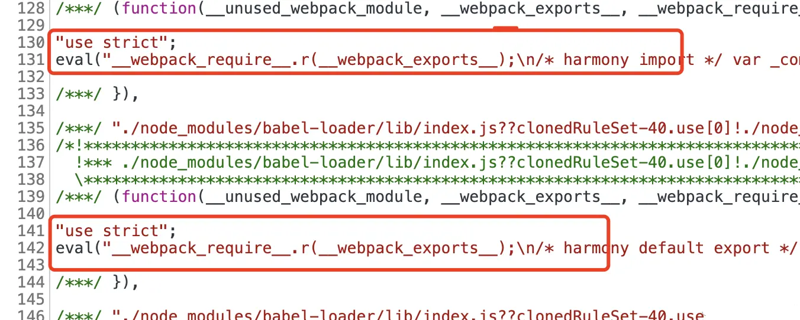
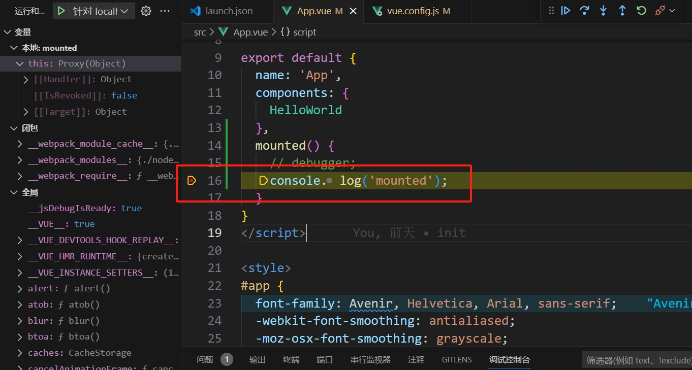
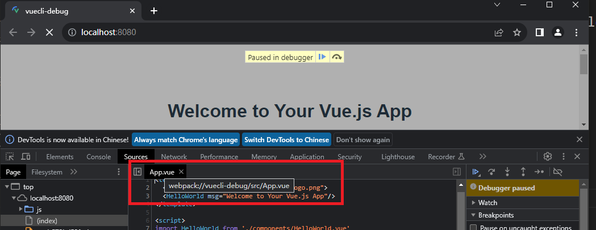
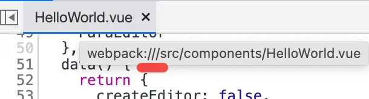
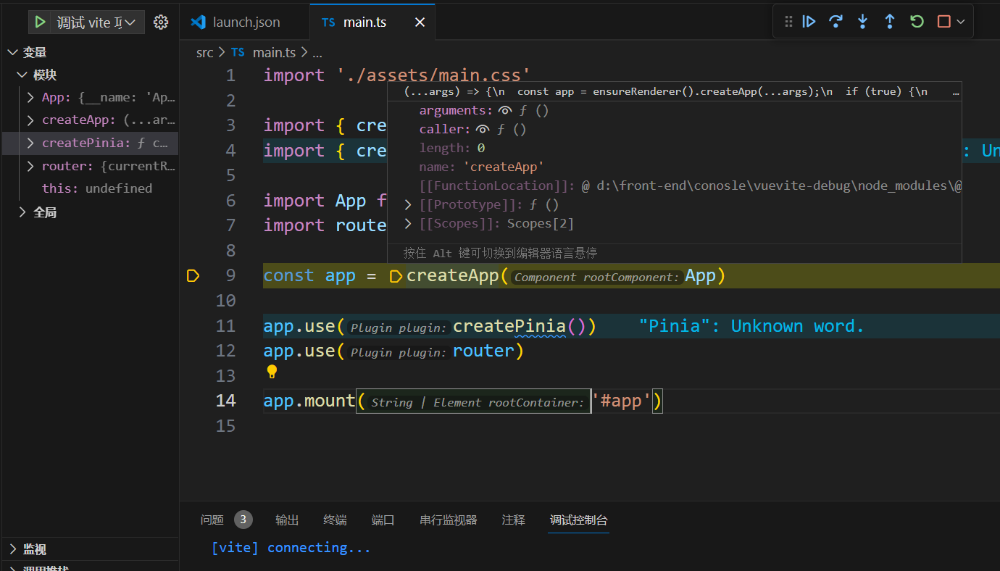
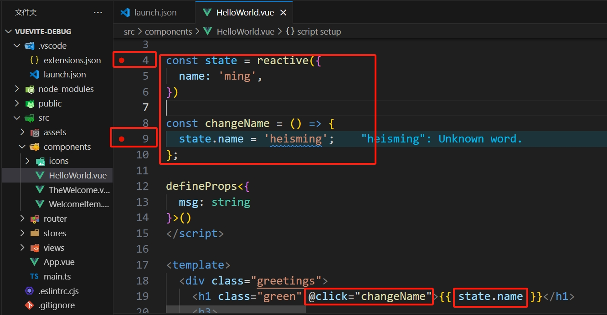
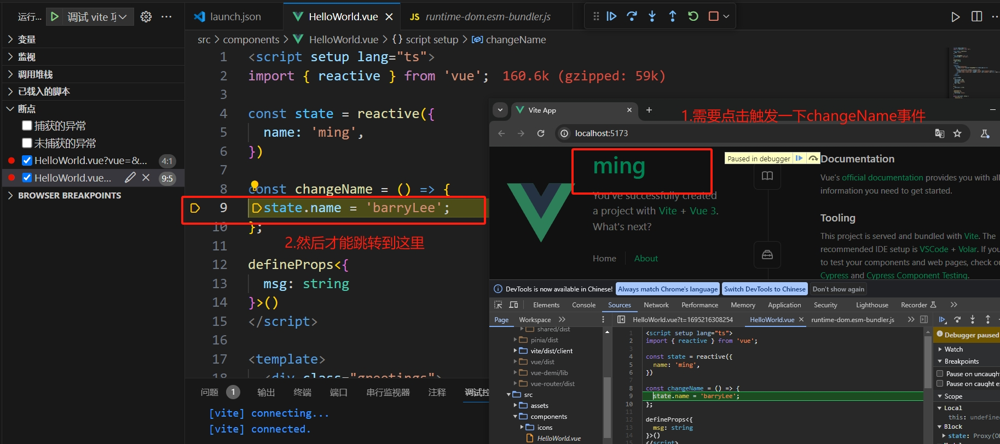
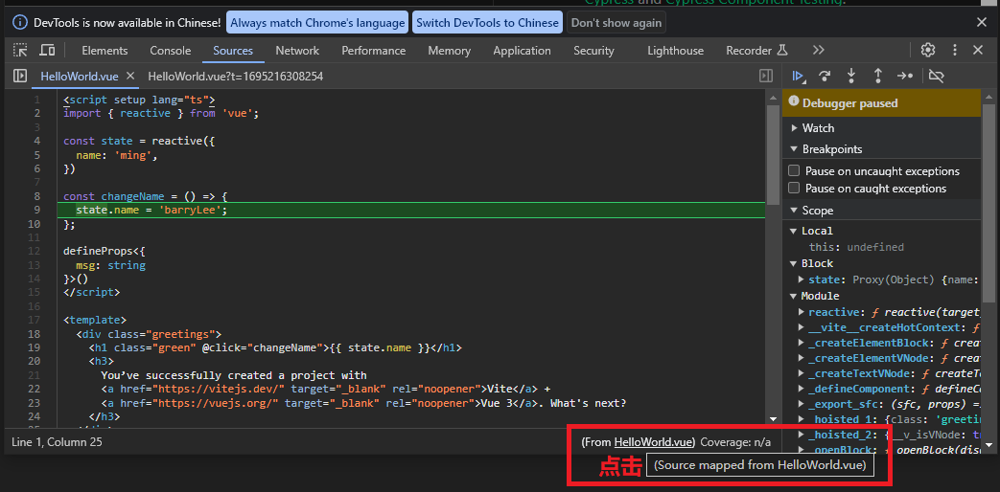

# 调试Vue项目

## 调试 @vue/cli 创建的 webpack 项目
```bash
$ yarn add -g @vue/cli
$ vue -V
```
然后执行 vue create vue-demo1 创建 vue 项目：
```bash
$ vue create vuecli-debug

Vue CLI v5.0.4
┌─────────────────────────────────────────┐
│                                         │
│   New version available 5.0.4 → 5.0.8   │
│                                         │
└─────────────────────────────────────────┘

? Please pick a preset: (Use arrow keys)
> Default ([Vue 3] babel, eslint)
  Default ([Vue 2] babel, eslint)
  Manually select features
```
选择 vue3 的模版。安装完之后把开发服务跑起来。
```bash
 $ cd vuecli-debug
 $ yarn serve
```
浏览器访问localhost:8080，会看到渲染出的页面。

然后我们进行调试：
点击调试窗口的 create a launch.json file(创建launch.json文件) 来创建调试配置文件：


把 Chrome 调试配置的 url 改成目标 url 就可以进行调试了：
```js
{
  // 使用 IntelliSense 了解相关属性。 
  // 悬停以查看现有属性的描述。
  // 欲了解更多信息，请访问: https://go.microsoft.com/fwlink/?linkid=830387
  "version": "0.2.0",
  "configurations": [
    {
      "type": "chrome",
      "request": "launch",
      "name": "针对 localhost 启动 Chrome",
      "url": "http://localhost:8080", // 保持与开发服务器一致
      "webRoot": "${workspaceFolder}"
    }
  ]
}
```
点击 debug 启动，在 vue 组件里打个断点，你会发现断点没生效：


这是为什么呢？

先加个 debugger 来跑一下：
```js
export default {
  name: 'App',
  components: {
    HelloWorld
  },
  mounted() {
    debugger;
    console.log('mounted');
  }
}
```
然后在 Chrome DevTools 里看下：


会发现他从一个乱七八糟的路径，映射到了`webpack://vuecli-debug/src/App.vue?91a0`的路径下。

然后在 VSCode Debugger 里看看这个路径：


发现是`D:\front-end\console\vuecli-debug\src\App.vue?91a0`
本地明显没这个文件，所以就只读了。
其实这个路径已经做过了映射，就是完成了从 `webpack://vuecli-debug/src/App.vue?91a0` 到 `D:\front-end\console\vuecli-debug\src\App.vue?91a0` 的映射。

看一下 sourceMapPathOverrides 默认这三条配置，很容易看出是最后一条做的映射：
```json
 "sourceMapPathOverrides": {
    "meteor://💻app/*": "${workspaceFolder}/*",
    "webpack:///./~/*": "${workspaceFolder}/node_modules/*",
    "webpack://?:*/*": "${workspaceFolder}/*"
  }
```
但问题就出现在后面多了一个 ?hash 的字符串，导致路径不对了。

那为什么会多这样一个 hash 呢？

这是因为 vue cli 默认的 devtool 设置是 **eval-cheap-module-source-map**，前面讲过，eval 是每个模块用 eval 包裹，并且通过 sourceURL 指定文件路径，通过 sourceMappingURL 指定 sourcemap。

在 Chrome DevTools 里点击下面的 source map from 的 url：


会发现先映射到了一个中间文件：


这个是被 eval 包裹并指定了 sourceURL 的模块代码，会被 Chrome DevTools 当作文件加到 sources 里。

这里有两个 sourceURL，第一个 sourceURL 在 sourceMappingURL 之前，这样 sourcemap 映射到的就是这个 url，也就是被 Chrome DevTools 当作文件的路径。而第二个 sourceURL 在之后，它可以修改当前文件的 url，也就是在调试工具里展示的路径。

然后再点击，会跳转回 bundle 的代码：


> 此处实操中未实现，好像Vuecli5的版本默认的 devtool 设置是 **eval-cheap-module-source-map**

这些被 eval 包裹的就是一个个的模块代码。

这些是上节讲过的内容，这样有啥问题么？

第一个 sourceURL 的路径是通过 [module] 指定的，而模块名后默认会带 ?hash：
```js
}); //# sourceURL=[module]
//# sourceMappingURL=data:app
```
所以想要去掉 hash 就不能用 eval 的方式。

所以修改下 webpack 的 devtool 配置：
```js
const { defineConfig } = require('@vue/cli-service');
module.exports = defineConfig({
  transpileDependencies: true,
  configureWebpack(config) {
    config.devtool = 'source-map'; // 从 eval-cheap-module-source-map 变为 source-map。
  }
})
```
去掉 eval 是为了避免生成 ?hash 的路径，去掉 cheap 是为了保留列的映射，去掉 module 是因为这里不需要合并 loader 做的转换。

然后重启跑一下 yarn server，再次调试：

这时会发现之前不生效的断点现在能生效了：


去 Chrome DevTools 里看一下，路径后也没有 ?hash 了：


这样就能愉快的调试 vue3 的代码了。
> 如果发现设置完 devtool: 'source-map'，还是没法设置断点的话，可以检查一下vscode 是否安装了Vue Language Features(Volar)这个插件

如果你创建的是 vue2 项目，可能还要在 launch.json 的调试配置加这样一段映射（**只保留这一条**）：
```json
{
  "type": "chrome",
  "request": "launch",
  "name": "调试vue项目",
  "runtimeExecutable": "canary",
  "runtimeArgs": ["--auto-open-devtools-for-tabs"],
  "webRoot": "${workspaceFolder}",
  "url": "http://localhost:5173",
  "sourceMapPathOverrides": {
    // this place
    // "webpack://你的项目名/src/*": "${workspaceFolder}/src/*"
    "webpack://your-project-name/src/*": "${workspaceFolder}/src/*",
  }
}
```
这个项目名就是 project 的名字，你也可以在代码里打个断点，在 Chrome DevTools 里看：
映射的目的就是把这个路径映射到本地目录。


如果你在 chrome devtools 里看到的路径没有项目名：


那就直接这样映射：
```json
{
  "sourceMapPathOverrides": {
    "webpack:///src/*": "${workspaceFolder}/src/*",
  }
}
```
绝大多数情况下，这样样配就行了。

但有的项目可能 VSCode 还是没映射对，这时候你可以自己映射一下，打个断点看看在 Chrome DevTools 里是什么路径，然后看看本地是什么路径，配置对应的映射就好了。

### 调试 create vue 创建的 vite 项目
[create vue](https://github.com/vuejs/create-vue)是创建 vite 作为构建工具的 vue 项目的工具。

直接执行 npm init vue@3 即可：
```bash
$ npm init vue@3
Need to install the following packages:
  create-vue@3
Ok to proceed? (y) y
npm WARN EBADENGINE Unsupported engine {
npm WARN EBADENGINE   package: 'create-vue@3.7.5',
npm WARN EBADENGINE   required: { node: '>=v16.20.0' },
npm WARN EBADENGINE   current: { node: 'v16.14.2', npm: '8.5.0' }
npm WARN EBADENGINE }

Vue.js - The Progressive JavaScript Framework

√ Project name: ... vuevite-debug
√ Add TypeScript? ... No / Yes*
√ Add JSX Support? ... No / Yes*
√ Add Vue Router for Single Page Application development? ... No / Yes*
√ Add Pinia for state management? ... No / Yes*
√ Add Vitest for Unit Testing? ... No* / Yes
√ Add an End-to-End Testing Solution? » No*
√ Add ESLint for code quality? ... No / Yes*
√ Add Prettier for code formatting? ... No / Yes*

Scaffolding project in D:\front-end\conosle\vuevite-debug...

Done. Now run:

  cd vuevite-debug
  npm install
  npm run format
  npm run dev
```
进入目录，执行安装，启动开发服务器：
```bash
$ yarn
$ yarn dev
```
浏览器访问http://localhost:5173/，可以看到渲染出的页面。
添加一个launch调试配置如下：
```json
{
  "type": "chrome",
  "request": "launch",
  "name": "调试 vite 项目",
  "runtimeExecutable": "canary",
  "runtimeArgs": ["--auto-open-devtools-for-tabs"],
  "userDataDir": false,
  "url": "http://localhost:5173",
  // "webRoot": "${workspaceFolder}/aaa" 旧版
  "webRoot": "${workspaceFolder}" // 新版
}
```
这里设置 userDataDir 为 false，是使用默认用户数据目录，不然 Vue DevTools 之类的插件就要再次安装了。

打个断点，然后 Debug 启动：


修改下 HelloWorld.vue 的代码，然后打两个断点：



重新启动调试：


两个断点都能生效，代码也能直接修改。

还有，调试 @vue/cli 创建的项目时，还映射了下 sourcemap 的 path，为啥 create vue 的项目就不需要了呢？

看下 sourcemap 到的文件路径就知道了：

运行的代码文件的路径是：



从 http://localhost:5173 后开始，把 `/src/components/HelloWorld.vue` 文件 sourcemap 到了 `D:\front-end\conosle\vuevite-debug\src\components\HelloWorld.vue`

这已经能够对应到本地的文件了，自然也就不需要 sourceMapPathOverrides 的配置。

### 总结
vue 项目有两种创建方式，@vue/cli 和 create vue，分别是创建 webpack 和 vite 作为构建工具的项目。

vue cli 创建的项目，默认情况下打断点不生效，这是因为文件路径后带了 ?hash，这是默认的 eval-cheap-module-source-map 的 devtool 配置导致的，去掉 eval，改为 source-map 即可。

create vue 创建的 vite 做为构建工具的项目 sourcemap 到的路径直接就是本地的路径了，更简单一些。但是会有一些文件被错误映射到源码的问题，需要设置下 webRoot。

