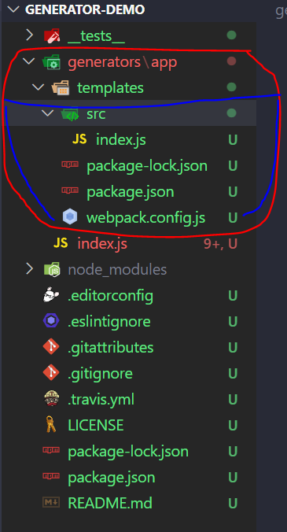

# 脚手架
> 脚手架是为了保证各施工过程顺利进行而搭设的工作平台 —— 百度百科

下面看一段vue-cli的官方解释：
> Vue Cli是一个基于Vue.js进行快速开发的完整系统，Vue Cli致力于将Vue生态中的`工具基础标准化`。它确保了各种构建工具能够基于智能的`默认配置`即可平稳衔接，这样你可以专注在应用开发上。与此同时，它也为每个工具提供了调整配置的灵活性，无需eject
> Vue-Cli 已经不更新，目前建议使用Vite

简单来说，脚手架就是**为了减少重复性工作而做的工具**

## 基本组成
cli依赖插件
- commander
  - 解析参数
- inquirer
  - 交互式命令作用
- download-git-report
  - 在官网上下载模板
- chalk
  - 在命令行增加色彩
- metalsmith
  - 读取文件，实现模板渲染
- consoledate
  - 统一的模板引擎(比如：对`ejs`的解析)

## 核心代码的实现
首先，新建一个项目，并进行项目的初始化工作
```bash
$ npm init -y
```

然后新建一个`bin/www.js`
```js
#! /user/bin/env node
console.log('111')
```
[#! /user/bin/env node](https://juejin.cn/post/6844903826344902670)

在`package.json`中,把`bin`指向bin目录下的`www.js`文件
```json
{
  "name": "cli-demo",
  "version": "1.0.0",
  "description": "",
  "main": "index.js",
  "scripts": {
    "test": "echo \"Error: no test specified\" && exit 1"
  },

  "bin": {
    "heisming-cli": "./bin/www.js"
  },

  "keywords": [],
  "author": "",
  "license": "ISC"
}
```

然后执行`npm link`就可以把`package.json`中配置的`bin`命令生效了。
```bash
$ npm link
npm ERR! code EPERM
npm ERR! syscall symlink
npm ERR! path D:\front-end\study\cli\cli-demo
npm ERR! dest C:\Program Files\nvm\v16.14.2\node_modules\cli-demo
npm ERR! errno -4048
npm ERR! Error: EPERM: operation not permitted, symlink 'D:\front-end\study\cli\cli-demo' -> 'C:\Program Files\nvm\v16.14.2\node_modules\cli-demo'
npm ERR!  [Error: EPERM: operation not permitted, symlink 'D:\front-end\study\cli\cli-demo' -> 'C:\Program Files\nvm\v16.14.2\node_modules\cli-demo'] {
npm ERR!   errno: -4048,
npm ERR!   code: 'EPERM',
npm ERR!   syscall: 'symlink',
npm ERR!   path: 'D:\\front-end\\study\\cli\\cli-demo',
npm ERR!   dest: 'C:\\Program Files\\nvm\\v16.14.2\\node_modules\\cli-demo'
npm ERR! }
npm ERR!
npm ERR! The operation was rejected by your operating system.
npm ERR! It's possible that the file was already in use (by a text editor or antivirus),
npm ERR! or that you lack permissions to access it.
npm ERR!
npm ERR! If you believe this might be a permissions issue, please double-check the
npm ERR! permissions of the file and its containing directories, or try running
npm ERR! the command again as root/Administrator.

npm ERR! A complete log of this run can be found in:
npm ERR!     C:\Users\HEISMING\AppData\Local\npm-cache\_logs\2022-09-01T23_53_12_079Z-debug-0.log
```
如果错误是权限不足
win10使用管理员powershell
```bash
PS D:\front-end\study\cli\cli-demo> npm link

added 1 package in 1s
PS D:\front-end\study\cli\cli-demo>
```

### 利用Commander来解析用户的参数
```bash
npm i commander
```

如何查看用户传递过来的参数呢？
先对`bin/www.js`文件进行如下修改
```js
require('../src/main')
```
根目录新建src目录，新建main.js和constance.js
```js
// constance.js
const { version } = require('../package.json')
module.exports = {
  version
}

// main.js
const program = require('commander')
console.log(process.argv)
const { version } = require('./constants.js')
program.version(version).parse(process.argv)
```
上述代码：
- 从package里拿到当前版本
- 解析用户传递的参数

```bash
ming-cli --version
```


## yeoman
> 使用脚手架生成脚手架
```bash
# 安装
# 如果报错就用管理员powershell
$ npm install -g generator-generator yo

# run
$ yo generator
? ==========================================================================
We're constantly looking for ways to make yo better!
May we anonymously report usage statistics to improve the tool over time?
More info: https://github.com/yeoman/insight & http://yeoman.io
========================================================================== Yes

? Your generator name generator-generator-demo
Your generator must be inside a folder named generator-generator-demo
I'll automatically create this folder.
? Description demo yeoman template
? Project homepage url
? Author's Name barry-lee
? Author's Email 976236190@qq.com
? Author's Homepage www.barry-lee.com
? Package keywords (comma to split) yeoman template
? Send coverage reports to coveralls No
? Enter Node versions (comma separated)
? GitHub username or organization HEISMING
? Which license do you want to use? MIT
```
等待安装完成后
创建一个简单的webpack
```bash
$ npm i -D webpack webpack-cli
```
`/src/index.js`
```js
console.log('HEISMING')
```
`/webpack.config.js`
```js
const path = require('path')

module.exports = {
  mode: 'development',
  entry: path.resolve(__dirname, 'src'),
  output: {
    path: path.resolve(__dirname, 'dist'),
    filename: 'index.bundle.js'
  }
} 
```
测试打包
```bash
npx webpack
```

将除了node_modules&&dist的文件夹以外的文件进行拷贝到刚刚生成的`generator/app/template`下，将dummyfile.txt文件删除。


`generator/app/index.js`
```js
'use strict';
const Generator = require('yeoman-generator');
const chalk = require('chalk');
const yosay = require('yosay');

module.exports = class extends Generator {
  prompting() {
    // Have Yeoman greet the user.
    this.log(
      yosay(
        `Welcome to the terrific ${chalk.red('generator-demo')} generator!`
      )
    );
    
    // 设置多个选项问题
    const prompts = [
      {
        type: 'confirm',
        name: 'someAnswer',
        message: 'Would you like to enable this option?',
        default: true
      }
    ];

    return this.prompt(prompts).then(props => {
      // To access props later use this.props.someAnswer;
      this.props = props;
    });
  }

  writing() {
    // 拷贝
    this.fs.copy(
      // this.templatePath('dummyfile.txt'),
      this.templatePath('**'),
      this.destinationPath('./')
    );
  }

  install() {
    this.installDependencies();
  }
};
```
让全局有这个工具（管理员powershell）
```bash
PS D:\front-end\study\cli\generator-demo> npm link
added 1 package in 767ms
```
然后就可以全局使用了，需要手动新建一个文件夹去执行
```bash
# generator-这个就被省略了
yo (generator-)demo 
# 如下
$ yo demo

     _-----_     ╭──────────────────────────╮
    |       |    │  Welcome to the terrific │
    |--(o)--|    │      generator-demo      │
   `---------´   │        generator!        │
    ( _´U`_ )    ╰──────────────────────────╯
    /___A___\   /
     |  ~  |
   __'.___.'__
 ´   `  |° ´ Y `

? Would you like to enable this option? Yes
   create package.json
   create package-lock.json
   create webpack.config.js
   create src\index.js

I'm all done. Running npm install && bower install for you to install the required dependencies. If this fails, try running the command yourself.

added 117 packages in 2s
'bower' 不是内部或外部命令，也不是可运行的程序
或批处理文件。
Could not finish installation.
Please install bower with npm install -g bower and try again.
If bower is already installed, try running the following command manually: bower install
PS D:\front-end\study\cli\cli-demo>
```


